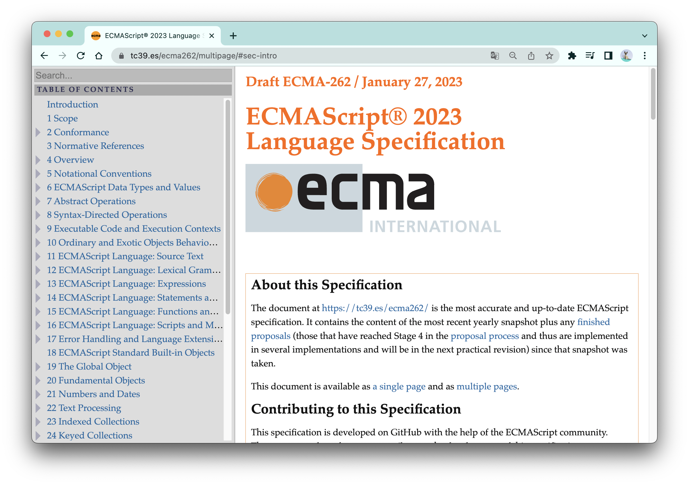
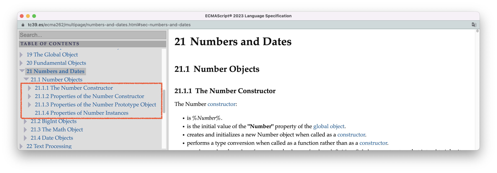
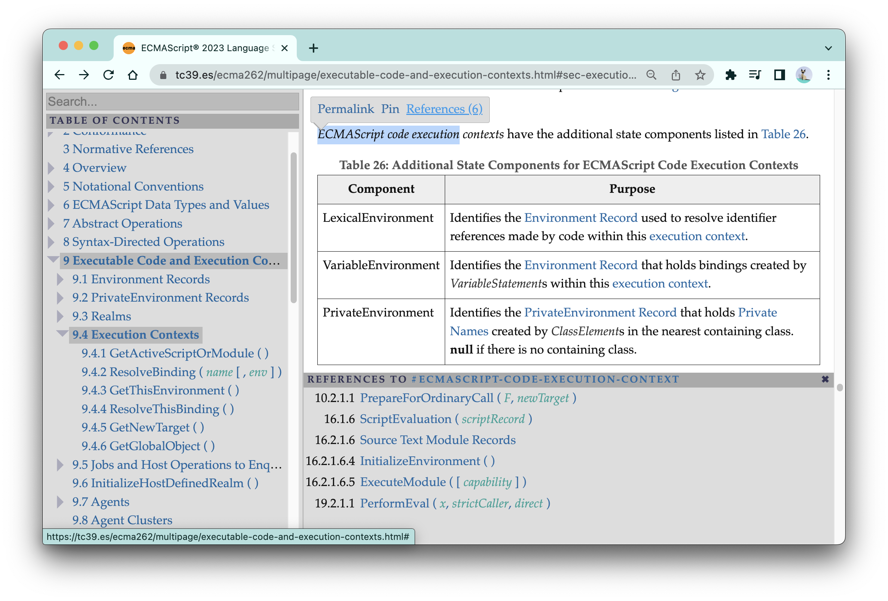

# 标准阅读指南

打开[ECMAScript2023](https://tc39.es/ecma262/multipage/)，你将看到下图的这个界面，这就是我们通向卓越工程师的入口：



在这个界面中，左侧是标准的目录，以及一个基于标准的检索框，右侧是标准的文本。

在刚开始阅读标准的时候，你可能会感到迷茫，不知道从哪里入手，也不知道怎样提高阅读的效率，就像进了一个面积很大的游乐场却没有地图一样。

本节，我将为你提供这样一张“地图”。我会先对标准的内容进行一次概览，让你知道标准的每个部分都在讲些什么东西，以及这些部分对应了这本书的哪些章节；然后我会根据个人经验，给你提供一些阅读标准的建议，希望这能帮助你提升阅读的效率。


<br/>


### 目录:

- [标准概览](#标准概览)

  * [第1～4章：介绍](#第14章介绍)

  * [第5章：表示法约定](#第5章表示法约定)

  * [第6～10章：执行环境](#第610章执行环境)

  * [第11～17章：文法和语义](#第1117章文法和语义)

  * [第18～28章：标准库](#第1828章标准库)

  * [附录](#附录)

- [一些阅读标准的建议](#一些阅读标准的建议)

  * [把标准下载到本地阅读](#把标准下载到本地阅读)

  * [刻意钻研新的概念](#刻意钻研新的概念)

  * [善用交叉索引](#善用交叉索引)

  * [读不懂就先跳过](#读不懂就先跳过)

  * [输出倒逼输入](#输出倒逼输入)

  * [认真阅读这本书](#认真阅读这本书)
<br/>


## 标准概览

**总的来说，ECMAScript标准主要讲了4个事情：文法、算法、执行环境以及标准库。** 

标准目前一共有29个章节，整体的内容架构如下表所示：

| 章节       | 内容                                      |
| ---------- | ----------------------------------------- |
| 第1～4章   | 介绍标准。                                |
| 第5章      | 定义整个标准使用的表示法约定。            |
| 第6～10章  | 定义执行环境的各个部分。                  |
| 第11～17章 | 定义语言的文法和语义。                    |
| 第18～28章 | 定义了语言的标准库。                      |
| 第29章     | 定义了与sharedArrayBuffer相关的内存模型。 |
| 附录       | 补充内容。                                |


<br/>


### 第1～4章：介绍

前面4章主要是介绍性的内容：包括ECMAScript的简史、语言特点、标准的大纲、术语定义等等。

我在介绍篇对这些介绍性内容作了许多有意义的扩展。

在[2.标准的迭代](./2.evolution.md)中，我使用一个实际的例子给你展示标准是如何进行迭代的，并基于此总结出标准的发展历史。

在[3.宿主环境](./3.host-environment.md)中，我使用许多具体的例子向你展示ECMAScript是如何与外部宿主环境（如浏览器、Node.js）协作的。从这些例子你可以清晰地看到，JavaScript的哪些部分由ECMAScript标准负责，哪些部分由其他的规范（如HTML标准）负责。


<br/>


### 第5章：表示法约定

在前言中，我使用了一个更加通熟易懂的词 —— 符号系统，来指代**表示法约定（Notational Conventions）** 。表示法约定主要分为两大部分：

- [文法表示法约定](https://tc39.es/ecma262/multipage/notational-conventions.html#sec-syntactic-and-lexical-grammars)
- [算法表示法约定](https://tc39.es/ecma262/multipage/notational-conventions.html#sec-algorithm-conventions)

它们是读懂标准的基础，也是把大多数人拒之门外的障碍。

本书，我在[4.文法基础](./4.context-free-grammar.md)讲解了文法表示法约定，在[6.算法](./6.algorithm.md)讲解了算法表示法约定。


<br/>


### 第6～10章：执行环境

执行环境是程序运行的基础，它由以下几个模块组成：

- 可供操作的数据类型：[语言类型](https://tc39.es/ecma262/multipage/ecmascript-data-types-and-values.html#sec-ecmascript-language-types)、[规范类型](https://tc39.es/ecma262/multipage/ecmascript-data-types-and-values.html#sec-ecmascript-specification-types)；
- 可供调用的算法：[常见的抽象操作](https://tc39.es/ecma262/multipage/abstract-operations.html#sec-abstract-operations)、[常见的语法导向操作](https://tc39.es/ecma262/multipage/syntax-directed-operations.html#sec-syntax-directed-operations)；
- 可供使用的资源：[agents](https://tc39.es/ecma262/multipage/executable-code-and-execution-contexts.html#sec-agents)、[执行上下文](https://tc39.es/ecma262/multipage/executable-code-and-execution-contexts.html#sec-agents)、[Realms](https://tc39.es/ecma262/multipage/executable-code-and-execution-contexts.html#sec-code-realms)、[作用域](https://tc39.es/ecma262/multipage/executable-code-and-execution-contexts.html#sec-environment-records)...

语言类型是我们熟悉的JavaScript中的8种数据类型，可以分为原始类型与对象类型。我在[12.原始类型](./12.primitive-type.md)讲了标准定义的原始类型、[13.对象类型](./13.object-type.md)中讲了标准定义的对象类型。而规范类型则可能是你比较陌生的。规范类型是标准内部算法使用的类型，这一部分我将在[7.规范类型](./7.spec_type.md)中进行介绍；

对于常用算法的讲解则是分布在整本书的各个角落。这是因为干讲算法是很容易让读者觉得枯燥的，所以我在遇到具体使用场景时，才把必要的算法搬出来。

可供使用的资源，是非常重要、也是具有一定复杂度的内容。我分别使用[8.执行环境](./8.execution-environment.md)、[9.作用域](./9.scope.md)、[10.作用域链](./10.scope-chain.md)三个章节详细地阐述这部分内容。


<br/>


### 第11～17章：文法和语义

文法用来定义语言的合法结构，主要可以分为两类：词法文法与句法文法。

在第12章，标准定义了ECMAScript的词法文法；在第13章～第16章，标准从小到大定义了ECMAScript的句法文法—— 表达式、语句和声明、函数和类、脚本和模块。

我在[5.文法汇总](./5.grammar-summary.md)中展示了这些文法是如何在语法解析中发挥作用的，并且对语言中所有的文法进行了一次类似现在这样的”概览“。

穿插在标准文法定义当中的是文法的语义 —— 语法导向操作。我在[6.算法](./6.algorithm.md)中介绍了语法导向操作的种类以及调用方式。常用的语法导向操作，也是像其他算法一样遍布在整本书的各个角落，在必要的时候才被搬出来。


<br/>


### 第18～28章：标准库

标准库主要指的是ECMAScript的内置对象，即那些在程序执行前，环境就为你准备好的对象，包括全局对象、内置构造器等等。

标准库的大部分内容与内置构造器相关。而对内置构造器的定义，是遵循一定的模版的。举个例子，假如有一个名为Example的构造器，标准会从4个方面对它进行定义：

1. 构造器的基本信息以及构造函数的具体逻辑：标题一般为「The  Example Constructor」；
2. 构造器的静态属性：标题一般为「Properties of the Example Constructor」；
3. 构造器的prototype对象属性：标题一般为「Properties of the Example Prototype Object」；
4. 构造器的实例属性：标题一般为「Properties of Example Instances」。

比如，下图是Number构造器的目录：



<br />

标准库不是本书关注的重点，毕竟本书的自我定位是标准的“说明书”，而不是“译本”。并且，相比于前面的章节，这部分阅读难度并不高。

标准库的一些内容更多地会在应用篇相关章节中被提及：

- 原始类型的相关对象：[12.原始类型](./12.primitive-type.md)
- Object相关对象：[13.对象类型](./13.object-type.md)
- Function相关对象：[14.函数](./14.function.md)
- class相关对象：[15.类](./15.class.md)
- Iterator/Generator相关对象：[16.iterator&generator](./16.iterator&generator.md)
- Error相关对象：[17.Error](./17.error.md)
- Promise相关对象：[18.promise](./18.promise.md)


<br/>


### 附录

附录主要是标准的补充内容，在这里，值得关注的地方有：

- [附录A](https://tc39.es/ecma262/multipage/grammar-summary.html#sec-grammar-summary)：文法的汇总；
- [附录C](https://tc39.es/ecma262/multipage/strict-mode-of-ecmascript.html#sec-strict-mode-of-ecmascript)：严格模式规则的汇总；
- [附录D](https://tc39.es/ecma262/multipage/host-layering-points.html#sec-host-layering-points)：宿主定义的汇总。


<br/>


## 一些阅读标准的建议


<br/>


### 把标准下载到本地阅读

你可以试试打开[标准的单页面版](https://tc39.es/ecma262/#sec-overview)，然后在开发者工具中输入以下的代码：

```js
console.log(document.body.textContent.length)
console.log(document.body.getElementsByTagName('*').length)
```

这里的第一行代码是计算页面的字符总量，结果有两百多万个字符；第二行代码是计算页面HTML元素的总量，结果有将近17万个HTML元素。

不过，我的实际目的是想让你体验一下在单页版中打开开发者工具的卡顿感；甚至你都不需要打开开发者工具，仅仅是打开页面，tab上的圈就要转好久。

在阅读标准的过程中，你会发现你经常需要做大量的交叉对比，于是常常需要同时打开多个页面。**此时，页面加载速度就成了阅读体验的关键。** 我曾经试过不同的解决方案：

1. 使用标准的PDF版本：我很快就放弃了这个方案。因为PDF不能使用标准页面提供的交叉索引功能，在下面你会看到，交叉索引是帮助理解标准的重要工具。
2. 使用[多页模式](https://tc39.es/ecma262/multipage/)：多页模式把标准按照章节拆成不同的页面，很大程度上解决了加载速度的问题，这本书所有引用标准的地方，都是使用多页版的链接，以便读者能够快速导航到标准对应的位置。但多页模式有一个致命的缺点：由于对页面作了拆分，所以不能使用浏览器提供的检索框直接进行“全标准”检索。尽管标准界面本身提供了检索框，但是这个检索框的“检索颗粒度“是非常大的，不如浏览器检索框那样来得精细。
3. 把标准下载到本地阅读：这是最佳解决方案。一方面，它的加载速度能够媲美甚至超越多页模式；另一方面，它又可以进行全标准检索。而且它还不需要考虑任何网络的因素，不需要科学上网，你在高铁上、飞机上、星巴克里都可以直接打开来看。

你可以在[标准仓库](https://github.com/tc39/ecma262#developing-the-specification)中下载标准，依据指示，很快就可以在本地阅读了。


<br/>


### 刻意钻研新的概念

在阅读标准的过程中，你会遇到许多新的词汇，有的词汇会对应一个新鲜的概念，且这个概念可能是你从未听说过的。此时，你就应该打醒十二分精神，把这个概念与自己大脑中的“Js概念库”进行一次比对：

1. 这个概念的含义是什么？
2. 这个概念是否与我大脑中某个已知的概念相类似？
   - 如果是的话，它们之间有什么差异？我应该对原有的概念做哪些修正？修正以后又会影响哪些其他概念？进而，又要进一步调整哪些地方？
   - 如果不是的话，这个概念与“Js概念库”中其他原有的概念有着怎样的关系？如何把这个概念兼容进我的知识体系中？

比如，当你第一次读到“Environment Record”的时候，你可能会发现这个概念跟你所理解的“作用域”非常相似。在你最初学习“作用域”的时候，你可能读了大量关于作用域的技术文章。这些文章有的好，有的不好；所以你对作用域的理解有的地方是对的，有的地方是错的。而此时，读到Environment Record的你，便获得了一次对“作用域”的理解进行“矫正”的机会。你需要不断地把自己所理解的“作用域”与标准描述的Environment Record进行比对，并做出恰当的更正。在更正的过程中，往往还会影响到其他的概念，比如作用域链、this值等等，而如果不把这些概念也一并更正了，你的知识体系就无法自洽....

阅读标准，就相当于对js概念库进行一次“重构”。你不断地将大脑中模糊、多余、错误的概念替换成清晰、必要、准确的概念，并同时对这些概念建立清晰、必要、准确的连接。待你完成了标准的阅读，也就完成了一次Js知识体系的重大升级。

本书的一个重要目标，就是帮助你提前建立这些概念。你可以在[首页的词汇表](./README.md#概念术语对照表)中，看到主要概念的汇总。


<br/>


### 善用交叉索引

「交叉索引」是理解标准的一大利器。



交叉索引，就是当你在阅读标准文本的时候，点击文本中的某个词汇，他会显示这个词汇在标准中所有被引用的地方（上图的References）。

于是，假如你读不懂某一个词汇的定义，你可以先通过交叉索引，找到这个词汇被实际应用的地方，通过理解它的使用方式来增加对这个词汇的认知。

反过来，当你在阅读一个句子时，你发现有一个不认识的词汇，且这个词汇是有索引的，那么你就可以通过交叉索引跳转到这个词汇的原始定义上。

交叉索引还有一个巨大用处，就是帮助建立知识体系的完整性。比如，我在[前言](./Preface.md#我们已经盲了太久)里面举了执行上下文的例子，说创建执行上下文的方式远不止大家普遍以为的3种，这个发现就是我从执行上下文的交叉索引中得来的，如上图所示。


<br/>


### 读不懂就先跳过

在阅读有难度的书籍时，”读不懂就先跳过“是比”必须完全弄明白才开始读下一页“更好的策略。

这主要是因为「前置引用」的存在。前置引用的意思是：一个在书后面才定义的概念，在前面就直接拿来使用了。

比如，标准的第五章讲算法表示约定的[部分](https://tc39.es/ecma262/multipage/notational-conventions.html#sec-completion-ao)，就提前使用到了在第六章才定义的“完成记录器“。这并不是说标准的编排有问题，而是有的概念之间本身就是互为依赖，所以前置引用是不可避免的。

因此，想要“平推式”地阅读标准，几乎是一个不可能完成的任务。

我们都有过这种感觉：一个曾经不理解的东西，过了一段时间后，突然有一天自己就想明白了。产生这种”顿悟“的原因，本质上就是理解这件事情所需要的所有底层概念，在过去的一段时间内，有意无意地被集齐了。所谓“初听不知曲中意，再听已是曲中人“，说的不就是这么一回事么。

这就是为什么我们应该采用“读不懂就先跳过”的策略。当然，这里不能遗漏的关键词是“先”，它表示你以后还会再回来读，甚至还不只回来读一次，要读很多次，读到你觉得自己“已是曲中人”为止。


<br/>


### 输出倒逼输入

我自己就是使用这个策略的典型案例。这一本书，以及另外一个未来会重构成为《人人都能读标准2 —— HTML篇》的[仓库](https://github.com/Lawliet01/HTML-spec-decipherment)，就是最好的证明。

我清晰地知道“输出”带给我的收获有多大；以及，如果我没有这么做的话，我（意识不到）的损失，有多大；这两者之间的差距甚至会大到时常让我惊出一身冷汗的程度。

在输出的过程中，为了准确表达你的内容，你对输入的要求会提高到另一个完全不一样的标准。你时常会惊讶地发现，某块原本你非常自信的知识，居然在理解上是如此肤浅的；为了内容的完整性，你不得不挖掘很多如果你不输出，就不会去触及的知识；为了更精彩地表达你的内容，你需要对同一个知识收集多个讲解的角度，同一个原理寻找多个示例，然后从中进行挑选....整个过程无疑会极大地增加你知识体系的广度以及深度。

当然，输出的方式并不仅限于写文章，你还可以跟着标准手写算法。比如，我就基于Promise的定义手写了一个通过test262测试的[Promise](https://github.com/Lawliet01/spec-promise)。

反正吧，“以教带学”这件事情，只要试过一次就戒不掉了。


<br/>


### 认真阅读这本书

最后，容我王婆卖瓜一下：**认真阅读这本书 —— 是最真诚、也是最有用的建议😊。** 

