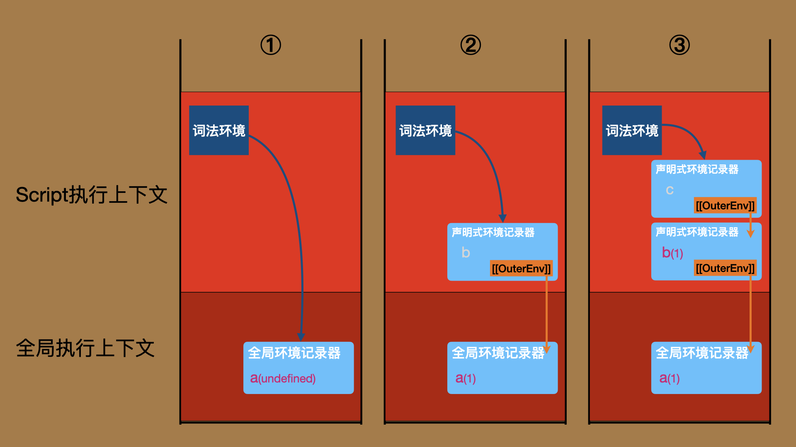
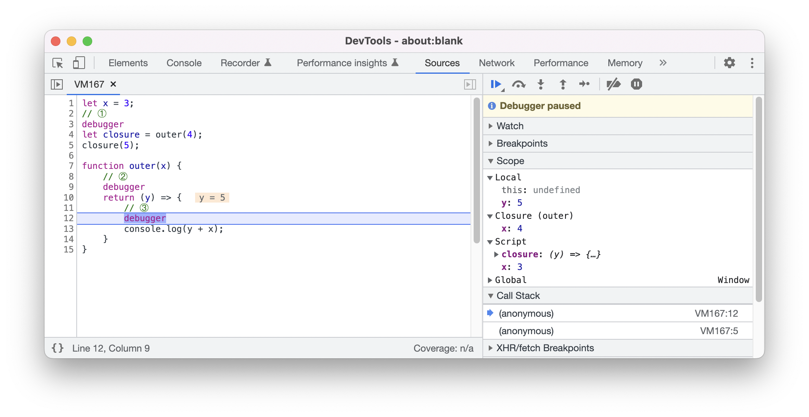

# 作用域链

在[8.执行环境](./8.execution-environment.md#执行上下文中的词法环境是作用域链的起点)我们说过，由ECMAScript代码创建的执行上下文会有一个词法环境的组件，指向一个环境记录器，这是每一条作用域链的起点。

在[9.作用域](./9.scope.md#不同类型的环境记录器)我们提到，每一个环境记录器都有一个`[[OuterEnv]]`字段指向另一个环境记录器，通过`[[OuterEnv]]`连接起来的所有环境记录器共同构成一条作用域链。并且，在那一节中我们已经多多少少已经见过作用域链在环境中的样子了：

> ```js
> for (var i = 1; i < 5; i++) {
>     setTimeout(() => {
>         console.log(i) //  ①
>     }, i * 1000)
> }
> ```
>
> 第一次执行到位置 ①，调用栈如下所示：
>
> 

本节，我会先讲标识符解析的算法，即在作用域链上查找标识符的具体过程；然后，我会讲作用域链的构建过程；最后，我会讲一个以作用域链为基础、且大家都非常关心的概念 —— 闭包。


<br/>


### 目录:

- [标识符的解析](#标识符的解析)

- [作用域链的构建](#作用域链的构建)

  * [块级代码](#块级代码)

  * [函数代码](#函数代码)

- [所谓闭包](#所谓闭包)
<br/>


## 标识符的解析

**在执行代码的过程中，当需要解析某个标识符的时候，会获取当前执行上下文的词法环境，从词法环境指向的环境记录器开始，沿着作用域链依次查找标识符，直到找到标识符或者走完整条作用域链才结束。** 

我们可以从标识符identifier的[求值语义](https://tc39.es/ecma262/multipage/ecmascript-language-expressions.html#sec-identifiers-runtime-semantics-evaluation)看到详细的过程：


以下我为你把这个过程使用中文进行概括（`name`为标识符）：

> 1. 执行[ResolveBinding(`name`)](https://tc39.es/ecma262/multipage/executable-code-and-execution-contexts.html#sec-resolvebinding)：
>    1. 默认把变量`env`设置为当前执行上下文的词法环境；（**①**）
>    2. 此时`env`是一个环境记录器；
>    3. 如果处于严格模式，设置变量`strict`为true，否则，设置为false；
>    4. 执行：[GetIdentifierReference(env, name，strict)](https://tc39.es/ecma262/multipage/executable-code-and-execution-contexts.html#sec-getidentifierreference)：
>       1. 如果`env`为null，返回一个表示解析失败的引用记录器。
>       2. 调用<u>env.HasBinding(name)</u>，查看`name`是否存在环境中：（**②**）
>       3. 如果结果为true，返回一个表示该标识符的<u>引用记录器（Reference Record）</u>；（**③**）
>       4. 如果结果为false，通过`env.[[OuterEnv]]`获得外层环境记录器`outer`，然后递归地调用[GetIdentifierReference(outer, name，strict)](https://tc39.es/ecma262/multipage/executable-code-and-execution-contexts.html#sec-getidentifierreference)；（**④**）

这里算法步骤后面的圆圈数字是我们需要重点关注的地方：

- （注释①）：这一步表示解析标识符时，会默认会选择执行上下文的词法环境作为起点。

  你或许会好奇，我们曾在[8.执行环境](./8.execution-environment.md#执行上下文中的词法环境是作用域链的起点)说到，ECMAScript代码执行上下文比普通执行上下文，额外多出了三个组件：词法环境（LexicalEnvironment）、变量环境（VariableEnvironment）、私有环境（PrivateEnvironment）。但似乎在解析标识符时，只用到了这其中的一个。

  实际上，私有环境是用于绑定[私有标识符](https://tc39.es/ecma262/multipage/ecmascript-language-lexical-grammar.html#prod-PrivateIdentifier)的，私有标识符的解析会启用另外一套与标识符类似但不完全一样的逻辑 —— [ResolvePrivateIdentifier](https://tc39.es/ecma262/multipage/executable-code-and-execution-contexts.html#sec-resolve-private-identifier)。

  而变量环境也是曾经让我非常困惑的地方。在标准中，如果你进行一次全文检索，你只能看到变量环境被设置的过程，看不到变量环境被使用的过程。变量环境会被设置为绑定变量声明那一层的环境记录器，而这一层的环境记录器，是会在上面解析标识符的过程中被遍历到的，也就是说，即便没有变量环境这个概念，整个机制也不会出错误，变量环境看起来就仅仅起到了标记的作用。

  有同样困惑的不止我一个人，在标准的仓库中曾经有人就这个问题提了[issue](https://github.com/tc39/ecma262/issues/1056)，但并未得到完全的解答。

- （注释②）：不同类型的环境记录器，`HasBinding`方法的逻辑可能不同：

  - 声明式环境记录器/函数环境记录器/模块环境记录器的[HasBinding(N)](https://tc39.es/ecma262/multipage/executable-code-and-execution-contexts.html#sec-declarative-environment-records-hasbinding-n)：查看是否有绑定标识符`N`，有的话返回true，没有的话返回false；
  - 对象环境记录器的[HasBinding(N)](https://tc39.es/ecma262/multipage/executable-code-and-execution-contexts.html#sec-object-environment-records-hasbinding-n)：查看环境记录器关联的对象是否有名为`N`的属性，有的话返回true，没有的话返回false；
  - 全局环境记录器的[HasBinding(N)](https://tc39.es/ecma262/multipage/executable-code-and-execution-contexts.html#sec-global-environment-records-hasbinding-n)：先调用`[[DeclarativeRecord]]`字段包含的声明式环境记录器的`HasBinding(N)`方法，如果返回false，再调用`[[ObjectRecord]]`字段包含的对象环境记录器的`HasBinding(N)`。这个逻辑也使得在全局环境中，会先查找词法声明（class/let/const）的变量，再查找变量声明（var/函数）的变量。

- （注释③）：[引用记录器](https://tc39.es/ecma262/multipage/ecmascript-data-types-and-values.html#sec-reference-record-specification-type)是一个记录器类型，常用于表示标识符的解析结果，它包含了与标识符相关的一系列信息：

  - `[[ReferencedName]]`字段：表示标识符的名字；
  - `[[Base]]`字段：标识符所在的环境记录器；
  - `[[Strict]]`字段：是否处于严格模式。

  得到的引用记录器，未来可以通过抽象操作[GetValue](https://tc39.es/ecma262/multipage/ecmascript-data-types-and-values.html#sec-getvalue)获得标识符关联的值，并通过抽象操作[PutValue](https://tc39.es/ecma262/multipage/ecmascript-data-types-and-values.html#sec-getvalue)修改这个值。许多其他的表达式，如[赋值表达式](https://tc39.es/ecma262/multipage/ecmascript-language-expressions.html#sec-assignment-operators-runtime-semantics-evaluation)，[typeof运算符](https://tc39.es/ecma262/multipage/ecmascript-language-expressions.html#sec-typeof-operator)，它们都是基于引用记录器完成的。

- （注释④）：这一步表示递归查找标识符的过程，如果外层的环境记录器为null（即作用域链“到头”了），则表示查找失败，会返回一个`[[Base]]`字段为`unresolvable`的引用记录器，表示解析失败；

<br />

基于以上，在开篇的那个例子中，当要解析标识符`i`时，查找的链条如下图所示（黄色粗线）：


解析得到的结果是一个引用记录器：

```txt
Reference Record {
   [[Base]]: globalEnv.[[ObjectRecord]], 
   [[ReferencedName]]: "i", 
   [[Strict]]: false,
   [[ThisValue]]: empty
}
```


<br/>


## 作用域链的构建

我们已经知道，不同类型代码在执行前会创建不同的环境记录器，然后通过声明实例化把这部分代码中的标识符绑定在环境记录器上；我们也已经知道，作用域链是通过这些环境记录器的`[[OuterEnv]]`字段串联起来的；于是，关于作用域链的构建，我们只缺少最后一块拼图了 —— **`[[OuterEnv]]`字段的指向是如何决定的？** 

**所有环境记录器，都会在创建的时候确定其`[[OuterEnv]]`字段，且这个字段在记录器整个生命周期内都不会发生改变。** 

于是，我们可以从不同类型环境记录器的创建算法以及这些算法的交叉索引找到`[[OuterEnv]]`指向的规律：

- [创建全局环境记录器](https://tc39.es/ecma262/multipage/executable-code-and-execution-contexts.html#sec-newglobalenvironment)：`[[OuterEnv]]`永远为null，因此全局环境记录器是所有作用域链的最后一环；
- [创建模块环境记录器](https://tc39.es/ecma262/multipage/executable-code-and-execution-contexts.html#sec-newmoduleenvironment)：`[[OuterEnv]]`永远指向运行环境中的全局环境记录器；
- [创建对象环境记录器](https://tc39.es/ecma262/multipage/executable-code-and-execution-contexts.html#sec-newobjectenvironment)：
  - 如果由with语句创建，`[[OuterEnv]]`设置为当前执行上下文的词法环境指向的环境记录器，并把执行上下文的词法环境更新为新创建的环境记录器；
  - 如果由全局环境记录器创建，则指向null；
- [创建声明式环境记录器](https://tc39.es/ecma262/multipage/executable-code-and-execution-contexts.html#sec-newdeclarativeenvironment)：如果由块级代码创建，`[[OuterEnv]]`设置为当前执行上下文的词法环境指向的环境记录器，并会把执行上下文的词法环境更新为新创建的环境记录器；如果由其他代码创建，则取决于其算法具体的逻辑。
- [创建函数环境记录器](https://tc39.es/ecma262/multipage/executable-code-and-execution-contexts.html#sec-newfunctionenvironment)：`[[OuterEnv]]`指向函数对象被创建时所处的环境记录器。

<br />

前面3种都比较简单，这里就不再解释。我们重点讲块级代码创建的声明式环境记录器以及函数代码创建的函数环境记录器。


<br/>


### 块级代码

块级代码创建声明式环境记录器时，会把`[[OuterEnv]]`设置为当前执行上下文的词法环境指向的记录器，并把执行上下文的词法环境更新为新创建的记录器，而这个“动作”，我在[9.作用域-块级声明实例化](./9.scope.md#块级声明实例化)一节中已经为你展示过了，你也可以在[块语句的求值语义](https://tc39.es/ecma262/multipage/ecmascript-language-statements-and-declarations.html#sec-block-runtime-semantics-evaluation)中回顾所有的细节。

从中你也可以看出，**执行上下文词法环境的指向是会随着代码的执行不断变化的。** 比如，下面的全局代码会持续更新Script执行上下文中的词法环境：

```js
// ①
var a = 1
{ // ②
  let b = 1
  { // ③
    let c = 1
  }
}
```

下图为当代码执行到不同位置时（① - ② - ③），调用栈的模样。从这里你可以看到随着声明式环境记录器的创建，词法环境也在不断地更新。



<br />


<br/>


### 函数代码

函数代码与块级代码则稍微有点不同，**函数环境记录器的`[[OuterEnv]]`指向函数对象被创建时所处的环境记录器。** 

关于这部分内容，只要把环境可视化起来就会变得相当容易理解。我们来看看以下的代码：

```js
// ①
let target = "global"
a()

function a(){
    // ②
    let target = "fn_a"
    b()
}

function b(){
   // ③
   console.log(target) // "global"
}
```

下图为当代码执行到不同位置时（① - ② - ③），调用栈的模样：


1. 位置①：此时，script会进行全局声明实例化，函数a、b会在这个时候创建，并绑定在全局环境记录器中。

2. 位置②：此时，准备执行函数a。函数a会创建函数环境记录器，由于函数a是在全局环境记录器中被创建的（全局环境记录器绑定了其标识符），所以函数环境记录器的`[[OuterEnv]]`会指向全局环境记录器。
3. 位置③：此时，准备执行函数b。函数b会创建函数环境记录器，由于函数b是在全局环境记录器中被创建的，所以函数环境记录器的`[[OuterEnv]]`会指向全局环境记录器，**而不是函数a的环境记录器**，也因此最终输出的是`gloabl`而不是`fn_a`。

这也就是为什么大家总说：**函数的作用域链由函数声明的地方决定，而不是调用的地方决定。** 

**实际上，函数对象在被创建的时候，会把当时所处的环境记录器，保存在函数对象上一个名为`[[Environment]]`的内部插槽中。当函数执行过程中使用抽象操作[NewFunctionEnvironmnet](https://tc39.es/ecma262/multipage/executable-code-and-execution-contexts.html#sec-newfunctionenvironment)创建函数环境记录器时，会直接从这个内部插槽取出先前保存的环境记录器，然后将新建的函数环境记录器的`[[OuterEnv]]`字段指向这个环境记录器，从而完成函数作用域链的构建。** 如下图红色框部分所示。（关于“内部插槽”的概念，会在[13.对象类型](./13.object-type.md)中介绍）


在上面的环境图中你还可以看到另外一个细节，在执行到位置③时，环境中一共有3条作用域链，分别来自不同的ECMAScript代码执行上下文。每条作用域链从执行上下文词法环境开始，到全局环境记录器结束。于是我们也可以得出另外一个你没有在其他地方看见过的结论：**调用栈内有多少个ECMAScript代码执行上下文，就会有多少条作用域链，尽管只有来自栈顶执行上下文的作用域链可以发挥实际作用。** 

关于这一点，我们也可以在chrome debugger中看到：


在Call Stack一栏，点击不同的执行上下文，就会在Scope中显示该执行上下文对应的作用域链。这里需要注意的是，Chrome debugger的Call Stack只会显示带有作用域链的ECMAScript代码执行上下文，所以这里只有3个栈元素，不包含全局代码执行上下文。其次，关于Scope的阅读方式，我已经在[9.作用域](./9.scope.md)中做了非常详细的解释，这里也不再啰嗦。


<br/>


## 所谓闭包

有了上面的基础，再看“闭包”就觉得简单地不像话。

所谓的闭包，使用标准的术语，就是：**尽管某段代码已经执行完毕，但是由这段代码创建的环境记录器，依然被这段代码中声明的某个函数保存在其[[Environemnt]]内部插槽里面，于是没有被销毁，且在函数未来执行的时候，该环境记录器依旧可以拿出来作为函数作用域链的一部分被使用。** 

让我们来看看以下的代码：

```js
let x = 3;
// ①
let closure = outer(4);
closure(5);   

function outer(x) {
    // ②
    return (y) => { 
        // ③
        console.log(y + x);
    }
}
```

下图为当代码执行到不同位置时（① - ② - ③），调用栈的模样：


1. 位置①：此时正在执行全局代码，初始化了全局变量`x`为3。
2. 位置②：此时，准备执行outer函数。他会先创建outer函数环境记录器，并在函数声明实例化的过程中，把参数x初始化为4。在后续执行return语句的过程中，return语句中的箭头函数表达式会创建箭头函数对象，并设置函数对象内部插槽`[[Environment]]`为outer函数环境记录器，最后返回这个函数对象。
3. 位置③：此时，准备执行closure函数，由closure函数创建的函数环境记录器，其`[[OuterEnv]]`字段指向的是closure函数`[[Environment]]`内部插槽所保存的环境记录器，即outer函数环境记录器。因此，在解析标识符x时，得到的结果是outer函数环境记录器中的x（4），而不是全局变量x（3），即便此时outer函数早已执行完毕，其执行上下文也早已弹出调用栈并被销毁。

你要是觉得我的图不够清晰，那你也可以看看chrome debugger在位置③时给出的环境图：



<br />开篇的那段代码，最终输出了许多的5。在[9.作用域](./9.scope.md#for声明绑定实例化)中，我们使用let声明解决了这个问题，而这实际上也是一种“闭包”，只不过`[[Environment]]`内部插槽存的是一个由块级代码创建的声明式环境作用域：


你当然也可以刻意往`[[Environment]]`里面塞一个函数环境作用域，如下面的代码所示：

```js
for (var i = 1; i < 5; i++) {
  setTimeout((function a(j){
    return () => {
      console.log(j) // ①
    }
  })(i), i * 1000)
}
// 1
// 2
// 3
// 4
```

此时，当第一次执行到位置①时，调用栈如下所示：


