# ECMAScript原始类型

ECMAScript有7种原始类型，分别是Undefined、Null、Boolean、String、Number、BigInt、Symbol。

本节中，我会先讲这7种原始类型的创建方式；然后我会谈到从标准的角度看，在原始类型上如对象一般调用方法是如何实现的；最后，我会对String和Number类型的底层编码形式进行深入的讲解。


<br/>


### 目录:

- [原始类型的创建](#原始类型的创建)

  * [Null与Boolean](#null与boolean)

  * [Number与BigInt](#number与bigint)

  * [String](#string)

  * [undefined](#undefined)

  * [Symbol](#symbol)

- [在原始类型上“调用”方法](#在原始类型上调用方法)

- [String类型的编码形式](#string类型的编码形式)

  * [UTF-16的编码模型](#utf-16的编码模型)

  * [UTF-16在实际代码中的应用](#utf-16在实际代码中的应用)

- [Number类型的编码形式](#number类型的编码形式)

  * [双精度浮点数模型](#双精度浮点数模型)

  * [精度丢失问题](#精度丢失问题)
<br/>


## 原始类型的创建

创建原始类型的主要途径是字面量。我们从[字面量表达式](https://tc39.es/ecma262/multipage/ecmascript-language-expressions.html#prod-Literal)的产生式可以看到，ECMAScript有4种原始类型的字面量：

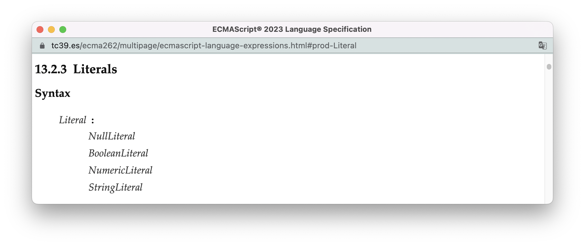
<br/>


### Null与Boolean

[null字面量](https://tc39.es/ecma262/multipage/ecmascript-language-lexical-grammar.html#sec-null-literals)与[Boolean字面量](https://tc39.es/ecma262/multipage/ecmascript-language-lexical-grammar.html#sec-boolean-literals)都非常简单，一个只能由终结符`null`构成，另一个只能由终结符`true`或`false`构成。


<br/>


### Number与BigInt

[数字字面量](https://tc39.es/ecma262/multipage/ecmascript-language-lexical-grammar.html#sec-literals-numeric-literals)是我们在原理篇用来解释[文法](./4.context-free-grammar.md#文法的基本理解规则)时，举的一个重要的例子。你还记得这张我们当时对数字字面量文法的“解构图”吗？

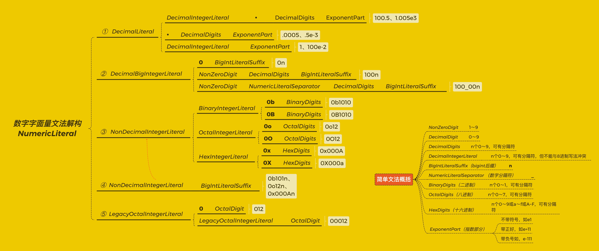

从解构的结果我们可以看到，数字字面量不仅可以生成Number类型，也可以生成BigInt类型，总的来说，它有5种大的合法结构：

> - ①十进制数字：允许纯数字：`100.5`、`1`；也允许以小数点开头：`.0005`；还允许使用指数e：`100e-2`、`.5e-3`；
>
>
> - ②十进制bigInt：不允许有小数点，也不允许使用指数e，且必须在数字后面添加`n`，如`0n`、`100n`；
>
>
> - ③非十进制整数，包括：
>
>   - 二进制整数：在二进制数字（0和1）前面在`0b`或`0B`：`0b1010`、`0B1010`；
>
>   - 八进制整数：在八进制数字（0～7）前面加`0o`或`0O`：`0o12`、`0O12`；
>
>   - 十六进制整数：在十六进制数字（0～9与Aa~Ff）前面加`0x`或`0X`：`0x000A`、`0X000a`；
>
>
> - ④非十进制bigInt：与非十进制整数一样，只是后面需要多加一个`n`：`0b1010n`、`0o12n`、`0x000An`;
>
>
> - ⑤老式的8进制：在八进制数字前面加0来表示8进制：如`012`、`00012`，现在这种写法已经不被推荐了。

此外，对于这些不同的数字字面量具体会产生什么样的数值，标准使用[静态语义NumericValue](https://tc39.es/ecma262/multipage/ecmascript-language-lexical-grammar.html#sec-numericvalue)来表示他们的“取值”过程。


<br/>


### String

我们同样可以像数字字面量一样对字符串字面量进行展开：

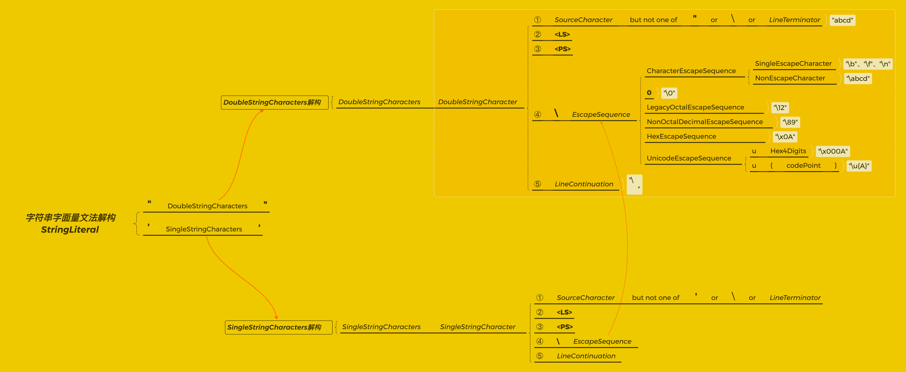

从展开的结果看，[字符串字面量](https://tc39.es/ecma262/multipage/ecmascript-language-lexical-grammar.html#prod-StringLiteral)包括双引号字符串以及单引号字符串，且不包括字符串模版，字符串模版的文法在[模版产生式](https://tc39.es/ecma262/multipage/ecmascript-language-lexical-grammar.html#prod-Template)中定义。

双引号字符串与单引号字符串，除了引号不同，每个字符的构成基本一样，都是由5条代换式组成，以双引号字符为例（图中框出部分）：

- ①：表示字符可以由除了双引号`"`、[行终结符](https://tc39.es/ecma262/multipage/ecmascript-language-lexical-grammar.html#prod-LineTerminator)、以及`\`以外的所有Unicode字符构成，这是我们最常使用的字符；

- ②：表示行终结符中的`<LS>`可以直接作为字符串字符使用；

- ③：表示行终结符中的`<PS>`可以直接作为字符串字符使用；

- ④：表示那些通过使用`\`转义后有特殊含义的字符或字符序列，包括：

  - [单转义字符](https://tc39.es/ecma262/multipage/ecmascript-language-lexical-grammar.html#prod-SingleEscapeCharacter)，包括`\b`、`\t`、`\n`、`\v`、`\f`、`\r`、`\"`、`\'`、`\\`。
  - 八进制转义序列：使用`\`、`\0`开头。
  - 十六进制转义序列：使用`\x`开头，且后面只能跟两个十六进制数字。
  - 码点转义序列：使用`\u`开头，有两种写法，不带`{}`的写法必须跟4个十六进制数字。

  从对字符串取值的[静态语义SV](https://tc39.es/ecma262/multipage/ecmascript-language-lexical-grammar.html#sec-static-semantics-sv)我们可以得知：八进制转义序列、十六进制转义序列、码点转义序列最终都会根据其数字的值转化为特定的码点，如下图所示（如果你对码点的概念不熟，后面的[字符串编码形式部分](#string类型的编码形式)能够帮到你）：

  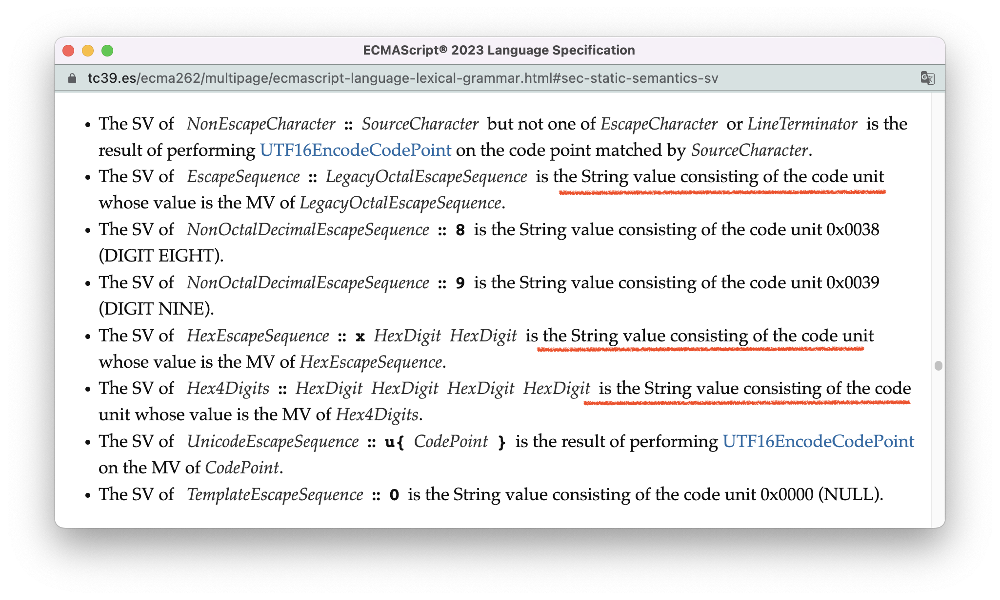

  基于这一点，我们可以使用不同的字符串字面量表示同一个换行符号`\n`（码点为10）：

  ```js
  "\n" === "\012"; // true - 八进制转义序列
  "\n" === "\x0A"; // true - 十六进制转义
  "\n" === "\u000A" // true - 码点转义序列（写法1）
  "\n" === "\u{A}" // true - 码点转义序列（写法2）
  ```

- ⑤：第五条代换式是对行终结符的转义，这甚至使得你可以不借助字符串模版，直接在字符串中换行：

  ```js
  console.log("\
   我完全合法！") 
  ```

  
<br/>


### undefined

undefined没有字面量文法，因而无法通过字面量创建。当我们在代码中如字面量一般地使用`undefined`时，实际上，它访问的是全局对象上的[undefined属性](https://tc39.es/ecma262/multipage/global-object.html#sec-undefined)：

```js
// undefined是全局对象上的属性
undefined in window // true
// 全局对象上的undefined属性不可修改
Object.getOwnPropertyDescriptor(window, "undefined") // {value: undefined, writable: false, enumerable: false, configurable: false}
```

undefined也不是保留字，所以你可以用undefined作为变量的标识符：

```js
{
    let undefined = 1 // 声明一个名为undefined的变量
    let a // 未赋值的变量会初始化值为undefined
    console.log(a === undefined) // false
    console.log(a === void 0) // true
}
```

有的代码，你会发现像这里一样使用不太常见的void运算符，void运算符可以用来获得“纯正”的undefined，我们可以从它的[求值语义](https://tc39.es/ecma262/multipage/ecmascript-language-expressions.html#sec-void-operator)中得到这个信息：

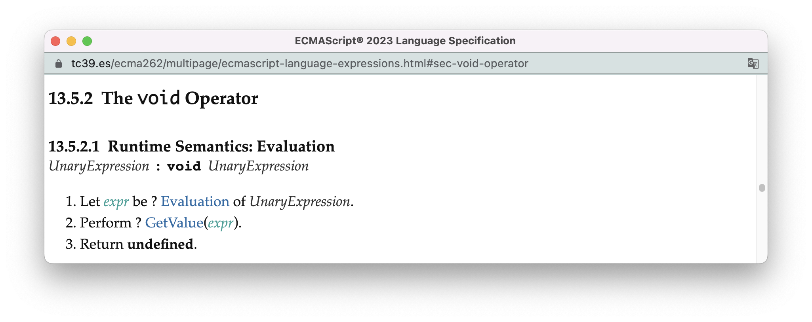
<br/>


### Symbol

Symbol也没有字面量，它只能通过内置对象Symbol创建：

```
Symbol("foo")
Symbol.for("foo")
```

标准中定义了一系列[常用的Symbol](https://tc39.es/ecma262/multipage/ecmascript-data-types-and-values.html#sec-well-known-symbols)，这些Symbol常常作为对象的插件使用。


<br/>


## 在原始类型上“调用”方法

我们对于原始类型的方法调用并不陌生：

```js
10.334524 .toFixed(2) // '10.33'
"  test ".trim() // "test"
```

原始类型之所以可以调用方法，与[成员表达式MemberExpression](https://tc39.es/ecma262/multipage/ecmascript-language-expressions.html#prod-MemberExpression)的[求值语义](https://tc39.es/ecma262/multipage/ecmascript-language-expressions.html#sec-property-accessors-runtime-semantics-evaluation)息息相关。如果你经常读标准，你就会发现成员表达式是一个存在感非常高的表达式。

通过成员表达式的产生式，我们很容易发现，`a.b`的形式会被解析为成员表达式。

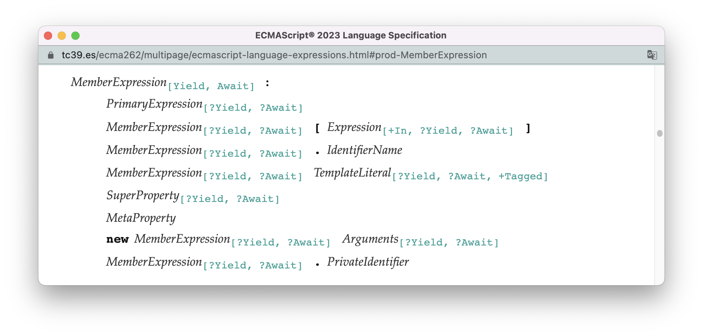

而对`a.b`形式的成员表达式的求值也非常简单明了：先获得`.`左侧表达式的值，然后通过抽象操作 [EvaluatePropertyAccessWithIdentifierKey](https://tc39.es/ecma262/multipage/ecmascript-language-expressions.html#sec-evaluate-property-access-with-identifier-key)获得这个值上对应的属性：

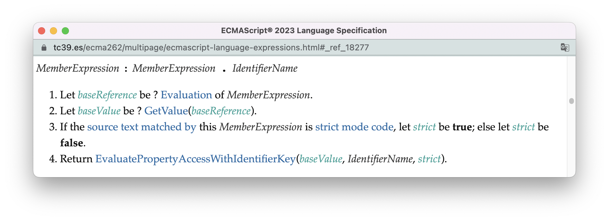

这里的“玄机”来自于第二步的抽象操作[GetValue](https://tc39.es/ecma262/multipage/ecmascript-data-types-and-values.html#sec-getvalue)。不管第一步得到的是不是一个对象，GetValue会把第一步获得的结果使用抽象操作[ToObject](https://tc39.es/ecma262/multipage/abstract-operations.html#sec-toobject)转化为对象。

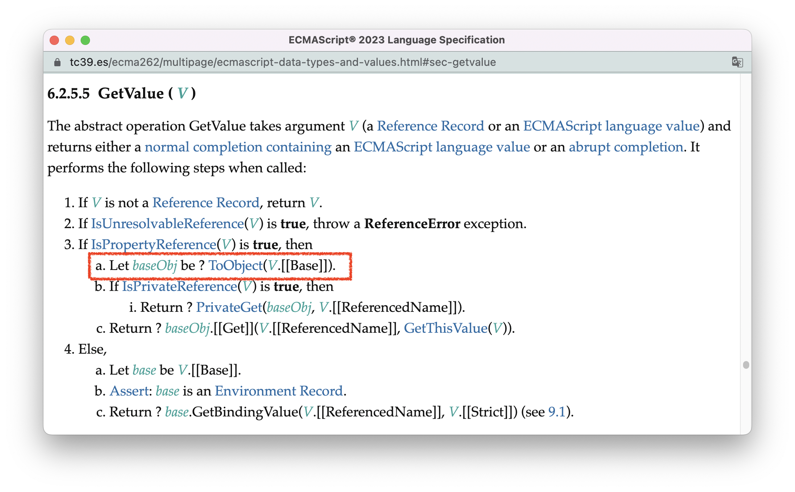

于是，我们在ToObject中就能看到不同的数据类型，转换为对象的结果：

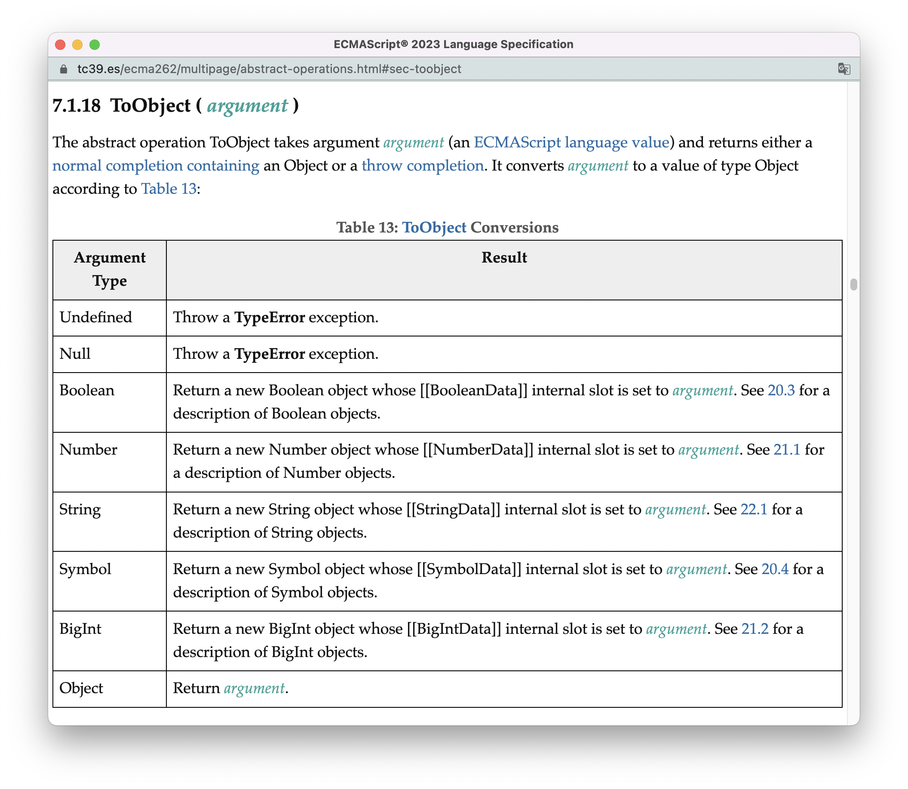

在这里，undefined与null无法进行转换，因为ECMAScript没有设计与这两个类型对应的内置对象，所以在undefined和null头上使用“成员表达式”会报错：

```js
undefined[2]; // ❌：Uncaught TypeError: Cannot read properties of undefined (reading '2')
null[2] // ❌： Uncaught TypeError: Cannot read properties of null (reading '2')
```

其他的原始类型都会转化为各自的内置对象，于是，就可以使用各自的内置对象上的方法。

在转化结果的描述中，不同的对象都有一个叫做“内部插槽”的东西，使用`[[]]`表示。关于内部插槽，我会在[13.对象类型](./13.object-type.md)进行解释。


<br/>


## String类型的编码形式

String类型表示程序中的字符串。而谈到字符串，就离不开**字符集（Character set）** 与**字符编码（Character Encoding）** 。

现行世界中主要使用的字符集是Unicode，包含将近15万个字符。对于Unicode主要的两种字符编码形式分别是UTF-8以及UTF-16。其中HTML默认使用的是UTF-8，而ECMAScript默认使用的是UTF-16。

不管是使用UTF-8还是UTF-16，都可以表示Unicode中所有的字符。而这里有两个重要的概念：

- **码点（code point）** ：字符编码中，每个Unicode字符对应的数字映射。
- **码元（code unit）** ：字符编码中，码点的最小组成单位。

在UTF-8中，一个码元用一个字节（8位）表示，一个码点用1到4个码元表示；在UTF-16中，一个码元用两个字节（16位）表示，一个码点用1个或2个码元表示。


<br/>


### UTF-16的编码模型

在讲模型之前，有一个事情需要先搞清楚。在ECMAScript，数字类型的十六进制以`0x`开头，如`0x000A`；表示码点的字符串的十六进制以`\x`或`\u`开头，如`"\x0A"`、`"\u000A"`，如果你不弄清楚这一点，就常常会被它们写法的切换弄得晕头转向。

正如前面所说，在UTF-16中，一个码元使用两个字节表示，因此每个码元能够表示的区间是[0x0000, 0xFFFF]。在这个区间内，UTF-16又划分出一个[高代理码元(high-surrogate code unit)](https://tc39.es/ecma262/multipage/ecmascript-data-types-and-values.html#high-surrogate-code-unit)，区间为[0xD800，0xDBFF]，以及一个[低代理码元（low-surrogate code unit）](https://tc39.es/ecma262/multipage/ecmascript-data-types-and-values.html#low-surrogate-code-unit)，区间为[0xDC00, 0xDFFF]，如下图所示：

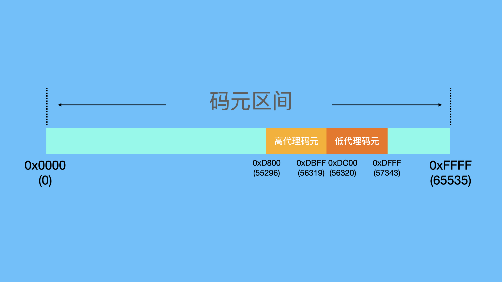

在ECMAScript中，码元是按照以下方式转化为码点的：

- 当一个码元即不是高代理码元，也不是低代理码元的时候，可以直接转化为码点；

- 当连续的两个码元c1、c2，前一个位于高代理码元，后一个位于低代理码元的时候，他们将构成一个**代理对**（surrogate pair），并通过以下的公式计算出码点的值：

  ```
   (c1 - 0xD800) × 0x400 + (c2 - 0xDC00) + 0x10000
  ```

- 其他情况，码元都会被直接转化为码点。

比如，下面的代码将一个高代理码元与一个低代理码元组合，得到了新的码点：

```js
console.log("\uD83D" + "\uDE0A')" //  '😊'
```

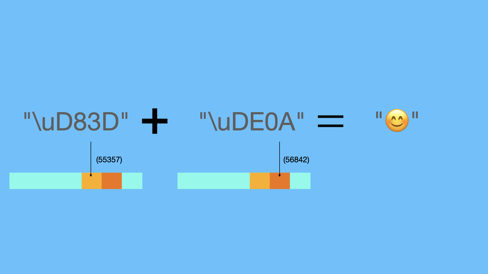


<br/>


### UTF-16在实际代码中的应用

在ECMAScript中，字符串的`length`方法计算的是字符串中码元的数量，而不是码点的数量：

```js
"😊".length // 2
"😊"[0] // '\uD83D'
"😊"[1] // '\uDE0A'
```

在字符串方法的命名中，ECMAScript习惯使用**charCode**表示一个码元，使用**codePoint**表示一个码点，相关的方法包括：

- String.prototype.charCodeAt(*pos*)：返回位置*pos*上码元的值。

  ```js
  "😊".charCodeAt(0) // 55357, 16进制表示是0xD83D
  "😊".charCodeAt(1) // 56842, 16进制表示是0xDE0A
  ```

- String.prototyoe.codePointAt(*pos*)：返回位置*pos*上码点的值。

  ```js
  "😊".codePointAt(0) // 128522
  "😊".codePointAt(1) // 56842
  ```

- String.fromCharCode(*codeUnit*)：把码元转化为字符。

  ```js
  String.fromCharCode(128522) // 
  String.fromCharCode(55357, 56842) // 😊
  ```

- String.fromCodePoint(*codePoint*)：把码点转化为字符。

  ```js
  String.fromCodePoint(128522) // 😊
  String.fromCodePoint(55357, 56842) // 😊
  ```

<br />

在这里，我们甚至还可以使用这些结果验证前面两个码元拼成一个码点的公式：

```
 (c1 - 0xD800) × 0x400 + (c2 - 0xDC00) + 0x10000
```

因为我们已经知道，“😊”是由两个码元组成，数值分别为55357与56842，于是，我们可以在`String.fromCodePoint`中应用这条公式：

```js
String.fromCodePoint((55357 - 0xD800) * 0x400 + (56842 - 0xDC00) + 0x10000) // 😊
```


<br/>


## Number类型的编码形式

从上面我们可以看出，String类型中的每个字符实际上是由内存中16位或32位二进制表示的。而Number类型则是使用64位二进制表示，具体采用的是《IEEE 754-2019》定义的双精度浮点数格式，在其他编程语言中，这种浮点数类型也常用float64表示。


<br/>


### 双精度浮点数模型

IEEE 754把64位分成3个部分：

- 符号位（sign）：占用1位
- 指数位（exponent）：占用11位
- 有效数位（fraction）：占用52个位

懒得做图了，这里直接使用[维基百科](https://en.wikipedia.org/wiki/Double-precision_floating-point_format)提供的图：

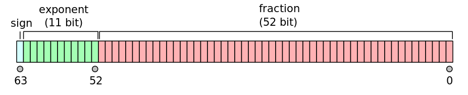

在这个模型中，任意数字都可以使用以下的公式表示：


在这条公式中，sign表示符号位，b表示有效数位，e表示指数位。

这里需要注意的是：**这是一条混合了十进制和二进制数字的计算公式。** 中间部分的`(1.b51b52...b0)`是二进制表示，一个带有小数点的二进制。后面的`2^e-1023`是十进制数字，不搞清楚这一点，你就无法得到正确的结果。

比如，数字1.5，可以用以下内存空间表示（这张图是我在一个[float64二进制转换器](https://www.binaryconvert.com/result_double.html)中获得的，这里的Mantissa(尾数)相当于上面的fraction(有效数位)）：

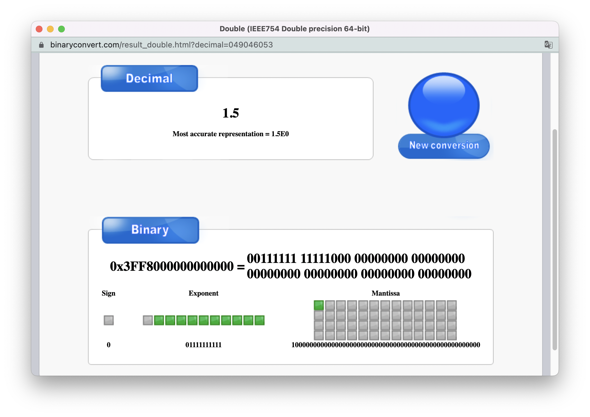

此时：

- 符号位为0，于是符号部分的计算相当于`-1^0`，表示正数；
- 指数位为`01111111111`，转为十进制后是1023。于是，指数部分计算为`2^(1023 - 1023)`，结果为1；
- 在有效数位上，我们得到的是一个`1.1`的二进制小数，转化为十进制的方式以及结果是`2^0 + 2^-1  =  1 + 0.5 = 1.5`

所以，最终的计算结果为：

```text
(-1^0) * (1.5) * 2^0 = 1.5
```

<br />

按理说，64位二进制应该可以表示2^64个数字。但实际上，ECMAScript的数字只有`2^64 - 2^53 + 3`种，这是因为：当一个数字的指数位全是1的时候，被设计为不能通过以上的公式转化为实际的数字，这类特殊的数字有`2^53`个（1个符号位 + 52个有效数位）。在ECMAScript中，这类特殊的数字会被转化为另外3种特殊的值：

- 如果此时有效数位全为0，符号位也是为0，在ECMAScript表示为+Infinity；
  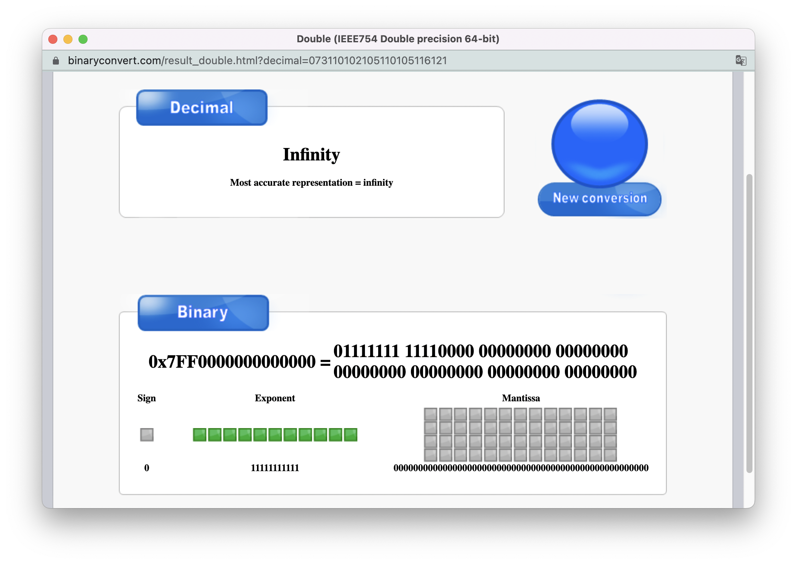

- 如果此时有效数位全为0，符号位为1，则表示为-Infinity；
  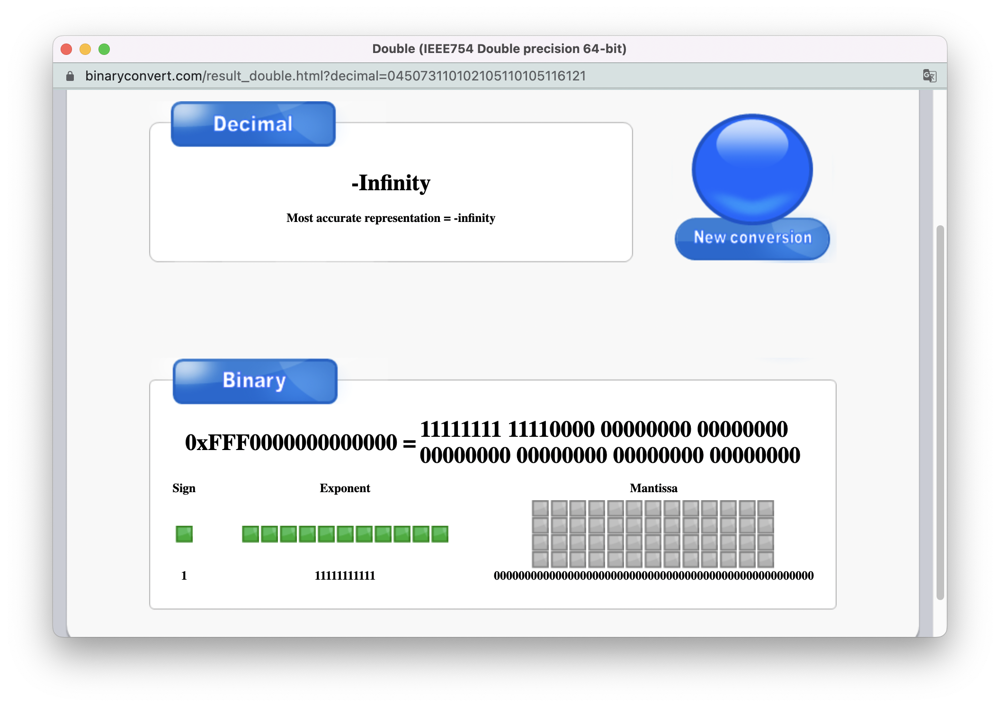

- 除此以外，其他的值都表示为NaN（Not a Number）。

  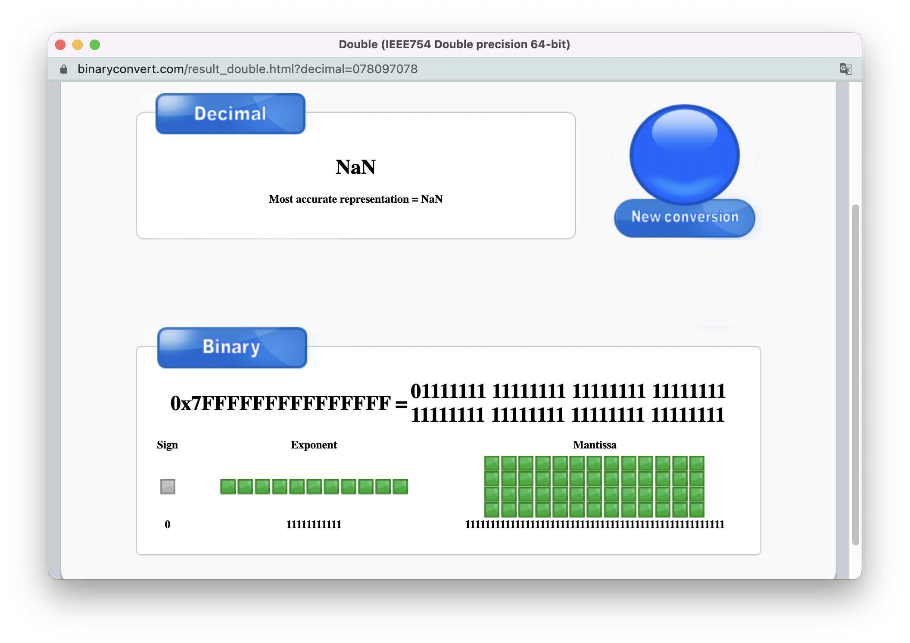


<br/>


### 精度丢失问题

使用浮点数表示数字的优势在于，它能够表示的数字范围比整点数更广。但它的缺点在于，有时候会有精度丢失的问题。稍有经验的前端都明白，在JS中，0.1 + 0.2 不精准等于 0.3，**核心原因在于：双精度浮点数模型根本无法精确表示0.1、0.2、0.3。** 

你完全可以在上面我提供的[转换器](https://www.binaryconvert.com/result_double.html)中测试一下：把0.3转化成二进制，再把对应的二进制反向转化一下，得到的只是一个无限接近0.3的数字，而不是0.3本身。


