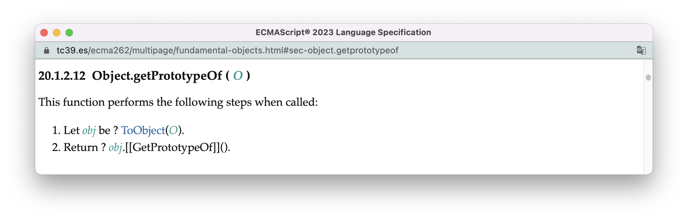
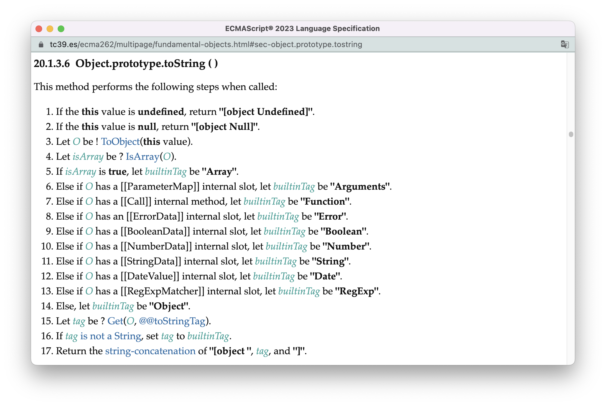
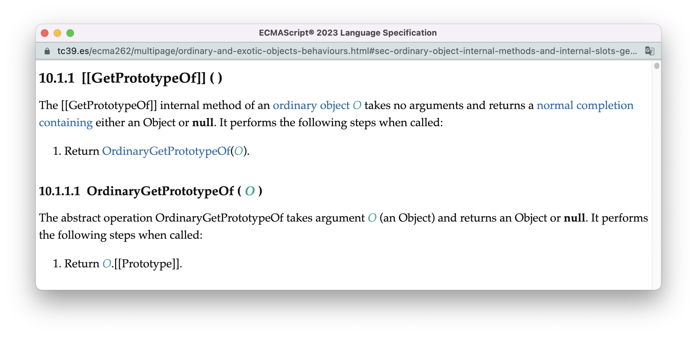
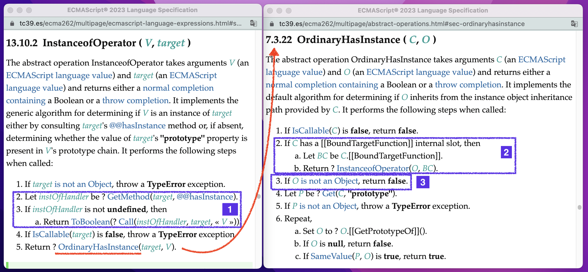
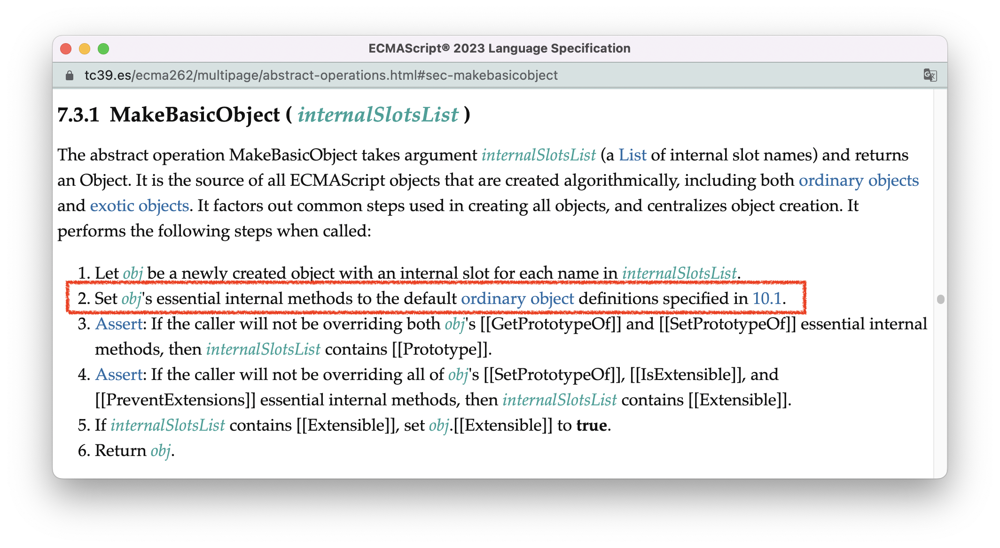
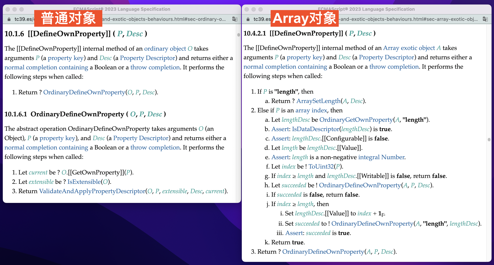
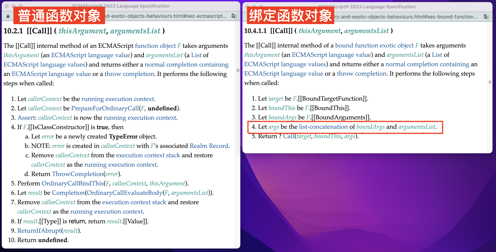

# ECMAScript的对象类型

JavaScript是一门面向对象编程语言，绝大多数的操作都是基于对象完成的。

本节，我会先讲ECMAScript对象的内部模型，这个模型可以帮助我们理解对象的内部行为。然后，我们会使用这个模型来实现类型判断。最后，我会讲基于这个模型，标准是如何对对象进行分类的。


<br/>


### 目录:

- [对象的内部模型](#对象的内部模型)

  * [内部方法](#内部方法)

  * [内部插槽](#内部插槽)

  * [应用：类型判断](#应用类型判断)

- [对象的分类](#对象的分类)

  * [普通对象 vs 异质对象](#普通对象-vs-异质对象)

  * [内置对象 vs 非内置对象](#内置对象-vs-非内置对象)
<br/>


## 对象的内部模型

在ECMAScript中，每个对象都有自己的**内部方法（internal methods）** 以及**内部插槽（internal slots）** 。内部方法表示对象在运行时上的行为，内部插槽则表示对象的状态，你也可以把它们理解为对象内更为底层的方法和属性。“内部”二字表示内部插槽和内部方法都可以使用“规范类型”，且都不能被ECMAScript程序直接访问。在标准中，所有的内部方法和内部插槽都使用`[[]]`表示。


<br/>


### 内部方法

所有的对象都必须有以下的[内部方法](https://tc39.es/ecma262/multipage/ecmascript-data-types-and-values.html#table-essential-internal-methods)，这些方法称为**基础内部方法（Essential Internal Methods）** ：

| 基础内部方法          | 描述                                                |
| --------------------- | --------------------------------------------------- |
| [[GetPrototypeOf]]    | 获取对象的原型                                      |
| [[SetPrototypeOf]]    | 设置对象的原型                                      |
| [[IsExtensible]]      | 判断对象是否可以增加新的属性                        |
| [[PreventExtensions]] | 控制对象是否允许增加新的属性                        |
| [[GetOwnProperty]]    | 返回某个自身属性的属性描述符（Property Descriptor） |
| [[DefineOwnProperty]] | 用一个属性描述符来创建或者修改一个自身属性          |
| [[HasProperty]]       | 判断对象是否有某个属性                              |
| [[Get]]               | 获取对象的属性                                      |
| [[Set]]               | 设置对象属性                                        |
| [[Delete]]            | 删除对象属性                                        |
| [[OwnPropertyKeys]]   | 获取对象所有的自身属性                              |

从以上列表可以看出，这些都是一些非常基础的操作，用于完成对象属性的增、删、改、查。许多暴露在[Object构造器](https://tc39.es/ecma262/multipage/fundamental-objects.html#sec-object-constructor)以及[Object.prototype](https://tc39.es/ecma262/multipage/fundamental-objects.html#sec-properties-of-the-object-prototype-object)上的方法，都是对这些内部方法的封装。比如，用以获得对象原型的静态方法[Object.getPrototypeOf(O)](https://tc39.es/ecma262/multipage/fundamental-objects.html#sec-object.getprototypeof):



除了以上的内部方法，对象可能还有两个特殊的内部方法：

-  `[[Call]]`方法：实现了这个内部方法的对象是函数对象，这个方法会由函数调用表达式触发，并执行一段绑定在对象上的逻辑。关于`[[Call]]`方法，我们会在[14.函数](./14.function.md)中进行深入研究。
-  `[[Construct]]`方法：实现了这个内部方法的对象是构造器对象，这个方法由new表达式或super方法触发，会创建一个新的对象。关于`[[Construct]]`方法，我们会在[15.类](./15.class.md)中进行深入研究。


<br/>


### 内部插槽

最重要的内部插槽是`[[Prototype]]`，该插槽指向另一个对象或者null。当对象A的`[[Prototype]]`指向对象B时，B即为A的原型对象。此时，对A来说，A自身的属性称为**自有属性（own properties）** ，而B的属性都为A的**继承属性（inherit properties）** 。当然，B也有自己的`[[Prototype]]`。于是，所有通过`[[Prototype]]`连接起来的对象就构成了A的原型链。

除了`[[Prototype]]`，常见的内部插槽还有:

- `[[Extensible]]`：用来表示对象是否可扩展。当这个插槽值为false时，对象不能添加属性、不能修改`[[prototype]]`插槽、不能修改`[[Extensible]]`插槽为true。这个插槽可以使用[Object.isExtensible(Obj)](https://tc39.es/ecma262/multipage/fundamental-objects.html#sec-object.isextensible)与[Object.preventExtensions(Obj)](https://tc39.es/ecma262/multipage/fundamental-objects.html#sec-object.preventextensions)间接访问与修改。
- `[[privateElements]]`：用于存储对象上的私有属性方法。


<br/>


### 应用：类型判断

基于对象内部方法以及内部插槽，我们可以完成一些类型判断的工作。主要有两种思路：

1. 基于对象特有的内部插槽或内部方法，判断对象的类型。
2. 基于`[[Prototype]]`内部插槽，判断对象的类型。

<br />

我在[12.原始类型](./12.primitive-type.md#在原始类型上调用方法)中提到过，在原始类型上调用方法，会使得原始类型通过抽象操作[ToObject](https://tc39.es/ecma262/multipage/abstract-operations.html#sec-toobject)转化为特定的对象，而原始类型对应的每一种对象，都有自己特有的内部插槽。比如布尔对象有一个特有的`[[BooleanData]]`内部插槽，Number对象有一个特有的`[[NumberData]]`内部插槽。。。因而，我们可以根据这些特有的内部插槽识别出数据类型。

当然，我们无法直接访问内部插槽，但是有的语言API会帮助我们间接完成访问，比如[Object.prototype.toString()](https://tc39.es/ecma262/multipage/fundamental-objects.html#sec-object.prototype.tostring):



这个API的逻辑非常清晰，就是先把参数转化为对象，然后根据对象是否具有某个特定的内部插槽或内部方法，输出不同的结果，借助这一点你便可以完成类型的识别。

```js
// 封装Object.prototype.toString，截取输出结果中的类型部分。
function getType(arg){
    return Object.prototype.toString.call(arg).match(/\[object (.*)\]/)[1]
}

getType(undefined) // 'Undefined'
getType(null) // 'Null'
getType([]) // 'Array'
(function(){getType(arguments)})() // Arguments
getType(()=>{}) // 'Function'
getType(new Error) // 'Error'
getType(false) // 'Boolean'
getType(1) // 'Number'
getType("1") // 'String'
getType(new Date) // 'Date'
getType(/\s/) // 'RegExp'
getType({}) // 'Object'
```

结合`Object.prototype.toString`的算法以及我上面的例子你可以看出，这个API不仅可以识别原始类型对象，它还依靠`[[Call]]`内部方法识别出函数，依靠`[[ErrorData]]`内部插槽识别出Error对象，依靠`[[RegExpMatcher]]`内部插槽识别出正则对象。

<br />

第二种类型判断的思路是基于`[[Prototype]]`内部插槽，用你熟悉的话说就是基于原型来判断。这种方法通过检查对象的原型链上，是否有任一对象属于某个构造器的prototype对象（`prototype`属性的值），从而识别对象的类型。

还是一样，虽然我们无法直接访问`[[Prototype]]`内部插槽，但我们可以借助语言提供的API，比如[Object.getPrototypeOf(O)](https://tc39.es/ecma262/multipage/fundamental-objects.html#sec-object.getprototypeof)，帮助我们拿到对象的原型。


从它的算法你可以看出，它会先使用抽象操作[ToObject](https://tc39.es/ecma262/multipage/abstract-operations.html#sec-toobject)把参数转化为对象，然后调用对象上的`[[GetPrototypeOf]]`内部方法。而`[[GetPrototypeOf]]`内部方法[会获取](https://tc39.es/ecma262/multipage/ordinary-and-exotic-objects-behaviours.html#sec-ordinary-object-internal-methods-and-internal-slots-getprototypeof)`[[Prototype]]`内部插槽的值，从而获得对象的原型。如下图所示：



于是，我们可以通过以下的代码，实现第二种类型判断的思路：

```js
function isInstanceOf(constructor, o){
  // 遍历原型链，并尝试匹配构造器
  while(o){
    if (constructor.prototype === o) return true
    o = Object.getPrototypeOf(o)
  }
  return false
}

isInstanceOf(Number, 1) // true
isInstanceOf(String, 's') // true
isInstanceOf(RegExp, /s/) // true
```

从函数名你应该已经看出来，其实语言里面已经有一个运算符帮我们完成这件事情了 —— [instanceof运算符](https://tc39.es/ecma262/multipage/ecmascript-language-expressions.html#sec-instanceofoperator)。instanceof运算符跟我这里写的`isInstanceOf`函数，其主要区别在于（下图紫色框出部分）：（1）instanceof运算符会受到对象上`Symbol.hasInstance`的影响。（2）instanceof运算符会“剥开”绑定函数，使用内部被绑定的函数作运算（如果你不知道什么是绑定函数，我在下面[对象分类的部分](#普通对象-vs-异质对象)会介绍）。（3）instanceof运算符不会考虑原始类型；




<br/>


## 对象的分类

在标准中，对象大约有两种分类方式：

- 根据关键内部方法的实现是否遵循标准定义的逻辑可以分为：**普通对象（Ordinary Object）**  vs **异质对象（Exotic Object）** 
- 根据对象是否由环境提供可以分为：**内置对象（Built-in Object）**  vs 非内置对象；内置对象又可以进一步分为宿主内置对象与ECMAScript内置对象。


<br/>


### 普通对象 vs 异质对象

标准对于普通对象的[划分界限](https://tc39.es/ecma262/multipage/ecmascript-data-types-and-values.html#ordinary-object)如下：

> - 对象上所有的基础内部方法，按照[标准10.1](https://tc39.es/ecma262/multipage/ordinary-and-exotic-objects-behaviours.html#sec-ordinary-object-internal-methods-and-internal-slots)定义的逻辑实现；
> - 如果对象有`[[Call]]`内部方法，按照[标准10.2.1](https://tc39.es/ecma262/multipage/ordinary-and-exotic-objects-behaviours.html#sec-ecmascript-function-objects-call-thisargument-argumentslist)或[标准10.3.1](https://tc39.es/ecma262/multipage/ordinary-and-exotic-objects-behaviours.html#sec-built-in-function-objects-call-thisargument-argumentslist)定义的逻辑实现；
> - 如果对象有`[[Construct]]`内部方法，按照[标准10.2.2](https://tc39.es/ecma262/multipage/ordinary-and-exotic-objects-behaviours.html#sec-ecmascript-function-objects-construct-argumentslist-newtarget)或[标准10.3.2](https://tc39.es/ecma262/multipage/ordinary-and-exotic-objects-behaviours.html#sec-built-in-function-objects-construct-argumentslist-newtarget)定义的逻辑实现。
>

以上列出的这些内部方法的逻辑，属于最常用、最典型、最标准的逻辑。开发者使用[对象字面量](https://objetc39.es/ecma262/multipage/ecmascript-language-expressions.html#prod-ObjectLiteral)创建的对象、[函数声明语句](https://tc39.es/ecma262/multipage/ecmascript-language-functions-and-classes.html#prod-FunctionDeclaration)创建的函数，[类声明语句](https://tc39.es/ecma262/multipage/ecmascript-language-functions-and-classes.html#prod-ClassDeclaration)创建的构造器，都属于普通对象。 如果你观察这些创建对象的方式，它们最终都会调用抽象操作[MakeBasicObject](https://tc39.es/ecma262/multipage/abstract-operations.html#sec-makebasicobject)来创建普通对象，这个抽象操作会按照标准制定的逻辑实现对象的基础内部方法，如下图红色框所示。



<br />

除了普通对象以外，其他的对象都为异质对象。

Array对象就是一种异质对象。在Array对象上，内部方法`[[DefineOwnProperty]]`的实现逻辑与普通对象是不一样的。`[[DefineOwnProperty]]`用于创建或修改对象的自身属性：

- 普通对象的[\[[DefineOwnProperty\]]](https://tc39.es/ecma262/multipage/ordinary-and-exotic-objects-behaviours.html#sec-ordinarydefineownproperty)就是简单地根据属性描述符给对象添加或修改属性。
- Array对象的[\[[DefineOwnProperty\]]](https://tc39.es/ecma262/multipage/ordinary-and-exotic-objects-behaviours.html#sec-array-exotic-objects-defineownproperty-p-desc)则可能出现“交叉修改属性”的情况：当给Array对象新增一个数字属性（array index）时，会同时增加Array对象上的`length`属性的数值；当修改`length`属性的，会删除掉index大于`length`的数字属性。两者的具体差异如下图所示：



关于Array对象与普通对象在创建与修改属性上的区别，可以使用以下代码看到：

```js
// Array对象的length属性与array index属性存在交叉影响
const array = ["a", "b", "c"]
console.log(array.length) // 3
array.length = 1
console.log(array) // ["a"] 


// 普通对象没有交叉影响
const obj = {0:"a", 1:"b", 2:"c"}
console.log(obj.length) // undefined 
obj.length = 1
console.log(obj) // {0: 'a', 1: 'b', 2: 'c', length: 1}
```

从这一点上看，所有的array-like对象都属于异质对象：包括string对象、arguments对象、nodeList对象等等。

<br />

另一个比较有意思的异质对象是[绑定函数（Bound Function）](https://tc39.es/ecma262/multipage/ordinary-and-exotic-objects-behaviours.html#sec-bound-function-exotic-objects)。绑定函数是通过`Function.prototype.bind()`创建的函数，如下所示：

```js
const fn1 = function(){console.log(arguments)} // 普通函数
const fn2 = fn1.bind(undefined,"arg1") // 绑定函数
fn2("arg2") // ["arg1", "arg2"]
```

绑定函数对象与普通函数对象的其中一个区别就是`[[Call]]`内部方法：

- 普通函数的[\[[Call\]]](https://tc39.es/ecma262/multipage/ordinary-and-exotic-objects-behaviours.html#sec-ecmascript-function-objects-call-thisargument-argumentslist)方法不会对传入的参数进行修改；
- 而绑定函数的[\[[Call\]]](https://tc39.es/ecma262/multipage/ordinary-and-exotic-objects-behaviours.html#sec-bound-function-exotic-objects-call-thisargument-argumentslist)方法则会把绑定的参数（上面代码示例中的`"arg1"`）与调用时候的参数(`"arg2"`)合并之后再调用函数（下图框出部分）



<br />

所有由ECMAScript标准定义的异质对象可见[这里](https://tc39.es/ecma262/multipage/ordinary-and-exotic-objects-behaviours.html#sec-built-in-exotic-object-internal-methods-and-slots)，在这里你可以看到每一种异质对象区别于普通对象的具体内部方法。

除了ECMAScript，宿主也可以定义自己的异质对象。比如浏览器宿主的Location对象就是一个异质对象，它的内部方法可见[HTML标准这里](https://html.spec.whatwg.org/#windowproxy-getprototypeof)。


<br/>


### 内置对象 vs 非内置对象

内置对象是那些由环境预先实现的对象。ECMAScript会提供一部分，宿主环境会提供另一部分。

内置对象即可能是普通对象，也可能是异质对象。比如Object就是一个普通内置对象，Array就是一个异质内置对象；使用函数声明语句创建的函数是普通非内置对象，而使用`bind`方法创建的函数是异质非内置对象。

ECMAScript定义的内置对象有：

- 一个全局对象
- 基础对象：Object、Function、Boolean、Symbol、不同的Error对象
- 操作数字的对象：Math、Number、BigInt、Date
- 操作字符串的对象：String、RegExp
- 索引集合类对象：Array和九种不同类型的Typed Arrays
- 带键的集合类对象：Map、Set、WeakMap、WeakSet
- 结构化数据的对象：JSON、Arraybuffer、SharedArrayBuffer、DataView、Atomics
- 内存管理对象：WeakRef、FinalizationRegistry
- 流程控制对象：iteratior、Generator函数、generator、Promise、Async函数、asyncGenerator
- 反射对象：Proxy、Reflect

这不是一个完整的列表。所有的ECMAScript内置对象都在标准的后半部分，第19章～第28章一一定义了。

而关于宿主环境的内置对象，可以重新回顾[3.宿主环境](./3.host-environment.md#宿主对象)。


