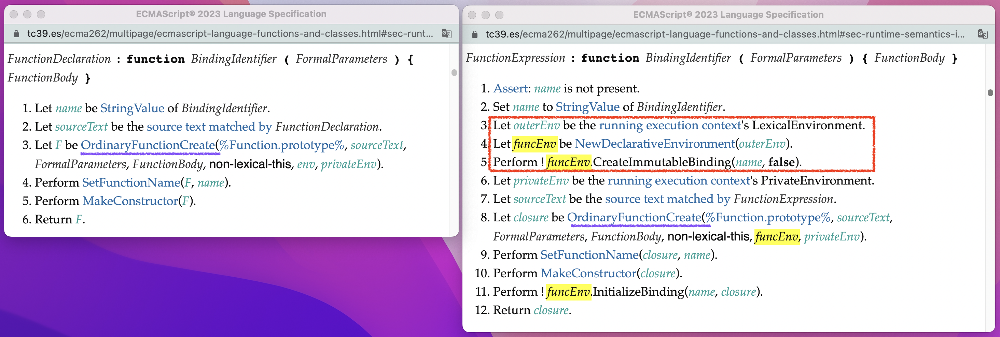
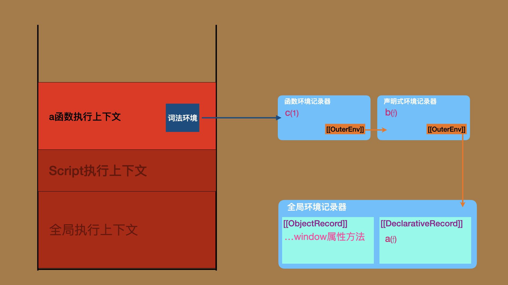
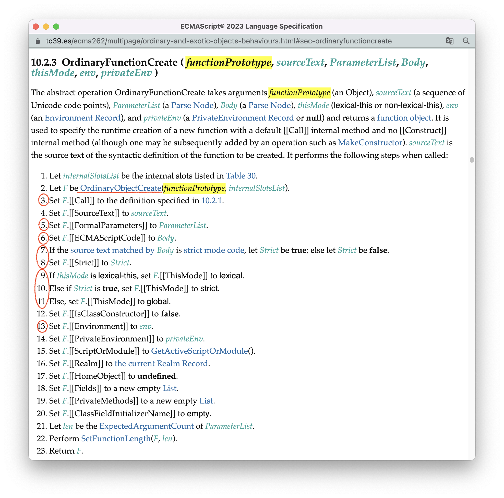
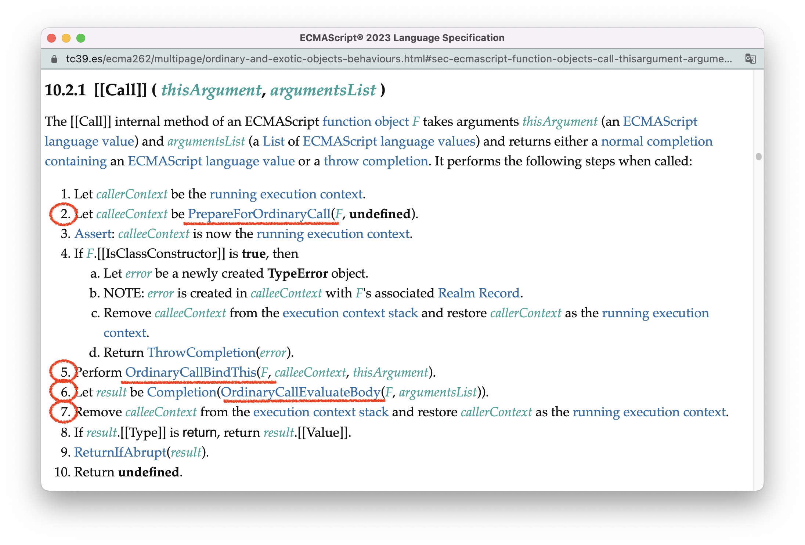
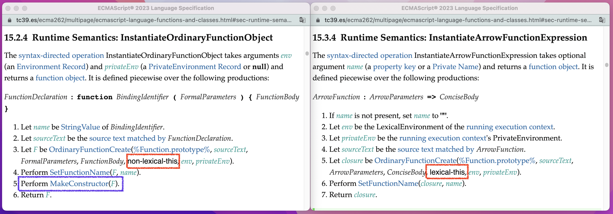
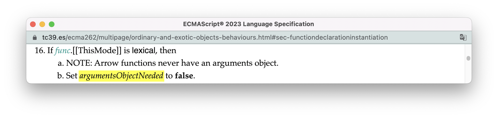
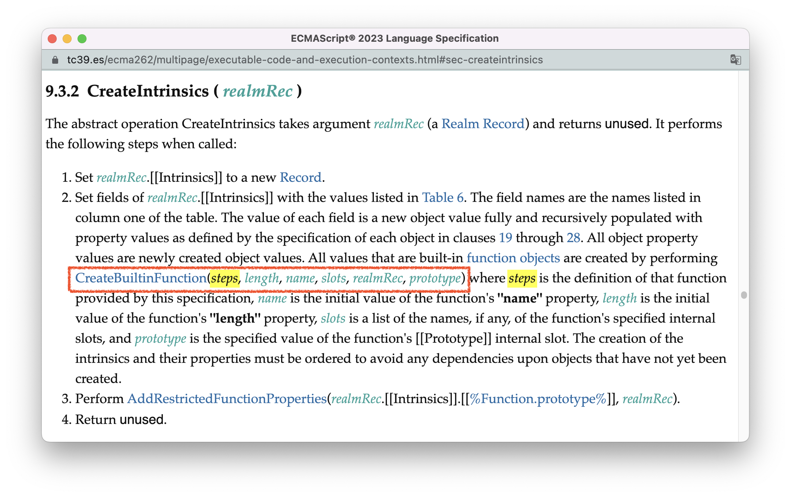
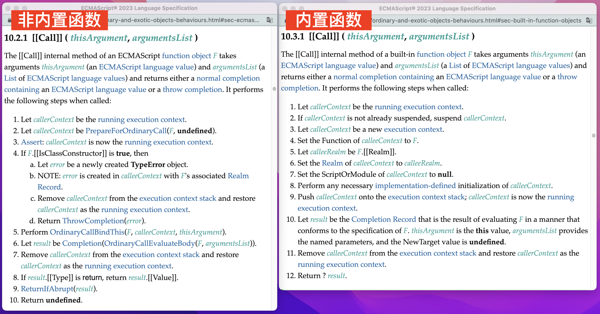

# ECMAScript中的函数

模块化是程序员应对系统复杂性的一个重要手段，而函数就是模块化的基石。在ECMAScript中，每个函数都是一个对象，该对象把一段代码封装在一个词法环境中，并支持这段代码的重复调用。

一个函数的生命周期大概会经历「创建函数」 -「 调用函数」两个阶段。在本节，我会先给你展示，从标准的角度看，这两个阶段的一般过程是怎样的。然后我们会使用这两个阶段的算法找到普通函数与箭头函数的区别。最后，我会讲一种特别的函数 —— ECMAScript内置函数，并解释它与开发者编写的函数在这两个阶段上有什么差异。


<br/>


### 目录:

- [创建函数](#创建函数)

- [调用函数](#调用函数)

- [应用：找出普通函数与箭头函数的区别](#应用找出普通函数与箭头函数的区别)

- [ECMAScript的内置函数](#ecmascript的内置函数)
<br/>


## 创建函数

**创建一个函数，有两种方式：一种是使用函数声明语句，另一种是使用函数表达式。** 前者会在环境声明实例化的时候被创建，后者则在函数表达式所在的语句实际执行的时候才被创建，如以下代码所示：

```js
function a{}()  // 函数声明语句，环境声明实例化时创建函数对象
let b = function(){} // 内嵌函数表达式，语句执行时才创建函数对象
```

在标准的[第15章](https://tc39.es/ecma262/#sec-ecmascript-language-functions-and-classes)，列出了所有ECMAScript函数的类型，不考虑class与class方法，一共有6种。在这里，你还可以找到不同函数的核心创建算法，我用下表给你总结：

| 函数类型                                                     | 函数声明语句创建语义                                         | 函数表达式创建语义                                           |
| ------------------------------------------------------------ | ------------------------------------------------------------ | ------------------------------------------------------------ |
| [普通函数](https://tc39.es/ecma262/multipage/ecmascript-language-functions-and-classes.html#sec-function-definitions) | [InstantiateOrdinaryFunctionObject](https://tc39.es/ecma262/multipage/ecmascript-language-functions-and-classes.html#sec-runtime-semantics-instantiateordinaryfunctionobject) | [InstantiateOrdinaryFunctionExpression](https://tc39.es/ecma262/multipage/ecmascript-language-functions-and-classes.html#sec-runtime-semantics-instantiateordinaryfunctionexpression) |
| [箭头函数](https://tc39.es/ecma262/multipage/ecmascript-language-functions-and-classes.html#sec-arrow-function-definitions) | 无（箭头函数只有表达式）                                     | [InstantiateArrowFunctionExpression](https://tc39.es/ecma262/multipage/ecmascript-language-functions-and-classes.html#sec-runtime-semantics-instantiatearrowfunctionexpression) |
| [Generator函数](https://tc39.es/ecma262/multipage/ecmascript-language-functions-and-classes.html#sec-generator-function-definitions) | [InstantiateGeneratorFunctionObject](https://tc39.es/ecma262/multipage/ecmascript-language-functions-and-classes.html#sec-runtime-semantics-instantiategeneratorfunctionobject) | [InstantiateGeneratorFunctionExpression](https://tc39.es/ecma262/multipage/ecmascript-language-functions-and-classes.html#sec-runtime-semantics-instantiategeneratorfunctionexpression) |
| [Async函数](https://tc39.es/ecma262/multipage/ecmascript-language-functions-and-classes.html#sec-async-function-definitions) | [InstantiateAsyncFunctionObject](https://tc39.es/ecma262/multipage/ecmascript-language-functions-and-classes.html#sec-runtime-semantics-instantiateasyncfunctionobject) | [InstantiateAsyncFunctionExpression](https://tc39.es/ecma262/multipage/ecmascript-language-functions-and-classes.html#sec-runtime-semantics-instantiateasyncfunctionexpression) |
| [Async箭头函数](https://tc39.es/ecma262/multipage/ecmascript-language-functions-and-classes.html#sec-async-arrow-function-definitions) | 无（箭头函数只有表达式）                                     | [InstantiateAsyncArrowFunctionExpression](https://tc39.es/ecma262/multipage/ecmascript-language-functions-and-classes.html#sec-runtime-semantics-instantiateasyncarrowfunctionexpression) |
| [AsyncGenerator函数](https://tc39.es/ecma262/multipage/ecmascript-language-functions-and-classes.html#sec-async-generator-function-definitions) | [InstantiateAsyncGeneratorFunctionObject](https://tc39.es/ecma262/multipage/ecmascript-language-functions-and-classes.html#sec-runtime-semantics-instantiateasyncgeneratorfunctionobject) | [InstantiateAsyncGeneratorFunctionExpression](https://tc39.es/ecma262/multipage/ecmascript-language-functions-and-classes.html#sec-runtime-semantics-instantiateasyncgeneratorfunctionexpression) |

**使用声明语句与使用表达式创建函数对象最主要的区别就是对于函数标识符的处理。** 我们都知道，函数声明语句的标识符会绑定在对函数进行声明实例化的环境记录器中，而**带有标识符的函数表达式，在创建函数前会新建一个声明式环境记录器，单独用来绑定函数标识符，进而使得函数体内可以使用这个标识符，以此获得函数的递归能力。** 下图是普通函数声明语句（左侧）与带有标识符的函数表达式（右侧）创建算法的对比，红色框框出的就是函数表达式新建声明式环境记录器并绑定函数标识符的逻辑片段：



因此，下面的代码：

```js
let a = function b(){
  let c = 1
  // ①
  b()
}
a()
```

执行到位置①时，调用栈如下图的样子，且此时，环境中`b === a`。



<br />

不管是函数声明语句还是函数表达式，也不管是什么类型的函数，仔细对比它们的创建算法，你会发现这些算法最终都是殊途同归 —— 通过抽象操作[OrdinaryFunctionCreate()](https://tc39.es/ecma262/multipage/ordinary-and-exotic-objects-behaviours.html#sec-ordinaryfunctioncreate)来完成函数对象的创建（如上面算法图中紫色下划线部分所示）。

**`OrdinaryFunctionCreate()`是用来创建函数对象的核心抽象操作：它会先基于参数中传入的函数原型创建一个对象，然后初始化这个对象的内部方法和内部插槽。** 如下图所示：



ECMAScript一共有4种函数原型：

- [%Function.prototype%](https://tc39.es/ecma262/multipage/fundamental-objects.html#sec-properties-of-the-function-prototype-object)：普通函数、箭头函数的原型；
- [%Generator.prototype%](https://tc39.es/ecma262/multipage/ecmascript-language-functions-and-classes.html#sec-runtime-semantics-instantiategeneratorfunctionexpression)：Generator函数的原型；
- [%AsyncGeneratorFunction.prototype%](https://tc39.es/ecma262/multipage/control-abstraction-objects.html#sec-properties-of-asyncgeneratorfunction-prototype)：AsyncGenerator函数的原型；
- [%AsyncFunction.prototype%](https://tc39.es/ecma262/multipage/control-abstraction-objects.html#sec-async-function-prototype-properties)：Async函数、Async箭头函数的原型；

不同类型的函数在创建时，会给`OrdinaryFunctionCreate()`传入各自的函数原型（图中黄色标记的functionPrototype），抽象操作[OrdinaryObjectCreate](https://tc39.es/ecma262/multipage/ordinary-and-exotic-objects-behaviours.html#sec-ordinaryobjectcreate)会创建函数对象，并把对象的`[[Prototype]]`内部插槽设置为传入的functionPrototype。

完成对象的创建后，`OrdinaryFunctionCreate()`开始初始化其他的内部插槽和内部方法，一些比较重要的是（红色圈圈出部分）：

- （步骤3）：使用[标准10.2.1](https://tc39.es/ecma262/multipage/ordinary-and-exotic-objects-behaviours.html#sec-ecmascript-function-objects-call-thisargument-argumentslist)定义的逻辑实现`[[Call]]`方法，这也表示使用`OrdinaryFunctionCreate()`创建的函数对象会归类为”ECMAScript普通对象“，如我们在[13.对象类型](./13.object-type.md#普通对象-vs-异质对象)提及的一样。
- （步骤5）：使用`[[FormalParameters]]`内部插槽记录函数参数；
- （步骤6）：使用`[[ECMAScriptCode]]`内部插槽记录函数体；
- （步骤7、8）：判断函数是否处于严格模式，把结果保存在`[[Strict]]`内部插槽；
- （步骤9、10、11）：设置函数的`[[ThisMode]]`内部插槽，该内部插槽对this值的解析有重要影响。
- （步骤13）：使用`[[Environment]]`记录函数的闭包环境，这个内部插槽在[10.作用域链](./10.scope-chain.md#函数代码)早已登场。

关于函数内部插槽的完整列表以及含义，可见[这里](https://tc39.es/ecma262/multipage/ordinary-and-exotic-objects-behaviours.html#table-internal-slots-of-ecmascript-function-objects)。

<br />

完成`OrdinaryFunctionCreate()`的执行后，创建一个函数就只剩下一些收尾工作需要做了。比如设置函数名、把函数变成一个构造器等等，我这里就不再展开具体的细节内容。

接下来，就让我们把注意力放在函数生命周期的第二个阶段 —— 调用函数。


<br/>


## 调用函数

函数的调用一般由[函数调用表达式](https://tc39.es/ecma262/multipage/ecmascript-language-expressions.html#sec-function-calls)触发。而所有的函数，不管什么类型，调用结果都会殊途同归 —— 触发内部方法`[[Call]]`。

**[[Call]]方法是函数执行的核心逻辑。** 我们在以上的创建阶段已经看到，由开发者创建的函数，其`[[Call]]`方法的逻辑使用[标准10.2.1](https://tc39.es/ecma262/multipage/ordinary-and-exotic-objects-behaviours.html#sec-ecmascript-function-objects-call-thisargument-argumentslist)中的定义：



`[[Call]]`方法的关键步骤我已经为你标记出来了：

> 1. [PrepareForOrdinaryCall()](https://tc39.es/ecma262/multipage/ordinary-and-exotic-objects-behaviours.html#sec-prepareforordinarycall) —— 为函数调用作环境准备，此时会：
>    1. 创建新的ECMAScript代码执行上下文；
>    2. 创建函数环境记录器
>    3. 初始化执行上下文的环境组件
>    4. 把执行上下文压入调用栈栈顶；
> 2. [OrdinaryCallBindThis()](https://tc39.es/ecma262/multipage/ordinary-and-exotic-objects-behaviours.html#sec-ordinarycallbindthis) —— 在函数环境记录器中绑定this值；
> 3. [OrdinaryCallEvaluateBody()](https://tc39.es/ecma262/multipage/ordinary-and-exotic-objects-behaviours.html#sec-ordinarycallevaluatebody) —— 执行函数体，此时会：
>    1. 进行函数声明实例化（[FunctionDeclarationInstantiation()](https://tc39.es/ecma262/multipage/ordinary-and-exotic-objects-behaviours.html#sec-functiondeclarationinstantiation)）；
>    2. 执行对应函数类型的逻辑
>
> 4. 函数执行完毕，把执行上下文从栈内弹出。

如果你顺利完成了原理篇的学习，这里大部分内容对你来说已经算非常熟悉了。唯一新鲜的可能是this值的绑定，而this值我需要使用另外[一整个大节](./19.this.md)来进行阐述。

此外，在执行函数体的时候，虽然所有函数都会进行函数声明实例化，但不同类型的函数在实际执行语句时，具体逻辑可能会有所不同:

- 普通函数和箭头函数就是依次执行函数体内的语句；
- Generator函数、AsyncGenerator函数会创建并返回一个generator，此时压根不会执行函数体内的语句；
- Async函数会创建一个promise作为函数的返回值，并依次执行函数体内的语句直到遇上await....

沿着抽象操作[OrdinaryCallEvaluateBody()](https://tc39.es/ecma262/multipage/ordinary-and-exotic-objects-behaviours.html#sec-ordinarycallevaluatebody) ，你就可以找到具体函数语句的执行细节：

| 函数类型                                                     | 函数体求值语义                                               |
| ------------------------------------------------------------ | ------------------------------------------------------------ |
| [普通函数](https://tc39.es/ecma262/multipage/ecmascript-language-functions-and-classes.html#sec-function-definitions) | [Runtime Semantics: EvaluateFunctionBody](https://tc39.es/ecma262/multipage/ecmascript-language-functions-and-classes.html#sec-runtime-semantics-evaluatefunctionbody) |
| [箭头函数](https://tc39.es/ecma262/multipage/ecmascript-language-functions-and-classes.html#sec-arrow-function-definitions) | [Runtime Semantics: EvaluateConciseBody](https://tc39.es/ecma262/multipage/ecmascript-language-functions-and-classes.html#sec-runtime-semantics-evaluateconcisebody) |
| [Generator函数](https://tc39.es/ecma262/multipage/ecmascript-language-functions-and-classes.html#sec-generator-function-definitions) | [Runtime Semantics: EvaluateGeneratorBody](https://tc39.es/ecma262/multipage/ecmascript-language-functions-and-classes.html#sec-runtime-semantics-evaluategeneratorbody) |
| [AsyncGenerator函数](https://tc39.es/ecma262/multipage/ecmascript-language-functions-and-classes.html#sec-async-generator-function-definitions) | [Runtime Semantics: EvaluateAsyncGeneratorBody](https://tc39.es/ecma262/multipage/ecmascript-language-functions-and-classes.html#sec-runtime-semantics-evaluateasyncgeneratorbody) |
| [Async函数](https://tc39.es/ecma262/multipage/ecmascript-language-functions-and-classes.html#sec-async-function-definitions) | [Runtime Semantics: EvaluateAsyncFunctionBody](https://tc39.es/ecma262/multipage/ecmascript-language-functions-and-classes.html#sec-runtime-semantics-evaluateasyncfunctionbody) |
| [Async箭头函数](https://tc39.es/ecma262/multipage/ecmascript-language-functions-and-classes.html#sec-async-arrow-function-definitions) | [Runtime Semantics: EvaluateAsyncConciseBody](https://tc39.es/ecma262/multipage/ecmascript-language-functions-and-classes.html#sec-runtime-semantics-evaluateasyncconcisebody) |

Generator函数的执行细节会在[16.生成器](./16.iterator&generator.md)中展开，async函数的执行细节会在[18.promise](./18.promise.md)中展开。


<br/>


## 应用：找出普通函数与箭头函数的区别

有了上面的基础，我们就可以开始做一些特别的事情。举个例子，我们可以找出普通函数与箭头函数的区别。

首先，由于箭头函数只有表达式的写法，**所以箭头函数不能像普通函数一样被提升**。

其次，在创建函数阶段，对比[普通函数的创建算法](https://tc39.es/ecma262/multipage/ecmascript-language-functions-and-classes.html#sec-runtime-semantics-instantiateordinaryfunctionobject)（下图左侧）以及[箭头函数的创建算法](https://tc39.es/ecma262/multipage/ecmascript-language-functions-and-classes.html#sec-runtime-semantics-instantiatearrowfunctionexpression)（下图右侧），你会发现有两个重要的不同地方：



- 在调用[OrdinaryFunctionCreate()](https://tc39.es/ecma262/multipage/ordinary-and-exotic-objects-behaviours.html#sec-ordinaryfunctioncreate)的时候，两者传入的ThisMode参数不同。普通函数传入的是`non-lexical-this`，箭头函数传入的是`lexical-this`，`lexical-this`会使得函数对象的`[[ThisMode]]`内部插槽赋值为`lexical`。在[19.this值解析](./19.this.md)你会看到，当`[[ThisMode]]`为`lexical`时，不允许绑定this值。因而，**箭头函数没有this值**。
- 普通函数会调用[MakeConstructor()](https://tc39.es/ecma262/multipage/ordinary-and-exotic-objects-behaviours.html#sec-makeconstructor)把对象变成构造器，而箭头函数没有。所以，箭头函数不是构造器，没有prototype属性，在箭头函数头上使用new表达式会报错。

最后，在调用函数阶段，箭头函数和普通函数都会进行[函数声明实例化](https://tc39.es/ecma262/multipage/ordinary-and-exotic-objects-behaviours.html#sec-functiondeclarationinstantiation)，而此时，`[[ThisMode]]`内部插槽又出来发挥作用了：当`[[ThisMode]]`为`lexical`时，不需要创建函数的arguments对象（`argumentsObjectNeeded`为false）。所以，**箭头函数没有arguments对象**。



**基于以上，箭头函数是一种轻量的函数，不能被提升、没有this值、即不是构造器、也没有arguments对象。** 


<br/>


## ECMAScript的内置函数

上面我们讲的函数，都是由开发者自己创建的函数，在ECMAScript中，这类函数称为[ECMAScript函数对象](https://tc39.es/ecma262/multipage/ordinary-and-exotic-objects-behaviours.html#sec-ecmascript-function-objects)（ECMAScript Function Objects）。除了这类函数，ECMAScript还有另外一类函数，称为[内置函数对象](https://tc39.es/ecma262/multipage/ordinary-and-exotic-objects-behaviours.html#sec-built-in-function-objects)（Build-in Function Objects） 。

内置函数即我们在[13.对象类型](./13.object-type.md#内置对象-vs-非内置对象)中提到的“内置对象”的一个分支。内置函数由程序的运行环境提供，帮助完成语言的基础功能。一些内置函数对象的例子包括：

- 全局对象上的方法：如`eval()`、`isFinite()`、`isNaN()`、`parseFloat()`、`parseInt()`等等；
- 各种构造器：如`Array`、`Number`、`Date`、`Map`等等；
- Promise提供的`resolve()`、`reject()`函数。（注意不是`Promise.resolve`、`Promise.reject`方法，而是`new Promise((resolve, reject) => {})`的两个参数）

ECMAScript函数与内置函数的主要区别是：

1. 逻辑的制定方不同。内置函数的逻辑由标准规定，而ECMAScript函数对象的逻辑则由程序员提供。

2. 由第一点导致：在函数创建阶段，两种函数创建方式不同。内置函数使用抽象操作[CreateBuiltinFunction()](https://tc39.es/ecma262/multipage/ordinary-and-exotic-objects-behaviours.html#sec-createbuiltinfunction)创建。而ECMAScript函数由上面提到的[OrdinaryFunctionCreate()](https://tc39.es/ecma262/multipage/ordinary-and-exotic-objects-behaviours.html#sec-ordinaryfunctioncreate)创建。

   你可以在创建固有对象的抽象操作[CreateIntrinsics()](https://tc39.es/ecma262/multipage/executable-code-and-execution-contexts.html#sec-createintrinsics)上看到`CreateBuiltinFunction()`的使用。当[CreateIntrinsics()](https://tc39.es/ecma262/multipage/executable-code-and-execution-contexts.html#sec-createintrinsics)启动的时候，所有标准化的内置函数都会通过`CreateBuiltinFunction(steps,...) `创建，而这里的`step`参数，表示的是函数的逻辑，这个逻辑由标准定义。

   

3. 由第二点导致，在函数执行阶段，两种函数的`[[Call]]`方法逻辑也不同。内置函数对象的[[Call]]内部方法在[标准10.3](https://tc39.es/ecma262/multipage/ordinary-and-exotic-objects-behaviours.html#sec-built-in-function-objects)定义，你可以在下图看见，它创建的只是普通执行上下文而不是ECMAScript代码执行上下文（第3步），它不需要创建函数环境记录器，也不需要调整this的值，并且最终执行的是由标准定义的逻辑（第10步）。

   

4. 最后，内置函数的逻辑也不可以直接在程序中查看得的：

   ```js
   new Promise(resolve => console.log(resolve))  // ƒ(){[native code]}
   ```

   
