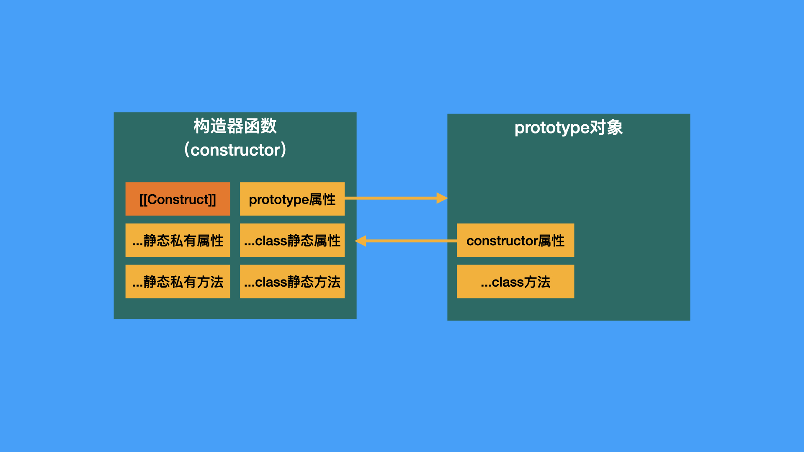

# ECMAScript中的类

类（class）是面向对象编程的基石。在ECMAScript中，有三个与类相关的重要对象，分别是：

- 构造器函数对象
- prototype对象
- 实例对象

他们之间的关系是：构造器函数有一个`prototype`属性指向prototype对象，prototype对象有一个`constructor`属性反过来指向构造器函数，对构造器函数使用new表达式可以创建一个实例对象。该实例对象的内部插槽`[[Prototype]]`指向prototype对象。如下图所示：


我们常说的原型对象，指的是对象内部插槽`[[Prototype]]`指向的对象。构造器当然也有自己的原型对象，且与构造器的`prototype`属性指向的对象往往是不一样的，如果这两个对象都使用“原型对象”来描述就会很容易混淆。

**为了避免歧义，本书会统一使用「原型对象」指代“内部插槽`[[Prototype]]`指向的对象”，「prototype对象」指代“构造器`prototype`属性指向的对象“。** 比如，Array构造器的原型对象是一个原生函数`ƒ () { [native code] }`，prototype对象则是一个含有基础方法的数组。你可以使用以下的API分别获得两个对象：

```js
// 原型对象
Object.getPrototypeOf(Array) // ƒ () { [native code] }

// prototype对象
Array.prototype // [constructor: ƒ, at: ƒ, concat: ƒ, copyWithin: ƒ, fill: ƒ, …]
```

花这么多文字来分清这三个对象是因为它们对于理解类非常重要。甚至毫不夸张的说，理解了它们三者的联系，标准的后半部分你就已经读懂了一大半。标准的第19章～28章对语言的内置构造器进行了定义，你可以翻翻这些章节的目录，你会发现定义一个内置构造器，无非就是定义构造器函数的逻辑，以及构造器函数、prototype对象、实例对象上的属性方法。


此外，这三个对象的关系对于能否理解类的“创建”与“实例化”，也就是我们接下来要讲的内容，起着决定性的作用。在下面的内容你会看到，**创建类与实例化类，就是逐步创建这三个对象并建立它们之间的联系的过程。** 


<br/>


### 目录:

- [创建类](#创建类)

  * [1. 创建prototype对象](#1-创建prototype对象)

  * [2. 创建构造器函数](#2-创建构造器函数)

  * [3. 给两个对象添加属性方法](#3-给两个对象添加属性方法)

  * [关于私有元素](#关于私有元素)

- [实例化类](#实例化类)
<br/>


## 创建类

创建类的核心语义是[ClassDefinitionEvaluation](https://tc39.es/ecma262/multipage/ecmascript-language-functions-and-classes.html#sec-runtime-semantics-classdefinitionevaluation)，如果你点进去看，你会发现这算法可不是一般地长。但无所谓，我会出手。

总的来说，这个核心语义主要做了三件事情：

1. 创建类的prototype对象
2. 创建类的构造器函数
3. 根据类声明语句中的元素类型，分别给prototype对象与构造器函数添加属性方法。


<br/>


### 1. 创建prototype对象

与创建prototype对象相关的逻辑片段如下所示：


这里的黄色`proto`是创建的结果。创建对象是一个很简单的事情，只需要一个抽象操作[OrdinaryObjectCreate](https://tc39.es/ecma262/multipage/ordinary-and-exotic-objects-behaviours.html#sec-ordinaryobjectcreate)就可以完成了。麻烦的地方是需要确定prototype对象的原型对象 —— 即这里棕红色的`protoParent`。

`protoParent`的确定过程经历以下这么几个判断：（以下括号内为算法片段中对应的步骤，后续的内容都沿用这个标注方式）

- （7.a）如果类没有继承，`protoParent`为`Object.prototype`；
- （8.f.i）如果有继承，但继承的是个null，`protoParent`即为null；
- （8.h.i）如果有继承，且继承的是一个货真价实的构造器（`superclass`），那么`protoParent`为`superclass`的prototype对象；
- 其他的情况，抛出TypeError的错误。

你可以使用以下的代码来验证这个过程：

```js 
// （7.a）
class A{}
Object.getPrototypeOf(A.prototype) === Object.prototype // true

// （8.f.i）
class B extends null{}
Object.getPrototypeOf(B.prototype) === null // true

// （8.h.i）
class C extends A{}
Object.getPrototypeOf(C.prototype) === A.prototype // true

// 其他情况
class D extends 1{} // ❌：Uncaught TypeError: Class extends value 1 is not a constructor or null
```

<br />

在这个算法片段中，除了创建prototype对象，还确定了构造器函数的原型对象 —— 即绿色的`constructorParent`，它的确定过程比较简单：

- （8.h.iii）如果有继承，且继承的是一个构造器，那么把`constructorParent`设置为这个构造器；
- 其他情况下，`constructorParent`为`Function.prototype`。

得到的`constructorParent`会在创建构造器函数的时候被使用。


<br/>


### 2. 创建构造器函数

创建构造器函数的逻辑片段如下图所示：


这里，棕色的`F`是最终的创建结果。它的创建过程大概是这样的：

1. 以constructor方法为基础创建一个函数`F`，但此时`F`还不是一个构造器，具体创建过程如下：
   - （14）如果类没有提供constructor方法，就会按照以下的方式创建一个默认的`F`：

     - （14.iv）如果类有继承语句，相当于使用以下的constructor方法创建了`F`：

       ```js
       constructor(...args) { super(...args); }
       ```

     - （14.v）如果无继承语句，相当于使用以下的constructor方法创建了`F`：

       ```js
       constructor(){}
       ```

   - （15）如果类提供了constructor方法，那么，会以`constructorParent`作为函数原型，以constructor方法为主要逻辑创建`F`

2. （16）使用抽象操作[MakeConstructor](https://tc39.es/ecma262/multipage/ordinary-and-exotic-objects-behaviours.html#sec-makeconstructor)把`F`变成一个构造器，这个抽象操作主要做两件事情：

   1. 根据标准的定义，实现`F`的`[[Construct]]`内部方法，`[[Construct]]`是实例化类的核心方法。
   2. 设置`F`的`prototype`属性指向prototype对象，即我们前面创建的`proto`。

3. （18）把`proto`的`constructor`属性指向构造器函数`F`。

至此，构造器函数、prototype对象已经创建完毕，它们之间的属性链接也建立完毕，如下面这张图所示：


于是，我们离完成类的创建也只剩下最后一步 —— 根据元素类型给两个对象添加属性方法。


<br/>


### 3. 给两个对象添加属性方法

完成以上两大块工作之后，[ClassDefinitionEvaluation](https://tc39.es/ecma262/multipage/ecmascript-language-functions-and-classes.html#sec-runtime-semantics-classdefinitionevaluation)剩余的内容都是如何给前面创建的两个对象添加属性方法。

我们从目标符[ClassElement](https://tc39.es/ecma262/multipage/ecmascript-language-functions-and-classes.html#prod-ClassElement)的产生式可以看出，类的元素主要可以分为5种：


我们可以把这些元素最终添加的对象先用下面这一张表进行总结：（暂不考虑私有元素的情况）

| 代换式                                                       | 俗称     | 添加的对象               |
| ------------------------------------------------------------ | -------- | ------------------------ |
| [MethodDefinition](https://tc39.es/ecma262/multipage/ecmascript-language-functions-and-classes.html#prod-MethodDefinition) | 方法     | prototype对象            |
| **static** [MethodDefinition](https://tc39.es/ecma262/multipage/ecmascript-language-functions-and-classes.html#prod-MethodDefinition) | 静态方法 | 构造器函数               |
| [FieldDefinition](https://tc39.es/ecma262/multipage/ecmascript-language-functions-and-classes.html#prod-FieldDefinition) **;**  | 属性     | 实例对象（实例化的时候） |
| **static** [FieldDefinition](https://tc39.es/ecma262/multipage/ecmascript-language-functions-and-classes.html#prod-FieldDefinition) **;**  | 静态属性 | 构造器函数               |
| [ClassStaticBlock](https://tc39.es/ecma262/multipage/ecmascript-language-functions-and-classes.html#prod-ClassStaticBlock) | 静态块   | 构造器函数               |

你可以通过以下的代码去验证这个事情：

```js
class A {
    a(){}
    static b(){}
    c = 1;
    static d = 2;
    static { // 静态块
        console.log(this.c) // undefined - 静态块只能访问静态属性、方法
        console.log(this.d) // 2
    }
}

console.log(Object.hasOwn(A.prototype, "a")) // 方法
console.log(Object.hasOwn(A, "b")) // 静态方法
console.log(Object.hasOwn(new A, "c")) // 属性
console.log(Object.hasOwn(A, "d")) // 静态属性
```

有了这个基础，我们再来看看每一种元素的具体添加逻辑（在算法中对应的分支）：


- 方法：
  1. （25.a）对方法元素执行[ClassElementEvaluation](https://tc39.es/ecma262/multipage/ecmascript-language-functions-and-classes.html#sec-static-semantics-classelementevaluation)运行时语义，执行的结果会把方法添加到prototype对象上；
- 静态方法：
  1. （25.b）对静态方法元素执行[ClassElementEvaluation](https://tc39.es/ecma262/multipage/ecmascript-language-functions-and-classes.html#sec-static-semantics-classelementevaluation)运行时语义，执行的结果把静态方法添加到构造器函数上；
- 属性：
  1. （25.a）对属性元素执行[ClassElementEvaluation](https://tc39.es/ecma262/multipage/ecmascript-language-functions-and-classes.html#sec-static-semantics-classelementevaluation)运行时语义，<u>与方法不同的是，此时不会直接添加元素到对象上</u>，而是得到一个表示属性元素的[ClassFieldDefinition](https://tc39.es/ecma262/multipage/ecmascript-data-types-and-values.html#sec-classfielddefinition-record-specification-type)记录器，该记录器的`[[Name]]`字段记录了属性名，`[[Initializer]]`字段记录了初始化属性值的相关逻辑。
  2. （25.f.i）把该ClassFieldDefinition记录器添加到名为`instanceFields`的列表；
  3. （29）（到这一步时，`instanceFields`列表已经收集完所有属性元素的ClassFieldDefinition记录器），将`instanceFields`列表保存在构造器函数`F`的内部插槽`[[Fields]]`中，它会在构造器实例化的时候再拿出来使用。
- 静态属性：
  1. （25.b）对静态属性元素执行[ClassElementEvaluation](https://tc39.es/ecma262/multipage/ecmascript-language-functions-and-classes.html#sec-static-semantics-classelementevaluation)运行时语义，得到静态属性的ClassFieldDefinition记录器。
  2. （25.f.ii）把该ClassFieldDefinition记录器添加到名为`staticElements`的列表中；
  3. （31.a）（到这一步时，`staticElements`列表已经收集完所有静态属性的ClassFieldDefinition记录器），在`staticElements`列表中过滤出所有的ClassFieldDefinition记录器，通过[DefineField](https://tc39.es/ecma262/multipage/abstract-operations.html#sec-definefield)给构造器函数添加这些静态属性。
- 静态块：
  1. （25.b）对静态块元素执行[ClassElementEvaluation](https://tc39.es/ecma262/multipage/ecmascript-language-functions-and-classes.html#sec-static-semantics-classelementevaluation)运行时语义，此时会基于静态块创建一个新的函数，并将这个函数保存在一个名为[ClassStaticBlockDefinition](https://tc39.es/ecma262/multipage/ecmascript-data-types-and-values.html#sec-classstaticblockdefinition-record-specification-type)的记录器，该记录器只有一个字段`[[BodyFunction]]`，用以存储静态块的函数。
  2. （25.g）把该ClassStaticBlockDefinition记录器添加到名为`staticElements`的列表中；
  3. （31.b）（到这一步时，`staticElements`列表已经收集完所有静态块的ClassStaticBlockDefinition记录器），在`staticElements`列表中过滤出所有的ClassStaticBlockDefinition记录器，并执行记录器`[[BodyFunction]]`中保存的函数。

<br />

完成这些步骤后，构造器函数与prototype对象得到了进一步的完善，如下图所示：


但这还并不能表示完整的创建结果，因为我们还缺失了最后一个部分 —— 私有元素，一个来自es2022的新特性。


<br/>


### 关于私有元素

私有元素会以`#`开头。如下图[FieldDefinition](https://tc39.es/ecma262/multipage/ecmascript-language-functions-and-classes.html#prod-FieldDefinition)的文法所示：


私有元素可以分为：私有方法、私有属性、静态私有方法、静态私有属性。它们各自归属的对象可以用下表总结：

| 私有元素     | 添加的对象 |
| ------------ | ---------- |
| 私有方法     | 实例对象   |
| 私有属性     | 实例对象   |
| 静态私有方法 | 构造器函数 |
| 静态私有属性 | 构造器函数 |

完成私有元素的初始化后，我们就完成了整个创建类的过程。此时构造器函数与prototype对象的结构与关系如下图所示：



以下为私有元素初始化的细节过程，如果你不感兴趣，完全可以直接跳到后面的实例化内容中。

<br />

要理解私有元素的初始化过程，需要先理清几个概念：

- [PrivateElement](https://tc39.es/ecma262/multipage/ecmascript-data-types-and-values.html#sec-privateelement-specification-type)：一个规范类型，相当于私有元素的属性描述符；
- [对象的\[[PrivateElements\]]内部插槽](https://tc39.es/ecma262/multipage/ecmascript-data-types-and-values.html#sec-object-internal-methods-and-internal-slots)：用于存储该对象上的私有元素（以PrivateElement的形式）；
- [Private Name](https://tc39.es/ecma262/multipage/ecmascript-data-types-and-values.html#sec-private-names)：一个规范类型，表示私有元素的标识符；
- [PrivateEnvironment Record](https://tc39.es/ecma262/multipage/executable-code-and-execution-contexts.html#sec-privateenvironment-records)：私有环境记录器，用于绑定私有元素标识符（以Private Name的形式）。
- [执行上下文的私有环境](https://tc39.es/ecma262/multipage/executable-code-and-execution-contexts.html#table-additional-state-components-for-ecmascript-code-execution-contexts)：指向一个私有环境记录器，是解析私有标识符的起点。

私有变量的使用过程，实际上与普通变量是非常相似的。解析标识符时，它会先以执行上下文的私有环境为起点，[解析](https://tc39.es/ecma262/multipage/ecmascript-data-types-and-values.html#sec-makeprivatereference)得到一个引用记录器，该引用记录器记录了私有变量的Private Name以及拥有该私有变量的对象。随后，在该对象的`[[PrivateElements]]`内部插槽中，通过Private Name可以找到私有变量的PrivateElement，基于PrivateElement，就可以对私有变量进行[取值](https://tc39.es/ecma262/multipage/abstract-operations.html#sec-privateget)和[赋值](https://tc39.es/ecma262/multipage/abstract-operations.html#sec-privateset)。

在使用[ClassDefinitionEvaluation](https://tc39.es/ecma262/multipage/ecmascript-language-functions-and-classes.html#sec-runtime-semantics-classdefinitionevaluation)创建类的过程中，与私有元素相关的逻辑如下：

1. （4、5）创建新的私有环境记录器。
2. （6）把类中所有私有元素的名字（Private Names）添加到这个私有环境记录器当中；
3. （25.a）对每个私有元素，执行[ClassElementEvaluation](https://tc39.es/ecma262/multipage/ecmascript-language-functions-and-classes.html#sec-static-semantics-classelementevaluation)，不同类型的元素会得到不同的结果：
   - 私有方法/静态私有方法：得到一个关于该方法的PrivateElement；
   - 私有属性/静态私有属性：得到一个关于该属性的ClassFieldDefinition记录器；

4. 将上面的结果存储在不同的列表当中：
   - （25.e.ii）私有方法的PrivateElement会添加到`instancePrivateMethods`列表中；
   - （25.e.iii）静态私有方法的PrivateElement会添加到`staticPrivateMethods`列表中；
   - （25.f.i）私有属性的ClassFieldDefinition记录器会添加到`instanceFields`列表中；
   - （25.f.ii）静态私有属性的ClassFieldDefinition记录器会添加到`staticElements`列表中；

5. 对不同的列表作不同的处理：
   - （28）`instancePrivateMethods`列表会保存在构造器的`[[PrivateMethods]]`内部插槽上，未来实例化的时候会使用它来创建实例对象的私有方法；
   - （29）`instanceFields`列表会保存在构造器的`[[Fields]]`内部插槽上，未来实例化的时候会使用它来创建实例对象的私有属性；
   - （30）对`staticPrivateMethods`列表内的每个PrivateElement，使用抽象操作[PrivateMethodOrAccessorAdd](https://tc39.es/ecma262/multipage/abstract-operations.html#sec-privatemethodoraccessoradd)来创建构造器的静态私有方法，PrivateElement会添加到构造器的`[[PrivateElements]]`内部插槽中。
   - （31.a）对`staticElements`列表内的每个ClassFieldDefinition记录器，使用抽象操作[DefineField](https://tc39.es/ecma262/multipage/abstract-operations.html#sec-definefield)来创建构造器的静态私有属性，此时会对根据属性名创建PrivateElement，并添加到构造器的`[[PrivateElements]]`内部插槽中。


<br/>


## 实例化类

我们前面说了，在创建构造器函数的时候，抽象操作[MakeConstructor](https://tc39.es/ecma262/multipage/ordinary-and-exotic-objects-behaviours.html#sec-makeconstructor)会给构造器实现一个`[[Construct]]`内部方法，而`[[Construct]]`方法之于构造器，就如同`[[Call]]`方法之于函数。

对构造器使用[new表达式](https://tc39.es/ecma262/multipage/ecmascript-language-expressions.html#prod-NewExpression)时，会触发构造器的`[[Construct]]`方法，进而实例化构造器，得到实例对象。

由开发者创建的构造器，其`[[Construct]]`方法使用[标准10.2.2](https://tc39.es/ecma262/multipage/ordinary-and-exotic-objects-behaviours.html#sec-ecmascript-function-objects-construct-argumentslist-newtarget)定义的逻辑：


`[[Construct]]`方法的关键步骤如下所示：

1. （3）如果类没有继承：那么以prototype对象为原型创建一个新的对象，**这个对象就是最终得到的实例对象**，在算法中赋值在（用黄色标注的）`thisArgument`变量中。
2. （4）创建执行上下文，初始化执行上下文的组件，创建函数环境记录器。**这一步为执行构造器函数的逻辑作环境准备。** 
3. （6）如果类没有继承：
   - （6.a）把函数环境记录器的this值绑定为`thisArguments`，**使得构造器函数中的this值指向实例对象**。
   - （6.b）通过抽象操作[InitializeInstanceElements](https://tc39.es/ecma262/multipage/abstract-operations.html#sec-initializeinstanceelements)初始化`thisArguments`的属性。**此时类的属性、私有属性、私有方法都添加到实例对象上**。
4. （8）执行构造器函数的逻辑。
5. 处理返回值：
   - （10）当使用了return语句：
     - 如果返回的是一个对象，那么这个对象就是返回值；
     - 如果类没有继承，则返回`thisArguments`，即实例对象。
     - 其他情况下，如果返回的不是一个undefined，则抛出错误TypeError
   - （12）否则，返回环境记录器绑定的this值，即实例对象。

<br />

你可能会觉得疑惑，这里好像缺失了一些当类有继承的时候的逻辑。是的，我们都知道，当类有继承的时候，在（8）执行构造器函数的逻辑中，必须先调用`super()`后才能使用this值，<u>因为此时，实例对象是在super方法中完成创建的</u>，如下图所示：


这里黄色的`result`就是在super方法中创建的实例对象。super方法的[关键步骤](https://tc39.es/ecma262/multipage/ecmascript-language-expressions.html#sec-super-keyword-runtime-semantics-evaluation)如下所示：

（此时，我们处于`[[Construct]]`方法的第8步 —— 执行构造器函数的逻辑，并正在执行`super()`语句...）

1. （3）获取继承的构造器；
2. （6）对继承的构造器进行实例化（即调用该继承构造器上的`[[Construct]]`方法），**得到实例对象`result`** ；
3. （8）把`result`作为this值绑定在环境中，**这一步使得构造器函数后续的语句可通过this值访问实例对象；** 
4. （11）在`result`上初始化实例属性，**此时类的属性、私有属性、私有方法都添加到实例对象上**。
5. （12）返回result。

（此后，继续构造器函数后续逻辑的执行...）

这里出现了一些关于this值的绑定内容，对于this值，我们会在[19.this值解析](./19.this.md)中进行非常详细的研究。

<br />

到这里，关于类的创建与实例化的内容就圆满完成了。此时，3个与类相关的对象，它们的结构与关系已经得到了完全的建立，如下图所示：


