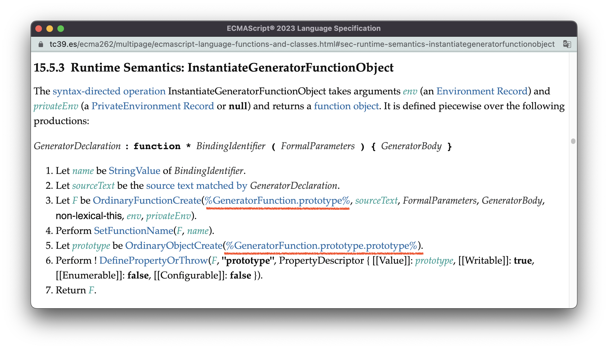

# iterator&generator

前面两节我们分别讲了模块化编程的基石 —— 函数，面向对象编程的基石 —— 类，本节我们将关注异步编程的基石 —— generator。我会先讲比generator更为的底层的对象 —— 迭代器与可迭代对象；然后会讲Generator函数的创建与执行；最后我会重点分析，从标准的角度看，generator是如何实现异步编程的。


<br/>


### 目录:

- [迭代器与可迭代对象](#迭代器与可迭代对象)

- [Generator函数与generator](#generator函数与generator)

  * [1. 创建Generator函数](#1-创建generator函数)

  * [2. 执行函数获得generator](#2-执行函数获得generator)

  * [3. 通过generator实现异步编程](#3-通过generator实现异步编程)
<br/>


## 迭代器与可迭代对象

众所周知，“鸭子类型”是JavaScript应用的一种类型系统。鸭子类型是指语言会在运行时根据对象的结构，隐式地推断对象的类型。标准使用接口（interface）描述某个对象类型的结构，当一个对象实现了这个接口定义的所有属性方法，该对象就可以使用这个接口关联的所有特性。

对于鸭子类型，最典型的应用就是迭代器。标准定义了3个[与迭代器相关的接口](https://tc39.es/ecma262/multipage/control-abstraction-objects.html#sec-iteration)。分别是：

- 可迭代对象接口（iterable interface）：定义了一个方法，所有实现了该方法的对象都可以称为**可迭代对象**。
  > - `Symbol.iterator`方法：执行该方法会返回一个”迭代器对象“。

- 迭代器接口（iterator interface）：定义了一个必须的方法以及两个可选的方法，所有实现了该接口的对象称为**迭代器对象**：
  > - `next`方法：必须的方法，返回一个“迭代结果对象”。
  > - `return`方法：可选，一般返回一个`done`属性为true的迭代结果对象，表示迭代结束。
  > - `throw`方法：可选，返回一个异常或`done`属性为true的迭代结果对象，表示迭代过程发生错误。
- 迭代结果接口（iteratorResult interface）：定义了两个属性值，所有实现该接口的对象称为**迭代结果对象**：
  > - `done`：使用一个布尔值表示迭代过程是否已经完成。
  > - `value`：表示当前迭代位置的值。

举一个简单的例子。在下面的例子中，`iterable`是一个可迭代对象，`iterator`是一个迭代器对象， `iteratorRes`是一个迭代结果对象：

```js
const iterable = { // 【可迭代对象】
    [Symbol.iterator]: fn,
}


function fn(){
    let curr = 0
    const iterator = { // 【迭代器对象】
        next(){
            const iteratorRes = { //【迭代结果对象】
                done: curr > 10, // 大于10终止遍历
                value: curr
            }
            curr ++
            return iteratorRes 
        }
    } 
    return iterator
}
```

在ECMAScript中，许多特性是基于可迭代对象接口实现的，比如`for ... of ... `循环、展开语法等等，所以上面的可迭代对象可以这么用：

```js
// for ... of ... 循环
for (let i of iterable) {
    console.log(i)
}
// 展开语法：
let a = [...iterable]
```

许多语言提供的对象类型，本身也是可迭代对象，比如数组、字符串对象、Map、Set：

```js
// 使用展开语法
console.log(...[1,2,3,4]) // 数组
console.log(..."123") // 字符串对象
console.log(...new Map([["a",1],["b",2],["c",3]])) // Map
console.log(...new Set([1,2,3])) // Set
```

<br />

学习迭代器我认为有一个常见的坑：**语言内置的迭代器，它既是迭代器，也是可迭代对象**。比如下面的代码，我通过执行`Symbol.iterator `方法拿到了数组的迭代器，却发现这个迭代器，不仅可以调用`next()` 方法，还可以使用可迭代对象的特性。

```js
const array = [1,2,3,4]
let arrayIterator = array[Symbol.iterator]() // 数组迭代器

// 作为迭代器使用
arrayIterator.next()

// 作为可迭代对象使用（使用展开语法）
console.log(...arrayIterator)
```

这个现象总是容易让初学者（比如曾经的我）一不小心就弄混迭代器与可迭代对象的区别。要找到这个现象的根源，需要追溯到这些内置迭代器的原型链上。不管是数组、字符串对象、Map、Set还是其他内置的可迭代对象，通过执行`Symbol.iterator `方法都可以拿到它们各自的迭代器，而这些迭代器的原型都共同源自于一个神秘的对象 —— [%iteratorPrototype%](https://tc39.es/ecma262/multipage/control-abstraction-objects.html#sec-%iteratorprototype%-object)。


之所以说他神秘，是因为这个对象并不是全局对象上的某一个属性，而且也并没有什么简便的方法可以获取到它，要拿到它，你只能爬原型链，如下面的代码所示：

```js
Object.getPrototypeOf(Object.getPrototypeOf([][Symbol.iterator]()))
```

而这个神秘的对象，自身有一个`Symbol.iterator`方法，且[这个方法](https://tc39.es/ecma262/multipage/control-abstraction-objects.html#sec-%iteratorprototype%-@@iterator)会返回它自身，如下图所示（标准使用`@@`表示Symbol）：


你可以使用以下代码验证这一点：

```js
let iteratorPrototype = Object.getPrototypeOf(Object.getPrototypeOf([][Symbol.iterator]()))
iteratorPrototype[Symbol.iterator]() === iteratorPrototype // true
```

于是，其他继承这个对象的迭代器，也继承了这个方法。而基于鸭子类型的特点，实现了`Symbol.iterator`方法的对象都是可迭代对象，这也就解释了，为什么这些内置迭代器，既是迭代器，也是可迭代对象。

<br />

有了以上的基础，我们就可以进入今日的正餐 —— generator。


<br/>


## Generator函数与generator

**在这里，首先需要区分的是：[Generator函数](https://tc39.es/ecma262/multipage/control-abstraction-objects.html#sec-generatorfunction-objects)与[generator](https://tc39.es/ecma262/multipage/control-abstraction-objects.html#sec-generator-objects)不是同一个东西。Generator函数用于创建generator，generator既是一个迭代器也是一个可迭代对象（因为generator也继承了%iteratorPrototype%），用于进行实际的异步迭代。** 

一个Generator函数的使用大致会经历以下三个阶段：

> 1. 创建Generator函数；
> 2. 执行函数获得可迭代对象；
> 3. 对可迭代对象进行迭代。
>

举个例子：

```js
// 1. 创建Generator函数
function* generatorFn(){
    yield 1;
    yield 2
}

// 2. 执行函数获得可迭代对象
const iterable = generatorFn()

// 3. 对可迭代对象进行迭代
for (let i of iterable) {
    console.log(i)
}
```

如果Generator函数仅仅拿来做迭代的话，那数组做得比它好一万倍。Generator函数真正的魔力在于：它可以实现异步编程，所以我们要把三个阶段的表述改一改：

一个Generator函数的使用大致会经历以下三个阶段：

> 1. 创建Generator函数；
> 2. 执行函数获得generator；
> 3. 通过generator实现异步编程。

举个例子：

```js
// 1. 创建Generator函数
function* generatorFn(){
    console.log(2);
    yield;
    console.log(4)
}

// 2. 执行函数获得generator；
const generator = generatorFn()

// 3. 通过generator实现异步编程。
console.log(1)
generator.next() // 2
console.log(3)
generator.next() // 4
```

<br />

在剩余的内容中，我会从标准的角度为你展示，Generator函数在这三个阶段分别都经历了什么。


<br/>


### 1. 创建Generator函数

在[14.函数](./14.function.md#创建函数)中，我们讲了ECMAScript创建函数的主要步骤，并且提到了创建Generator函数的运行时语义 —— [InstantiateGeneratorFunctionObject](https://tc39.es/ecma262/multipage/ecmascript-language-functions-and-classes.html#sec-runtime-semantics-instantiategeneratorfunctionobject)。

Generator函数的创建过程与一般函数大体一致，差异主要体现在两个方面：

- 原型对象不同。普通函数使用的原型对象是`Function.prototype`的，而Generator函数使用的原型对象是`GeneratorFunction.prototype`；
- prototype对象不同。普通函数使用[MakeConstructor](https://tc39.es/ecma262/multipage/ordinary-and-exotic-objects-behaviours.html#sec-makeconstructor)创建一个以`Object.prototype`为原型的prototype对象，并把函数变成一个构造器；而Generator函数会以`GeneratorFunction.prototype.prototype`为原型创建prototype对象，但Generator函数不会变成构造器（无`[[Construct]]`方法），这个prototype对象会在创建generator的时候被使用。




<br/>


### 2. 执行函数获得generator

在[14.函数](./14.function.md#调用函数)中我们也说过，对于Generator函数，执行函数体的时候会调用[EvaluateGeneratorBody](https://tc39.es/ecma262/multipage/ecmascript-language-functions-and-classes.html#sec-runtime-semantics-evaluategeneratorbody)，有趣的是，此时并不会执行Generator函数内语句，而是创建了一个新的对象，即generator：


这里的主要逻辑可以总结如下：

1. 函数声明实例化；
2. 基于`GeneratorFunction.prototype.prototype`创建一个对象G，G就是最终获得的generator；
3. 准备generator的执行环境，核心算法是[GeneratorStart](https://tc39.es/ecma262/multipage/control-abstraction-objects.html#sec-generatorstart)；
4. 返回G

从这个角度看，执行Generator函数，就好像使用new表达式创建了一个generator实例一样，尽管Generator函数本身并不是一个构造器。关于Generator函数与generator的原型链、prototype对象之间的关系，可以用下面这张图理清楚：


<br />

在上述算法中，[GeneratorStart](https://tc39.es/ecma262/multipage/control-abstraction-objects.html#sec-generatorstart)是与实现异步相关的抽象操作，我们放到下面一起讲。


<br/>


### 3. 通过generator实现异步编程

从标准的角度来看，与generator实现异步编程密切相关的抽象操作分别是：[GeneratorStart](https://tc39.es/ecma262/multipage/control-abstraction-objects.html#sec-generatorstart)、[GeneratorResume](https://tc39.es/ecma262/multipage/control-abstraction-objects.html#sec-generatorresume)、[GeneratorYield](https://tc39.es/ecma262/multipage/control-abstraction-objects.html#sec-generatoryield)。它们分别会在创建generator、调用generator的`next()`方法、遇到yield表达式的时候被触发，如下面的代码所示：

```js
function* a(){
    console.log(2);
    yield; // 3. 触发【GeneratorYield】
    console.log(4);
}
b = a() // 1. 触发【GeneratorStart】
console.log(1) 
b.next() // 2. 触发【GeneratorResume】
console.log(3)
b.next() // 4. 触发【GeneratorResume】
```

在深入这些抽象操作的细节之前，我们需要先知道generator对象上的两个重要的内部插槽：

-  `[[GeneratorState]]`：记录generator当前的执行状态，该内部插槽有意义的值以及对应的含义分别是：
   - `suspendedStart`：generator初始化完毕；
   - `suspendedYield`：在执行generator的过程中，遇到了yield表达式，需要暂停执行。
   - `executing`：正在执行generator；
   - `completed`：generator执行完毕。
-  `[[GeneratorContext]]`：保存用以执行generator的执行上下文，该执行上下文在未来可能会被数次压入、弹出调用栈。

<br />

[GeneratorStart](https://tc39.es/ecma262/multipage/control-abstraction-objects.html#sec-generatorstart)会在执行Generator函数的过程中触发，它的完整逻辑如下图所示：


这里的关键步骤是：（与[15.类](./15.class.md)一样，括号内对应图中算法的步骤）

1. （2）获取当前执行上下文（图中黄色的`genContext`），由于此时正在执行Generator的函数，所以`genContext`为Generator函数所创建的执行上下文。
2. （4）创建一个[抽象闭包](./7.spec_type.md#抽象闭包abstract-closure)（红色的`closure`），这个抽象闭包封装了一段逻辑：执行Generator函数体内的语句列表（绿色的`generatorBody`），并根据执行的结果，返回不同的迭代结果对象。我们前面所说的“执行generator”，指的就是执行这个抽象闭包。
3. （5）设置`genContext`的`code evaluation state `组件，使得每次`genContext`压入调用栈栈顶并恢复执行时，抽象闭包从原来暂停的地方继续执行。
4. （6）把`genContext`保存在generator的`[[GeneratorContext]]`内部插槽中；
5. （7）把generator的`[[GeneratorState]]`内部插槽设置为`suspendedStart`。

在此之后，不管是显式使用`next()`方法、还是由语言特性（如for...of...）隐式触发generator，都会触发抽象操作[GeneratorResume](https://tc39.es/ecma262/multipage/control-abstraction-objects.html#sec-generatorresume)，其完整的逻辑如下图所示：


GeneratorResume的关键步骤并不复杂：

1. （4）获得generator的`[[GeneratorContext]]`内部插槽保存的执行上下文，`genContext`；

2. （7）把generator的`[[GeneratorState]]`内部插槽设置为`executing`；

3. （8）把`genContext`压入调用栈；

4. （9）恢复`genContext`的执行。如果`next()`方法调用的时候有传参，那么此时会使用这个参数（红色的`value`）作为上一个yield表达式的返回值。如以下的代码所示：

   ```js
   function *a(){
       console.log(yield)
   }
   
   b = a()
   b.next()
   b.next(2) // 2
   ```

此后，抽象闭包就会重新启动执行，直至执行完毕，或者再次遇到了yield表达式。

当遇到yield表达式的时候，会触发抽象操作[GeneratorYield](https://tc39.es/ecma262/multipage/control-abstraction-objects.html#sec-generatoryield)：


GeneratorYield与GeneratorResume几乎是“镜像”的：

1. （5）把generator的`[[GeneratorState]]`设置为`suspendedYield`

2. （6）把栈顶的执行上下文弹出，抽象闭包的执行就此暂停执行。

3. （8）恢复此时栈顶执行上下文的执行。**此时，generator外部的代码开始运行，至此，异步编程得到了实现。** 此外，这一步还会把yield表达式后面部分（红色的`iterNextObj`）作为`next()`方法执行的返回值。如下面的代码所示：

   ```js
   function *a(){
       yield 1;
   }
   
   b = a()
   console.log(b.next()) // {value: 1, done: false}
   ```

<br />

从以上的内容我们可以看到，执行上下文的保存与恢复对于实现异步编程起到了至关重要的作用。在[8.执行环境](./8.execution-environment.md#执行上下文是实现异步编程的基础)，我们早已对generator执行过程中调用栈的变化进行了可视化，现在你可以再看一次这张图，相信你会有许多新的感悟：

```js
function* a(){
    console.log(2);
    yield; 
    console.log(4);
}
b = a() 
console.log(1) 
b.next() 
console.log(3)
b.next() 
```

这段代码执行的过程中，调用栈的变化如下图所示：


