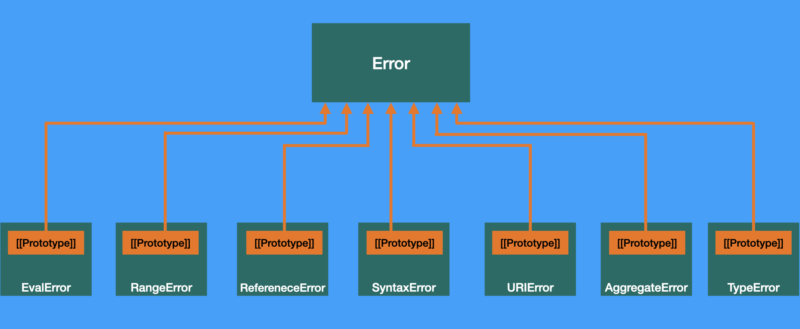
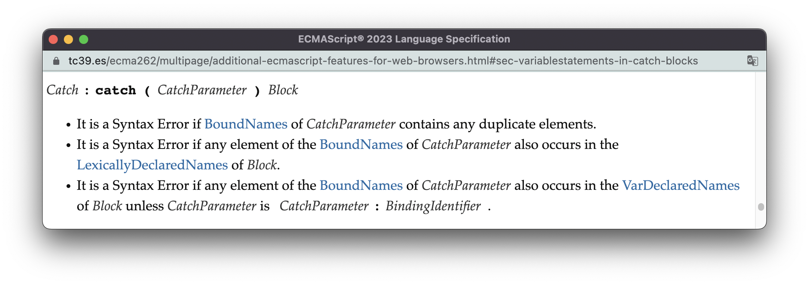
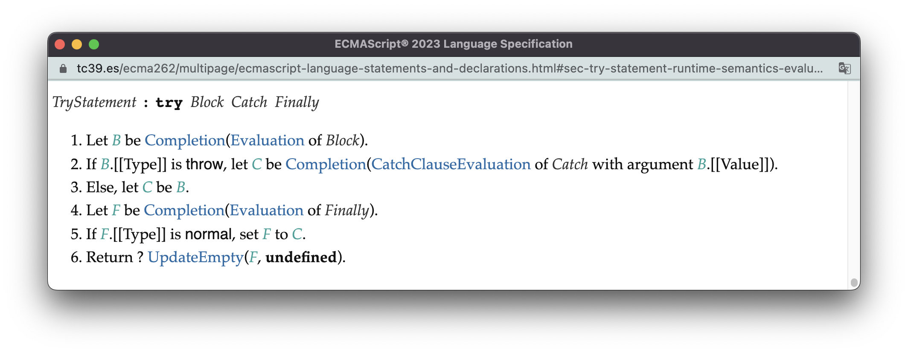
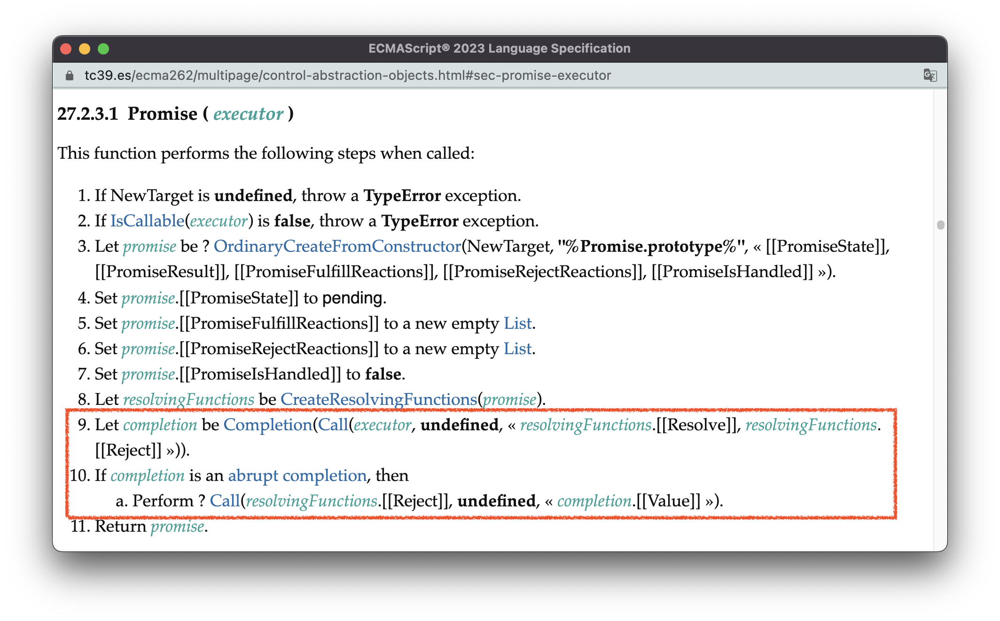

# ECMAScript错误处理机制

我们在[11.程序完整执行过程](./11.code-execution.md#一个程序的执行过程)说过，一个程序的运行会经历三个阶段：初始化Realm环境 - 解析脚本 - 执行脚本。

在解析脚本的过程中，会对语法解析得到的解析树，进行先验错误的检查。如果此时发现语法不合法，就会提前终止整个程序的执行。这一阶段发生的错误称为**解析错误（parsing errors）** 。

在执行脚本的过程中，当一个语句的执行结果是类型为`throw`的完成记录器（以下均称“throw完成”）时，表示这个语句出现了某个方面的错误，这一个阶段发生的错误称为**运行时错误（runtime errors）** 。此时有两种情况：一种是错误被捕获（如使用try/catch语句），此时程序的执行会跳转到对应的错误处理逻辑上；另一种是错误没有被捕获，则程序终止执行。

本节我会先从ECMAScript中的Error对象讲起，然后我会以try/catch语句为主要例子，为你展示先验错误的检查过程以及运行时错误的捕获过程。最后，我会从标准的角度分析为何异步代码的错误往往无法被正常捕获，并基于这个原因提供一些解决方案。


<br/>


### 目录:

- [Error对象](#error对象)

- [解析错误](#解析错误)

- [运行时错误](#运行时错误)

- [异步代码的错误捕获](#异步代码的错误捕获)
<br/>


## Error对象

我们可以从原型链的视角，看到所有类型的Error构造器：



不同类型的Error构造器，结构几乎都是一样的。区别只在于：构造器的名字、prototype对象的 `name`属性与`message`属性。AggregateError的实例对象还有一个额外的`errors`属性。

我用一张表为你总结所有Error类型的含义以及触发示例：

| 错误类型        | 含义                                                         | 触发示例                                              |
| --------------- | ------------------------------------------------------------ | ----------------------------------------------------- |
| EvalError       | 一个遗留（legacy）的错误类型，现已不会由引擎抛出，只是为了兼容性保留。 | 无                                                    |
| RangeError      | 表示值超出了安全的范围。                                     | `1 .toFixed(-1)`                                      |
| RefereneceError | 表示不合法的引用。                                           | `console.log(a);let a`                                |
| SyntaxError     | 表示语法错误。                                               | `const a;`                                            |
| URIError        | 全局URI解析函数抛出的错误。                                  | `decodeURIComponent('%')`                             |
| AggregateError  | 多个错误需要包装在一个错误中。                               | `Promise.any([Promise.reject(1), Promise.reject(2)])` |
| TypeError       | 当其他的原生错误类型都不适用时，就抛出该类型的错误。         | `var a; a()`                                          |


<br/>


## 解析错误

解析错误是那些可以在代码执行前就发现的错误，解析错误会以SyntaxError表示。

在[6.算法](./6.algorithm.md#静态语义)中，我以词法声明语句的先验错误作为例子，展示了解析阶段检查语法错误的过程。在这里，我们再举一个[try/catch语句的先验错误](https://tc39.es/ecma262/multipage/additional-ecmascript-features-for-web-browsers.html#sec-variablestatements-in-catch-blocks)作为例子：



在解析catch块的过程，会在三个地方检查错误：

- 如果catch使用了相同名字的参数，就抛出SyntaxError；

  ```js
  try{}catch(e, e){}
  ```

- 如果catch块中存在某个词法声明变量，其变量名与catch参数名重复，就抛出SyntaxError；

  ```js
  try{}catch(e){let e}
  ```

- 如果catch块中存在某个变量声明的变量，其变量名与catch参数名有重复，且catch参数不是以[BindingIdentifier](https://tc39.es/ecma262/multipage/ecmascript-language-expressions.html#prod-BindingIdentifier)的形式出现的，就抛出SyntaxError：

  ```js
  try {}catch({name}){var name = 10}
  ```

 <br />

实际上，除了解析全局代码，还有两种情况也会扫描先验错误：第一种是引入模块的时候，第二种是使用`eval()` 函数的时候。与全局代码一样，在解析模块代码时，如果发现错误，模块就不会被初始化。在解析`eval()`的参数时，如果发现错误，eval就不会执行。


<br/>


## 运行时错误

我们在[7.规范类型](./7.spec_type.md#完成记录器completion-record)讲过，在执行语句列表的时候，当某个语句的执行结果为硬性完成（类型为`break`、`continue`、`return`、`throw`的完成记录器），会提前终止语句列表的执行，并以这个硬性完成作为语句列表的执行结果，交由外部代码作处理。

对于返回“throw完成”的语句列表，可以使用try/catch语句对该“throw完成”进行处理。

try语句主要有[三种形态](https://tc39.es/ecma262/multipage/ecmascript-language-statements-and-declarations.html#prod-TryStatement)：

- try - catch
- try - catch - finally
- try - finally

```js
try { 
    throw "something wrong"
} catch(e) { 
    console.log('caught:' + e)
} finally { 
    console.log('do some clean up job')
}

// caught:something wrong
// do some clean up job
```

我们可以从try - catch - finally语句的[求值语义](https://tc39.es/ecma262/multipage/ecmascript-language-statements-and-declarations.html#sec-try-statement-runtime-semantics-evaluation)了解到它的执行过程：



把这段逻辑翻译过来大致如下：

1. 先执行try块中的代码，try块的执行与普通代码块的执行没有区别，都是依次执行块内语句列表中的语句。

2. 如果try块执行的结果是一个throw完成，那么[执行catch块](https://tc39.es/ecma262/multipage/ecmascript-language-statements-and-declarations.html#sec-runtime-semantics-catchclauseevaluation)。catch块与普通代码块的执行过程也基本一样，唯一的区别是：它会把`catch(err){}` 语句中的`err`参数，以词法变量的形式实例化，并以throw完成的`[[Value]]`字段的值初始化`err`的值。

3. 执行finally块。

4. 如果finally块是正常完成，返回catch块的完成记录器，如果catch块没有被执行过，则返回try块的完成记录器。

从这里的算法你会发现，不管try块、catch块的执行结果是什么，finally块都一定会执行。因此，你可以看到以下神奇的行为：

- 在try块中使用continue：

  ```js
  for (let i = 0; i < 10; i++) {
      try {
          continue
      } finally {
          console.log(i)
      }
  }
  
  // 依旧输出0～9
  ```

- 在catch块中使用return语句：

  ```js
  (function(){
    try {
      throw new Error
    } catch (err) {
      return err
    } finally {
      console.log("You can't return without executing me")
    }
  })()
  // 输出"You can't return without executing me"
  ```

- 即便catch块抛出了错误，也必须等finally执行完再抛：

  ```js
  try {
    throw new Error
  } catch {
    throw new Error
  } finally {
    console.log("You can't throw without executing me")
  }
  // 输出"You can't throw without executing me"
  // ❌：Uncaught Error
  ```
  
  
<br/>


## 异步代码的错误捕获

有的时候，异步代码的错误无法被正常捕获，比如像下面这样：

```js
const throwFn = () => {throw new Error("catch me please")}

try {
  setTimeout(throwFn, 0)
} catch(e){
  console.log(e)
}
// ❌ Uncaught Error：catch me please
```

**很多人会从调用栈的角度去解释它的原因，但从标准的角度看，根本原因是：此时try块的执行结果是一个正常完成！** 

`setTimeout(throwFn, 0)`所做的事情，就是注册一个宏任务，并在0秒之后执行。所以它本身的执行结果是一个正常完成，由此导致了整个try块都是正常完成。而真正抛出错误的，是后续宏任务的实际执行。

从这个角度看，为了使得异步代码的错误得到捕获，我们必须让异步代码作为try块内语句列表的一部分执行。因此，我们可以这么修改代码：

```js
setTimeout(() => {
  try {
    throwFn()
  }catch(e){
    console.log(e)
  }
}, 0)
```

<br />

在ECMAScript中，除了try/catch，其实还有另一个API也可以捕获错误 —— Promise。Promise神奇的一点在于：**在Promise内执行的代码所产生的一切错误，都不会终止程序的执行**。比如下面这样：

```js
new Promise(() => {throw new Error})
console.log("1") // 语句会执行，输出1

new Promise(() => {throw new Error}).catch(()=>{throw new Error})
console.log("2") // 语句会执行，输出2
```

我们可以从[Promise的构造器方法](https://tc39.es/ecma262/multipage/control-abstraction-objects.html#sec-promise-executor)看到其原因：



从框出的部分你可以看到，**执行executor的时候，如果产生了硬性完成，并不会返回该硬性完成给外部代码，而是Promise通过触发reject方法自己内部消化掉了。** 使用`Promise.prototype.then`以及`Promise.prototype.catch`注册的代码，也会有同样的错误处理过程。

所以，对于前面的例子，我们还可以这么改：

```js
setTimeout(() => {
    new Promise(throwFn).catch(e => console.log(e))    
}, 0)
```

如果你对宏任务、微任务执行时机上的细微差异没有那么在意，那么你还可以把“等待定时器执行”与“执行`throwFn`”两个部分分开：

```js
new Promise((resolve) => setTimeout(resolve, 0))
  .then(() => {throwFn()})
  .catch(e => console.log(e))
```

这个时候，你就可以使用async函数让代码变得足够优雅：

```js
(async function(){
  try {
    await new Promise((resolve) => setTimeout(resolve, 0))
    throwFn()
  } catch(e){
    console.log(e)
  }
})()
```


