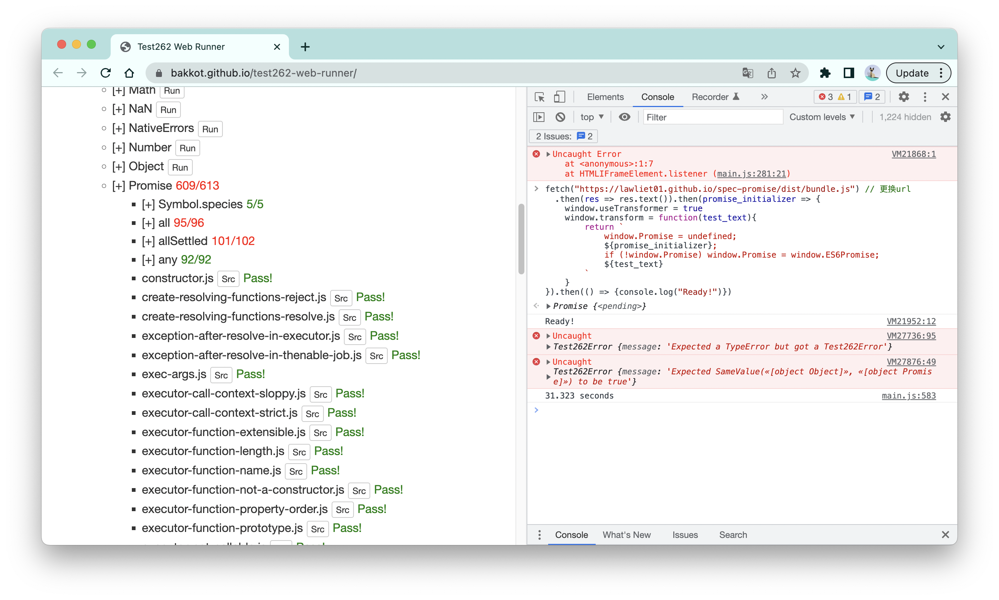
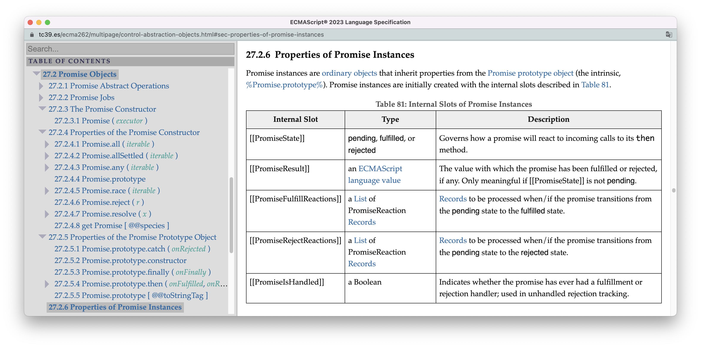
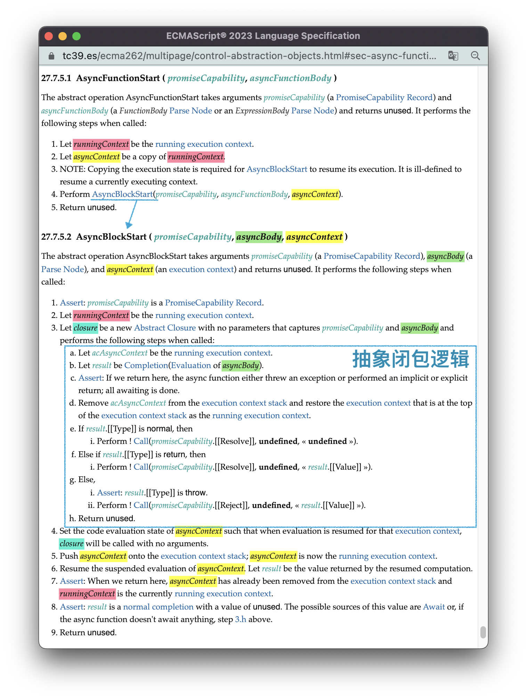
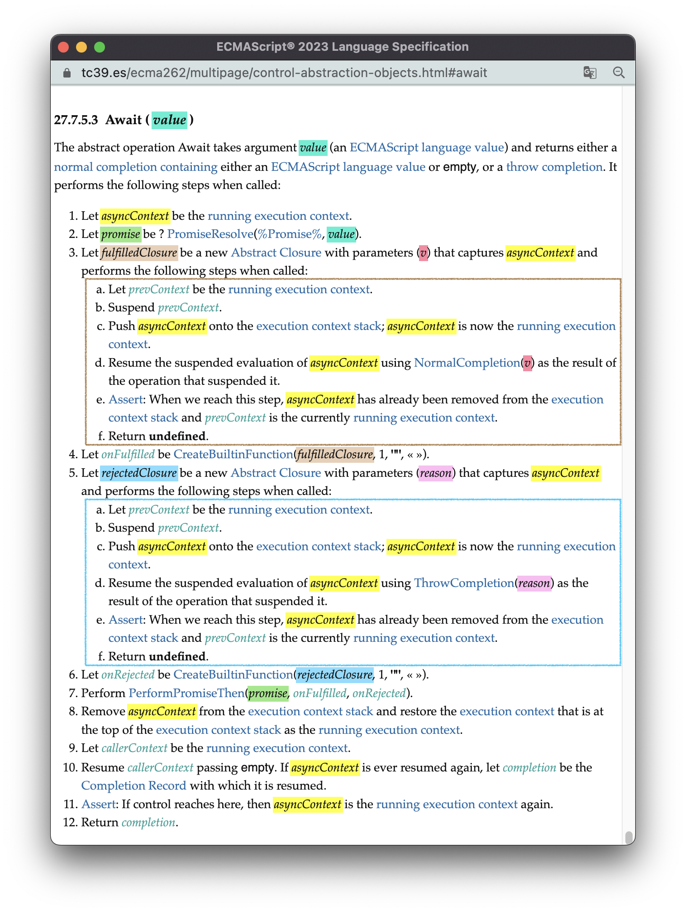
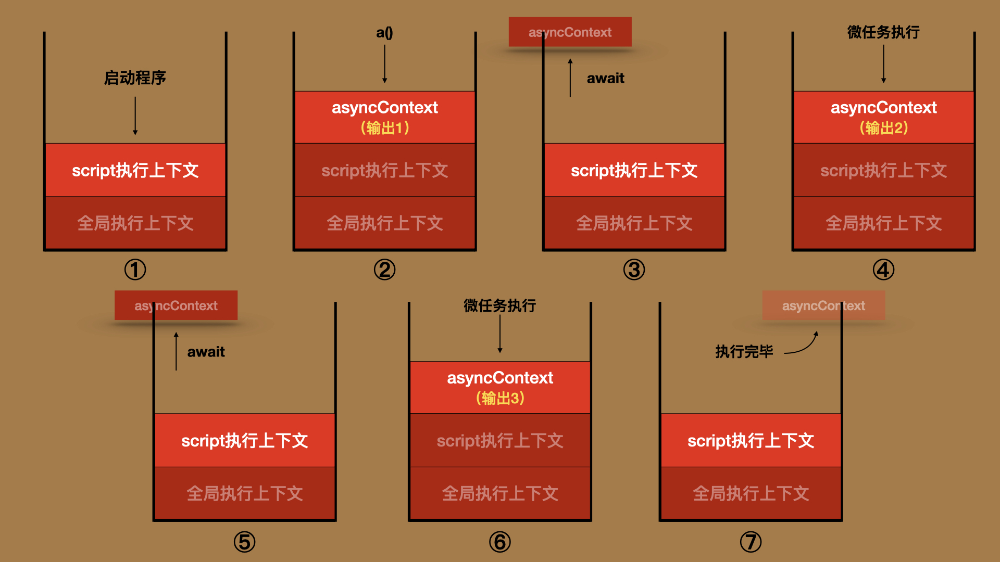

# 手写一个通过test262测试的promise

Promise是JavaScript中的“明星对象”。如果你在github搜一搜，你会发现有大量的程序员在造Promise的轮子，与之相比，你就几乎看不到有人会说“我要手写一个Math对象”。

我自己也造一个Promise的轮子，不过这个“轮子”跟其他人的“轮子”不太一样，这个轮子可以通过test262标准符合性测试99.3%的测试用例。在同类产品中，[then/Promise](https://github.com/then/promise)只有63.8%的通过率，[es6-promise](https://github.com/stefanpenner/es6-promise)只有46%的通过率。你可以在[spec-promise](https://github.com/Lawliet01/spec-promise)中看到我轮子的源码，以及具体的测试方法。



我是如何做到这一点的？是靠个人聪明才智么？那肯定不是。论能力，目前的我肯定远远不及这些项目背后的大佬。我使用的是看起来“非常笨”的方法：**跟着[标准定义的Promise](https://tc39.es/ecma262/multipage/control-abstraction-objects.html#sec-promise-objects)按部就班地实现。** 

本节的内容会分为两个部分，前面的部分我会为你展示基于标准的定义实现Promise的大致过程。基于易读性的考虑，我不能把spec-promise中的代码直接贴进来，我会使用更为简易的代码框架为你展示实现的过程。当然，简易不是简陋，最后这个Promise还是可以小跑一下的，完整的代码可见[这里](./assets/code/mini-promise.js)。而剩余的部分，我会延续[16.生成器](./16.iterator&generator.md#3-通过generator实现异步编程)中异步编程的内容，从标准的角度为你展示，Async函数是如何实现异步编程的。


<br/>


### 目录:

- [跟着标准写Promise](#跟着标准写promise)

  * [Promise骨架](#promise骨架)

  * [构造函数constructor](#构造函数constructor)

  * [prototype对象的方法](#prototype对象的方法)

  * [静态方法](#静态方法)

- [Async/await的异步实现](#asyncawait的异步实现)
<br/>


## 跟着标准写Promise


<br/>


### Promise骨架

在[1.阅读向导](./1.reading_gudie.md#第1828章标准库)我提到过，标准在定义每一个内置构造器的时候，都会从**构造器函数**、**构造器属性**、**prototype对象属性**、**实例属性**4个角度出发。基于这4个角度，我们可以从[标准Promise章节](https://tc39.es/ecma262/multipage/control-abstraction-objects.html#sec-promise-objects)的目录看到Promise的“架构”：



于是，我们就有了Promise类的JavaScript骨架：

```js
class Promise {
    // 27.2.3 The Promise Constructor： 构造函数
    constructor(executor){}

    // 27.2.4 Properties of the Promise Constructor：构造器属性
    static all(iterable){}
    static allSettled(iterable){}
    static any(iterable){}
    static race(iterable){}
    static reject(r){}
    static resolve(x){}
    static get [Symbol.species](){}

    // 27.2.5 Properties of the Promise Prototype Object：prototype对象属性
    then(onFulfilled, onRejected){}
    catch(onRejected){}
    finally(onFinally){}
    [Symbol.toStringTag](){}

    // 27.2.6 Properties of Promise Instances：实例属性(内部插槽)
    __PromiseState;
    __PromiseResult;
    __PromiseFulfillReactions;
    __PromiseRejectReactions;
    __PromiseIsHandled;
}
```

值得注意的是，这里的实例属性都是Promise实例对象中的内部插槽，理论上来说是无法被代码观察到的。但由于我们的Promise使用JavaScript实现，所以只能使用带有`__`前缀的属性名表示内部插槽。（不使用私有属性`#`是因为在后续的实现中，外部的“抽象操作”也会用到这些实例属性）。

这些内部插槽的含义我用下表给你总结：

| 内部插槽                  | 描述                                                         |
| ------------------------- | ------------------------------------------------------------ |
| __PromiseState            | 表示Promise的状态：`pending`、`fulfilled`、`rejected`。      |
| __PromiseResult           | 表示Promise的结果。                                          |
| __PromiseFulfillReactions | fulfilled状态的handlers列表。当状态从`pending`转为`fulfilled`时，列表中的handler会依次触发。 |
| __PromiseRejectReactions  | rejected状态的handlers列表。当状态从`pending`转为`rejected`时，列表中的handler会依次触发。 |
| __PromiseIsHandled        | 记录promise是否注册了handler。                               |


<br/>


### 构造函数constructor

constructor方法会在new表达式上被触发。

从标准[27.2.3 Promise构造函数的定义](https://tc39.es/ecma262/multipage/control-abstraction-objects.html#sec-promise-executor)可以看出，该算法主要做以下几个事情：

1. 判断方法是否被合法调用：必须由new表达式或super方法触发，且传入的第一个参数executor必须是一个函数；
2. 创建promise实例对象，并初始化其内部插槽；
3. 创建resolve，reject两个内置函数；
4. 分别以resolve，reject作为executor的参数，执行executor；如果executor的执行有误，直接reject promise。
5. 返回promise对象。

翻译成代码是这样的：

```js
class Promise {
    constructor(executor) {
        // 1. 判断方法是否被合法调用：必须由new表达式、super方法触发，且传入的第一个参数executor必须是一个函数。
        if (!new.target) throw new TypeError("Promise constructor cannot be invoked without 'new'")
        if (typeof executor !== 'function') throw new TypeError("Promise resolver  is not a function")

        // 2. 创建promise实例对象，并初始化其内部插槽
        const promise = Object.create(Promise.prototype)
        promise.__PromiseState = "pending"
        promise.__PromiseFulfillReactions = []
        promise.__PromiseRejectReactions = []
        promise.__PromiseIsHandled = false

        // 3. 创建resolve，reject两个内置函数
        let { resolve, reject } = createResolvingFunction(promise)

        // 4. 分别以resolve，reject作为executor的参数，执行executor；如果executor的执行有误，直接reject promise。
        try {
            executor.call(undefined, resolve, reject)
        } catch (e) {
            reject.call(undefined, e)
        }

        // 5. 返回promise对象。
        return promise
    }
    // ...
}
```

在第3步中，`createResolvingFunction`是一个抽象操作，这个抽象操作会创建[resolve()](https://tc39.es/ecma262/multipage/control-abstraction-objects.html#sec-promise-resolve-functions)、[reject()](https://tc39.es/ecma262/multipage/control-abstraction-objects.html#sec-promise-reject-functions)两个内置函数，调用它们会将promise的状态从`pending`分别转为`fulfilled`、`rejected`，并触发对应状态handler列表上的函数，如下面的代码所示：

```js
function createResolvingFunction(promise){
    let alreadyResolve = false // 使得resolve、reject只允许触发一次

    return {
        resolve: function (value) { // resolve内置函数
            if (alreadyResolve) return undefined;
            alreadyResolve = true

            // 修改内部插槽
            let reactions = promise.__PromiseFulfillReactions
            promise.__PromiseState = "fulfilled"
            promise.__PromiseFulfillReactions = undefined
            promise.__PromiseRejectReactions = undefined
            promise.__PromiseResult = value

            // 触发handler
            for (let reaction of reactions) {
                queueMicrotask(reaction.bind(undefined, value))
            }

        },
        reject: function (reason) { // reject内置函数
            if (alreadyResolve) return undefined;
            alreadyResolve = true

            // 修改内部插槽
            let reactions = promise.__PromiseRejectReactions
            promise.__PromiseState = "rejected"
            promise.__PromiseFulfillReactions = undefined
            promise.__PromiseRejectReactions = undefined
            promise.__PromiseResult = reason

            // 触发handler
            for (let reaction of reactions) {
                queueMicrotask(reaction.bind(undefined, reason))
            }
        }
    }
}
```

当然，以上并不是`createResolvingFunction`的所有逻辑，比如，当`resolve()`的参数是一个promise时，会有其他的逻辑。你可以在标准中看到[这个抽象操作的完整逻辑](https://tc39.es/ecma262/multipage/control-abstraction-objects.html#sec-createresolvingfunctions)，也可以[spec-promise的实现](https://github.com/Lawliet01/spec-promise/blob/main/src/obstract_operations.js#L45)。


<br/>


### prototype对象的方法

不管是prototype对象的方法还是静态方法，在执行的过程中，往往会创建新的promise，于是在使用自然语言解释这个过程时，常常很容易导致读者混淆，所以这里需要先做一些用词上的规定。后续的篇幅都会使用以下的词汇区分promise对象：

- old_promise：表示被触发方法的promise对象；
- new_promise：表示方法执行过程中创建的新的promise对象。

<br />

Promise的prototype对象最重要的方法就是then方法，很多其他的prototype对象方法、静态方法、甚至await语句都是基于`Promise.prototype.then`实现的。

then方法的[核心逻辑](https://tc39.es/ecma262/multipage/control-abstraction-objects.html#sec-promise.prototype.then)其实也很简单，它接受两个函数（`onFulfilled`，`onRejected`）作为参数，主要做以下两件事情：

1. 创建一个新的promise（`new_Promise`），并分别对`onFulfilled`以及`onRejected`再做一层[封装](https://tc39.es/ecma262/multipage/control-abstraction-objects.html#sec-newpromisereactionjob)，得到两个新的函数：
   - `onFulfilledJobCallback`：用以触发`onFulfilled`的逻辑，然后根据执行过程中有无错误选择resolve/reject `new_Promise`；
   - `onRejectedJobCallback`：用以触发`onRejected`的逻辑，然后根据执行过程中有无错误选择resolve/reject `new_Promise`；；
2. 根据`old_promise`的状态做不同的操作：
   - 如果是`pending`：
     - 把`onFulfilledJobCallback`添加到`old_promise`的fulfilled handlers列表（__PromiseFulfillReactions）中
     - 把`onRejectedJobCallback`添加到`old_promise`的rejected handlers列表（__PromiseRejectReactions）中。
   - 如果是`fulfilled`，以`old_promise.__PromiseResult`为参数，把`onFulfilledJobCallback`添加到宿主微任务队列。
   - 如果是`rejected`，以`old_promise.__PromiseResult`为参数，把`onRejectedJobCallback`添加到宿主微任务队列。

把这个逻辑翻译成代码大概是这样的：

```js
class Promise {
    // ...
    then(onFulfilled, onRejected) {
        return new Promise((resolve, reject) => {
          
            // 封装onFufilled
            let onFulfilledJobCallback = function (value) {
                try {
                    let handerResult = onFulfilled.call(undefined, value);
                    resolve(handerResult)
                } catch (e) {
                    reject(e)
                }
            }
            // 封装onRejected
            let onRejectedJobCallback = function (reason) {
                try {
                    let handerResult = onRejected.call(undefined, reason);
                    resolve(handerResult)
                } catch (e) {
                    reject(e)
                }
            }

            // 根据old_promise的状态做不同的操作：
            if (this.__PromiseState === "pending") {
                this.__PromiseFulfillReactions.push(onFulfilledJobCallback)
                this.__PromiseRejectReactions.push(onRejectedJobCallback)
            } else if (this.__PromiseState === "fulfilled") {
                queueMicrotask(onFulfilledJobCallback.bind(undefined, this.__PromiseResult))
            } else if (this.__PromiseState === "rejected") {
                queueMicrotask(onRejectedJobCallback.bind(undefined, this.__PromiseResult))
            }
        })
    }
    // ...
}
```

还记得我们在[3.宿主环境](./3.host-environment.md#promise任务的执行时机)中说的吗，标准使用[HostEnqueuePromiseJob](https://tc39.es/ecma262/multipage/executable-code-and-execution-contexts.html#sec-hostenqueuepromisejob)表示注册promise微任务的过程。而我在这里使用`queueMicrotask`替代这个抽象操作。以防你不知道，这是一个不管在浏览器宿主还是在node环境中都真实可用的方法。

当然，这里其实省略了一些边缘逻辑。比如，对参数onFulfilled/onRejected不是函数类型的情况做处理、对执行onFulfilled/onRejected时Realm的选择等等。完整的逻辑可见[标准](https://tc39.es/ecma262/multipage/control-abstraction-objects.html#sec-promise.prototype.then)，也可见[spec-promise](https://github.com/Lawliet01/spec-promise/blob/main/src/index.js#L39)。

<br />

有了then方法，[catch方法](https://tc39.es/ecma262/multipage/control-abstraction-objects.html#sec-promise.prototype.catch)的逻辑就非常简单了：

```js
class Promise {
    // ...
    catch(onRejected){
        return this.then(undefined, onRejected)
    }
}
```

<br />

[finally方法](https://tc39.es/ecma262/multipage/control-abstraction-objects.html#sec-promise.prototype.finally)也是完全基于then方法实现的，但是finally会对传入的函数`onFinally`先做一层封装：

```js
class Promise {
  // ... 
  finally(onFinally){
        // ... 省略对edge cases的处理
        let thenFinally = function(value){
            let result = onFinally.call(undefined)  // ①
            return Promise.resolve(result).then(() => {return value}) // ②
        }
        let catchFinally = function(reason){
            let result = onFinally.call(undefined) // ①
            return Promise.resolve(result).then(() => {throw reason}) // ②
        }
        return this.then(thenFinally, catchFinally) // ③
    }
}
```

从这段逻辑，你可以看出finally方法的一些特点：

1. 参数`onFinally`函数在被调用时，不会传入任何参数（注释①）：

   ```js
   Promise.resolve("first").finally((arg) => {console.log(arg)}) // undefined
   ```

2. 对finally方法进行链式调用时，finally不会修改链上传递的值（注释②）：

   ```js
   Promise.resolve("first").finally(() => {return "second"}).then((arg) => console.log(arg)) // "first"
   ```

3. 在finally方法的执行过程中，实际上调用了两次then方法：第一次是在返回语句中（注释③），第二次是在执行thenFinally/catchFinally的过程中（注释②）。于是，完整执行一次finally，至少需要两次执行微任务队列，所以你会看到下面代码的这种奇异行为：

   ```js
   Promise.resolve().finally(() => {}).then(() => {console.log("first")})
   Promise.resolve().then(() => {}).then(() => {console.log("second")})
   // sencond
   // first
   ```

   
<br/>


### 静态方法

Promise.resolve/Promsise.reject是两个最常用的静态方法，它们的逻辑也很简单：

- [Promise.resolve(x)](https://tc39.es/ecma262/multipage/control-abstraction-objects.html#sec-promise.resolve)：
  1. 判断x是不是promise，如果是的话，直接返回。
  2. 如果x不是promise，创建一个新的promise，并以x为参数resolve该promise。
- [Promise.reject(r)](https://tc39.es/ecma262/multipage/control-abstraction-objects.html#sec-promise.reject):
  1. 创建一个新的promise，并以r为参数reject该promise。

```js
class Promise {
    // ...
    static resolve(x){
        if (x instanceof Promise) return x
        return new Promise(resolve => resolve(x))
    }
    static reject(r){
        return new Promise((_, reject) => reject(r))
    }
}
```

<br />

而对于[Promise.all](https://tc39.es/ecma262/multipage/control-abstraction-objects.html#sec-promise.all) /  [Promise.any](https://tc39.es/ecma262/multipage/control-abstraction-objects.html#sec-promise.any) / [Promise.allSettled](https://tc39.es/ecma262/multipage/control-abstraction-objects.html#sec-promise.allsettled) / [Promise.race](https://tc39.es/ecma262/multipage/control-abstraction-objects.html#sec-promise.race)这些静态方法，它们的大体逻辑是一样的，只是终止条件不同。它们都接受一个可迭代对象（iterable）为参数，并做以下事情：

1. 创建`new_promise`。
2. 遍历iterable，对于遍历过程中的每一个值`i`，分别执行`Promise.resolve(i)`，最终得到一个`promises`列表。
3. 对`promises`列表中的每个元素`p`，分别使用then方法注册handler：`p.then(onFulfilled, onRejected)`。而这四种静态方法的差异，就在于`onFulfilled`与`onRejected`的不同：
   - Promise.all：
     - `onFulfilled`：如果此时其他所有的`p`状态都为`fulfilled`，resolve `new_promise`。
     - `onRejected`：直接reject `new_promise`。 

   - Promise.any: 
     - `onFulfilled`：直接resolve `new_promise`。
     - `onRejected`：如果此时其他所有的`p`状态都为`rejected`，reject `new_promise`。

   - Promise.allSettled：
     - `onFulfilled`：如果此时其他所有的`p`状态都不是`pending`，resolve `new_promise`。
     - `onRejected`：如果此时其他所有的`p`状态都不是`pending`，resolve `new_promise`。

   - Promise.race:
     - `onFulfilled`：直接resolve `new_promise`。
     - `onRejected`：直接reject `new_promise`。 


如果你小学数学掌握得还不错，你会发现把这4个静态方法放在一起，呈现出一种几何上的美感，它们就好像对称地坐落在坐标系上4个不同的象限一样。

以下，我列出了Promise.all、Promise.allSettled两个静态方法的代码示例：

```js
class Promise {
    // ...
    static all(iterable) {
        return new Promise((resolve, reject) => {
            let promises = [...iterable].map(i => Promise.resolve(i)) 
            let values = [...iterable].map(_ => undefined) 
            let remainingElementsCount = 0 // 计算未fulfilled的p

            promises.forEach((p, index) => {
                remainingElementsCount++
                p.then( 
                    (x) => { // onFulfilled
                        remainingElementsCount--
                        values[index] = x
                        if (remainingElementsCount === 0) { 
                          // 此时其他所有的p状态都为fulfilled
                            resolve(values)
                        }
                    },
                    (reason) => reject(reason)) // onRejected
            })
        })
    }
  
    static allSettled(iterable) {
        return new Promise((resolve) => {
            let promises = [...iterable].map(i => Promise.resolve(i))
            let values = [...iterable].map(_ => undefined)
            let remainingElementsCount = 0 // 计算未settled的p

            promises.forEach((p, index) => {
                remainingElementsCount++
                p.then(  
                    (x) => { // onFulfilled
                        remainingElementsCount--
                        values[index] = {
                            status: "fulfilled",
                            value: x
                        }
                        if (remainingElementsCount === 0) { 
                          // 此时其他所有的p状态都不是pending
                            resolve(values)
                        }
                    },
                    (reason) => { // onRejected
                        remainingElementsCount--
                        values[index] = {
                            status: "rejected",
                            reason
                        }
                        if (remainingElementsCount === 0) { 
                          // 此时其他所有的p状态都不是pending
                            resolve(values)
                        }
                    })
            })
        })
    }
}
```

<br />

至此，一个简易的Promise就完成了。


<br/>


## Async/await的异步实现

在[16.生成器](./16.iterator&generator.md#3-通过generator实现异步编程)中，我已经为你展示了generator是如何实现异步编程的，其关键就是对执行上下文的保存与恢复。实际上，Async函数对异步的实现方式，与generator本质上是一样的，以下是它们之间的算法对比：

|                                | Async函数                                                    | generator                                                    |
| ------------------------------ | ------------------------------------------------------------ | ------------------------------------------------------------ |
| 创建抽象闭包、初始化执行上下文 | [AsyncFunctionStart](https://tc39.es/ecma262/multipage/control-abstraction-objects.html#sec-async-functions-abstract-operations-async-function-start) | [GeneratorStart](https://tc39.es/ecma262/multipage/control-abstraction-objects.html#sec-generatorstart) |
| 暂停执行                       | [Await](https://tc39.es/ecma262/multipage/control-abstraction-objects.html#await) | [GeneratorYield](https://tc39.es/ecma262/multipage/control-abstraction-objects.html#sec-generatoryield) |
| 恢复执行                       | 由微任务队列执行时恢复                                       | [GeneratorResume](https://tc39.es/ecma262/multipage/control-abstraction-objects.html#sec-generatorresume) |

你也可以通过以下代码看到Async函数相关抽象操作的调用顺序：

```js
async function a(){
    // 1. 触发【AsyncFunctionStart】
    console.log(1)
    await 0; // 2. 触发【Await】
    console.log(2); // 3. 微任务队列执行时恢复执行
    await 0; // 4. 触发【Await】
    console.log(3); // 5. 微任务队列执行时恢复执行
}

a()
```

<br />

从执行Async函数体的[EvaluateAsyncFunctionBody](https://tc39.es/ecma262/multipage/ecmascript-language-functions-and-classes.html#sec-runtime-semantics-evaluateasyncfunctionbody)运行时语义我们可以看出，Async函数会先创建一个promise，然后启动[AsyncFunctionStart](https://tc39.es/ecma262/multipage/control-abstraction-objects.html#sec-async-functions-abstract-operations-async-function-start)的执行，执行完毕之后，会返回这个promise。

AsyncFunctionStart的逻辑如下：



这里的关键逻辑是：

1. AsyncFunctionStart：
   1. （1）使变量`runningContext`为当前执行上下文（由于此时正在执行Async函数，所以`runningContext`是由Async函数创建的，图中使用红色标注）。
   2. （2）使变量`asyncContext`为`runningContext`的一份拷贝。（图中使用黄色标注）
   3. （4）启动AsyncBlockStart：
      1. （3）创建一个抽象闭包（青色的`closure`），这个抽象闭包封装了一段逻辑：执行Async函数体内的语句列表（绿色的`asyncBody`），并根据执行的结果，选择resolve或者reject由Async函数创建的promise。
      2. （4）设置`asyncContext`的`code evaluation state `组件，使得每次`asyncContext`压入调用栈栈顶并恢复执行时，抽象闭包从原来暂停的地方继续执行。
      3. （5、6）把`asyncContext`压入调用栈栈顶，并启动抽象闭包的执行

Generator函数的执行会创建generator但不会立即执行这个过程中创建抽象闭包；而Async函数的执行不仅会创建promise，还会直接启动抽象闭包的执行。

在执行抽象闭包的过程中，当遇到await语句的时候，会触发抽象操作[Await](https://tc39.es/ecma262/multipage/control-abstraction-objects.html#await)：



这里的关键逻辑如下：

1. （2）对await表达式后面的值（青色的`value`）使用`Promise.resolve(value)`，得到一个新的promise（绿色的`promise`）。
2. （3）创建一个抽象闭包（棕色的`fulfilledClosure`），这个抽象闭包会在后续作为`promise`then方法的第一个参数使用，它会把`asyncContext`重新压入调用栈栈顶，并以传入的参数（红色的`v`）恢复其执行。
3. （5）再创建一个抽象闭包（蓝色的`rejectedClosure`），这个抽象闭包会在后续作为`promise`then方法的第二个参数使用，它会把`asyncContext`重新压入调用栈栈顶，并以传入的参数（粉红色的`reason`）恢复其执行。
4. （7）通过`promsise.then()`把两个抽象闭包注册到promise上
5. （8）移除`asyncContext`，恢复原来`asyncContext`下面的执行上下文的执行。

整个await的逻辑，相当于以下的代码：

```js
const promise = Promise.resolve(value)
const fulfilledClosure = (v) => {/*以参数v恢复执行*/}
const rejectedClousure = (reason) => {/*以参数reason恢复执行*/}
promise.then(fulfilledClosure, rejectedClousure)
// 移除asyncContext
```

这就解释了为什么当await表达式所创建的promise被resolve的时候，Async函数内的逻辑会重新启动执行。**由此，Async函数就实现了异步编程。** 

在Async函数中首次遇到await的时候，此时调用栈中，`asyncContext`下方的执行上下文是由Async函数创建的执行上下文`runningContext`。因此，当`asyncContext`弹出后，会执行[EvaluateAsyncFunctionBody](https://tc39.es/ecma262/multipage/ecmascript-language-functions-and-classes.html#sec-runtime-semantics-evaluateasyncfunctionbody)运行时语义中未完成的逻辑，即返回一个promise，如以下代码所示：

```js
async function a(){
    console.log(1)
    await 0;
    console.log(2);
    await 0;
    console.log(3);
}

console.log("Promise: " + a())
// 1
// Promise: [object Promise]
// 2
// 3
```

返回promise之后，`runningContext`就被销毁了，之后每一次恢复执行，使用的都是`asyncContext`。

<br />

在[8.执行环境](./8.execution-environment.md#执行上下文是实现异步编程的基础)，我们早已对Async/await执行过程中调用栈的变化进行了可视化，现在你可以再看一次这张图，相信你会有许多新的感悟：

```js
async function a(){
    console.log(1)
    await 0;
    console.log(2);
    await 0;
    console.log(3);
}
a()
```

这段代码的执行过程中，调用栈的变化如下图所示：（出于易读性的考虑，此图忽略了上面提到的`runningContext`）



