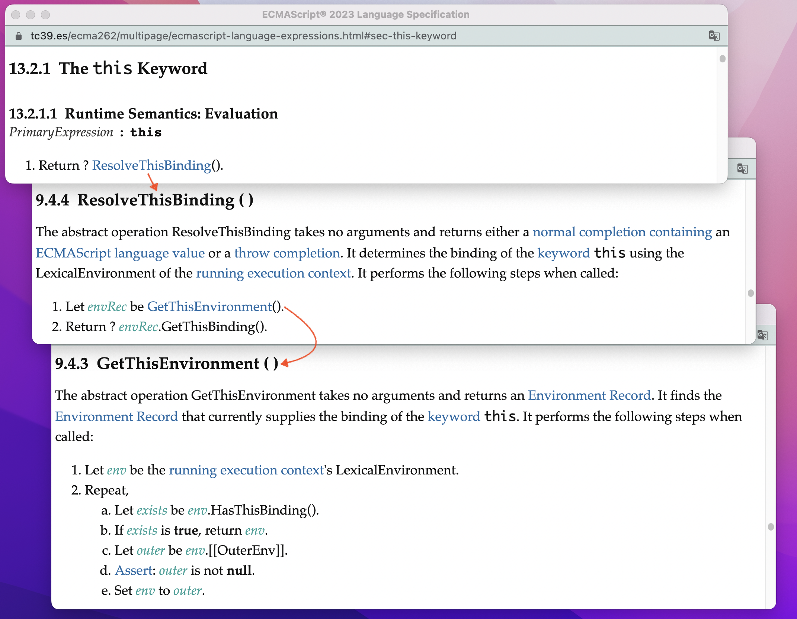
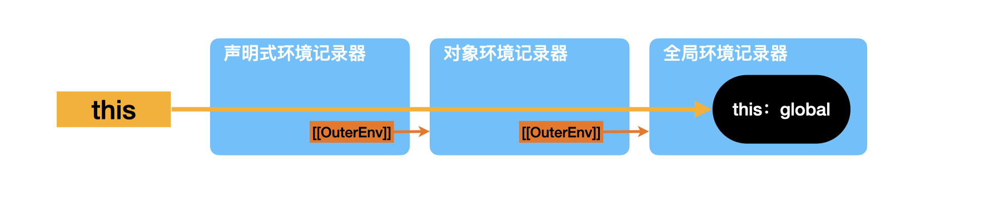
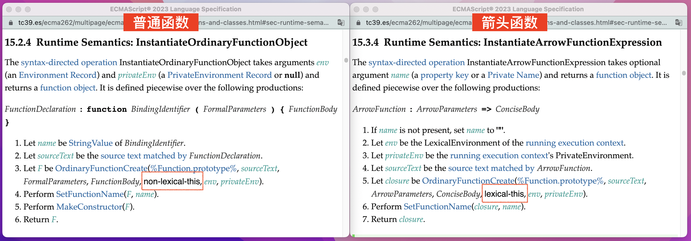
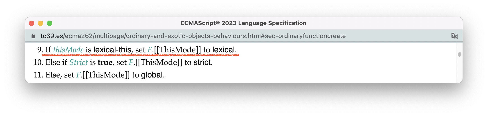
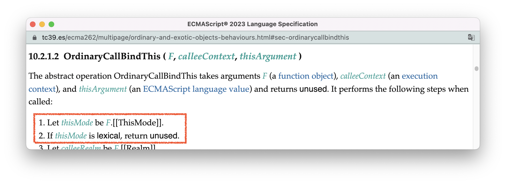
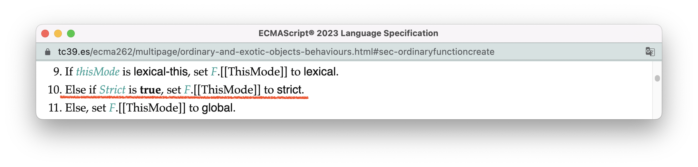
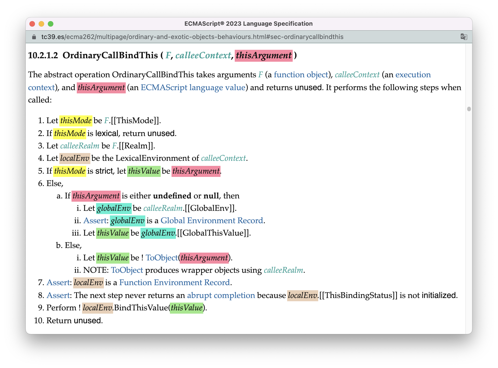
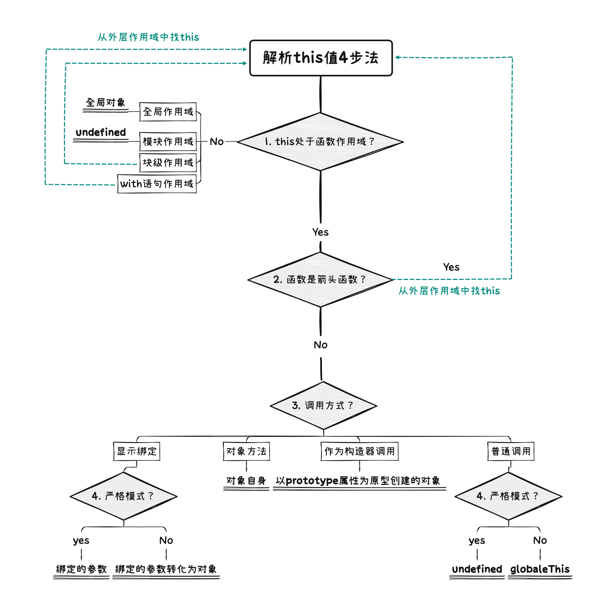
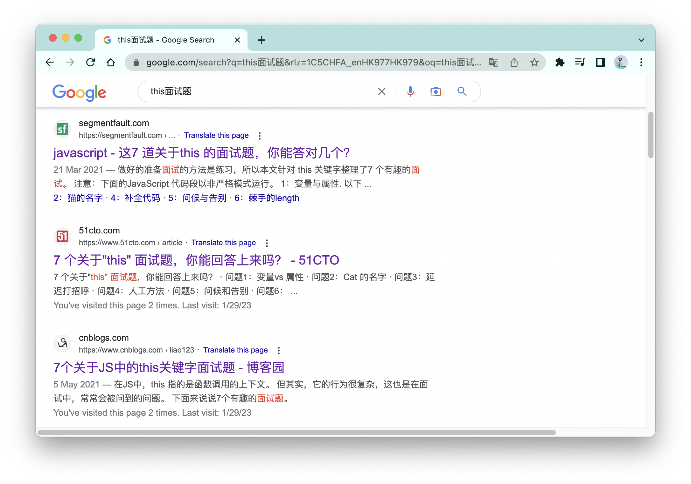

# 4个步骤永久根治this问题

在JavaScript中，“this指针“可能是程序员”骂娘指数“最高的特性。网络上有很多讲解this指针的文章，有的会列举this指针在不同情况下具体的指向，然后说特殊情况只能死机硬背；有的则尝试基于各种各样的情况总结出一些一般性地规律，比如什么"this永远指向最后调用它的那个对象"等等；当然，其中不少文章还穿插着对this的一番批判。

这些作者的努力固然值得尊敬，但大多很难让人满意。其核心原因在于：**this指针的具体指向实际上是由多个变量共同影响的**，这些变量包括：

- **变量1 —— this所在的作用域类型**：在全局代码、模块代码、块级代码、函数代码里的this指针都可能会有不同的指向；
- **变量2 —— 函数的类型**：普通函数与箭头函数的this指向是不同的；
- **变量3 —— 函数是否处于严格模式**；
- **变量4 —— 函数的调用方式**：直接调用、作为对象的方法调用、作为构造器调用、使用显式绑定...... 这些调用方式都会影响this的指向；

所以，当我们在考察this指针的时候，实际上就像在研究一个4元方程，一共有4个变量，每个变量都有数种可能，于是最终能够交叉组合出十几种甚至几十种情况，你几乎不可能在一篇文章内穷举完所有的情况；并且，在不完整了解所有的这些变量时，所总结出来的一般性规律也是片面的、缺失的、带有误导性的。

幸运的是，我们一路走了这么远，我们掌握了标准的阅读方法，我们知道了作用域实际上是由环境记录器类型表示的，我们深入研究了函数的创建与执行..... 有了这些基础，我们就有了完整理解this指针的能力。

**通过阅读标准，我总结出了一套切实可行的人脑解析this值的4步法，这个“4步法”足够稳定，没有例外情况，可以根治一切this值的面试题：** 

> 1. 查看this所处的作用域类型，如果不是函数作用域，可以快速完成判断；
> 2. 如果处于函数作用域，但函数为箭头函数，则需要对外层作用域重新应用这4个步骤。
> 3. 如果函数不是箭头函数，则根据不同的调用方式确定this值；
> 4. 如果此时this值不是对象，且函数不处于严格模式，需要把this值按照规则转化为对象类型。

本节，我会先从标准的角度，解释this值的绑定过程，你可以在这个过程中看到这4个变量是如何影响this值的；然后，我会使用图示对“4步法”进行更加详细的解释；最后，我会应用“4步法”解决一些经典的this值问题，让你看到4步法的实际使用过程。

<br />

<br/>


### 目录:

- [this表达式的求值](#this表达式的求值)

  * [变量1 ——  this所在的作用域类型](#变量1---this所在的作用域类型)

- [函数作用域的this解析](#函数作用域的this解析)

  * [函数环境记录器[[ThisValue]]字段的赋值过程](#函数环境记录器thisvalue字段的赋值过程)

  * [变量2 —— 函数的类型](#变量2--函数的类型)

  * [变量3 —— 严格模式](#变量3--严格模式)

  * [变量4 —— 函数调用方式](#变量4--函数调用方式)

- [人脑解析this值4步法](#人脑解析this值4步法)

  * [实战](#实战)

  * [关于4步法的使用总结](#关于4步法的使用总结)
<br/>


## this表达式的求值

尽管this看起来很复杂，但this表达式的[求值过程](https://tc39.es/ecma262/multipage/ecmascript-language-expressions.html#sec-this-keyword)却简单得令人发指：**从作用域链上寻找第一个有绑定this值的环境记录器，然后获得该环境记录器上的this值。** 



我们在[9.作用域](./9.scope.md#不同类型的环境记录器)已经看到，不同代码在执行时会创建不同的环境记录器，用以绑定代码中的标识符。

在解析this值时，每个环境记录器，会使用`HasThisBinding()`方法查看是否有绑定this值，如果返回true，就可以调用`GetThisBinding()`方法获得该环境记录器绑定的this值。不同类型的环境记录器，这两个方法的具体逻辑会不同，但也遵循一定的规律。而这些规律，就是我们「变量1 —— this所在的作用域类型」的核心部分。


<br/>


### 变量1 ——  this所在的作用域类型

不同的作用域，this的解析结果如下表所示：

| 作用域类型     | 对应的环境记录器类型 | 执行HasThisBinding()                                         | 执行GetThisBinding()                                         |
| -------------- | -------------------- | ------------------------------------------------------------ | ------------------------------------------------------------ |
| 全局作用域     | 全局环境记录器       | [返回true](https://tc39.es/ecma262/multipage/executable-code-and-execution-contexts.html#sec-global-environment-records-hasthisbinding) | [返回全局对象](https://tc39.es/ecma262/multipage/executable-code-and-execution-contexts.html#sec-global-environment-records-getthisbinding) |
| 模块作用域     | 模块环境记录器       | [返回true](https://tc39.es/ecma262/multipage/executable-code-and-execution-contexts.html#sec-module-environment-records-hasthisbinding) | [返回undefined](https://tc39.es/ecma262/multipage/executable-code-and-execution-contexts.html#sec-module-environment-records-getthisbinding) |
| 块级作用域     | 声明式环境记录器     | [返回false](https://tc39.es/ecma262/multipage/executable-code-and-execution-contexts.html#sec-declarative-environment-records-hasthisbinding) | 无此方法                                                     |
| with语句作用域 | 对象环境记录器       | [返回false](https://tc39.es/ecma262/multipage/executable-code-and-execution-contexts.html#sec-object-environment-records-hasthisbinding) | 无此方法                                                     |
| 函数作用域     | 函数环境记录器       | [箭头函数返回false，其他返回true](https://tc39.es/ecma262/multipage/executable-code-and-execution-contexts.html#sec-function-environment-records-hasthisbinding) | [返回环境记录器`[[ThisValue]]`字段的值](https://tc39.es/ecma262/multipage/executable-code-and-execution-contexts.html#sec-function-environment-records-getthisbinding) |

幸运的是，在这里，除了函数作用域，其他类型的作用域，this值的解析都是极为简单的：

- 位于全局顶层代码的this表达式指向全局对象：

  ```js
  // 全局环境
  console.log(this === globalThis) // true
  ```

- 模块作用域的this值指向undefined:

  ```html
  <!-- 浏览器宿主 -->
  <body>
      <script>
          console.log(this) // 全局作用域，返回全局对象
      </script>
      <script type="module">
          console.log(this) // 模块作用域，返回undefined
      </script>
  </body>
  ```

- 块级作用域和with语句的作用域都没有this值的绑定，所以处在这个作用域内的this表达式都会沿着作用域链继续检索this值，如下面的代码和配图所示：

  ```js
  with({a:1}){ // with作用域
      if(true){ // 块级作用域
          console.log(this === globalThis) // true，在全局作用域才找到this值
      }
  }
  ```

  


<br />

尽管函数环境记录器的`GetThisBinding()`方法看起来极为简单，就是返回其`[[ThisValue]]`字段的值，但是`[[ThisValue]]`字段的赋值过程却是蜿蜒曲折的，**剩余的变量2、变量3、变量4都只影响函数作用域，于是，函数作用域也是我们重点关注的部分！** 


<br/>


## 函数作用域的this解析

虽然函数作用域的this解析受到三个变量的影响，但我还是尝试先用一张二维的表为你总结解析的结果：

|                      | 非箭头函数                                                   | 箭头函数 |
| -------------------- | ------------------------------------------------------------ | -------- |
| 显式绑定             | 严格模式：this参数的值<br />非严格模式：this参数转化为对象   | 无this   |
| 作为对象方法调用     | 对象自身                                                     | 无this   |
| 作为构造器调用       | 以prototype属性为原型创建的对象                              | 无this   |
| 其他情况（普通调用） | 严格模式：undefined<br />非严格模式：undefined转化为globalThis | 无this   |

这张表只是为了让你先有一种“整体轮廓”的感知，有不明白的地方不用担心，我在下面全部都会解释清楚。


<br/>


### 函数环境记录器[[ThisValue]]字段的赋值过程

我们在[14.函数](./14.function.md)讲过，一个函数的生命周期大概会经历「创建函数 - 调用函数」两个阶段。创建函数阶段会根据声明语句，创建不同类型的函数对象，如普通函数、箭头函数、Generator函数、Async函数等等。而调用函数阶段则可能会有不同的调用形式，如直接调用、作为对象方法调用、作为构造器调用等等。

这两个阶段共同决定了最后函数环境记录器的`[[ThisValue]]`字段，具体过程如下：

- **在[创建函数阶段](https://tc39.es/ecma262/multipage/ordinary-and-exotic-objects-behaviours.html#sec-ordinaryfunctioncreate)，会根据函数声明语句决定函数对象的`[[ThisMode]]`内部插槽。** 这个内部插槽会在后续干扰函数环境记录器`[[ThisValue]]`字段的赋值。`[[ThisMode]]`有三个可能的值：

  | [[ThisMode]] | 对应的函数声明语句      | 对[[ThisValue]]赋值的影响           |
  | ------------ | ----------------------- | ----------------------------------- |
  | lexical      | 箭头函数、Async箭头函数 | 不允许给`[[ThisValue]]`赋值         |
  | strict       | 函数处于严格模式        | 无                                  |
  | global       | 除了以上以外的其他语句  | 强制把`[[ThisValue]]`的值转化为对象 |

- **在[调用函数阶段](https://tc39.es/ecma262/multipage/ordinary-and-exotic-objects-behaviours.html#sec-ecmascript-function-objects-call-thisargument-argumentslist)，会[创建](https://tc39.es/ecma262/multipage/ordinary-and-exotic-objects-behaviours.html#sec-prepareforordinarycall)函数环境记录器，不同的函数调用方式，会[尝试](https://tc39.es/ecma262/multipage/ordinary-and-exotic-objects-behaviours.html#sec-ordinarycallbindthis)给该环境记录器的`[[ThisValue]]`字段绑定不同的值。** 而具体的绑定结果，会受到上面的`[[ThisMode]]`的影响。

此时你应该可以看出，创建阶段的`[[ThisMode]]`与变量2、3有关，调用函数阶段与变量4有关。


<br/>


### 变量2 —— 函数的类型

对于变量2，可以一句话总结：**箭头函数不能绑定this值，箭头函数内的this值要沿着箭头函数的作用域链上继续查找。** 

以下我会从标准中的算法给你呈现这一点：

- 对于函数的创建阶段，我们在[14.函数](./14.function.md#创建函数)中罗列了不同类型函数的创建算法，并说[OrdinaryFunctionCreate()](https://tc39.es/ecma262/multipage/ordinary-and-exotic-objects-behaviours.html#sec-ordinaryfunctioncreate)是这里的核心抽象操作。仔细对比这些算法，你会发现只有箭头函数以及async箭头函数在调用`OrdinaryFunctionCreate()`时，传入的thisMode参数是`lexical-this`，而其他类型的函数传入的都是`non-lexical-this`。

  

  于是，沿着`OrdinaryFunctionCreate()`我们能够看到这样的一个逻辑：`lexical-this`会给创建出来的函数对象F的`[[ThisMode]]`内部插槽赋值为`lexical`。

  

- 对于函数的调用阶段，我们在[14.函数](./14.function.md#调用函数)也同样提到过，此时会调用[OrdinaryCallBindThis()](https://tc39.es/ecma262/multipage/ordinary-and-exotic-objects-behaviours.html#sec-ordinarycallbindthis)抽象操作给环境记录器绑定this值。沿着这个方法的链接，我们在开头就看到这样一个逻辑：如果`[[ThisMode]]`是`lexical`，啥也不干，直接返回！

  

因此，由箭头函数创建的环境记录器不会绑定this值。而我们上面讲过：this表达式的解析会从作用域链上寻找第一个有绑定this值的环境记录器，然后获得其绑定的this值。于是，要解析箭头函数的this值就必须分析箭头函数的作用域链，然后沿着外层作用域继续寻找。关于作用域链的构建，如果你忘了，可以回看[10.作用域链](./10.scope-chain.md#作用域链的构建)。


<br/>


### 变量3 —— 严格模式

对于变量3，也可以一句话总结：**非严格模式会强制this值转化为对象，如果this值为null或undefined，则转化为全局对象，而严格模式不会对this值进行转化。** 

我继续从标准的底层算法给你呈现这一点：

- 在函数创建阶段，[OrdinaryFunctionCreate()](https://tc39.es/ecma262/multipage/ordinary-and-exotic-objects-behaviours.html#sec-ordinaryfunctioncreate)会对严格模式的函数设置`[[ThisMode]]`为`strict`。

  

- 在函数调用阶段，[OrdinaryCallBindThis()](https://tc39.es/ecma262/multipage/ordinary-and-exotic-objects-behaviours.html#sec-ordinarycallbindthis)有以下的一段逻辑：

  

  在这里，黄色的`thisMode`是函数`[[ThisMode]]`内部插槽的值，红色的`thisArgument`是函数尝试绑定的this值（由变量4决定），绿色的`thisValue`是最终绑定的this值，青色的`globalEnv`是全局环境记录器，棕色的`localEnv`是该函数的函数环境记录器。于是，把这段逻辑转化为我们熟悉的语言是这样的：

  - （第5步）若是严格函数，`thisValue`设定为传入的`thisArgument`。
  - （第6步）若非严格函数：
     - （6.a）如果传入的`thisArgument`是undefined或null，设置`thisValue`为全局对象；
  
     - （6.b）否则：设置`thisValue`为Object(`thisArgument`)转化后结果。
  
  - （第9步）把`thisValue`作为this值绑定在函数环境记录器中。

你可以使用以下的代码验证严格模式与非严格模式的差异：

```js
// 非严格模式
function printThis(){console.log(this)}
printThis() // global (浏览器宿主就是window)
printThis.call(undefined) // global
printThis.call(null) // global
printThis.call(false) // Boolean {false}
printThis.call(0) // Number{0}
printThis.call("") // String{""}

// 严格模式
function printThisStrict(){"use strict";console.log(this)}
printThisStrict() // undefined
printThisStrict.call(undefined) // undefined
printThisStrict.call(null) // null
printThisStrict.call(false) // false
printThisStrict.call(0) // 0
printThisStrict.call("") // ""
```

在[前言](./Preface.md#我们已经盲了太久)中我提到过，有一种江湖说法：

> “this永远指向最后调用它的那个对象。”

这个说法尝试解释普通函数调用时this值指向了全局对象的现象。现在你应该能看出来，这种说法是在不了解this值解析机制的情况下，强行编造出来的“规律”。正确的解释应该是：**普通函数的this值默认绑定undefined，但是在非严格模式下被强制转化为全局对象。** 

我怎么知道默认绑定undefined？继续往下看你就明白了。


<br/>


### 变量4 —— 函数调用方式

对于变量4，不同的调用方式会尝试绑定不同的this值（传入不同的`thisArgument`），我用一张表为你总结：

| 调用方式             | 传入的thisArgument              | 核心算法链接（确定thisArgument的地方）                       |
| -------------------- | ------------------------------- | ------------------------------------------------------------ |
| 显式绑定             | 绑定的参数                      | [apply](https://tc39.es/ecma262/multipage/fundamental-objects.html#sec-function.prototype.apply)、[bind](https://tc39.es/ecma262/multipage/fundamental-objects.html#sec-function.prototype.bind)、[Array.prototype.map](https://tc39.es/ecma262/multipage/indexed-collections.html#sec-array.prototype.map)等可显式绑定this值的API |
| 作为对象方法调用     | 对象自身                        | [EvaluateCall第1步a](https://tc39.es/ecma262/multipage/ecmascript-language-expressions.html#sec-evaluatecall) |
| 作为构造器调用       | 以prototype属性为原型创建的对象 | [[Construct]]内部方法的[第3步与第6步](https://tc39.es/ecma262/multipage/ordinary-and-exotic-objects-behaviours.html#sec-ecmascript-function-objects-construct-argumentslist-newtarget) |
| 其他情况（普通调用） | undefined                       | [EvaluateCall第1步b](https://tc39.es/ecma262/multipage/ecmascript-language-expressions.html#sec-evaluatecall)、[EvaluateCall第2步](https://tc39.es/ecma262/multipage/ecmascript-language-expressions.html#sec-evaluatecall) |

基于篇幅的考虑，这里我就不再详细贴出每一个算法的细节。你只需要知道，每一种调用方式会传入什么样的`thisArgument`，有兴趣的读者可以自行查看表格中的算法链接。

现在你应该已经清楚，最终绑定的结果要与变量2、变量3（即不同的`[[ThisMode]]`）一同考虑。

在这里，我会为不同的调用方法逐一举例。

- 显式绑定，以bind()方法为例：

  ```js
  // 非严格模式：[[ThisMode]]:global, 强制转化为对象
  function ordinaryFn(){console.log(this)}
  const boundOrdinaryFn = ordinaryFn.bind(2)
  boundOrdinaryFn() // Number{2}
  
  // 严格模式：[[ThisMode]]:strict, 无强制转化
  function ordinaryStrictFn(){"use strict";console.log(this)}
  const boundOrdinaryStrictFn = ordinaryStrictFn.bind(2)
  boundOrdinaryStrictFn() // 2
  
  // 箭头函数：[[ThisMode]]:lexical, 无this。
  const arrowFn = () => {console.log(this)}
  const boundArrowFn = arrowFn.bind(2)
  boundArrowFn() // global
  ```

- 普通调用：

  ```js
  // 非严格模式：[[ThisMode]]:global, 强制转化为对象
  function ordinaryFn(){console.log(this)}
  ordinaryFn() // global
  
  // 严格模式：[[ThisMode]]:strict, 无强制转化
  function ordinaryStrictFn(){"use strict";console.log(this)}
  ordinaryStrictFn() // undefined
  
  // 箭头函数：[[ThisMode]]:lexical, 无this。
  const arrowFn = () => {console.log(this)}
  arrowFn() // global
  ```

- 作为对象方法调用：

  ```js
  const obj = {
    ordinaryMethod: function(){console.log(this)},
    arrowMethod: () => {console.log(this)},
  }
  // 普通对象方法，this指向对象
  obj.ordinaryMethod() // obj {ordinaryMethod: ƒ, arrowMethod: ƒ}
  
  // 箭头方法，依旧无this
  obj.arrowMethod() // global
  
  // 需要注意的是：以下的情况是普通调用，而不是作为方法调用：
  const trick = obj.ordinaryMethod
  trick() // global
  ```

- 作为构造器调用，构造器实例化的具体过程我在[15.类](./15.class.md#实例化类)里面讲过：

  ```js
  function A(){console.log(this.a)}
  A.prototype = {a:"test"}
  new A // "test"
  
  class B extends A {
    constructor(){
      super() 
    }
  }
  new B // "test"
  ```

<br />

对于普通调用，只有一种例外情况：就是当函数在with语句内进行普通调用，且函数标识符是从with语句的对象环境记录器上解析得到的，this值绑定为with对象。

```js
let obj = {a: function(){console.log(this)}}
with(obj){
    a() // shu
} 
```

由于with语句是一个遗留的特性，已经不被鼓励使用，所以这种情况不会在我们后续“4步法”的考虑范围之内。当然，你也可以把它理解为相当于在调用`obj.a()`，即作为对象方法调用，尽管从标准的角度来说它并不是。


<br/>


## 人脑解析this值4步法

有了以上的基础，你已经具备彻底根治this解析这一疑难杂症的基础。在这里，我再给你一个锦囊，里面写了4个步骤，只要按部就班地应用这四个步骤，你就可以人脑解析出任何情况下this值的指向：

1. 查看this所处的作用域类型，如果不是函数作用域，可以快速完成判断；（基于[变量1](#变量1---this所在的作用域类型)）
2. 如果处于函数作用域，但函数为箭头函数，则需要对外层作用域重新应用这4个步骤。（基于[变量2](#变量2--函数的类型)）
3. 如果函数不是箭头函数，则根据不同的调用方式确定this值；（基于[变量4](#变量4--函数调用方式)）
4. 如果此时this值不是对象，且函数不处于严格模式，需要把this值按照规则转化为对象类型。（基于[变量3](#变量3--严格模式)）

我使用一张流程图为你总结详细的过程：



<br />

我谷歌了“this面试题”这个关键词，发现很多结果的标题都是《7道this面试题，XXXX》，而点进去这些链接，发现它们的7道题都是一样的。那既然这7道题的拷贝率很高，我们就用这7道题来练练手，检验一下我们的“4步法“




<br/>


### 实战

#### 1. 变量与属性：

以下代码输出什么：

```js
const object = {
  message: 'Hello, World!',

  getMessage() {
    const message = 'Hello, Earth!';
    return this.message;
  }
};

console.log(object.getMessage()); // => ?
```

以下是应用4步法的结果：

1. 函数作用域，继续往下看
2. getMessage函数非箭头函数
3. 调用方式为对象方法调用，所以this值指向object；

显而易见，结果为`"Hello, World!"`

<br />

#### 2. 猫的名字：

以下代码输出什么：

```js
function Pet(name) {
  this.name = name;

  this.getName = () => this.name;
}

const cat = new Pet('Fluffy');

console.log(cat.getName()); // => ? ①

const { getName } = cat;
console.log(getName());     // =>? ②
```

以下是应用4步法的结果：

第一次调用的解析（①）：

1. 函数作用域
2. getName函数类型是箭头函数，所以要从外层作用域分析。此时外层作用域是Pet函数作用域，因而，对Pet函数作用域继续应用4步法：
   1. 函数作用域
   2. Pet函数非箭头函数
   3. Pet函数通过new表达式作为构造器调用，所以this指向基于`Pet.prototype`创建的对象，即`cat`

最终，`this.name`指向`cat.name`，即“Fluffy”。

而第二次调用的解析过程（②）完全同上！

由此可见，**当函数类型为箭头函数时，函数的调用方式并不影响this值的指向！** 

<br />

#### 3. 延迟输出：

以下代码输出什么：

```js
const object = {
  message: 'Hello, World!',

  logMessage() {
    console.log(this.message); // => ?
  }
};

setTimeout(object.logMessage, 1000);
```

以下是应用4步法的结果：

1. 函数作用域
2. logMessage非箭头函数
3. 调用方式为**普通调用**，所以this指向undefined
4. 非严格模式，把undefined转化为全局对象，所以最终this指向全局对象

由于全局对象没有声明message变量，所以`this.message`为undefined。

这道题耍了一个小花招，让人容易以为这是对象方法调用；实际上`setTimeout(object.logMessage, 1000);`等同于：

```js
let callback = object.logMessage
setTimeout(callback, 1000);
```

<br />

#### 4. 补全代码

补全代码，使结果输出 `"Hello，World!"` 。

```js
// 初始代码
const object = {
  message: 'Hello, World!'
};

function logMessage() {
  console.log(this.message); // => "Hello, World!"
}

// 你的代码：
```

这道题是4步法大展身手的地方。你看其他的题解，都会说，有三种方法，分别是对logMessage使用call/apply/bind方法。抱歉，对于我们掌握4步法的人，这三种方法只能算一种，即显示绑定。

依据4步法的第三步，我们知道不同的调用方式会传入不同的this值。于是，这道题有4种实现方式：

1. 使用普通调用：

   ```js
   // 初始代码
   // ....
   
   // 你的代码：
   var message = 'Hello, World!'
   logMessage()
   ```

2. 使用对象方法调用：

   ```js
   // ....
   // 你的代码：
   object.a = logMessage
   object.a()
   ```

3. 使用构造器调用：

   ```js
   // 。。。
   // 你的代码：
   logMessage.prototype = object
   new logMessage
   ```

4. 最后才是显式绑定：

   ```js
   logMessage.call(object);
   logMessage.apply(object);
   const boundLogMessage = logMessage.bind(object);
   boundLogMessage();
   ```


<br />

#### 5. 问候与告别：

以下代码输出什么：

```js
const object = {
  who: 'World',

  greet() {
    return `Hello, ${this.who}!`; 
  },

  farewell: () => {
    return `Goodbye, ${this.who}!`;
  }
};

console.log(object.greet());    // => ? ①
console.log(object.farewell()); // => ? ②
```

以下是应用4步法的结果：

第一次调用的解析（①）：

1. 函数作用域
2. greet函数非箭头函数
3. 作为对象方法调用，所以this指向对象object

最终，输出`"hello world"`

第二次调用的解析（②）：

1. 函数作用域
2. farewell函数类型是箭头函数，所以要从外层作用域分析。此时外层作用域为全局作用域，对全局作用域继续分析：
   1. 全局作用域，this指向全局对象。

最终，输出`"Goodbye, undefined"`

<br />

#### 6. 棘手的 length: 

以下代码输出什么：

```js
var length = 4;
function callback() {
  console.log(this.length); // => ?
}

const object = {
  length: 5,
  method(callback) {
    callback();
  }
};

object.method(callback, 1, 2);
```

以下是应用4步法的结果：

1. 函数作用域
2. callback函数非箭头函数
3. 调用方式为普通调用，所以this指向undefined
4. 非严格模式，把undefined转化为全局对象，所以this指向全局对象

最终this.length的输出为4。

搞不懂，棘手的length棘手在哪？

<br />

#### 7. 调用参数

以下代码输出什么：

```js
var length = 4;
function callback() {
  console.log(this.length); // 输出什么
}

const object = {
  length: 5,
  method() {
    arguments[0]();
  }
};

object.method(callback, 1, 2);
```

以下是应用4步法的结果：

1. 函数作用域
2. callback函数非箭头函数
3. 调用方式为**对象方法调用**，所以this指向对象arguments。

最终，由于arguments.length为3，所以最终输出为3。

这一题是我认为7题里面最“绕”的，`arguments[0]()`是一个对象方法调用，对象为`arguments`，方法名为`0`，方法的值为callback函数。


<br/>


### 关于4步法的使用总结

从上面你可以看出，掌握了四步法之后，许多的this值问题基本上都是“秒解”的。**正确使用4步法是不会出错的**，如果你做错了，要么是中了陷阱，要么是其他领域的知识不牢靠。常见的出错原因如下：

1. 对于箭头函数的作用域链分析错误。比如[2.猫的名字](#2-猫的名字)，如果你误以为getName的外层作用域是全局作用域，这一题就错了；如果你是这种情况，你就要重新阅读[9.作用域](./9.scope.md)与[10.作用域链](./10.scope-chain.md)了。

2. 对于调用方式的判断错误。比如[3.延迟输出](#3-延迟输出)，如果你误以为调用方式是对象方法调用，你就会把结果错误判断为"hello world"。

3. 对于是否处于严格模式的判断错误，比如下面代码：

   ```js
   function foo() {
     console.log( this.a );
   }
   var a = 2;
   (function(){
     "use strict";
     foo();
   })();
   ```

   如果你认为此时foo处于严格模式，那么你就会误以为这段代码会报错，可实际上foo不是严格模式。你可以从我们前面的分析看到，是否处于严格模式，在函数创建的时候就确定了。

4. 其他类型知识的缺乏，比如[7.调用参数](#7-调用参数)，考查了你关于arguments参数的知识，如果你对arguments参数不了解，那这题你就没法做了。如果你是这种情况，你就需要反复阅读这本书，反复阅读标准。

