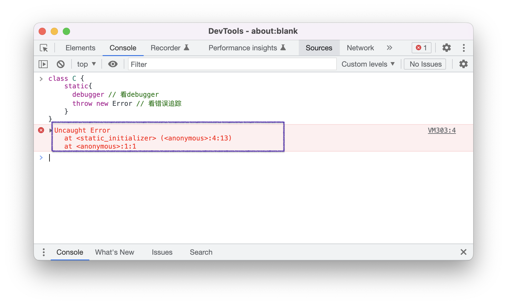

# ECMAScript的演化

1997年，一台名为“深蓝”的电脑，在国际象棋上击败了世界冠军卡斯帕罗夫，这是人类历史上首次在与计算机的智力较量上败下阵来。

1997年，一只名为“多利”的绵羊，在苏格兰的某个实验室里“出生”了，这是人类历史上第一只成功克隆的哺乳动物。

还是1997年，一部名为“ECMAScript”的语言标准悄然发布，随后的20年，JavaScript成为了彻底颠覆人类生活方式的互联网所使用的核心脚本语言。

本节，我将为你展示ECMAScript的演化历程 —— 诞生、迭代方式、迭代历史以及历史遗留问题。

在讲迭代方式的过程中，我会使用一个实际的例子，给你“可视化”一个新的语言特性是如何“百炼成钢”才进入标准的；本节的最后部分，我会为你展示如何使用标准提供的test262测试包自测自家浏览器对标准的实现程度，而对于那些未实现的部分，我们都有哪些主要的应对方案。


<br/>


### 目录:

- [标准的诞生：为什么叫ECMAScript？](#标准的诞生为什么叫ecmascript)

- [标准的迭代流程](#标准的迭代流程)

  * [Stage0：稻草人阶段](#stage0稻草人阶段)

  * [stage1](#stage1)

  * [stage2](#stage2)

  * [stage3](#stage3)

  * [stage4](#stage4)

- [从stage4看ECMAScript的迭代历史](#从stage4看ecmascript的迭代历史)

- [兼容性问题与解决方案](#兼容性问题与解决方案)

  * [解决方案](#解决方案)
<br/>


## 标准的诞生：为什么叫ECMAScript？

> ECMAScript was always an unwanted trade name that sounds like a skin disease.  —— Brendan Eich
>
> ECMAScript一直是一个不受欢迎的商用名，听起来就像是一种皮肤病。 —— 布兰登·艾克
>

也许你跟我有过同样的困惑，即然ECMAScript标准是JavaScript的规范，为什么不干脆直接叫“JavaScript”？

我们可以从ECMAScript标准的诞生过程找到答案。

1995年，网景公司的一名工程师[布兰登·艾克（Brendan Eich）](https://en.wikipedia.org/wiki/Brendan_Eich)用十天的时间创造了一门可以在浏览器上运行的脚本语言，这个语言最初命名为“Mocha”，然后改为“LiveScript”，最后决定为“JavaScript”。

1996年，微软发布了他们自己版本的JavaScript，叫JScript，JScript可以在微软的IE3上运行。

为了避免一场脚本语言的战争，1997年，网景公司找到**欧洲计算机制造商协会（European Computer Manufacturers Association，简称ECMA）** 来标准化JavaScript。在网景和微软的各种争论与妥协下，最终决定以「ECMAScript」来命名JavaScript的标准，即便布兰登老爷子觉得这听起来就像是一种皮肤病。

ECMA协会以**ECMA-262**编号ECMAScript标准，并任命**tc39技术委员会**负责制定这份标准。

随后，ECMAScript就开始了自己的野蛮生长。从1997年第一版ECMAScript的发布，到我编写这本书的时候，ECMAScript已经出到第14版了，并成为了世界上最多人使用的通用编程语言之一。

在本书，ECMAScript与JavaScript会交替使用，它们表达的都是同一个意思。


<br/>


## 标准的迭代流程

从es6往后开始，ECMAScript标准就开源了它的开发流程。它在github上新建了一个[仓库](https://github.com/tc39/ecma262)，任何人都可以在这里提交语言的bug、标准中的表达错误以及其他优化的内容。

ECMA协会还标准化了语言的迭代流程：


**任何人都可以以任何形式提出增加或修改语言特性的提议；对于那些社区中反响热烈、有潜力的提议，tc39技术委员会的人会将其提交为一个提案（proposals），并进入正式的开发流程（process）。这个流程会对提案的内容进行问题建模、构建解决方案、识别潜在风险、收集社区反馈、编写规范文本、开发测试用例等等一系列的过程。整个流程会拆分为4个阶段（stage），每一个阶段的完成度以及审核的严格程度都不断提升，只有进入stage4最终阶段的提案才可以进入标准，从stage1到stage4往往需要数年时间。** 

**每年7月份，ECMA协会就会正式发布新一版的标准，新的标准会把过去一年中进入stage4的提案集成进标准当中。** 

这有点类似于奥运会参赛选手的选拔过程：教练团队会把在全国各地发现的好苗子带到一个地方，并对这些好苗子进行科学的、严格的、规范的训练，而只有那些最终通过所有测试的运动员，才有资格参加奥运会。

你可以在[这里](https://tc39.es/process-document/)看到4个stage分别的要求以及工作内容，我不打算干巴巴地给你翻译这些内容。在这里，我会以一个在2021年进入stage4、并最终进入es2022标准的提案 —— class静态块，作为例子，为你更加生动地呈现这4个阶段。

```js
// class静态块示例：
class C {
  static {
    // ...
  }
}
```

关于class静态块提案的历史发展，你可以从它的[github仓库](https://github.com/tc39/proposal-class-static-block)commit历史中找到详细的记录，每个stage的commit节点我已经为你找出来了：

> proposal-class-static-block：[stage0](https://github.com/tc39/proposal-class-static-block/tree/0db32a4978df3183a2e2ab420bfd5ea40031ff27) -> [stage1](https://github.com/tc39/proposal-class-static-block/tree/c1626ae5d3762bb4b2642025c96f9f8fcc4ce70e) -> [stage2](https://github.com/tc39/proposal-class-static-block/tree/611aef51b7b82d666b5cc8d7292b3701c5409b3d) -> [stage3](https://github.com/tc39/proposal-class-static-block/tree/dcd7bd1ab5ce1f2b2dbc3430bcb1d260ea4404aa) -> [stage4](https://github.com/tc39/proposal-class-static-block)


<br/>


### Stage0：稻草人阶段

stage0是每一个提案最原始的阶段：在这个阶段，提案的作者提出一个新的语言特性，并解释为什么开发者需要这个特性，但此时提议并未准许进入正式流程。你可以在[这里](https://github.com/tc39/proposals/blob/2233a975d5cf7a86709dc17a614f3f610f5bd060/stage-0-proposals.md)查看所有现有的stage0提案。

在class静态块提案的github仓库中，我们可以在其历史上的[第一个commit](https://github.com/tc39/proposal-class-static-block/tree/0db32a4978df3183a2e2ab420bfd5ea40031ff27)看到stage0阶段的快照。class静态块是在4年前由一个微软的牛人Ron Buckton提出的，你甚至还可以在仓库中看到Ron Buckton当年对这个特性做宣讲的[PPT](https://docs.google.com/presentation/d/1TLFrhKMW2UHlHIcjKN02cEJsSq4HL7odS6TE6M-OGYg/edit#slide=id.p)。在这个提案的雏形中，Ron Buckton描述了class静态块的语句形态、设计动机、语义等内容。

class静态块的设计动机讲解起来需要花费很大的篇幅，我就不在这里展开，你可以在仓库中查看Ron Buckton最原汁原味的解释。在这里，你只需要知道它允许在创建类的时候执行一段逻辑即可：

```js
class A {
  static {
    console.log('a')
  }
}
console.log('b')
// a
// b
```


<br/>


### stage1

**stage1表示那些tc39委员会感兴趣且愿意花时间进行研究的提案。** 

要进入stage1，提案需要先完成以下几件事情：

1. 确认提案的负责人（champion）；
2. 描述提案主要应对的问题以及大体的解决方案；
3. 提供使用的示例；
4. 顶层API的设计；
5. 识别潜在的兼容性风险，以及实现这个特性将面临的挑战；
6. 提供一个公开的仓库，放置以上的内容。

你可以在[这里](https://github.com/tc39/proposals/blob/2233a975d5cf7a86709dc17a614f3f610f5bd060/stage-1-proposals.md)查看所有现有的stage1提案。

在class静态块的提案中，负责人就是Ron Buckton，而关于提案的问题描述（即动机）、解决方案、使用案例、顶层API设计等等内容，基本上在仓库首次创建时就已经完成了。这是因为Ron Buckton是一个有经验的成员，他另一个进入stage4的提案是[RegExp Match Indices](https://github.com/tc39/proposal-regexp-match-indices)，给正则表达式相关方法的返回结果增加一个`indices`属性。


<br/>


### stage2

**进入stage2的提案表示tc39委员会预期这个特性会被开发并最终进入标准中**。

进入stage2的要求是要有初始的标准文稿 —— 使用标准的语言规范描述提案的内容。你可以在[这里](https://github.com/tc39/proposals#stage-2)看到所有现有的stage2提案。

在class静态块的[初始文稿](https://arai-a.github.io/ecma262-compare/?rev=51e28c71cea1c73e3f22a007a058ebbf5ebc06aa)中，它做了以下事情：

- 定义了新的规范类型：ClassStaticBlockDefinition Record 
- 定义了新的文法：ClassStaticBlockStatementList...
- 定义了与class静态块相关的语法导向操作。

（如果你不理解这些东西的含义，没有关系，这些概念都是本书后面的重点内容。）

除了初始文稿，有的提案还会提供特性的polyfill或者转译器。Babel现在已经支持class静态块的转译:


<br />
<br/>


### stage3

stage3是进入最终阶段前的最后一个阶段。你可以在这里看到所有现有的[stage3提案](https://github.com/tc39/proposals/tree/2233a975d5cf7a86709dc17a614f3f610f5bd060#stage-3)。

进入stage3的标准有：

1. 有完整的标准的文稿；
2. 所有标准的审核人员对文稿进行了签名。
3. 所有标准的编辑人员对文稿进行了签名。

你可以把class静态块的[完整文稿](https://tc39.es/proposal-class-static-block/)与初始文稿进行对比，完整文稿显然更为详细、更为专业。

从stage2到stage3是一次重大的跃迁，提案的各个方面会在这个阶段被资深的语言专家进行严格的考察，往往许多最初的设计会被推翻，有的提案甚至会整个被否决，你可以在[这里](https://github.com/tc39/proposals/blob/HEAD/inactive-proposals.md)看到所有被否决的提案。

对比[stage2的语义](https://github.com/tc39/proposal-class-static-block/tree/611aef51b7b82d666b5cc8d7292b3701c5409b3d#semantics)和[stage3的语义](https://github.com/tc39/proposal-class-static-block/tree/dcd7bd1ab5ce1f2b2dbc3430bcb1d260ea4404aa#semantics)，你可以看到class静态块在这个过程中发生的重大改变：


1. （橙色下划线）在初始设计中，每一个类只能有一个静态块，但现在一个类可以有任意数量的静态块。

2. （紫色下划线）在初始设计中，不管静态块在什么位置声明，静态块都会在所有class的字段完成初始化以后，才会执行；但现在，静态块的执行与字段的初始化按照声明位置的前后顺序进行：

   ```js
   class C {
       static a = "a"
       static {
           console.log(this.a) // 输出"a"
           console.log(this.b) // 输出undefined, 因为未初始化
       }
       static b = "b"
   }
   ```

3. 新增语义：在静态块中访问`arguments`会报错；

4. 新增语义：在静态块中调用`super()`会报错；

5. 新增语义：可以在静态块中使用super关键字：

   ```js
   class A {
       static test(){console.log("good")}
   }
   class C extends A{
       static{super.test()} // "good"
   }
   ```

6. 新增语义：静态块在debugger和错误追溯中要使用一个独立的栈帧表示（即便静态块的执行并不会创建执行上下文）。

   ```js
   class C {
       static{
         debugger // 看debugger
         throw new Error // 看错误追踪
       }
   }
   ```

   下图为执行过程中debugger的调用栈：
   
   
   
   下图为报错时显示的调用栈：
   
   
   
   
<br/>


### stage4

**进入stage4表示提案已经成熟，将会进入下一版本的标准中。** 

进入stage4有以下标准：

1. 标准符合性测试包[Test262](https://github.com/tc39/test262)完成了对该特性相关测试用例的开发。
2. 至少两个js引擎通过了上述的测试。
3. 对[标准仓库](https://github.com/tc39/ecma262)发起一个PR，用以合并文稿。
4. 所有的标准编辑人员都对这个PR完成签名。

你可以在[这里](https://github.com/tc39/test262/pull/2968)看到class静态块在test262中相关的测试用例，并在[这里](https://github.com/tc39/ecma262/pull/2440)看到class静态块的PR。

关于test262的更多内容，我将在下面[兼容性](#兼容性问题与解决方案)的小节中再展开。


<br/>


## 从stage4看ECMAScript的迭代历史

新一版的标准会在每年的7月份正式发布，这版标准会把过去一年进入stage4的提案集成进标准中。也因此，我们可以直接从[stage4提案集合](https://github.com/tc39/proposals/blob/HEAD/finished-proposals.md)，看到ECMAScript的迭代历史。我用一张图为你进行了总结：


这并不是一个完整的列表，一些对语言小修小补的地方我没有放上去。但从这张图，我们也可以看到，从es6（即es2015）以来，ECMAScript在多个方面获得了长足的进步：

- 运算能力：新增多个运算符，包括`**`、`.?`、`??`、`??=`、`&&=`、`||=`；
- 内置对象API：新增了许多内置构造器（Array、String、Object等）的静态属性/方法以及prototype对象属性/方法。
- 异步编程能力：新增async函数类型、新增Promise的静态方法、新增顶层await语句、新增asyncIterator。
- 面向对象编程能力：新增class的私有字段以及静态块。
- 内存相关：新增实现内存共享的SharedArrayBuffer、垃圾回收相关的weakRefs及FinalizationRegistry API。


<br/>


## 兼容性问题与解决方案

我们已经看到，至es6以后，ECMAScript每一年都会更新一个新的版本，每一个版本都会有一些新增的语言功能。那么，各种浏览器，又或者更宏观的说，各种流行于市面上的ECMAScript宿主，对这些新增的语言特性实现到什么样的程度，是开发者关注的一个重要的问题。

从2010年开始，ECMA协会就着手开发ECMAScript的测试包[test262](https://github.com/tc39/test262)，ECMAScript宿主通过运行这个测试包，就可以知道哪些功能还没有被实现、哪些实现不符合标准等等。你可以在[这个网站](https://kangax.github.io/compat-table/es2016plus/)中看到不同宿主的测试结果。

有兴趣的话，你甚至可以对自己电脑上正在使用浏览器进行测试，测试方式非常简单：

1. 在test262[官方仓库](https://github.com/tc39/test262)下载test262测试包（无需解压）；
2. 打开运行test262的[浏览器runner页面](https://bakkot.github.io/test262-web-runner/)；
3. 点击`Local`，选择第一步下载的测试包；
4. 点击`Run`。

下图是我电脑上Safari浏览器的测试结果，看起来相当糟糕：


基本上5分之一的测试都没有通过。但这并不表示Safari很拉垮。没有通过的原因是很多还处在stage2/stage3提案的测试，也放在这个包里了。比如：

- 有超过5000个失败的测试用例来自于一个还处于stage3的特性 —— [Temporal](https://github.com/tc39/proposal-temporal)。该提案企图新增一个全局`Temporal`对象来管理日期和时间：

  ```js
  const duration = Temporal.Duration.from({
    hours: 130,
    minutes: 20
  });
  
  duration.total({ unit: 'second' }); // => 469200 转换为秒
  ```

- 另外一些失败的测试用例来自于一个曾经进入stage3后来被打回stage2的特性 —— [import Assertions](https://github.com/tc39/proposal-import-assertions/)。import assertion尝试允许你导入js以外类型的文件。（实际上，在chrome上面已经支持这么用了）

  ```js
  import json from 'example.json' assert {type: 'json'} // 引入json模块
  import css from 'example.css' assert {type: 'css'} // 引入css模块
  ```

<br />
<br/>


### 解决方案

对于那些浏览器还未实现的特性，我们一般有2种应对方法：

1. **使用polyfill/垫片(shim)。** polyfill和垫片的原理都是拦截某个API，然后增加一个中间层。比如下面的代码，可以增加浏览器对上面所说的全局`Temporal`对象的支持：

   ```js
   if(!window.Temporal){ window.Temporal = (class {/* Temporal的实现逻辑 */}) }
   ```

   你可以看看`Temporal`对象实际的polyfill仓库：

   - [ js-temporal/temporal-polyfill](https://github.com/js-temporal/temporal-polyfill)
   - [ fullcalendar/temporal](https://github.com/fullcalendar/temporal)

   polyfill和垫片的差别并不大，如果硬要作区分，根据[MDN](https://developer.mozilla.org/en-US/docs/Glossary/Shim)，polyfill用来支持浏览器未实现的API，而垫片则用来矫正已有API的行为。

   需要注意的是，polyfill和垫片都只能应对语言的API功能，对于语言的语法特性，它是束手无侧的。比如上面所说的import Assertion。

2. **使用转译器（transpiler）。** 转译器是比polyfill/垫片更加“釜底抽薪”的一种手段。它会通过解析器把原有的代码解构，然后再重新组合成新的语句，比如下面这样：

   ```js
   // es6
   () => {}
   
   // 通过编译之后
   (function(){});
   ```

   转译器与polyfill/垫片有两个主要的区别：第一，转译器是在代码打包阶段而不是运行时阶段工作的。第二，通过转译可以引入新的语法特性。

   比较有名的转译器是[babel](https://babeljs.io/)、[closure-complier](https://github.com/google/closure-compiler)。我们开篇所说的class静态块，在浏览器不支持的时候，必须使用转译器才能实现；前面提到的import Assertion，同样也需要使用转译器，你可以看看实现它的[babel插件](https://www.npmjs.com/package/@babel/plugin-syntax-import-assertions)。除此以外，通过转译的方式，你甚至还可以设计一门全新的语言，比如ECMAScript的超集 —— TypeScript。

