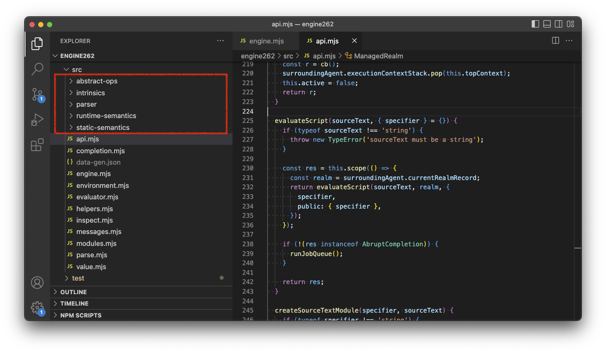
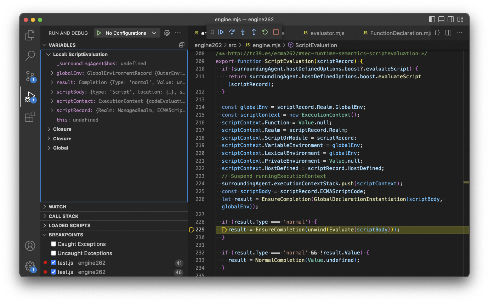

# 结束语：使用Engine262把标准“跑”起来

我们一路走了很远很远，终于来到了终点。

在应用篇，我从标准的角度，为你展示了各种语言特性是如何被实现的。当然，短短的几万字根本不可能覆盖所有的特性，但是，已经足以向你展示，利用标准我们可以收获多少只要不读标准就不可能知道的东西。

在结束以前，我再给你推荐一个“神器” —— [engine262](https://github.com/engine262/engine262)。engine262是一个使用JavaScript实现的JavaScript引擎，且100%基于标准使用实现。使用它，你就可以把标准“跑”起来。

与[spec-promise](https://github.com/Lawliet01/spec-promise)不同，spec-promise的运行依旧是依赖于原生的宿主环境，而engine262则自己搭了一套环境，包括自生成的agent、调用栈、环境记录器等等。

我对这个“神器”是一种相见恨晚的感觉，因为在我最初阅读标准的时候，我并不知道有这么一个好东西早已存在，使得我多走了许多弯路，多掉进了许多的坑。

你在它的目录，可以看到许多我们已经非常熟悉的字眼：抽象操作、固有对象、解析器、运行时语义、静态语义。点进去，你就可以看到这些内容的JavaScript实现。



从它的仓库，你可以看到基本的使用例子。它需要先手动创建一个agent，然后手动创建一个Realm，最后再基于Realm执行代码。执行代码的过程会先解析后求值，跟我们前面讲的一样。

```js
const {
  Agent,
  setSurroundingAgent,
  ManagedRealm,
  Value,
  CreateDataProperty,
  inspect,
} = require('engine262');

// 创建agent
const agent = new Agent({});
setSurroundingAgent(agent);

// 创建realm
const realm = new ManagedRealm({});

// 修改realm
realm.scope(() => {
  // Add print function from host
  const print = new Value((args) => {
    console.log(...args.map((tmp) => inspect(tmp)));
    return Value.undefined;
  });
  CreateDataProperty(realm.GlobalObject, new Value('print'), print);
});

// 执行代码
realm.evaluateScript(`
'use strict';

async function* numbers() {
  let i = 0;
  while (true) {
    const n = await Promise.resolve(i++);
    yield n;
  }
}

(async () => {
  for await (const item of numbers()) {
    print(item);
  }
})();
`);
```

使用Nodejs把它跑起来之后，你就可以通过debugger看到执行过程中算法的调用链以及环境的变化：



有了这个神器，对于标准的任何部分，你都可以通过它来进行“可视化”。至此，标准对你来说不再存在任何吃不透的地方。

<br />

以上，就是关于《人人都能读标准 —— ECMAScript篇》的全部内容。未来我会启动《人人都能读标准》的第二部 —— [HTML篇](https://github.com/Lawliet01/HTML-spec-decipherment)的撰写，敬请期待。


