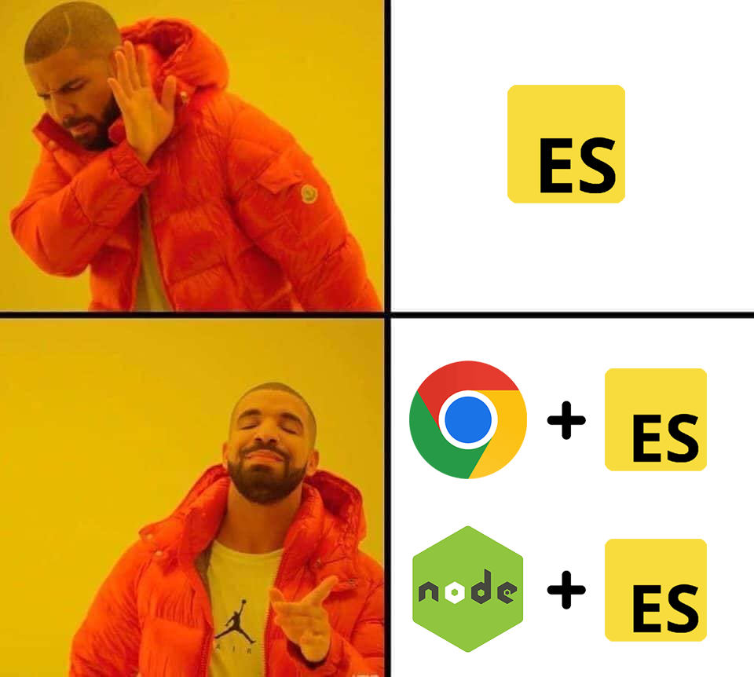
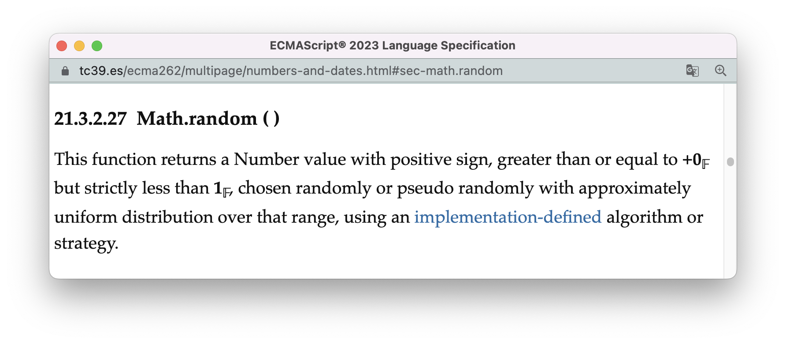
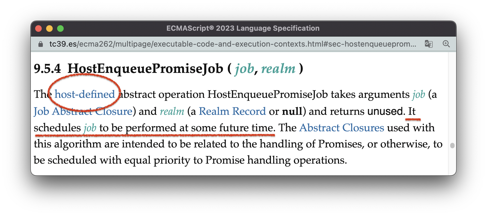
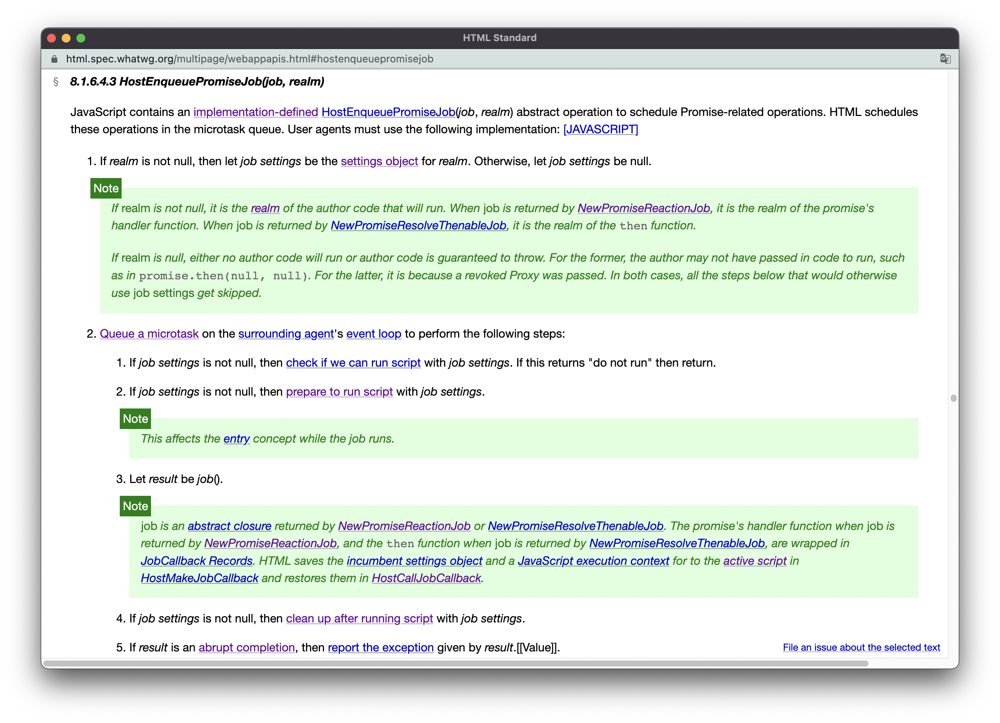
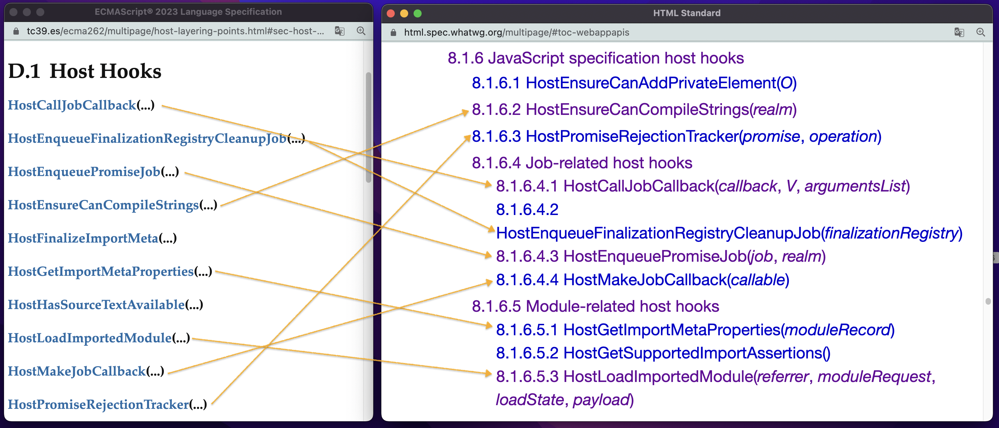

# 宿主环境



ECMAScript并不是一门能够独立运行的编程语言，它必须要接入到一个**宿主环境（host environment）** 中才能发挥作用。

你可以把ECMAScript比作一台发动机，它提供了最核心的动力。但是光有一台发动机是无法产生价值的，你必须配合一个“宿主”设备才能充分发挥它的作用：把发动机装在风扇中，可以让扇叶旋转制造凉风；把发动机装在汽车里，可以推动汽车在马路上奔跑；把发动机装在升降机上，可以把人和货物运往高处......

ECMAScript有两个最常见的宿主：

- 作为web客户端的浏览器；
- 作为web服务端的Node.js；

实际上，在宿主实现ECMAScript引擎的过程中，并不一定要使用标准定义的概念（如执行上下文），也不需要完全依照标准定制的算法实现每个API，最终的引擎只需要在“表现层面”上与标准规定的一致即可。

其次，在ECMAScript标准中，会有一些刻意“留白”的地方（也称为延迟定义），这些留白的地方会以**宿主定义（host-defined）** 或**实现定义（implementation-defined）** 标注，表示其逻辑由接入ECMAScript的外部环境自定义，比如标准对[Math.random()的定义](https://tc39.es/ecma262/multipage/numbers-and-dates.html#sec-math.random)：



> 21.3.2.27 Math.random()：
>
> 该函数返回一个符号为正的Number值，范围大于或等于0但严格小于1，具体数值通过在该范围内进行随机选择或以近似均匀分布的方式进行伪随机选择，具体使用**实现定义**的算法或策略。

“宿主（host）“与”实现（implementation）“是不一样的，宿主是实现的集合，比如web浏览器是”宿主“环境，而chrome、safari、Opera这些都是”实现“环境。又因为“宿主”比“实现”更加宏观，所以宿主定义的内容比实现定义更有趣、适用范围更广、研究价值更高。

标准在[附录D](https://tc39.es/ecma262/multipage/host-layering-points.html#sec-host-layering-points)中归纳了所有可由宿主定义的内容，可以把它们概括为以下两个大的方面：

- 由宿主环境提供的资源：如宿主对象、以及对全局对象的扩展等等；
- 由宿主环境定义的机制：如promise任务的执行时机、加载模块的具体流程等等；

本节剩余的部分，就是给你展示“宿主定义”的各种现实例子，以及ECMAScript标准与HTML标准协作的内部细节。


<br/>


### 目录:

- [由宿主提供的资源](#由宿主提供的资源)

  * [宿主对象](#宿主对象)

  * [全局对象的扩展](#全局对象的扩展)

- [由宿主环境定义的机制](#由宿主环境定义的机制)

  * [promise任务的执行时机](#promise任务的执行时机)

  * [加载模块](#加载模块)
<br/>


## 由宿主提供的资源

ECMAScript是一门面向对象的编程语言，几乎所有的程序逻辑都是基于对象完成的。在程序运行前，环境会初始化一系列的**内置对象（Built-in Objects）** ，这些内置对象至少包括一个全局对象以及所有[标准定义的固有对象](https://tc39.es/ecma262/multipage/ecmascript-data-types-and-values.html#table-well-known-intrinsic-objects)（如Array、Object、Number等）。这些内置对象会帮助实现最基础的语言功能。

而宿主环境，则可以依据自身的业务需求，增加环境中的内置对象（俗称“宿主对象”）并扩展全局对象的属性和方法。


<br/>


### 宿主对象

**最典型的客户端宿主 —— 浏览器，会提供两类重要的宿主对象：DOM、BOM**。

DOM（Document Object Model），文档对象模型，包含9种不同类型的节点（node），每一种节点的实例都是一个ECMAScript对象。浏览器中的每张HTML页面都由一颗DOM树表示，这颗DOM树不仅可以给用户呈现多种类型的信息，比如文本内容、多媒体内容；还可以提供许多可交互的组件，比如表单、弹窗、超链接等等。基于ECMAScript提供的脚本能力，你可以创建、修改、移动、删除这颗DOM树。

BOM（Browser Object Model），包括history对象、location对象、navigator对象等等，基于这些对象，开发者可以实现历史导航、页面跳转、获取环境信息等浏览器功能。

**而服务端宿主，Node.js则会提供完全不同的宿主对象**。在Node.js中，没有DOM、也没有BOM，Node.js主要提供与服务端操作相关的对象，包括操作本地文件系统的对象、启动http请求的对象、建立http服务的对象等等。


<br/>


### 全局对象的扩展

在[ECMAScript标准的第19章](https://tc39.es/ecma262/multipage/global-object.html#sec-global-object)，定义了ECMAScript全局对象的所有属性方法，包括4个纯值属性、11个方法以及44个构造器属性。

而你可以使用以下的代码分别查看浏览器宿主（使用about:blank页面）、Node.js宿主的全局对象有多少属性方法：

```js
console.log(Object.getOwnPropertyNames(globalThis).length)
```

在我本地环境的自测中：浏览器宿主一共输出921个属性，而Node.js上，则有86个属性。

比标准定义的59个全局对象属性多出来的部分，就是这些宿主对全局对象的扩展。

比如，浏览器宿主的全局对象，即`window`，新增了许多访问页面尺寸和位置的属性，如`window.screenX`、`window.scrollY`，以及许多事件监听方法，如`window.ondrag`、`window.onblur`等等。

而Node.js宿主，则在全局对象上新增了进程属性`globalThis.process`、缓冲区构造器属性`globalThis.Buffer`、以及一些特别的定时器方法`globalThis.setImmediate()`、`globalThis.clearImmediate()`等等。

<br />

对于浏览器宿主来说，定义宿主对象以及全局对象上的扩展属性，一般是由各种web标准完成。比如[DOM标准](https://dom.spec.whatwg.org/)定义了DOM，而HTML标准定义了[history](https://html.spec.whatwg.org/multipage/nav-history-apis.html#the-history-interface)、[location](https://html.spec.whatwg.org/multipage/nav-history-apis.html#the-location-interface)、[navigator](https://html.spec.whatwg.org/multipage/system-state.html#the-navigator-object)对象，以及部分[window对象](https://html.spec.whatwg.org/multipage/nav-history-apis.html#the-window-object)上的扩展属性。


<br/>


## 由宿主环境定义的机制

除了代码运行的资源，一些特定的执行机制，也是由宿主定义的。两个最典型的例子是promise任务的执行时机以及模块的加载过程。


<br/>


### promise任务的执行时机

先回想一下你关于promise的知识，我想应该差不多是这样的：

> “promise会创建一个微任务，然后微任务会在宏任务执行完毕后执行”

在标准中，使用一个内部方法[HostEnqueuePromiseJob](https://tc39.es/ecma262/multipage/executable-code-and-execution-contexts.html#sec-hostenqueuepromisejob)来安排执行promise任务（准确地说，“内部方法”称为「抽象操作」，这个概念会在[6.算法](./6.algorithm.md)才正式为你介绍）。当一个promise的状态从`pending`转为`fulfilled`或`rejected`的时候，程序的内部就会对注册在该promise相应状态上的任务（称为`job`）调用`HostEnqueuePromiseJob(job)`。

我们先来看看标准对这个内部方法的描述：



忽略其他部分，只管看我为你标红的地方，从这些地方我们可以得知：

- 这个内部方法是由宿主定义的；
- 这个方法会安排job在未来某个时间节点执行。

即然是由宿主定义，那我们应该能从一些web标准中找到浏览器宿主关于这个方法的定义，果不其然，我们在HTML标准中[找到](https://html.spec.whatwg.org/multipage/webappapis.html#hostenqueuepromisejob)了：



看不懂没关系，我这里的目的只是为你展示ECMAScript标准是如何与其他web标准协作的。它这里的主要逻辑大概是这样的：

> HostEnqueuePromiseJob(job, realm)：
>
> 1. 设置job的执行环境。
> 2. 在**微任务队列**添加一个新的任务，当该任务被执行时，需要触发以下步骤：
>    1. 测试页面是否可以执行脚本（当页面脚本功能被禁用、页面不是活跃状态时不能执行）；
>    2. 做一些脚本执行的准备工作；
>    3. <u>执行job的逻辑</u>；
>    4. 做一些清理工作；
>    5. 如果这个过程有错，则报错。

而经过`HostEnqueuePromiseJob`注册的微任务，具体在什么时间节点执行，由宿主环境自身的事件循环机制决定。

此刻你应该可以看出，实际上，“微任务”是来自宿主的概念，”事件循环“也是来自宿主的概念。你可以在HTML标准上看到对于[事件循环](https://html.spec.whatwg.org/multipage/webappapis.html#event-loops)的定义。我的另一个正在重构的系列，基于HTML标准，也写了一篇关于事件循环的文章：[8.1 浏览器的事件循环](https://github.com/Lawliet01/HTML-spec-decipherment/blob/main/8.1.md)。

于是，必然的，Node.js也有自己的[事件循环](https://nodejs.org/en/docs/guides/event-loop-timers-and-nexttick/)，且由于任务类型不同，Node.js的事件循环与浏览器是有一定差异的。


<br/>


### 加载模块

不需要我说，你肯定也意识到在浏览器与在Node.js使用模块是不一样的。在浏览器中引入一个模块，一般会发起一个HTTP请求来获取模块的内容；而在Node.js中引入一个模块，一般是从本地进行查找。

加载模块的内部方法是[HostLoadImportedModule](https://tc39.es/ecma262/multipage/ecmascript-language-scripts-and-modules.html#sec-HostLoadImportedModule)，与上面的`HostEnqueuePromiseJob`一样是一个宿主定义的方法，它的浏览器宿主定义也同样可以在HTML标准中[找到](https://html.spec.whatwg.org/multipage/webappapis.html#hostloadimportedmodule)。

<br >

实际上，像`HostEnqueuePromiseJob`以及`HostLoadImportedModule`这样，逻辑由宿主环境定义的内部方法，在标准中有一个统一的名字 —— **宿主钩子（Host Hooks）** 。标准的附录D列出了所有的[宿主钩子](https://tc39.es/ecma262/multipage/host-layering-points.html#sec-host-hooks-summary)，而这里大部分的钩子，你都在HTML标准中找到它们[在浏览器宿主中的定义](https://html.spec.whatwg.org/multipage/webappapis.html#javascript-specification-host-hooks)：

（下图左侧为ECMAScript的附录D，右侧为HTML标准关于JS宿主钩子定义的目录部分）：




