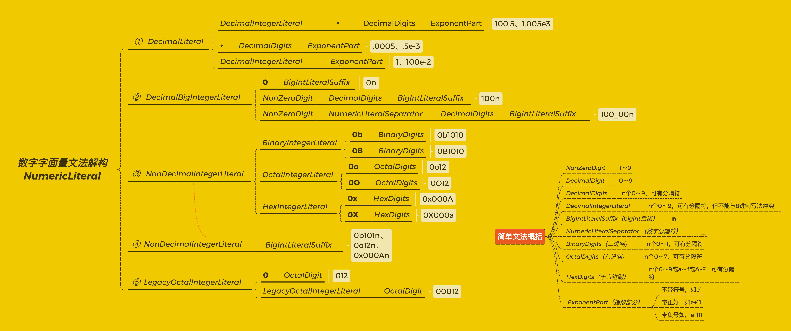

# 文法基础

点开标准的[附录A](https://tc39.es/ecma262/multipage/grammar-summary.html#sec-grammar-summary)，你会看到一大串这样犹如"摩斯密码"一般的东西：


这是ECMAScript的文法（grammer）汇总。

**文法用来定义语言的合法结构。** 举两个最简单的例子，null字面量[NullLiteral](https://tc39.es/ecma262/multipage/ecmascript-language-lexical-grammar.html#sec-null-literals)与布尔字面量[BooleanLiteral](https://tc39.es/ecma262/multipage/ecmascript-language-lexical-grammar.html#sec-boolean-literals)：


把上面null字面量的文法“翻译”过来是这样的：

> null字面量由4个连续的字母构成，这4个字母在Unicode字符集对应的码点分别是：U+006E（n）、U+0075（u）、U+006C（l）、U+006C（l）。其他的字符序列都不能构成null字面量，如"NULL"、"n ull"、nvll"、"nu11"。

同理，把布尔字面量的文法（简化地）翻译过来是这样的：

> 布尔字面量有两种可能的组成，一种是"true"，另一种"false"。

<br />

能够读懂文法是非常有必要的。

首先，如果你想读懂标准，文法是一个绕不开坎。其次，阅读文法实际上是一个非常有意思的过程，正如我在本节后面会为你展示的一样，在阅读文法的过程中你常常会发现一些不为人知的语言细节，说不定哪一天你自己也可以写一本《你所不知道的JS》给大家看。最后，如果你想玩点高级的东西，比如做个解析器、转译器，那你更得掌握文法了。

关于文法的内容，我会使用两个章节来完成。

本节，我会先用一半的篇幅讲文法的基本理解规则，包括基础的概念以及整体的模型。剩余的另一半则讲文法的表示约定，即文法中那些花花绿绿的小东西，都代表了什么含义。在下一节[5.文法汇总](./5.grammar-summary.md)，我会讲文法在语法解析上的应用，并对标准中所有的文法做一次“总览”。

相信经过这两个章节，能帮助你无障碍地阅读标准的文法。


<br/>


### 目录:

- [文法的基本理解规则](#文法的基本理解规则)

- [文法的表示约定](#文法的表示约定)

  * [文法参数](#文法参数)
<br/>


## 文法的基本理解规则

为了更好地沟通，我们需要先定义一些与文法相关的基本概念（术语），下图是[数字字面量](https://tc39.es/ecma262/multipage/ecmascript-language-lexical-grammar.html#sec-literals-numeric-literals)的文法片段：


这里我标出了与文法相关的重要概念：

- **产生式（production）** ：由一个分隔符号（这里是`::`）、分隔符号左侧的目标符、分隔符号右侧一条或多条代换式组成。表示左侧的目标符可以由右侧的任意一条代换式构成。在这张图中，一共出现了4条产生式。

- **目标符（goal symbol）** ：位于分隔符号的左侧，表示产生式的目标结果。在ECMAScript使用的文法类型中，每条产生式都有且只有一个目标符。在这张图中，从上往下依次是：

  - [NumericLiteralSeparator](https://tc39.es/ecma262/multipage/ecmascript-language-lexical-grammar.html#prod-NumericLiteralSeparator)：表示数字字面量分隔符；

  - [NumericLiteral](https://tc39.es/ecma262/multipage/ecmascript-language-lexical-grammar.html#prod-NumericLiteral)：数字字面量；

  - [DecimalBigIntegerLiteral](https://tc39.es/ecma262/multipage/ecmascript-language-lexical-grammar.html#prod-DecimalBigIntegerLiteral)：表示十进制bigInt字面量；

  - [NonDecimalIntegerLiteral](https://tc39.es/ecma262/multipage/ecmascript-language-lexical-grammar.html#prod-NonDecimalIntegerLiteral)：非十进制整数字面量。

- **代换式（alternative）** ：位于分隔符号的右侧，每条代换式由任意数量的终结符与非终结符组成，不同的代换式通过换行来进行区分。每条代换式都表示目标符的一种合法构成。比如在图中，橙色框圈出的产生式，一共有5条代换式，用以表示数字字面量有5种大的合法结构：

  - 十进制数字：[DecimalLiteral](https://tc39.es/ecma262/multipage/ecmascript-language-lexical-grammar.html#prod-DecimalLiteral)
  - 十进制BigInt：[DecimalBigIntegerLiteral](https://tc39.es/ecma262/multipage/ecmascript-language-lexical-grammar.html#prod-DecimalBigIntegerLiteral)
  - 非十进制数字：[NonDecimalIntegerLiteral](https://tc39.es/ecma262/multipage/ecmascript-language-lexical-grammar.html#prod-NonDecimalIntegerLiteral)
  - 非十进制BigInt：[NonDecimalIntegerLiteral](https://tc39.es/ecma262/multipage/ecmascript-language-lexical-grammar.html#prod-NonDecimalIntegerLiteral) [BigIntLiteralSuffix](https://tc39.es/ecma262/multipage/ecmascript-language-lexical-grammar.html#prod-BigIntLiteralSuffix)
  - 老式的八进制写法：[LegacyOctalIntegerLiteral](https://tc39.es/ecma262/multipage/ecmascript-language-lexical-grammar.html#prod-LegacyOctalIntegerLiteral)

- **终结符（terminal)）** ：表示没有产生式的元素，无法继续“展开”，在标准中使用黑色粗体表示。图中终结符只出现了两次：一次是[NumericLiteralSeparator](https://tc39.es/ecma262/multipage/ecmascript-language-lexical-grammar.html#prod-NumericLiteralSeparator)中的下划线`_`，另一次是[DecimalBigIntegerLiteral](https://tc39.es/ecma262/multipage/ecmascript-language-lexical-grammar.html#prod-DecimalBigIntegerLiteral)第一条代换式中的`0`。实际上，我们开篇用来举例的布尔字面量与null字面量，其代换式都完全由终结符组成的。

- **非终结符（nonterminal）** ：表示带有产生式的元素，在标准中使用斜体表示，点击对应的非终结符会自动跳转到其产生式上。位于产生式右侧的非终结符可以继续“展开”，“展开”的过程就是把该非终结符替换成其产生式的所有代换式。如下图所示：

  

如果我们重复地将产生式右侧所有的非终结符“展开”，我们就能穷尽目标符所有的合法结构。于是，当我对数字字面量[NumericLiteral](https://tc39.es/ecma262/multipage/ecmascript-language-lexical-grammar.html#prod-NumericLiteral)应用这个过程，我得到了一张数字字面量文法的“解构图”：



在这张图中，虚线大括号`{`表示一个非终结符的展开，大括号内每一条分支都是该非终结符的代换式，白色框为对应代换式的一些实例。（基于可读性考虑，图中并没有展开所有非终结符，你可以从“简单文法概括”中看到那些未展开的非终结符的含义。）

于是，从每一条分支上面，你可以得到关于数字字面量不同的合法结构：

- ①十进制数字：允许纯数字：`100.5`、`1`；也允许以小数点开头：`.0005`；还允许使用指数e：`100e-2`、`.5e-3`；


- ②十进制bigInt：不允许有小数点，也不允许使用指数e，且必须在数字后面添加`n`，如`0n`、`100n`；


- ③非十进制整数，包括：

  - 二进制整数：在二进制数字（0和1）前面在`0b`或`0B`：`0b1010`、`0B1010`；

  - 八进制整数：在八进制数字（0～7）前面加`0o`或`0O`：`0o12`、`0O12`；

  - 十六进制整数：在十六进制数字（0～9与Aa~Ff）前面加`0x`或`0X`：`0x000A`、`0X000a`；


- ④非十进制bigInt：与非十进制整数一样，只是后面需要多加一个`n`：`0b1010n`、`0o12n`、`0x000An`;


- ⑤老式的8进制：在八进制数字前面加0来表示8进制：如`012`、`00012`，现在这种写法已经不被推荐了。

从我们解构的结果我们还可以发现另一个有趣的事情：即数字是可以有[分隔符](https://tc39.es/ecma262/multipage/ecmascript-language-lexical-grammar.html#prod-NumericLiteralSeparator)的，用以增加数字的可读性（这是一个es2021的[特性](https://github.com/tc39/proposal-numeric-separator)）。在生活中，我们常用逗号分隔数字，如"999,999,999"，而在ECMAScript中，分隔符用下划线`_`表示：

```js
1_000_000_000；// 十进制
0b1010_0001_1000_0101; // 二进制
0xA0_B0_C0; //十六进制
1_000_000_000_000n // bigint
0o1234_5670 // 八进制
```

<br />

像这样的解构方式，是非常有意思的，你完全可以自己没事就在标准中找两个文法玩玩。前面我们举的都是字面量这种例子，但别看例子简单，你已经把文法最核心的部分掌握了。不信？我换一个你可能以为会更加复杂的例子 —— [class声明语句](https://tc39.es/ecma262/multipage/ecmascript-language-functions-and-classes.html#sec-class-definitions)：


class声明语句的文法实际上比数字字面量简单多了：

- 它主要的组成就是一个终结符（`class`），一个表示class名的非终结符（[BindingIdentifier](https://tc39.es/ecma262/multipage/ecmascript-language-expressions.html#prod-BindingIdentifier)），还有一个表示剩余部分的非终结符（[ClassTail](https://tc39.es/ecma262/multipage/ecmascript-language-functions-and-classes.html#prod-ClassTail)）；
- ClassTail又主要分为两个部分：表示class继承的部分（[ClassHeritage](https://tc39.es/ecma262/multipage/ecmascript-language-functions-and-classes.html#prod-ClassHeritage)）以及表示class主体的部分（[ClassBody](https://tc39.es/ecma262/multipage/ecmascript-language-functions-and-classes.html#prod-ClassBody)）；
- ClassBody可以包含多个class元素（[ClassElement](https://tc39.es/ecma262/multipage/ecmascript-language-functions-and-classes.html#prod-ClassElement)），而ClassElement主要可以分为5种，没了。

有了这层基础，我们就可以在图中两个框出的部分挖掘出一些有意思的东西。

表示class继承部分的目标符是[ClassHeritage](https://tc39.es/ecma262/multipage/ecmascript-language-functions-and-classes.html#prod-ClassHeritage)。我们从其产生式（下图左侧）可以看到，该产生式只有一条代换式，由一个终结符`extends`以及一个的非终结符[LeftHandSideExpression](https://tc39.es/ecma262/multipage/ecmascript-language-expressions.html#prod-LeftHandSideExpression)组成。从目标符`LeftHandSideExpression`的产生式（下图右侧）我们可以看到，它有3条代换式，分别是：[NewExpression](https://tc39.es/ecma262/multipage/ecmascript-language-expressions.html#prod-NewExpression)、[CallExpression](https://tc39.es/ecma262/multipage/ecmascript-language-expressions.html#prod-CallExpression)、[OptionalExpression](https://tc39.es/ecma262/multipage/ecmascript-language-expressions.html#prod-OptionalExpression)。


基于这个产生式的信息我们可以得知，以下的继承语句都是合法的：

1. 继承一个new表达式（NewExpression）：

   ```js
   class SubClass {
       constructor(){
           return Array
       }
   }
   
   class Test extends new SubClass {
     // ...
   }
   ```

2. 继承一个函数调用表达式（CallExpression）：

   ```js
   const getArrayConstructor = () => Array
   class Test extends getArrayConstructor(){
     // ...
   }
   ```

3. 继承一个可选表达式（OptionalExpression）：

   ```js
   class Test extends window?.Array {
     // ...
   }
   ```

<br />

表示class元素的目标符则是[ClassElement](https://tc39.es/ecma262/multipage/ecmascript-language-functions-and-classes.html#prod-ClassElement)，我们可以从其产生式看到所有的元素类型，分别是方法、静态方法、字段、静态字段、class静态块（ClassStaticBlock）。静态块是es2022的新特性，我在[2.标准的迭代](./2.evolution.md#标准的迭代流程)为你展示过这个特性是如何一步一步进入标准的。


沿着字段产生式[FieldDefintion](https://tc39.es/ecma262/multipage/ecmascript-language-functions-and-classes.html#prod-FieldDefinition)（下图），我们又发现字段还可以分为两类：属性字段与私有字段。私有字段也是es2022的特性，其产生式[PrivateIdentifier](https://tc39.es/ecma262/multipage/ecmascript-language-lexical-grammar.html#prod-PrivateIdentifier)告诉我们私有字段是以`#`开头的：


如果你按照这个方式查看方法的产生式[MethodDefinition](https://tc39.es/ecma262/multipage/ecmascript-language-functions-and-classes.html#prod-MethodDefinition)，你会发现方法也是可以私有的。

根据以上，我们可以总结得知，es2022有以下新的类元素：

```js
class Example {
    static #staticPrivateField = 1 // 静态私有字段
    #instancePrivateField = 2 // 私有字段
    static #staticPrivateMethod = 3 // 静态私有方法
    #instancePrivateMethod = 4 // 私有方法
    static { // 静态块
        console.log(this.#staticPrivateField) // 1
    }
}
console.log(Example.#staticPrivateField) // 报错，私有元素不能在外部访问
```

 <br />

以上，就是关于ECMAScript文法的基本概念以及它的构建模型。这整一套模型实际上是有一个名字的，叫作 —— **上下文无关文法（context-free grammars）** 。在语言学中，把语言分为自然语言和形式语言，形式语言又可以根据文法的严格程度从小到大进一步分类为“无限制文法”、“上下文相关文法”、“上下文无关文法”以及“正则文法”，大多数编程语言使用的文法，包括ECMAScript，都属于上下文无关文法。


<br />

在上面的内容中，我基本上忽略了所有文法中花花绿绿的字眼，这是一种关注点分离的策略。现在你已经掌握了文法基本框架，我们可以开始把注意力放在文法的符号表示规则上面了。


<br/>


## 文法的表示约定

你可能曾经听说过“BNF“，它是一套用来表示上下文无关文法的规则。ECMAScript则使用的是[自己定制的EBNF](https://tc39.es/ecma262/multipage/notational-conventions.html#sec-grammar-notation)，一个BNF的扩展版本。它与BNF一样是基于上下文无关文法的产生式、终结符、非终结符等概念构建的，区别只是根据标准自己的需求新增了一些表示方式以及调整了符号的具体含义。

我们在前面举了数字字面量与class声明语句两个文法的例子，从这里面我们已经可以看到一些基本的表示规则：

- 使用「**粗体**」表示终结符，使用「*斜体*」表示非终结符，点击非终结符可以跳转到其产生式上。

- 使用黄色的后缀“`opt`”表示元素为可选，比如下面的文法中，表示十进制数字的指数部分是可选的：

  

- 使用粗体「**one of**」表示其中之一：

  

- 当产生式右端出现与目标符同样的非终结符，表示这是一条递归产生式，递归产生式可以无限展开。比如下面的文法表示ClassElementList（理论上）可以包含无限个ClassElement：

  

- 使用`:`作为分隔符号表示句法文法，使用`::`表示词法文法，使用`:::`表示一个特殊的数字字符串字面量的文法[StringNumericLiteral](https://tc39.es/ecma262/multipage/abstract-operations.html#prod-StringNumericLiteral)。是的，文法可以分为句法文法与词法文法，class声明语句是句法文法，数字字面量是词法文法。关于文法的分类，我们会在[5.文法汇总](./5.grammar-summary.md)中进行更加深入的探讨。

<br />

其他的一些基本表示规则如下所示：

- 使用「but not」表示“排除”。如[标识符的产生式](https://tc39.es/ecma262/multipage/ecmascript-language-expressions.html#prod-Identifier)，意思是除保留字以外，所有的标识符名称都可以作为标识符使用。

  

- 使用`[empty]`表示即没有终结符也没有非终结符。如[参数arguments产生式](https://tc39.es/ecma262/multipage/ecmascript-language-functions-and-classes.html#prod-FormalParameters)的其中一条代换式，表示参数可以为空：

  

- 使用`[no LineTerminator here]`表示这个区域不允许有行终结符（如换行符号）。如[更新表达式](https://tc39.es/ecma262/multipage/ecmascript-language-expressions.html#sec-update-expressions)：

  

  因此，以下的代码不能构成一条更新表达式：

  ```js
  var a = 1
  a 
   ++;
  ```

  但以下的代码却可以（因为以`++`开头的代换式中没有插入`[no LineTerminator here]`）：

  ```js
  var a = 1
  ++ 
    a;
  ```

- 有的产生式会使用自然语言来描述，此时会使用sans-serif字体。如[源字符的产生式](https://tc39.es/ecma262/multipage/ecmascript-language-source-code.html#sec-ecmascript-language-source-code)，表示所有Unicode字符集的码点（U+0000～U+10FFFF）都可以作为源字符使用。

  

- 有时候在文法中，你会在代换式中看到`lookahead`这个词，表示代换式中紧随部分的限制，这个东西也称为前瞻限制（Lookahead Restrictions）。

  - `[lookahead = seq]`：表示代换式中，该位置后面紧跟着的词必须是seq。

  - `[lookahead ∈ set]`：set是一个有限集合，表示该位置后面紧跟着的词必须属于set。

  - `[lookahead ≠ seq]`：表示代换式中，该位置后面紧跟着的词不能是seq。

  - `[lookahead ∉ set]`：表示该位置后面紧跟着的词必须不属于set。

  比如，可选链标点符号`?.`的[产生式](https://tc39.es/ecma262/multipage/ecmascript-language-lexical-grammar.html#prod-OptionalChainingPunctuator)，这里的前瞻限制表示符号后面不允许跟十进制数字：

  

  所以，以下的代码会报错：

  ```js
  var a = []
  a?.1; // 报错
  a?.[1] // 正确访问方式
  ```


关于文法表示规则，我们只剩下最后一个内容 —— 文法参数（grammatical parameters），即文法中那些使用`[]`括住的绿色小字。如果你是第一次阅读本书，或对这些文法参数没有太大兴趣，我建议你直接跳过下面的部分，进行后面章节的阅读。因为一方面这个东西讲起来有点复杂，另一方面，它并不会影响我们对标准理解的大方向。你完全可以等到你对文法足够熟悉的时候，再来看这部分的内容。


<br/>


### 文法参数

要全面地讲完文法参数需要花费很大的篇幅，插入非常多的例子，我不打算这么做。我这里给你提供一条理解的“捷径”，这条“捷径”覆盖了很多的情况，但并不是全部。想要无死角理解文法参数，需要你阅读标准对文法参数的[解释](https://tc39.es/ecma262/multipage/notational-conventions.html#sec-grammatical-parameters)以及自己在实际阅读文法的时候进行不断的练习。

我先为你总结一下标准中的主要文法参数的含义：

- seq：表示是否可以使用数字分隔符；
- await：表示是否可以使用await语句；
- yield：表示是否可以使用yield语句；
- in：表示in是in操作符还是`for...in...`语句中的「in」；
- default：表示是否可以使用无名函数/类；
- return：表示是否可以使用return语句；

当文法参数在产生式右侧的非终结符上使用时，它会有带有一些符号：

- ”+“：表示非终结符带有该参数
- ”~“：表示非终结符不带有该参数
- ”？“：如果目标符有该参数，那么非终结符中也有，否则没有。

我还是先从我们已经非常熟悉的数字字面量开始举例 —— 十进制数字字面量：


`[+Sep]`表示这些非终结符都可以使用数字分隔符，所以下面的数字都是合法的：

```js
100.100_100e100_100;
.100_100e100_100;
100_100e100_100;
```

然后我们看一个反例 —— [码点的产生式](https://tc39.es/ecma262/multipage/ecmascript-language-lexical-grammar.html#prod-NotCodePoint)：


`[~Sep]`表示这些非终结符不可以使用数字分隔符，所以这条产生式表示码点是由无数字分隔符的16进制数字组成的：

```js
"\u0061" // 字符"a"的码点
"\u00_61" // 报错：Uncaught SyntaxError: Invalid Unicode escape sequence
```

我们点进去看这个码点产生式中的非终结符 —— [HexDigits](https://tc39.es/ecma262/multipage/ecmascript-language-lexical-grammar.html#prod-HexDigits)：


我们先看第二条代换式：`[?Sep]`表示能否使用数字分隔符取决于它的目标符。当目标符HexDigits作为码点使用的时候，不带有参数Sep，也因此不能使用数字分隔符；但当HexDigits作为数字字面量使用时，则带有参数Sep，也因此可以使用数字分隔符。

然后我们再看第三条代换式，当文法参数放在代换式左侧时，它的符号意义与放在非终结符上是不一样：

- `+`：表示如果目标符带有该参数，那么这条代换式就存在，否则不存在；
- `~`：表示如果目标符不带有该参数，那么这条代换式存在，否则不存在；

<br />

我们再来看一些其他文法参数的例子：

比如，ECMAScript[普通脚本的产生式Script](https://tc39.es/ecma262/multipage/ecmascript-language-scripts-and-modules.html#sec-ecmascript-language-scripts-and-modules)如下所示。在这里，文法参数`[~Yield, ~Await, ~Return]`出现在元素右端，表示的是：在程序的顶层代码中，不能使用await、yield、return语句。此时await，yield会被当作普通标识符使用：


所以，以下代码中，前两句是合法的，第三句会报错：

```html
<script>
    let yield = 1;
    let await = 2;
    return yield // ❌ Uncaught SyntaxError: Illegal return statement
</script>
```

与其相对应的是[模块脚本的产生式Module](https://tc39.es/ecma262/multipage/ecmascript-language-scripts-and-modules.html#sec-modules)，模块产生式中的文法参数`[~Yield, +Await, ~Return]`表示：yield依旧被当作普通标识符使用，并且也不能使用return语句；但在这里，`+Await`表示模块的顶层代码中，await会被当作关键字使用，所以模块代码可以使用顶层await语句（如果你不知道，这是一个新特性）。


所以，以下的代码是合法的：

```html
<script type="module">
    await Promise.resolve()
</script>
```

以下的代码是非法的：

```html
<script type="module">
    // 尝试把await以标识符使用
    let await = 1 // ❌ Uncaught SyntaxError: Unexpected reserved word
</script>
```

尽管顶层代码都不允许使用return语句，只要出现函数，函数体内就可以允许使用return语句了，我们可以从[函数声明语句的文法](https://tc39.es/ecma262/multipage/ecmascript-language-functions-and-classes.html#sec-function-definitions)中看到这一点：


