# 语法解析与文法总览

[上一节](./4.context-free-grammar.md)，我们讲了文法的基础。有了文法，我们就能够像js引擎一样对代码进行「语法解析」。实际上，语法解析不仅仅用在Js引擎上，我们日常开发中使用的很多工具，都是基于对代码进行语法解析后实现的：

- minifier：识别并删除代码中不影响语义的空格、换行符、注释，以减少文件大小。
- compressor：识别代码中的标识符（变量名），用更短的词替换标识符的名字，以减少文件大小。
- 语法高亮：识别代码中不同类型的词，给不同类型的词上不同的颜色。
- transpiler：转译器，可用于同一语言不同版本的转换(es10 -> es6)，也可以用于不同语言之间的转换（jsx -> js）。

本节，我会先为你展示文法的应用 —— 语法解析的过程，并且给你提供一个方法，让你可以可视化任意程序语法解析的结果。剩余的部分，我会为你对ECMAScript的文法进行一次总览，从而让你看到语言的整体轮廓。


<br/>


### 目录:

- [语法解析的过程](#语法解析的过程)

  * [词法分析](#词法分析)

  * [句法分析](#句法分析)

- [可视化解析树](#可视化解析树)

- [文法概览](#文法概览)

  * [脚本与模块](#脚本与模块)

  * [函数与类的声明语句](#函数与类的声明语句)

  * [普通语句与声明语句](#普通语句与声明语句)

  * [表达式](#表达式)

  * [输入元素](#输入元素)
<br/>


## 语法解析的过程

我们这本书叫做：

> 人人都能读标准

如果我们对这句话做语法解析，大致会经历这样的过程：

1. 词法分析：把这个句子拆解成不同的词： 
   - “人人” —— 代词；
   - “都能” —— 能愿动词；
   - “读” —— 动词；
   - “标准” —— 名词。
2. 句法分析：看看上面得到的词可以“套”进怎样的句子结构中。由于代词能充当主语，“能愿动词+动词”能充当谓语，名词能充当宾语，于是，这些词组合起来便构成了典型的“主谓宾”结构；所以，这是一个合法的句子！

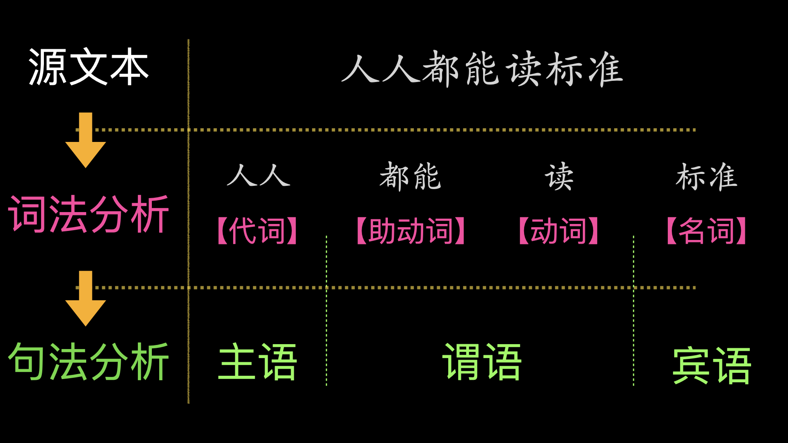

<br />

**ECMAScript的语法解析也是包含这两个主要过程：词法分析 -> 句法分析。词法分析的目的是为了确定句子中词的类型，不同的词的组合会构成不同的语句；句法分析的目的是为了确定语句的类型，不同类型的语句能够表达不同的语义。** 

我们把“人人都能读标准”翻译成js代码：

```js
everyoneCanReadSpec = true
```

如果对这行代码进行语法解析，一个简化的过程会如下图所示：

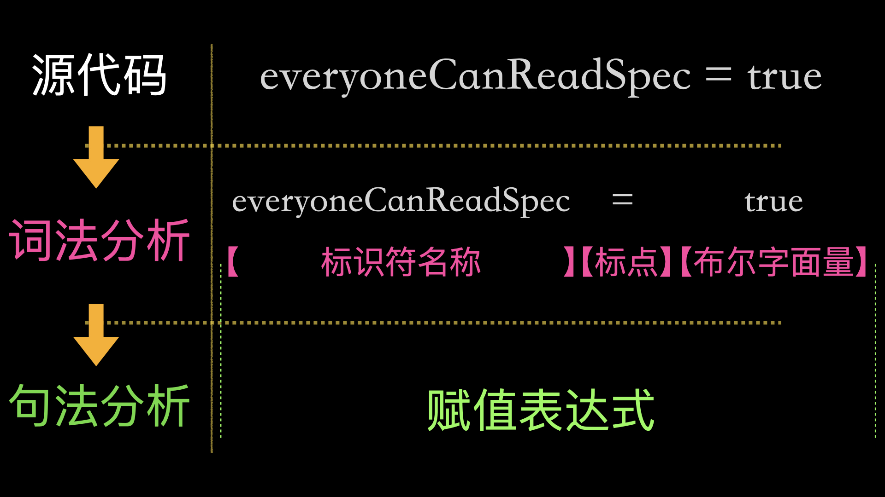


<br/>


### 词法分析

在ECMAScript中，词法分析的过程是基于**词法文法（lexical grammer）** ，把源代码拆解成一连串的**输入元素（input elements）** 。

**词法文法定义了语言中不同类型的输入元素由怎样的字符序列构成，这些输入元素是语言的最小合法组成。** 我们在上一节提到的布尔字面量、null字面量、数字字面量，他们的文法都属于词法文法。

在标准中，所有的词法文法都在[第12章](https://tc39.es/ecma262/multipage/ecmascript-language-lexical-grammar.html#sec-ecmascript-language-lexical-grammar)进行了定义。我们在那儿可以总结得到，ECMAScript主要的输入元素类型包括：

- [空格](https://tc39.es/ecma262/multipage/ecmascript-language-lexical-grammar.html#prod-WhiteSpace)
- [行终结符](https://tc39.es/ecma262/multipage/ecmascript-language-lexical-grammar.html#prod-LineTerminator)
- [注释](https://tc39.es/ecma262/multipage/ecmascript-language-lexical-grammar.html#prod-Comment)
- [tokens](https://tc39.es/ecma262/multipage/ecmascript-language-lexical-grammar.html#sec-tokens)，tokens又可以进一步分为：
  - [标识符名称（identifierName）](https://tc39.es/ecma262/multipage/ecmascript-language-lexical-grammar.html#prod-IdentifierName)
  - [字面量（literals）](https://tc39.es/ecma262/multipage/ecmascript-language-lexical-grammar.html#sec-ecmascript-language-lexical-grammar-literals)
  - [标点符号](https://tc39.es/ecma262/multipage/ecmascript-language-lexical-grammar.html#sec-punctuators)
  - [字符串模版](https://tc39.es/ecma262/multipage/ecmascript-language-lexical-grammar.html#prod-Template)

你可以点击链接看到这些输入元素的词法文法，绝大多数词法文法都非常简单。

于是，通过词法分析，`everyoneCanReadSpec = true`实际上会被拆解成以下的输入元素：

| 序号 | symbols               | 输入元素类型                                                 |
| ---- | --------------------- | ------------------------------------------------------------ |
| 1    | "everyoneCanReadSpec" | [标识符名称](https://tc39.es/ecma262/multipage/ecmascript-language-lexical-grammar.html#prod-IdentifierName) |
| 2    | " "                   | [空格](https://tc39.es/ecma262/multipage/ecmascript-language-lexical-grammar.html#sec-white-space) |
| 3    | "="                   | [标点符号](https://tc39.es/ecma262/multipage/ecmascript-language-lexical-grammar.html#sec-punctuators) |
| 4    | " "                   | [空格](https://tc39.es/ecma262/multipage/ecmascript-language-lexical-grammar.html#sec-white-space) |
| 5    | "true"                | [布尔字面量](https://tc39.es/ecma262/multipage/ecmascript-language-lexical-grammar.html#prod-BooleanLiteral) |


<br/>


### 句法分析

在ECMAScript中，句法分析是基于**句法文法（sytactic grammer）** 完成的。对于词法分析得到的输入元素，会根据代码的类型，使用相应的句法文法对这些输入元素进行解析，解析的过程就是尝试将这些输入元素“匹配”进对应的句法文法中。

**句法文法定义了语言中不同类型的语句是由怎样的子语句以及输入元素构成。** 句法文法的定义位于标准中的第13章～第16章，标准根据句法结构大小，对这些内容从小到大进行编排：

- 第13章：[表达式](https://tc39.es/ecma262/multipage/ecmascript-language-expressions.html#sec-ecmascript-language-expressions)
- 第14章：[普通语句与声明语句](https://tc39.es/ecma262/multipage/ecmascript-language-statements-and-declarations.html#sec-ecmascript-language-statements-and-declarations)
- 第15章：[函数与类](https://tc39.es/ecma262/multipage/ecmascript-language-functions-and-classes.html#sec-ecmascript-language-functions-and-classes)
- 第16章：[脚本与模块](https://tc39.es/ecma262/multipage/ecmascript-language-scripts-and-modules.html#sec-ecmascript-language-scripts-and-modules)

关于这些句法的内容，我会在下面[文法概览](#文法概览)的部分再作展开。

在句法分析的过程中，如果最终某些输入元素未能成功“匹配”，则表示源代码有语法错误。如果整个过程没有错误，最终会得到一颗**解析树**（parse tree；也称AST抽象语法树，本书将沿用标准的叫法）；**树上的每一个节点都是一个终结符或一个非终结符的实例。当某个节点是非终极符的实例时，该节点还有一系列的子节点，对应其产生式右端的符号。** 

比如，通过句法分析，前面的代码会得到一颗这样的解析树：

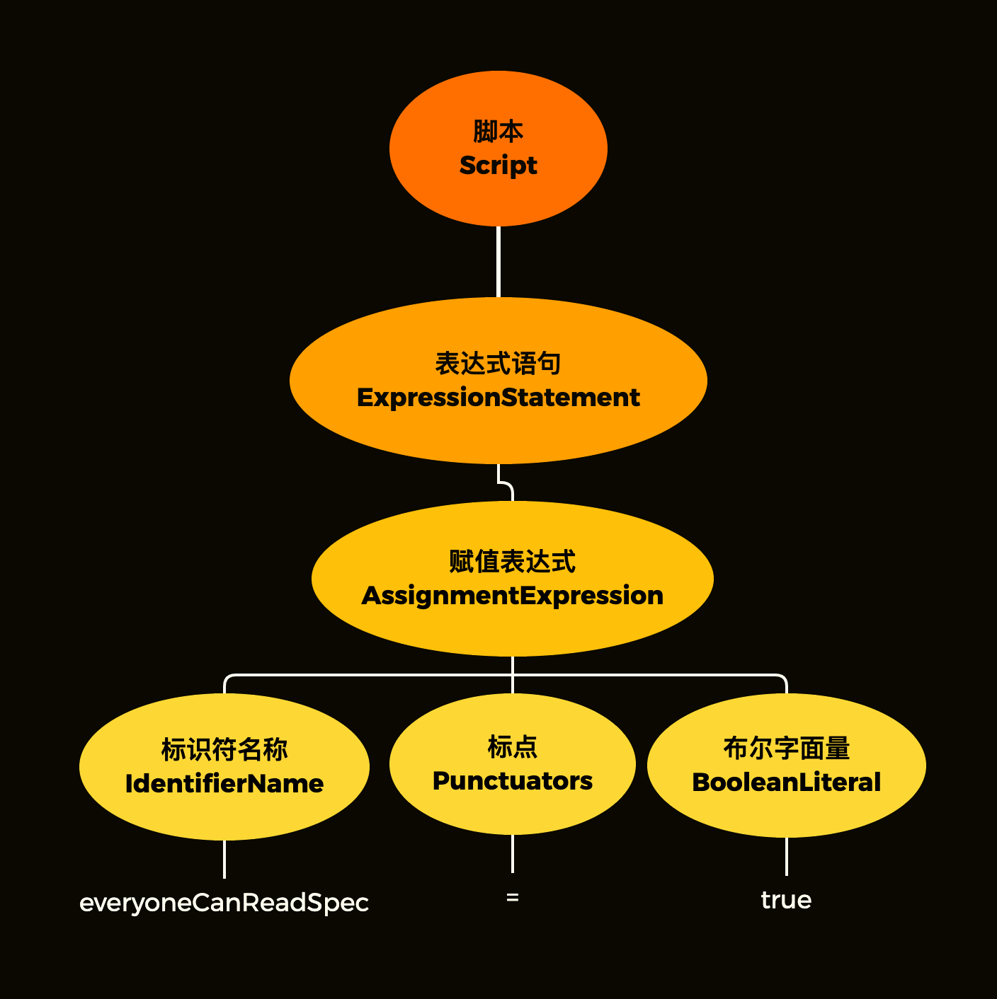

这颗树中，属于句法文法的非终结符实例有：[Script](https://tc39.es/ecma262/multipage/ecmascript-language-scripts-and-modules.html#prod-Script)、[ExpressionStatement](https://tc39.es/ecma262/multipage/ecmascript-language-statements-and-declarations.html#prod-ExpressionStatement)、[AssignmentExpression](https://tc39.es/ecma262/multipage/ecmascript-language-expressions.html#prod-AssignmentExpression)；属于词法文法的非终结符实例有：[IdentifierName](https://tc39.es/ecma262/multipage/ecmascript-language-lexical-grammar.html#prod-IdentifierName)、[Punctuators](https://tc39.es/ecma262/multipage/ecmascript-language-lexical-grammar.html#prod-Punctuator)、[BooleanLiteral](https://tc39.es/ecma262/multipage/ecmascript-language-lexical-grammar.html#prod-BooleanLiteral)。

得到解析树后，我们就可以使用解析树表达程序的语义，关于程序语义表达方式，将在[6.算法](./6.algorithm.md)当中为你介绍。


<br/>


## 可视化解析树

通过前面的例子你可以看出，**语法解析的本质：无非就是基于语言的文法，将代码解构成一颗能够表示程序结构的树。** 

我们再来看一个稍微复杂一点的例子：

```js
function lie(something){
  alert(something)
}
lie("我有浓密的头发！")
```

对这段程序解析得到的解析树如下图所示：

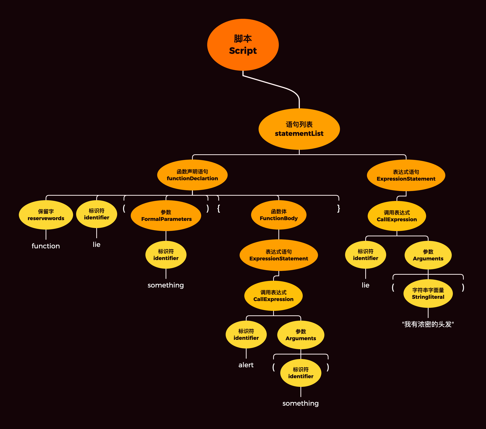

（不管是这颗解析树还是上面那颗解析树，为了展示的简洁性，都省略了一些无实际意义的中间过渡节点。）

你也可以使用一些js解析器在自己本地可视化解析树构建的结果，一个比较有名的js解析器是[acorn](https://github.com/acornjs/acorn)，它是babel的“御用“解析器。当你根据acorn仓库的[提示](https://github.com/acornjs/acorn/tree/master/acorn/#installation)完成配置后，你便可以通过以下的代码解析我们上面的那一段程序：

```js
let acorn = require("acorn");

console.log(JSON.stringify(acorn.parse(`
function lie(something){
  alert(something)
}
lie("我有浓密的头发！")
`, {ecmaVersion: 2020})));

//输出： {"type":"Program","start":0,"end":62,"body":[{"type":"FunctionDeclaration","start":1,"end":45,"id":{"type":"Identifier","start":10,"end":13,"name":"lie"},"expression":false,"generator":false,"async":false,"params":[{"type":"Identifier","start":14,"end":23,"name":"something"}],"body":{"type":"BlockStatement","start":24,"end":45,"body":[{"type":"ExpressionStatement","start":27,"end":43,"expression":{"type":"CallExpression","start":27,"end":43,"callee":{"type":"Identifier","start":27,"end":32,"name":"alert"},"arguments":[{"type":"Identifier","start":33,"end":42,"name":"something"}],"optional":false}}]}},{"type":"ExpressionStatement","start":46,"end":61,"expression":{"type":"CallExpression","start":46,"end":61,"callee":{"type":"Identifier","start":46,"end":49,"name":"lie"},"arguments":[{"type":"Literal","start":50,"end":60,"value":"我有浓密的头发！","raw":"\"我有浓密的头发！\""}],"optional":false}}],"sourceType":"script"}
```

把得到的结果贴到一个[把JSON转为树视图的工具](https://vanya.jp.net/vtree/)上，你就能看到一颗解析树的大致模样（`type`是节点的类型，`body`表示节点的子节点，`star`、`end`是节点在源代码中的头尾位置）：

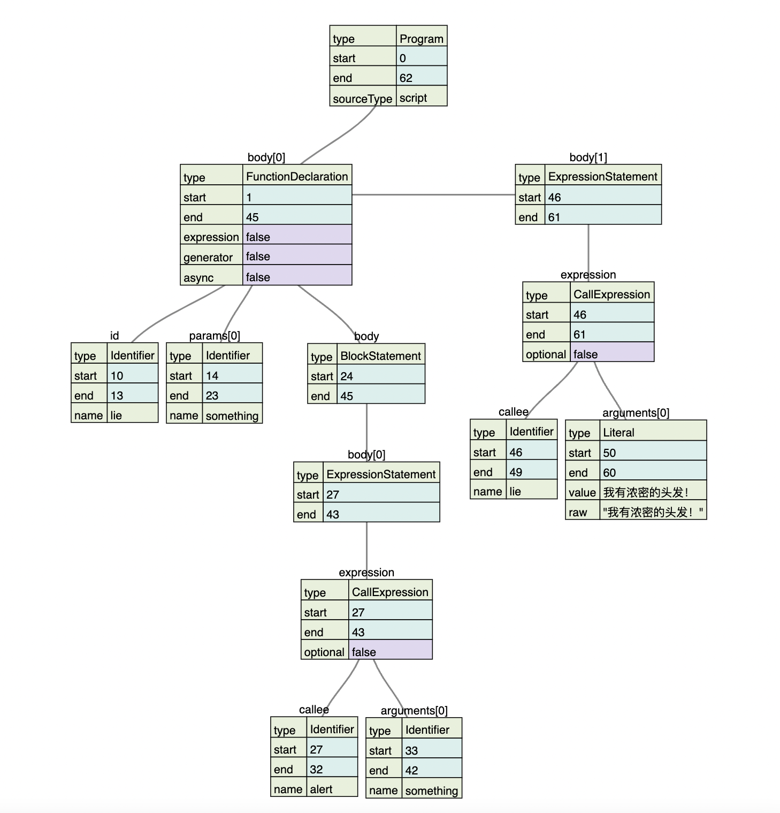

你也许会发现使用acorn解析出来的树跟我前面为你展示的有一点点差异。一是因为acorn会基于效率的考量，剔除掉了终结符以及一些过渡节点；二是因为，在一些文法上acorn没有采用最新标准的命名，这也许是出于软件兼容性的考量；不过这些都是无伤大雅问题。


<br/>


## 文法概览

到这里，关于文法的模型、文法的符号表示、文法在语法解析上的应用我们基本上已经讲完了。剩余的内容，我会对标准中的文法进行一次总览，一方面，你会看到ECMAScript语法的整个轮廓，这将进一步增加你对文法的认知；另一方面，这会让你对标准的结构有一个更加深入的了解，当你未来想要研究某个语句时，能够快速地找到对应的地方。

文法结构从大到小依次为：

- 脚本与模块
- 函数与类的声明语句
- 普通语句与声明语句
- 表达式
- 输入元素


<br/>


### 脚本与模块

标准的第16章定义了普通脚本[Script](https://tc39.es/ecma262/multipage/ecmascript-language-scripts-and-modules.html#sec-scripts)和模块脚本[Module](https://tc39.es/ecma262/multipage/ecmascript-language-scripts-and-modules.html#sec-modules)的产生式。Script和Module是启动语法解析的两个最常用的目标符。因此，当程序以普通脚本进行解析时，解析树的根节点为Script（如我们上面的例子一样）；当程序以模块脚本进行解析时，解析树的根节点为Module。

在HTML中，通过`type`属性标识语法解析使用的目标符：

```html
<script>
    // 这里的代码以Script作为目标符进行解析
</script>

<script type="module">
    // 这里的代码以Module作为目标符进行解析
</script>
```

从Script的产生式我们可以看出，普通脚本就是由一个语句列表（StatementList）构成的。

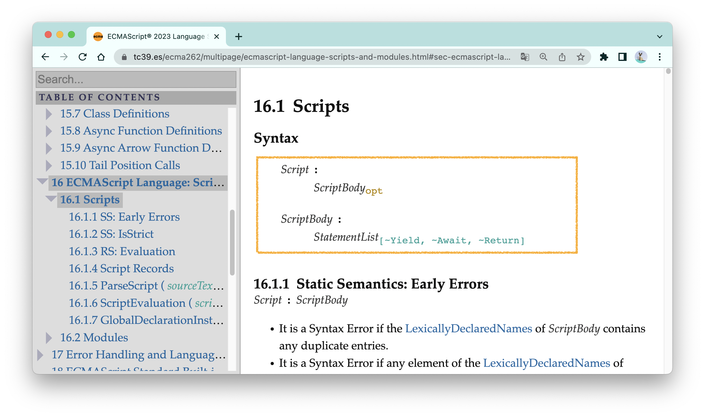

相比Script的产生式，Module相关产生式多了两个类型的语句 —— [ImportDeclaration](https://tc39.es/ecma262/multipage/ecmascript-language-scripts-and-modules.html#prod-ImportDeclaration)、[ExportDeclaration](https://tc39.es/ecma262/multipage/ecmascript-language-scripts-and-modules.html#prod-ExportDeclaration)：

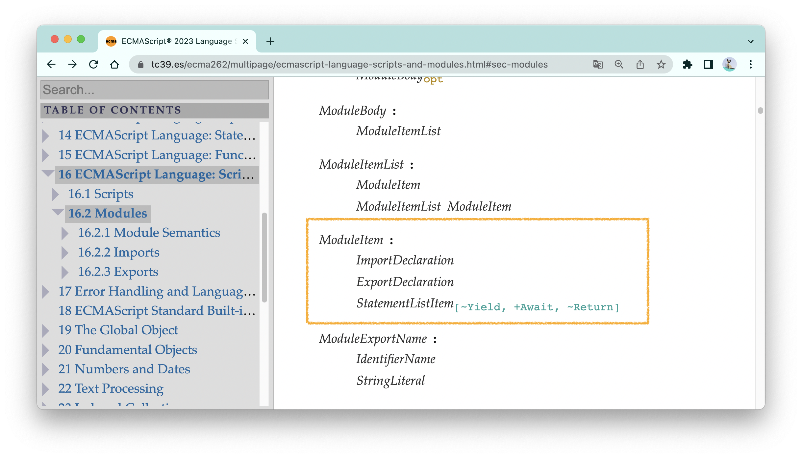

也因此，模块脚本支持import/export语句，但普通脚本不支持：

```html
<script>
    import "./test"
</script>
<!-- ❌ Uncaught SyntaxError: Cannot use import statement outside a module -->
```


<br/>


### 函数与类的声明语句

标准的[第15章](https://tc39.es/ecma262/multipage/ecmascript-language-functions-and-classes.html#sec-ecmascript-language-functions-and-classes)定义了函数与类声明语句的文法。

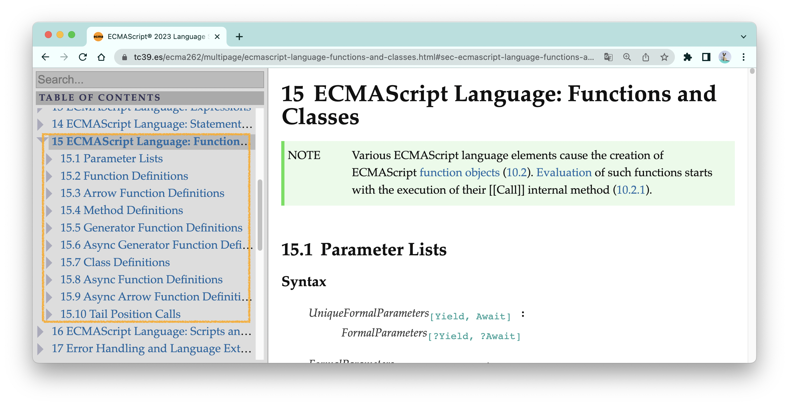

从目录中，我们就可以看到ECMAScript中，所有函数的类型：

| 文法：函数类型                                               | 示例                    |
| ------------------------------------------------------------ | ----------------------- |
| [普通函数](https://tc39.es/ecma262/multipage/ecmascript-language-functions-and-classes.html#sec-function-definitions) | `function a(){}`        |
| [箭头函数](https://tc39.es/ecma262/multipage/ecmascript-language-functions-and-classes.html#sec-arrow-function-definitions) | `() => {}`              |
| [对象方法](https://tc39.es/ecma262/multipage/ecmascript-language-functions-and-classes.html#sec-method-definitions) | `{a:function(){}}`      |
| [Generator函数](https://tc39.es/ecma262/multipage/ecmascript-language-functions-and-classes.html#sec-generator-function-definitions) | `function* a(){}`       |
| [AsyncGenerator函数](https://tc39.es/ecma262/multipage/ecmascript-language-functions-and-classes.html#sec-async-generator-function-definitions) | `async function* a(){}` |
| [Async函数](https://tc39.es/ecma262/multipage/ecmascript-language-functions-and-classes.html#sec-async-function-definitions) | `async function a(){}`  |
| [Async箭头函数](https://tc39.es/ecma262/multipage/ecmascript-language-functions-and-classes.html#sec-async-arrow-function-definitions) | `async () => {}`        |

函数和类是语言中非常重要的部分，关于函数和类的更多内容，我分别放在了应用篇的[14.函数](./14.function.md)、[15.类](./15.class.md)中。


<br/>


### 普通语句与声明语句

标准的[第14章](https://tc39.es/ecma262/multipage/ecmascript-language-statements-and-declarations.html#sec-ecmascript-language-statements-and-declarations)定义了普通语句与声明语句的文法。

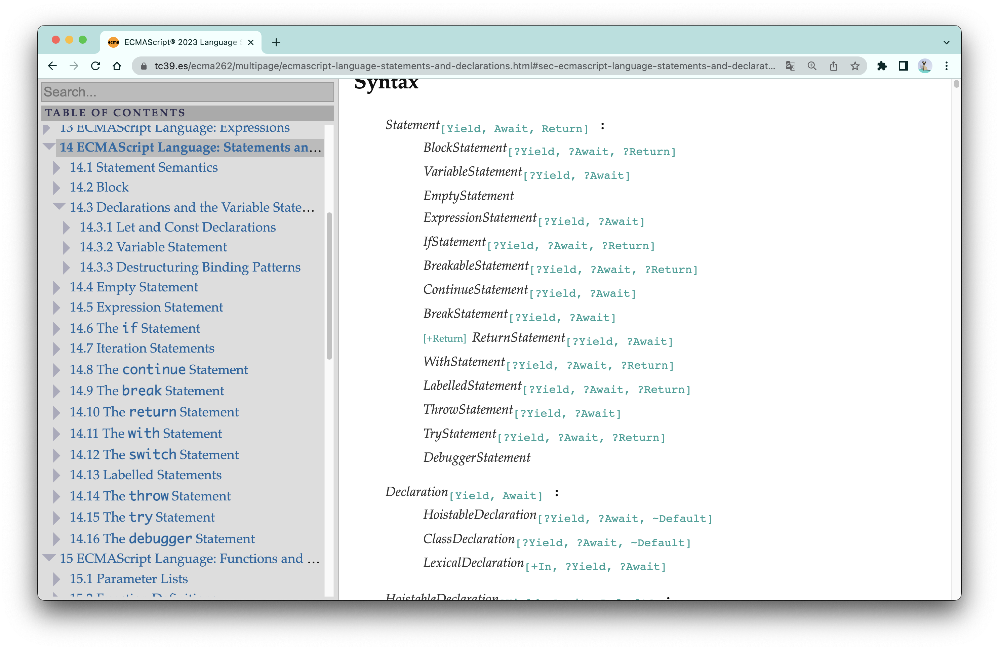

我们从普通语句产生式[Statement](https://tc39.es/ecma262/multipage/ecmascript-language-statements-and-declarations.html#prod-Statement)、声明语句产生式[Declaration](https://tc39.es/ecma262/multipage/ecmascript-language-statements-and-declarations.html#prod-Declaration)，可以总结出语言中所有的普通语句类型以及声明语句类型：

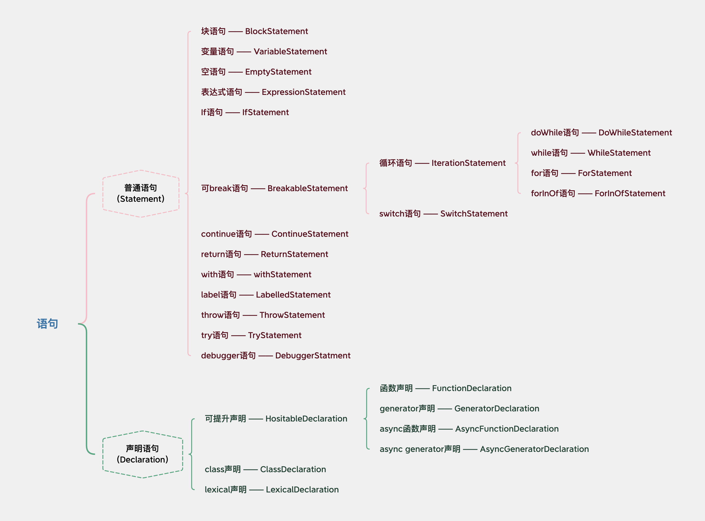

在声明语句中，有几个你可能会觉得奇怪的点：

- 表示使用`var`关键词进行声明的语句[VariableStatement](https://tc39.es/ecma262/multipage/ecmascript-language-statements-and-declarations.html#prod-VariableStatement)，是放在普通语句中而不是声明语句中；
- 许多函数类型的声明都单独归类在可提升声明[HoistableDeclaration](https://tc39.es/ecma262/multipage/ecmascript-language-statements-and-declarations.html#prod-HoistableDeclaration)中；
- 这里没有找到箭头函数的踪影。

`var`之所以留在普通语句中，是ECMAScript设计的遗留问题；这表示很多可以使用普通语句的地方，都可以使用var声明语句，比如下面：

```js
// while语句后面可以单独使用普通语句Statement
while(true) var a = 1

// 但while语句后面不允许单独使用声明语句Declaration
while(true) let a = 1 // ❌：Lexical declaration cannot appear in a single-statement context
```

而之所以许多函数类型都归类在可提升声明中，我相信你通过名字就能够知道它的意思。没错，HoistableDeclaration中的函数声明都是会提升的。这也同时意味着class声明与let/const声明没有提升的效果。在[9.作用域](./9.scope.md)中，我会对这一部分进行深入分析。

最后，没有箭头函数的踪影，这是因为箭头函数的声明文法是一个比语句更小的结构 —— 表达式，即我们下面要讲的内容。


<br/>


### 表达式

标准的[第13章](https://tc39.es/ecma262/multipage/ecmascript-language-expressions.html#sec-ecmascript-language-expressions)定义了表达式的文法。

表达式是比语句更小的一个语言结构，当表达式需要单独作为语句出现时，会以表达式语句[ExpressionStatement](https://tc39.es/ecma262/multipage/ecmascript-language-statements-and-declarations.html#sec-expression-statement)的形式出现，比如前面的两颗解析树中，调用表达式以及赋值表达式的父节点都是表达式语句。

第一眼看表达式的目录，你会觉得有点混乱：

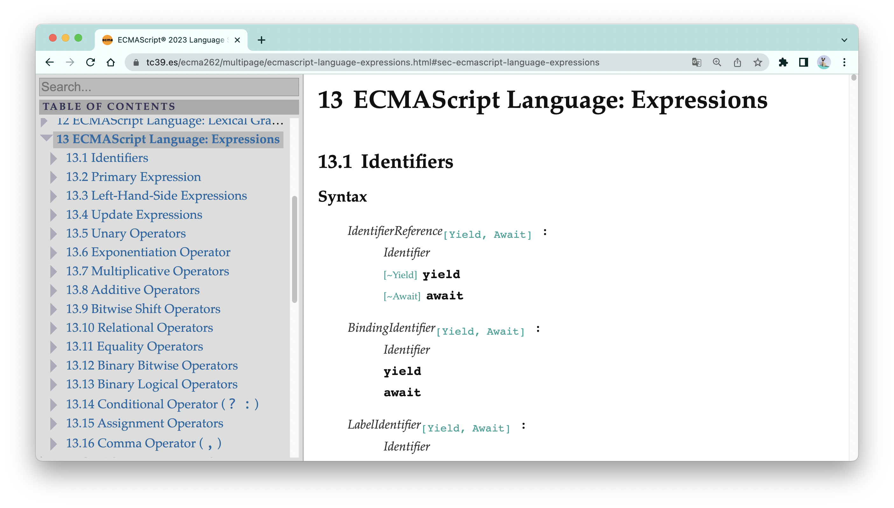

实际上，**这个目录是按照表达式的结构从小到大编排的**。一般来说，上一章节定义的表达式会作为下一章节定义的表达式的组成部分：

- 比如，[13.1 标识符引用](https://tc39.es/ecma262/multipage/ecmascript-language-expressions.html#sec-identifiers)可以作为[13.2 基础表达式](https://tc39.es/ecma262/multipage/ecmascript-language-expressions.html#sec-primary-expression)的组成部分：

  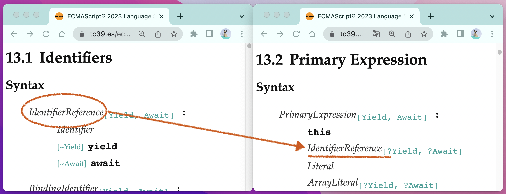

- 又比如，[13.7 乘法表达式](https://tc39.es/ecma262/multipage/ecmascript-language-expressions.html#sec-multiplicative-operators)可以作为[13.8 加法表达式](https://tc39.es/ecma262/multipage/ecmascript-language-expressions.html#sec-additive-operators)的组成部分：

  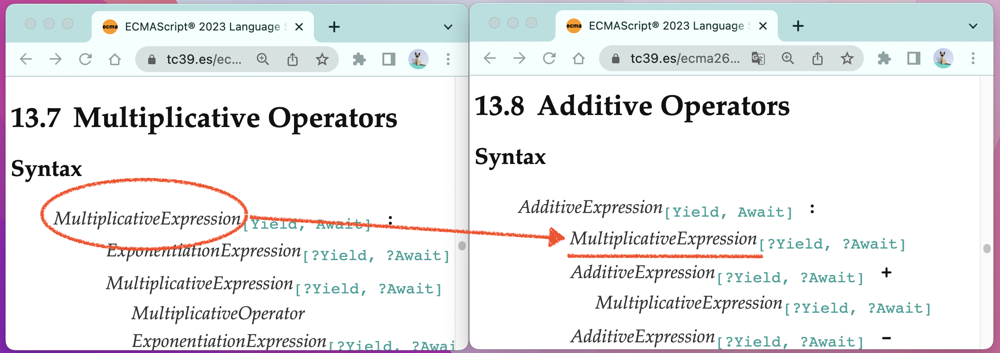

- [最后一节13.16](https://tc39.es/ecma262/multipage/ecmascript-language-expressions.html#sec-comma-operator)定义了结构最大的表达式Expression，它通过逗号`,`把其他表达式组合起来。

  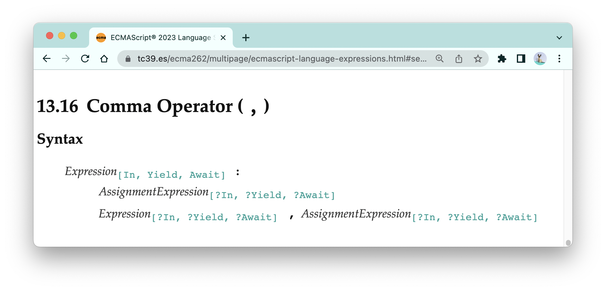

所有表达式的含义我用一张表为你总结了：

| 章节序号 | 表达式                                                       | 含义                                             |
| -------- | ------------------------------------------------------------ | ------------------------------------------------ |
| 13.1     | [IdentifierReference](https://tc39.es/ecma262/multipage/ecmascript-language-expressions.html#prod-IdentifierReference) | 标识符的表达式                                   |
| 13.2     | [PrimaryExpression](https://tc39.es/ecma262/multipage/ecmascript-language-expressions.html#prod-PrimaryExpression) | 基础表达式：包括标识符、对象字面量、函数表达式等 |
| 13.3     | [LeftHandSideExpression](https://tc39.es/ecma262/multipage/ecmascript-language-expressions.html#prod-LeftHandSideExpression) | 一般来说可以在运算符左侧使用表达式               |
| 13.4     | [UpdateExpression](https://tc39.es/ecma262/multipage/ecmascript-language-expressions.html#prod-UpdateExpression) | 运算符`++`、`--`构建的更新表达式                 |
| 13.5     | [UnaryExpression](https://tc39.es/ecma262/multipage/ecmascript-language-expressions.html#prod-UnaryExpression) | 运算符`+`、`-`、`~`、`!`等构建的一元表达式       |
| 13.6     | [ExponentiationExpression](https://tc39.es/ecma262/multipage/ecmascript-language-expressions.html#prod-ExponentiationExpression) | 运算法`**`构建的指数表达式                       |
| 13.7     | [MultiplicativeExpression](https://tc39.es/ecma262/multipage/ecmascript-language-expressions.html#prod-MultiplicativeExpression) | 运算符`*`、`/`、`%`构建的乘法表达式              |
| 13.8     | [AdditiveExpression](https://tc39.es/ecma262/multipage/ecmascript-language-expressions.html#prod-AdditiveExpression) | 运算符`+`、`-`构建的加法表达式                   |
| 13.9     | [ShiftExpression](https://tc39.es/ecma262/multipage/ecmascript-language-expressions.html#prod-ShiftExpression) | 运算符`<<`、`>>`、`>>>`构建的偏移表达式          |
| 13.10    | [RelationalExpression](https://tc39.es/ecma262/multipage/ecmascript-language-expressions.html#prod-RelationalExpression) | 运算符`>`、`<`、`>=`等构建的关系表达式           |
| 13.11    | [EqualityExpression](https://tc39.es/ecma262/multipage/ecmascript-language-expressions.html#prod-EqualityExpression) | 运算符`===`、`!=`等构建的相等表达式              |
| 13.12    | [BitwiseORExpression](https://tc39.es/ecma262/multipage/ecmascript-language-expressions.html#prod-BitwiseORExpression) | 运算符`&`、`^`、`|`构建的按位表达式              |
| 13.13    | [ShortCircuitExpression](https://tc39.es/ecma262/multipage/ecmascript-language-expressions.html#prod-ShortCircuitExpression) | 运算符`&&`、`||`、`??`构建的短路表达式           |
| 13.14    | [ConditionalExpression](https://tc39.es/ecma262/multipage/ecmascript-language-expressions.html#prod-ConditionalExpression) | 运算符`? :`构建的条件表达式                      |
| 13.15    | [AssignmentExpression](https://tc39.es/ecma262/multipage/ecmascript-language-expressions.html#prod-AssignmentExpression) | 运算符`=`、`&&=`、`||=`、`??=`等构建的赋值表达式 |
| 13.16    | [Expression](https://tc39.es/ecma262/multipage/ecmascript-language-expressions.html#prod-Expression) | 使用`,`构建的表达式                              |

从这里我们能看到，很多的表达式都是由不同的运算符构成的，而标准并没有任何章节定义这些运算符之间的优先级关系。**实际上，表达式结构的大小，暗示了表达式及其运算符执行的优先级顺序，结构较小的表达式有着更高的运算优先级。** 这是因为结构大的表达式包含着结构小的表达式，所以结构大的表达式必须先等到结构小的表达式执行完毕后再开始执行。

比如，我刻意设计了下面这一段代码，这段代码“串联”了上表中所有的表达式：

```js
0,  a = 1 ** ~this.b++ % 1 + 1 << 1 > 1 == 1 & 1 ?? 1 ? 1 : 0 
```

通过对这段代码进行语法解析，我们得到下图这样一颗解析树。这颗解析树每个黄色的节点都对应着上表中的一种表达式。你可以从解析的结果看到，表达式的结构大小，决定了它的实例节点在解析树中层级的上下：

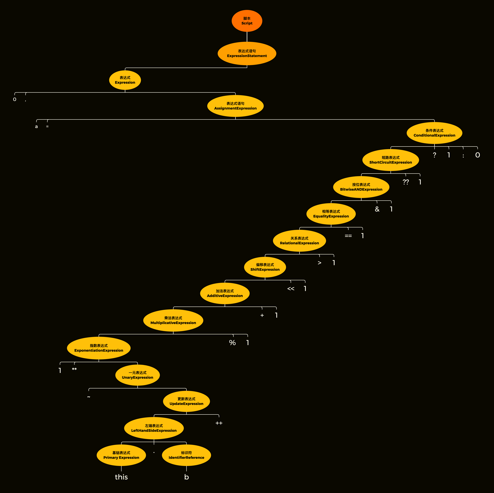

子节点将比父节点优先执行，所以这颗树会从下往上开始执行：`this.b` -> `this.b ++` -> `~ this.b ++` -> ..... 。

在实际开发中，如果你想要避免处理运算符优先级的问题，可以使用括号`()`括住想要优先运算的部分。这是因为括号以及括号内部的代码会被当成“基础表达式”来执行，不信你看基础表达式的产生式：

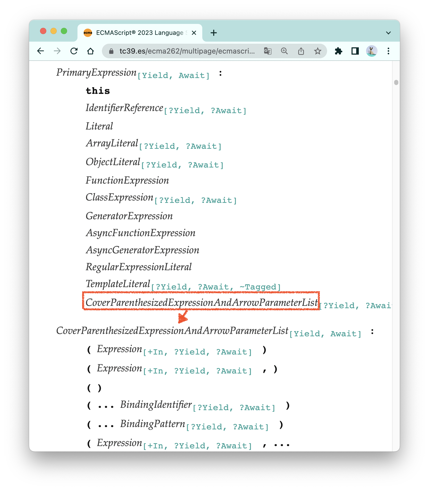

而我们已经得知，基础表达式是一个运算优先级仅次于标识符引用的表达式，所以括号内的内容会被优先执行。于是，尽管标准里没有任何地方定义过“立即执行函数“这个概念，但你也可以使用括号实现“函数就地创建，并立即执行”的效果：

```js
(()=>{console.log("1")})() // 1
```


<br/>


### 输入元素

我在上面[词法分析](#词法分析)的小节提到，输入元素可以分为以下类型：

> - [空格](https://tc39.es/ecma262/multipage/ecmascript-language-lexical-grammar.html#sec-white-space)
> - [行终结符](https://tc39.es/ecma262/multipage/ecmascript-language-lexical-grammar.html#sec-line-terminators)
> - [注释](https://tc39.es/ecma262/multipage/ecmascript-language-lexical-grammar.html#sec-comments)
> - [tokens](https://tc39.es/ecma262/multipage/ecmascript-language-lexical-grammar.html#sec-tokens)，tokens又可以进一步分为：
>   - [标识符名称（identifierName）](https://tc39.es/ecma262/multipage/ecmascript-language-lexical-grammar.html#prod-IdentifierName)
>   - [字面量（literals）](https://tc39.es/ecma262/multipage/ecmascript-language-lexical-grammar.html#sec-ecmascript-language-lexical-grammar-literals)
>   - [标点符号](https://tc39.es/ecma262/multipage/ecmascript-language-lexical-grammar.html#sec-punctuators)
>   - [字符串模版](https://tc39.es/ecma262/multipage/ecmascript-language-lexical-grammar.html#prod-Template)
>

这其实是一个不完全准确的说法，如果你阅读[词法文法](https://tc39.es/ecma262/multipage/ecmascript-language-lexical-grammar.html#prod-InputElementDiv)，你首先看到的，是5条“真正”的输入元素的产生式：

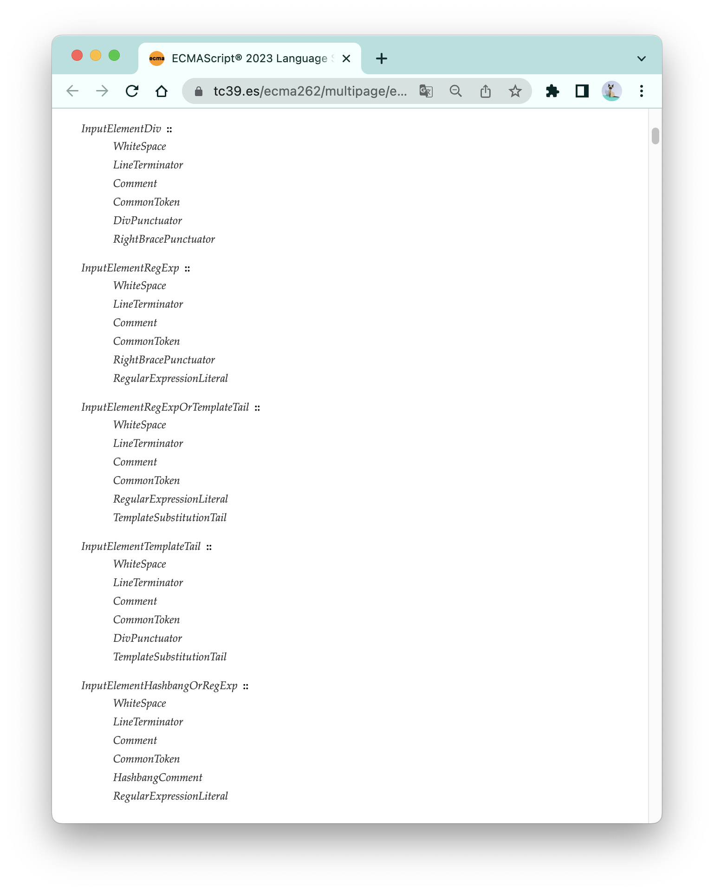

这5条输入元素的产生式对上面的元素进行了一层“封装”。在实际的词法分析中，会根据不同的上下文，选择不同的输入元素进行解析。之所以要这么做，是因为**一些特定的符号，在不同的场景下有不同的意义。** 

比如，一般来说，`/`表示除法符号，但是在正则表达式中，`/`则用来表示正则表达式的边界。于是，为了抹去歧义，就不得不使用不同的输入元素类型进行区分 —— [InputElementDiv](https://tc39.es/ecma262/multipage/ecmascript-language-lexical-grammar.html#prod-InputElementDiv)与[InputElementRegExp](https://tc39.es/ecma262/multipage/ecmascript-language-lexical-grammar.html#prod-InputElementRegExp)。

又比如，一般来说，右侧大括号`}`表示块语句的结束，但是在字符串模版中，`}`表示模版替换的边界。于是，为了抹去歧义，就不得不使用不同的输入元素类型进行区分—— [InputElementDiv](https://tc39.es/ecma262/multipage/ecmascript-language-lexical-grammar.html#prod-InputElementDiv)与[InputElementTemplateTail](https://tc39.es/ecma262/multipage/ecmascript-language-lexical-grammar.html#prod-InputElementTemplateTail)。

对这五种输入元素的使用场景，我为你总结如下：

| 输入元素类型                                                 | 使用场景                                                     |
| ------------------------------------------------------------ | ------------------------------------------------------------ |
| [InputElementHashbangOrRegExp](https://tc39.es/ecma262/multipage/ecmascript-language-lexical-grammar.html#prod-InputElementHashbangOrRegExp) | [普通脚本Script](https://tc39.es/ecma262/multipage/ecmascript-language-scripts-and-modules.html#prod-Script)以及[模块脚本Module](https://tc39.es/ecma262/multipage/ecmascript-language-scripts-and-modules.html#prod-Module)的开头使用 |
| [InputElementRegExp](https://tc39.es/ecma262/multipage/ecmascript-language-lexical-grammar.html#prod-InputElementRegExp) | 允许使用正则表达式但不允许使用字符串模版的环境下使用         |
| [InputElementTemplateTail](https://tc39.es/ecma262/multipage/ecmascript-language-lexical-grammar.html#prod-InputElementTemplateTail) | 允许使用字符串模版但不允许使用正则表达式的环境下使用         |
| [InputElementRegExpOrTemplateTail](https://tc39.es/ecma262/multipage/ecmascript-language-lexical-grammar.html#prod-InputElementRegExpOrTemplateTail) | 同时允许使用正则表达式与字符串模版的环境下使用               |
| [InputElementDiv](https://tc39.es/ecma262/multipage/ecmascript-language-lexical-grammar.html#prod-InputElementDiv) | 除以上以外的其他场景                                         |

