# 标准中的算法

程序员是一个痴迷于“底层机理”的群体。他们喜欢通过造轮子吃透底层原理；那些标题带有“底层”二字的技术文章也常常会有不错的反响；而面试官，冷不丁就会让你手写个什么东西。

对我来说，了解JavaScript的底层原理，只有两个靠谱的渠道：一是阅读Js引擎源码，另一个是阅读ECMAScript标准中的算法。而其他的资料，统统不靠谱，或者至少远远不如这两个资料源靠谱。

就像我在[18.promise](./18.promise.md)为你展示的一样，我基于标准[定义Promise对象](https://tc39.es/ecma262/multipage/control-abstraction-objects.html#sec-promise-objects)的章节，造了一个Promise的“轮子”，这个轮子通过了test262标准符合性测试，试问：哪一篇技术文章，又或者哪一本技术书能够让你做到这个程度？

除了Promise对象，一些常常被拿出来讨论的底层算法，也是明晃晃的放在标准当中：

> - [对象的拆箱转换](https://tc39.es/ecma262/multipage/abstract-operations.html#sec-ordinarytoprimitive)
> - [instance操作符的原理](https://tc39.es/ecma262/multipage/ecmascript-language-expressions.html#sec-instanceofoperator)
> - [new表达式的原理](https://tc39.es/ecma262/multipage/ordinary-and-exotic-objects-behaviours.html#sec-ecmascript-function-objects-construct-argumentslist-newtarget)
> - 函数的[apply](https://tc39.es/ecma262/multipage/fundamental-objects.html#sec-function.prototype.apply)、[bind](https://tc39.es/ecma262/multipage/fundamental-objects.html#sec-function.prototype.bind)、[call](https://tc39.es/ecma262/multipage/fundamental-objects.html#sec-function.prototype.call)方法的原理
> - ...
>

当然，要读懂这些算法，也不是没有门槛的。首先，你得了解算法有什么类型，不同的类型有什么特点，这样你才能知道这个算法会在什么时候被调用；其次，为了减少冗余，标准的算法使用了大量的符号代替文字进行表述，所以你必须了解这些符号的具体含义；最后，你必须要有足够的基础概念的积累，因为算法中常常会大量引用其他篇章的概念，如果这些基础概念缺失太多，你就会感觉自己在读一篇很多生词的文章，理解起来非常吃力。

本节会帮你解决前两个问题，即算法的分类以及算法的符号表示；而第三个问题，是这整本书要帮你解决的问题。

标准的算法大致可以分为两类：一类是**抽象操作（abstract operations）** ，另一类是**语法导向操作（syntax-directed operation）** 。本节我会先讲较为简单的抽象操作，然后再讲语法导向操作，最后，我会讲这两类算法的表示约定。


<br/>


### 目录:

- [抽象操作](#抽象操作)

- [语法导向操作](#语法导向操作)

  * [运行时语义](#运行时语义)

  * [静态语义](#静态语义)

  * [链式产生式的语法导向操作](#链式产生式的语法导向操作)

- [算法的表示约定](#算法的表示约定)

  * [算法中的数字](#算法中的数字)

  * [算法中的规范类型](#算法中的规范类型)
<br/>


## 抽象操作

**「抽象操作」是那些可以被复用的逻辑，相当于普通函数。** 

常见的抽象操作在标准的[第7章](https://tc39.es/ecma262/#sec-abstract-operations)定义，包括：

- [7.1 类型转换相关的抽象操作](https://tc39.es/ecma262/#sec-type-conversion)
- [7.2 类型判断与数值比较相关的抽象操作](https://tc39.es/ecma262/#sec-testing-and-comparison-operations)
- [7.3 对象相关的抽象操作](https://tc39.es/ecma262/#sec-operations-on-objects)
- [7.4 迭代器相关的操作操作](https://tc39.es/ecma262/#sec-operations-on-iterator-objects)

比如，前面提到的拆箱转换，核心逻辑[OrdinaryToPrimitive](https://tc39.es/ecma262/multipage/abstract-operations.html#sec-ordinarytoprimitive)就是一个抽象操作。

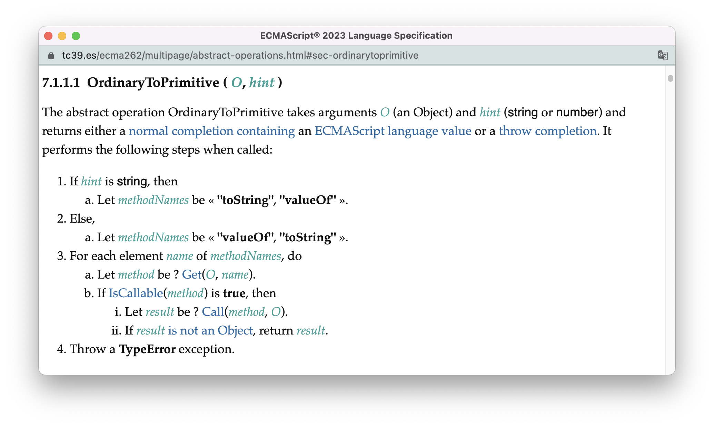

这个算法的意思大概是这样的：

> 该抽象操作以一个*O*（对象类型）以及*hint*（值为"string"或"number"）为参数，成功执行会返回一个ECMAScript语言类型的值，否则会抛出一个错误：
>
> 1. 根据参数*hint*决定`toString`、`valueOf`的调用顺序，如果hint为“string”就先调用`tostring`；
> 2. 否则就先调用`valueof`；
> 3. 按照前面决定的顺序依次调用对应方法，当某个方法返回的值不是对象类型，则直接返回该值，算法结束；
> 4. 否则，如果两个方法返回的都是对象类型，则抛出TypeError的异常。

（图片中的`normal completion`、`throw completion`是什么我会在[7.规范类型](./7.spec_type.md)中再细说。）

<br />

你可以通过算法标题的交叉索引找到这个抽象操作被复用的地方：

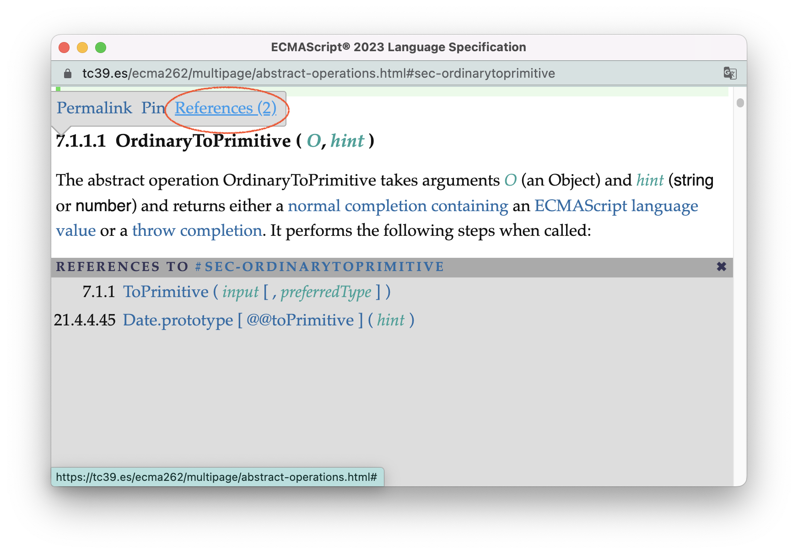

沿着交叉索引，我们反向追踪到`Number()`以及`String()`都会使用这个抽象操作进行类型转换，调用链如下所示：

> - [Number()](https://tc39.es/ecma262/multipage/numbers-and-dates.html#sec-number-constructor-number-value)-> [ToNumeric()](https://tc39.es/ecma262/multipage/abstract-operations.html#sec-tonumeric) -> [ToPrimitive()](https://tc39.es/ecma262/multipage/abstract-operations.html#sec-toprimitive) -> [OrdinaryToPrimitive()](https://tc39.es/ecma262/multipage/abstract-operations.html#sec-ordinarytoprimitive)；
> - [String()](https://tc39.es/ecma262/multipage/text-processing.html#sec-string-constructor-string-value) -> [ToString()](https://tc39.es/ecma262/multipage/abstract-operations.html#sec-tostring) -> [ToPrimitive()](https://tc39.es/ecma262/multipage/abstract-operations.html#sec-toprimitive) -> [OrdinaryToPrimitive()](https://tc39.es/ecma262/multipage/abstract-operations.html#sec-ordinarytoprimitive)；

于是，我们可以用以下的代码来验证`OrdinaryToPrimitive()`的逻辑：

```js
// 使valueOf、toString都返回对象
const testObj = {
    "valueOf": () => {
        console.log('number')
        return {}
    },
    "toString": () => {
        console.log("string")
        return {}
    }  
}

Number(testObj) // 此时hint为number
/* 依次打印结果：
    1. number
    2. string
    3. 报错：Uncaught TypeError: Cannot convert object to primitive value */

String(testObj) // 此时hint为string
/* 依次打印结果：
    string
    number
    报错：Uncaught TypeError: Cannot convert object to primitive value */
```

<br />


<br/>


## 语法导向操作

**另一大类算法称为「语法导向操作」，与抽象操作不同的是，语法导向操作与产生式绑定，你可以理解为目标符实例上的方法。** 

还记得我们在[5.文法汇总](./5.grammar-summary.md#语法解析的过程)对“人人都能读标准”这句话进行了语法解析吗？我们得出这是一个“主谓宾”结构的句子，而特定结构的句子能够表达特定的语义。比如，“主谓宾”结构的句子，一般用于表达“主体”对“客体”做了什么；在这里，即：所有程序员（主体）都能够读懂ECMAScript标准（客体）。

而编程语言当然也有自己的语义（semantics）表达。在程序中，一个赋值语句表达想要为某个变量赋予某个值；一个函数声明语句表达想要创建一个含有特定逻辑的函数；一个函数调用语句表达想要执行某个函数的逻辑；一个throw语句表达想要抛出某个错误......

**在ECMAScript中，文法只用于定义语句的结构。而不同结构的语句，其语义通过「语法导向操作」进行表达。一条产生式可以绑定多条语法导向操作，其具体逻辑由标准定义；每条产生式的目标符实例都可以通过调用其自身的语法导向操作，执行这些逻辑，从而完成语句语义的表达。** 

在标准中，语法导向操作的逻辑会以算法步骤的形式直接出现在产生式的下方。我们先以一个[全标准最简单的语法导向操作](https://tc39.es/ecma262/multipage/ecmascript-language-scripts-and-modules.html#sec-script-semantics-runtime-semantics-evaluation)为例：

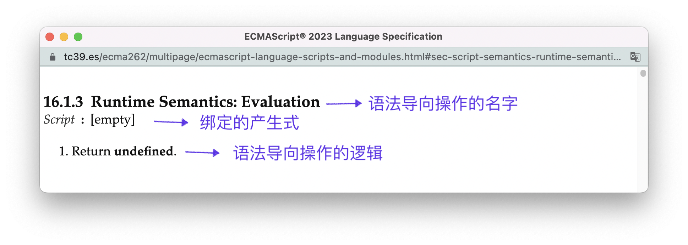

这里需要注意的点有：

- 在语法导向操作的名字中：
  - `:`左边的部分表示语法导向操作的类型。在标准中，语法导向操作可以分为两类：**运行时语义（Runtime Semantics）** 以及**静态语义（Statics Semantics）** ，它们的区别我们会在下面详细展开。
  
  - `:`右边的部分是该语法导向操作的具体名字。当在其他地方需要调用这个语法导向操作时，会使用`(语法导向操作名) of（目标符）`的格式，比如，这里是`Evaluation of Script`。下图是一个[实际的例子](https://tc39.es/ecma262/multipage/ecmascript-language-scripts-and-modules.html#sec-runtime-semantics-scriptevaluation)：
  
    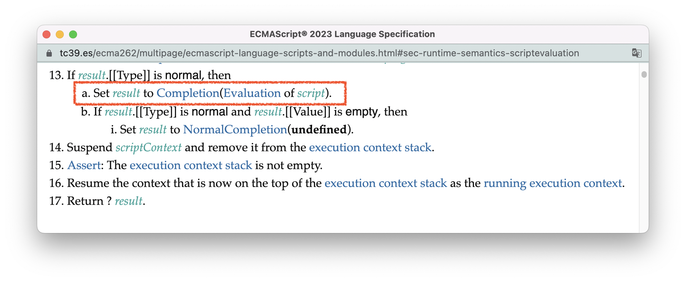
  
- 同一目标符的不同代换式中，语法导向操作的具体逻辑有可能会不同。比如这个“全标准最简单的语法导向操作”，是绑定在目标符[Script](https://tc39.es/ecma262/multipage/ecmascript-language-scripts-and-modules.html#prod-Script)上的，逻辑非常简单，就是返回一个undefined。但它只绑定在`Script:[empty]`这条代换式上，也就是说只适用于Script为空的情况，当Script不为空时，调用Evaluation语法导向操作并不会走这段逻辑。


<br/>


### 运行时语义

**类型为运行时语义的语法导向操作，一般表示该语句能做什么，且只会在运行时被调用。** 

**最常见、最重要的运行时语义就是Evaluation —— 本书将统一称为「求值语义」。我们常说的“执行某个语句”，站在标准的角度，就是调用这个语句的求值语义。** 

比如，我们在[5.文法汇总](./5.grammar-summary.md#表达式)提到的结构最大的表达式[Expression](https://tc39.es/ecma262/multipage/ecmascript-language-expressions.html#prod-Expression)，其求值语义如下所示：

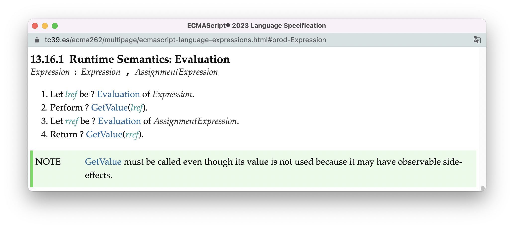

把这段逻辑翻译过来大概是这样的：

> 1. 调用逗号左边的表达式的求值语义；
> 1. 获取第一步执行结果的值；
> 1. 调用逗号右边的表达式的求值语义；
> 1. 返回第三步执行结果的值。

（关于算法中问号`?`的含义，会在下面[符号表示的部分](#算法中的规范类型)再解释）

由此我们得知，通过逗号分隔的表达式，会返回最后一条表达式的值：

```js
console.log((1,2,3,4)) // 4
console.log((a = 1, b = 2)) // 2
console.log((c = 1, c++, -c)) // -2
```

正如绿色的Note所提示的，即便逗号左边的表达式不会被返回，但（在第二步）也需要有“获取表达式的值”这个动作。我们可以通过以下的代码看到它所带来的副作用：

```js
const a = {
    get b(){console.log("flag")} 
}
console.log((a.b, 1))
// flag
// 1
```

又由于，运行时语义是在非终结符实例上触发的，所以我们必然可以从解析树的视角观察运行时语义的调用过程，比如下面这条表达式：

```js
c = 1, c++, -c
```

通过对这条表达式进行语法解析我们可以得到下图左侧这样的一颗解析树。右侧蓝色部分是该解析树的“求值过程”，橙色虚线连接的是树节点（即非终结符实例）与在其身上触发的运行时语义，最右边白色的代码对应着该非终结符实例所包含的代码文本。

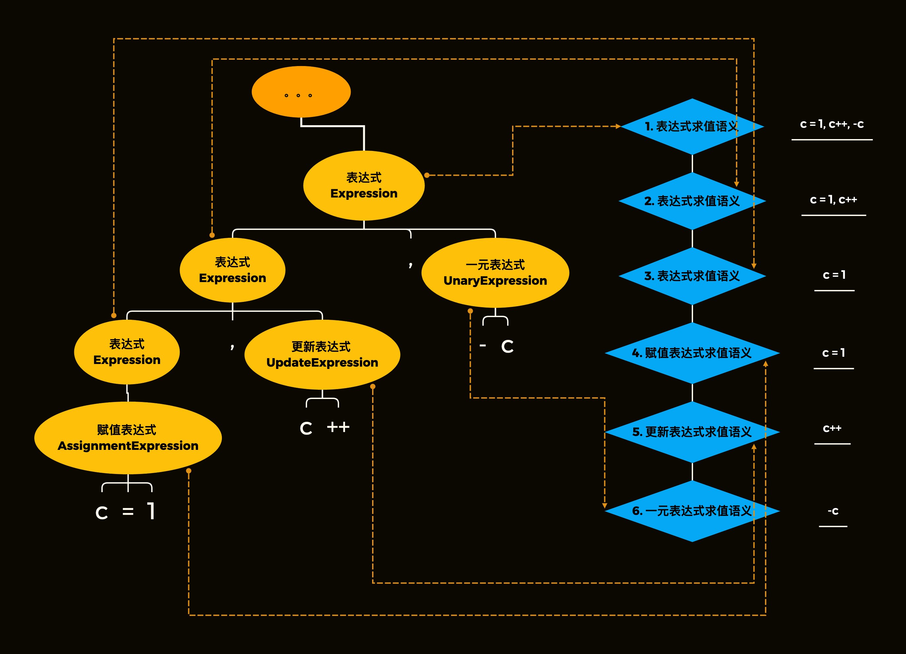

从语言的角度讲，右边蓝色的调用链，就是这条表达式输出语义的过程。通过解析树的视角，我们甚至可以“用肉眼”看到表达式Expression求值时，逗号左边表达式的递归过程。

在这条调用链中，所有表达式的求值语义，你都可以在标准中找到：

- 赋值表达式AssignmentExpression的[求值语义](https://tc39.es/ecma262/multipage/ecmascript-language-expressions.html#sec-assignment-operators-runtime-semantics-evaluation)。
- 更新表达式UpdateExpression的[求值语义](https://tc39.es/ecma262/multipage/ecmascript-language-expressions.html#sec-postfix-increment-operator-runtime-semantics-evaluation)。
- 一元表达式UnaryExpression的[求值语义](https://tc39.es/ecma262/multipage/ecmascript-language-expressions.html#sec-unary-minus-operator)。

<br />

对于关键的内容，我往往不会只举一个例子。

还记得我们在[4.文法基础](./4.context-free-grammar.md#文法的基本理解规则)中对class声明语句的文法进行了一次完全的解构吗？

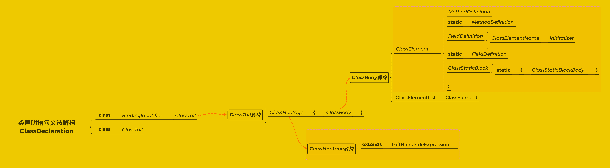

你可以同样在标准[class声明语句](https://tc39.es/ecma262/multipage/ecmascript-language-functions-and-classes.html#sec-class-definitions)一节，找到所有class声明语句相关产生式所绑定的运行时语义：(如下图红色框所示，RS是Runtime Semantics的缩写)

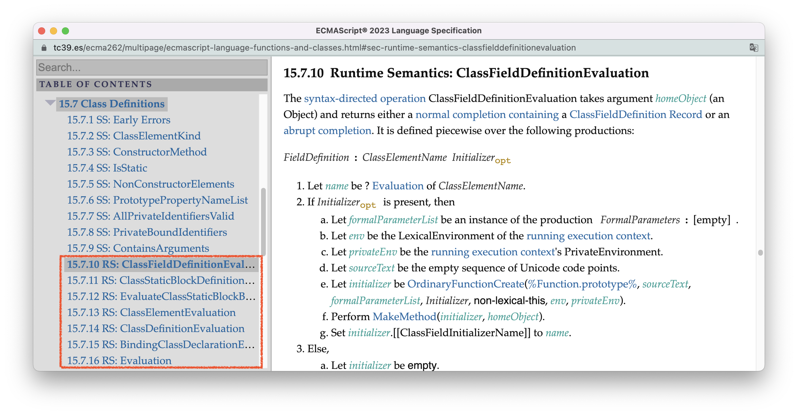

我把这些运行时语义所绑定的产生式以及主要逻辑大致为你总结一下（目录从下往上）：

| 运行时语义的名称                                             | 绑定的产生式                                                 | 主要逻辑                                                     |
| ------------------------------------------------------------ | ------------------------------------------------------------ | ------------------------------------------------------------ |
| [Evaluation(求值语义)](https://tc39.es/ecma262/multipage/ecmascript-language-functions-and-classes.html#sec-class-definitions-runtime-semantics-evaluation) | [ClassDeclaration](https://tc39.es/ecma262/multipage/ecmascript-language-functions-and-classes.html#prod-ClassDeclaration)<br />[ClassExpression](https://tc39.es/ecma262/multipage/ecmascript-language-functions-and-classes.html#prod-ClassExpression) | 启动创建类的过程                                             |
| [BindingClassDeclarationEvaluation](https://tc39.es/ecma262/multipage/ecmascript-language-functions-and-classes.html#sec-runtime-semantics-bindingclassdeclarationevaluation) | [ClassDeclaration](https://tc39.es/ecma262/multipage/ecmascript-language-functions-and-classes.html#prod-ClassDeclaration) | 把class的标识符（类名）绑定在环境中                          |
| [ClassDefinitionEvaluation](https://tc39.es/ecma262/multipage/ecmascript-language-functions-and-classes.html#sec-runtime-semantics-classdefinitionevaluation) | [ClassTail](https://tc39.es/ecma262/multipage/ecmascript-language-functions-and-classes.html#prod-ClassTail) | 根据ClassTail，创建构造器对象与prototype对象                 |
| [ClassElementEvaluation](https://tc39.es/ecma262/multipage/ecmascript-language-functions-and-classes.html#sec-static-semantics-classelementevaluation) | [ClassElement](https://tc39.es/ecma262/multipage/ecmascript-language-functions-and-classes.html#prod-ClassElement) | 根据ClassElement的类型，分别在构造器对象与prototype对象上添加属性和方法 |
| [EvaluateClassStaticBlockBody](https://tc39.es/ecma262/multipage/ecmascript-language-functions-and-classes.html#sec-runtime-semantics-evaluateclassstaticblockbody) | [ClassStaticBlockBody](https://tc39.es/ecma262/multipage/ecmascript-language-functions-and-classes.html#prod-ClassStaticBlockBody) | 执行class静态块的逻辑                                        |
| [ClassStaticBlockDefinitionEvaluation](https://tc39.es/ecma262/multipage/ecmascript-language-functions-and-classes.html#sec-runtime-semantics-classstaticblockdefinitionevaluation) | [ClassStaticBlock](https://tc39.es/ecma262/multipage/ecmascript-language-functions-and-classes.html#prod-ClassStaticBlock) | class静态块具体的创建过程                                    |
| [ClassFieldDefinitionEvaluation](https://tc39.es/ecma262/multipage/ecmascript-language-functions-and-classes.html#sec-runtime-semantics-classfielddefinitionevaluation) | [FieldDefinition](https://tc39.es/ecma262/multipage/ecmascript-language-functions-and-classes.html#prod-FieldDefinition) | class字段具体的创建过程                                      |

从上表我们大致可以猜到：当创建一个类时，就是通过调用class声明语句中，不同部分对应的运行时语义完成的。比如，当我尝试通过以下代码创建一个类：

```js
class A {
  a;
  static {}
}
```

其解析得到的解析树以及这些运行时语义的调用过程如下图所示：

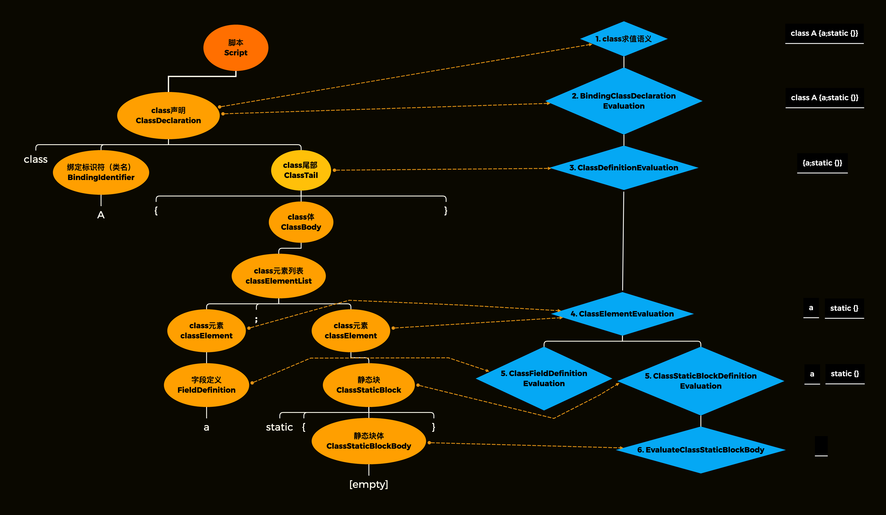

如果你想钻研创建类的具体细节，有两个方式。一是直接阅读标准中创建类的[求值语义](https://tc39.es/ecma262/multipage/ecmascript-language-functions-and-classes.html#sec-class-definitions-runtime-semantics-evaluation)，沿着算法给出交叉索引你将看到整个过程运行时语义的调用链以及每个运行时语义的具体逻辑。另一种方法是阅读本书应用篇的[15.类](./15.class.md)，当然，我不会像标准一样列出所有细节，我只是把每个过程的重要步骤给你做一个总结。


<br/>


### 静态语义

**静态语义一般用于对语句做一些静态工作，比如检查语法错误、判断语句的类型、截取语句的某个部分供其他语义使用等等**

以[词法声明语句产生式LexicalDeclaration](https://tc39.es/ecma262/multipage/ecmascript-language-statements-and-declarations.html#prod-LexicalDeclaration)绑定的一个名为[early-error](https://tc39.es/ecma262/multipage/ecmascript-language-statements-and-declarations.html#sec-let-and-const-declarations-static-semantics-early-errors)的静态语义为例，这个语义会检查语句语法是否有错误：

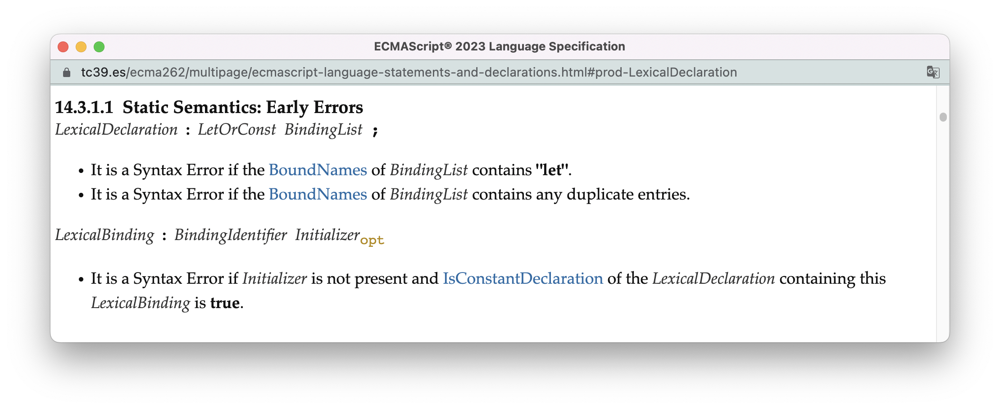

从这里可以看出，当一个词法声明语句出现以下的情况时，会抛出语法错误（Syntax Error）：

- 变量名包含"let"：

  ```js
  let let = 10
  ```

- 重复声明同一变量：

  ```
  let a = 10, a = 100
  ```

- 使用const来进行声明，但没有初始化变量：

  ```
  const a
  ```

实际上，**「先验错误（early-error）」是最重要的静态语义。** 

**先验错误表示那些不需要执行代码就能够发现的错误。在得到解析树后，解析树上的每个节点都会进行先验错误的检查，只有整颗树都通过了检验，才能开始执行节点上的求值语义。当检验不通过的时候，程序会以语法错误SyntaxError提前终止，因此代码不会进入执行阶段。** 

先验错误的存在，是因为有时候文法不足以完全覆盖语言结构的所有限制。就好比自然语言中，“人人都能吃标准”、“人人都能拉标准”、“人人都能吐标准”，是结构上完全合法的句子，但语义实际上是不通的。

由于先验错误能够被静态检查，一些好的代码编辑器会在你编码的时候就为你提示这些错误，比如我的vscode：

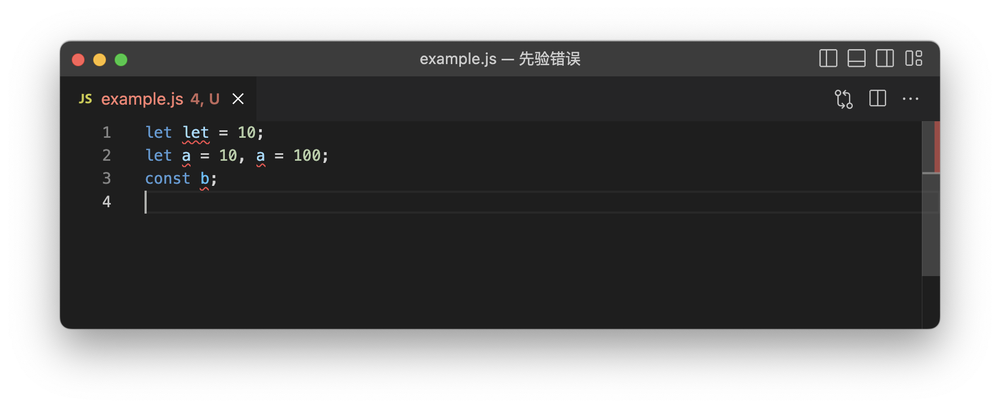

<br />

我们从class声明语句的目录中，同样可以看到与class文法相关的静态语义（SS为Static Semantics的缩写）：

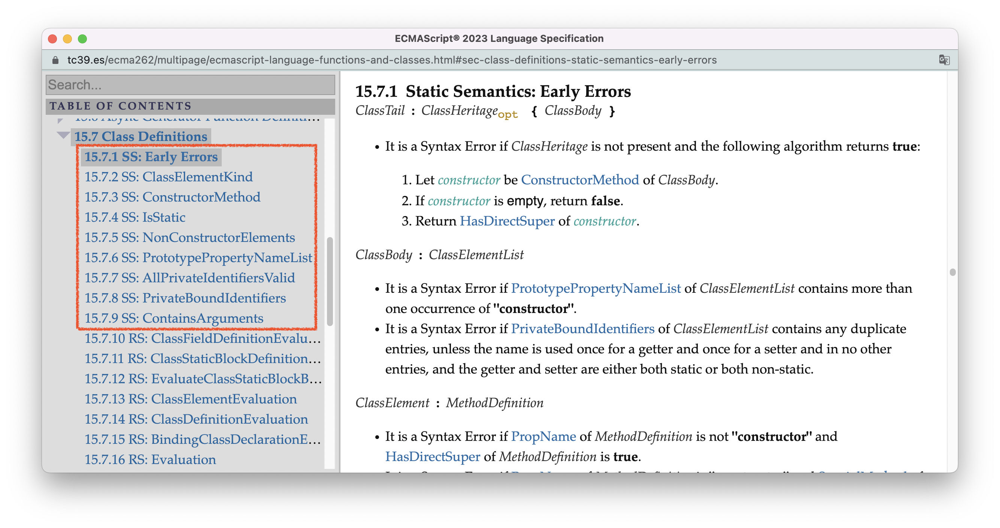

下表我为你总结出这些静态语义绑定的产生式以及他们的主要逻辑，从中你可以大致感受到静态语义主要的职责范围。同样的，你也可以点进这些链接，通过标准提供的交叉索引，找到这些静态语义被调用的位置。

| 静态语义的名称                                               | 绑定的产生式                                                 | 主要逻辑                                       |
| ------------------------------------------------------------ | ------------------------------------------------------------ | ---------------------------------------------- |
| [Early Errors（先验错误）](https://tc39.es/ecma262/multipage/ecmascript-language-functions-and-classes.html#sec-class-definitions-static-semantics-early-errors) | [ClassTail](https://tc39.es/ecma262/multipage/ecmascript-language-functions-and-classes.html#prod-ClassTail)、<br />[ClassBody](https://tc39.es/ecma262/multipage/ecmascript-language-functions-and-classes.html#prod-ClassBody)、<br />[ClassElement](https://tc39.es/ecma262/multipage/ecmascript-language-functions-and-classes.html#prod-ClassElement)、<br />[FieldDefinition](https://tc39.es/ecma262/multipage/ecmascript-language-functions-and-classes.html#prod-FieldDefinition)、<br />[ClassElementName](https://tc39.es/ecma262/multipage/ecmascript-language-functions-and-classes.html#prod-ClassElementName)、<br />[ClassStaticBlockBody](https://tc39.es/ecma262/multipage/ecmascript-language-functions-and-classes.html#prod-ClassStaticBlockBody) | 在语句实际执行前检查有无语法错误               |
| [ClassElementKind](https://tc39.es/ecma262/multipage/ecmascript-language-functions-and-classes.html#sec-static-semantics-classelementkind) | [ClassElement](https://tc39.es/ecma262/multipage/ecmascript-language-functions-and-classes.html#prod-ClassElement) | 判断某个class元素是不是constructor方法         |
| [ConstructorMethod](https://tc39.es/ecma262/multipage/ecmascript-language-functions-and-classes.html#sec-static-semantics-constructormethod) | [ClassElementList](https://tc39.es/ecma262/multipage/ecmascript-language-functions-and-classes.html#prod-ClassElementList) | 获取class元素列表中的constructor方法           |
| [IsStatic](https://tc39.es/ecma262/multipage/ecmascript-language-functions-and-classes.html#sec-static-semantics-isstatic) | [ClassElement](https://tc39.es/ecma262/multipage/ecmascript-language-functions-and-classes.html#prod-ClassElement) | 判断某个class元素是不是静态元素                |
| [NonConstructorElements](https://tc39.es/ecma262/multipage/ecmascript-language-functions-and-classes.html#sec-static-semantics-nonconstructorelements) | [ClassElementList](https://tc39.es/ecma262/multipage/ecmascript-language-functions-and-classes.html#prod-ClassElementList) | 获取class元素列表中所有非constructor方法的元素 |
| [PrototypePropertyNameList](https://tc39.es/ecma262/multipage/ecmascript-language-functions-and-classes.html#sec-static-semantics-prototypepropertynamelist) | [ClassElementList](https://tc39.es/ecma262/multipage/ecmascript-language-functions-and-classes.html#prod-ClassElementList) | 获得prototype对象上所有的属性名                |
| [AllPrivateIdentifiersValid](https://tc39.es/ecma262/multipage/ecmascript-language-functions-and-classes.html#sec-static-semantics-allprivateidentifiersvalid) | [ClassBody](https://tc39.es/ecma262/multipage/ecmascript-language-functions-and-classes.html#prod-ClassBody) | 判断所有的私有属性名是否合法                   |
| [PrivateBoundIdentifiers](https://tc39.es/ecma262/multipage/ecmascript-language-functions-and-classes.html#sec-static-semantics-privateboundidentifiers) | [ClassElementList](https://tc39.es/ecma262/multipage/ecmascript-language-functions-and-classes.html#prod-ClassElementList) | 获得所有的私有属性名                           |
| [ContainsArguments](https://tc39.es/ecma262/multipage/ecmascript-language-functions-and-classes.html#sec-static-semantics-containsarguments) | [MethodDefinition](https://tc39.es/ecma262/multipage/ecmascript-language-functions-and-classes.html#prod-MethodDefinition) | 判断class上的方法是否有参数                    |


<br/>


### 链式产生式的语法导向操作

还记得我们前面说的“全标准最简单的语法导向操作”吗？我们现在已经知道，这是普通脚本Script上的一个求值语义，但只适用于脚本为空的情况。

那么，如果脚本不为空，它的求值语义是什么呢？很可惜，你在标准中找不到任何关于非空Script求值语义的定义。

在这里，我们就不得不再引入一个概念 —— **链式产生式（chain production）** 。

**链式产生式指的是右侧只有唯一非终结符的产生式。** 比如，普通脚本[相关的产生式](https://tc39.es/ecma262/multipage/ecmascript-language-scripts-and-modules.html#sec-scripts)就是两条链式产生式：

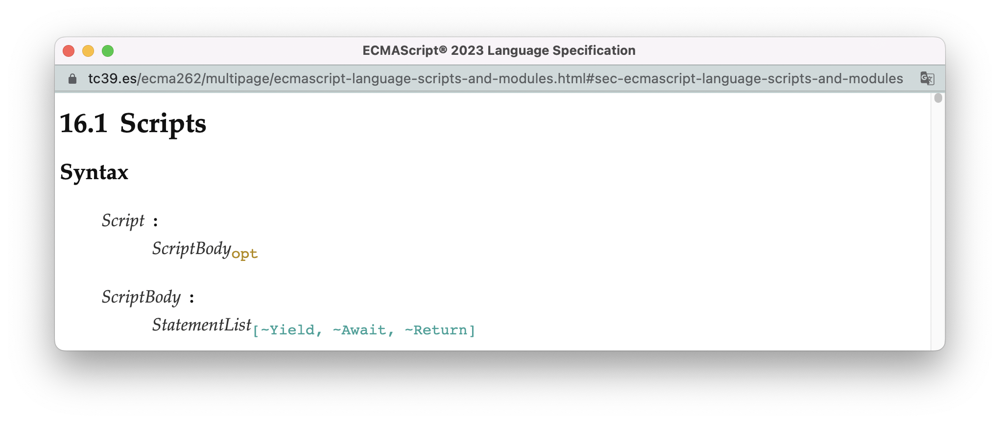

**链式产生式有一个特点：当触发产生式的某个语法导向操作，但标准没有定义其具体逻辑时，会隐式地触发产生式右端那个唯一的非终结符上，同名的语法导向操作。** 

我们以一段普通脚本的代码为例：

```js
let a = 1;
a++;
console.log(a)
```

对这段代码进行语法解析，然后调用Script的求值语义，过程如下图所示：

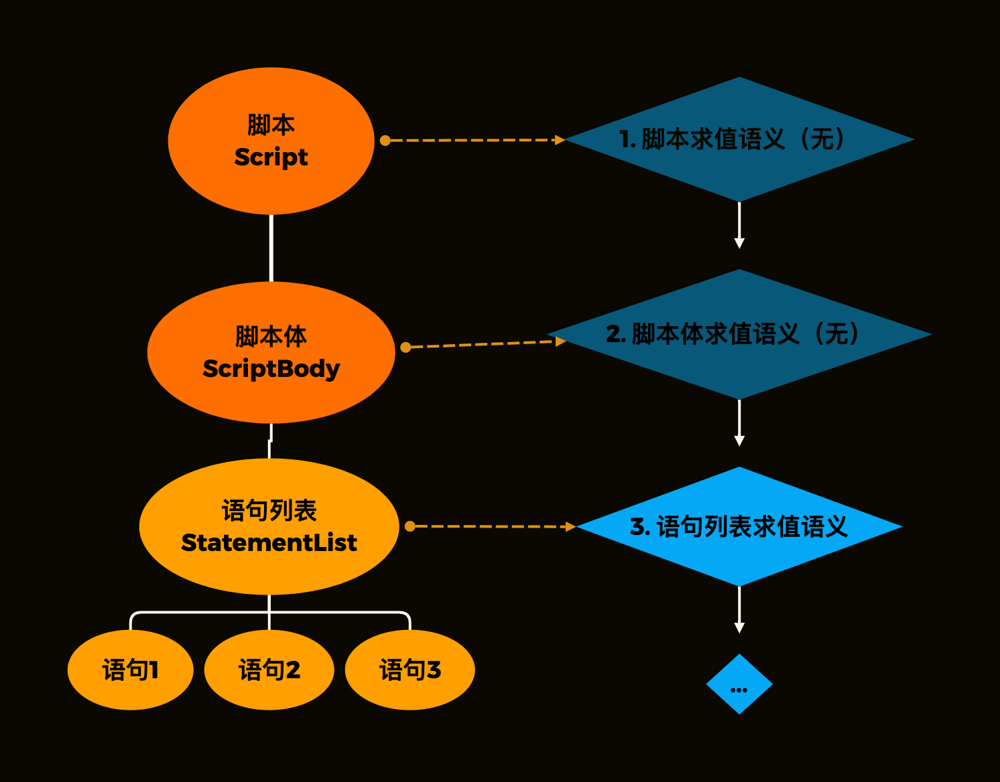

使用语言表述的话，这个过程是这样的：

1. 由于标准中没有定义普通脚本Script（不为空时）的求值语义，基于链式产生式的特点，[脚本体ScriptBody]()的求值语义会被触发。

2. 由于标准也没有定义脚本体的求值语义，基于链式产生式的特点，[语句列表StatementList](https://tc39.es/ecma262/multipage/ecmascript-language-statements-and-declarations.html#prod-StatementList)的求值语义会被触发。

3. 根据语句列表的求值语义，语句会依次被执行：

   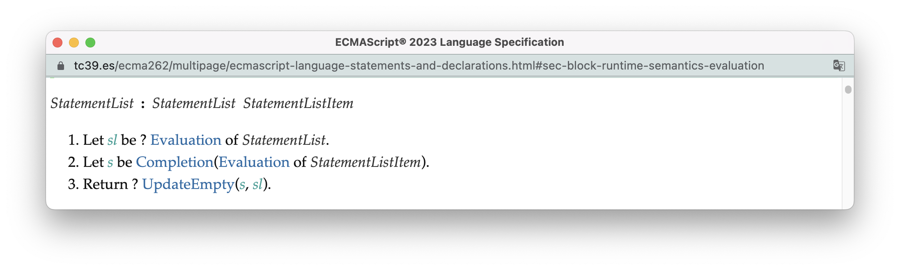

StatementList的求值语义是一个非常重要的运行时语义，因为它构成了[脚本体ScriptBody](https://tc39.es/ecma262/multipage/ecmascript-language-scripts-and-modules.html#prod-ScriptBody)、[函数体FunctionBody](https://tc39.es/ecma262/multipage/ecmascript-language-functions-and-classes.html#prod-FunctionBody)、[块语句Block](https://tc39.es/ecma262/multipage/ecmascript-language-statements-and-declarations.html#prod-Block)的主体，对Script、FunctionBody、Block的求值最终都会导向对它的求值。在[7.规范类型](./7.spec_type.md)中，我们会再对这个求值语义进行更加深入的研究。

<br />

以上，就是关于算法类型的全部内容。剩余的部分，我们会对算法的符号表示进行完全的解剖。


<br/>


## 算法的表示约定

从上面拆箱转换的例子中，我们已经可以看到一些基础符号的使用规则：

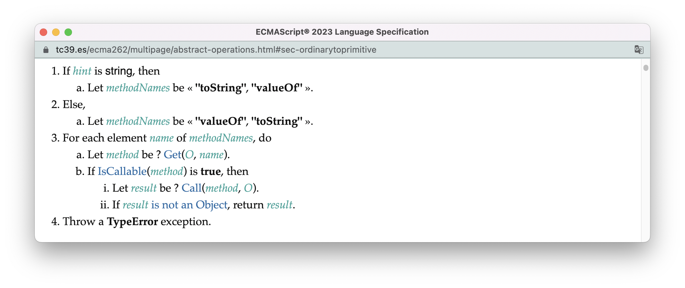

- 使用标号表示步骤顺序，并且按照「整数 - 英文字母 - 罗马数字」的标号顺序表示不同层级的算法。实际上，如果子算法嵌套超过三层，会循环使用这个标号顺序；

- 通过“let x be y”表示给x赋予y值。

- 通过if、Else表示条件语句；For表示遍历语句；标准还会用Repeat表示循环语句。

- 所有语言类型，都会以加粗的方式表示。比如这里的函数（`tostring`与`valueof`）、布尔值（`true`）、对象（`TypeError`）都进行了加粗；


<br />

其他一些重要的表示规则如下：

- 可选参数使用`[]`表示，如拆箱转换中，[Call算法](https://tc39.es/ecma262/multipage/abstract-operations.html#sec-call)的定义：

- `Assert: `表示当算法执行到这一步的时候，其后面的语句必须为真，任何有导致假的情况都是标准的编写错误。使用`Assert: `的目的是增加算法的可读性。

  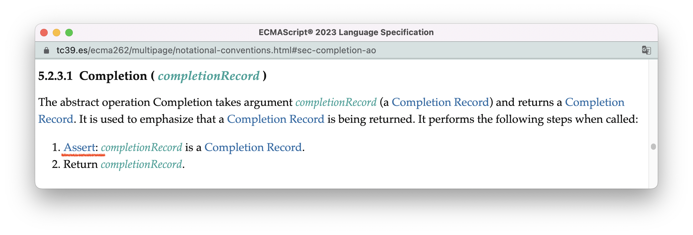
  
- 固有对象使用`%%`表示。固有对象是标准定义的内置对象，固有对象常常在算法中作为原型来创建新的对象。比如，在创建类的运行时语义[ClassDefinitionEvaluation](https://tc39.es/ecma262/multipage/ecmascript-language-functions-and-classes.html#sec-runtime-semantics-classdefinitionevaluation)中：

  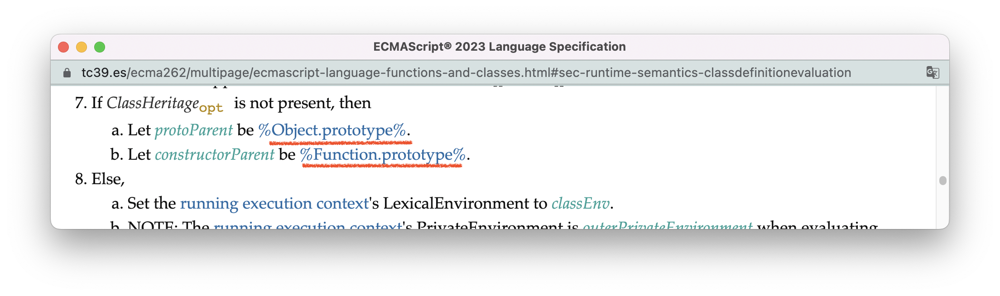

  

<br />
<br/>


### 算法中的数字

可以把算法中的数字分成三类：

1. Number类型的数字：使用`𝔽 `的下标；

2. BigInts类型的数字：使用`ℤ`的下标；

3. 标准算法内部使用的数字：没有特定的下标。

这么做的原因是，不同类型的数字在遇到运算符（如加减乘除、大于小于）时，会调用不同的算法。第三种数字类型只会在算法内部使用，程序无法捕获到，

这些数字类型之间是可以互相转换的。标准会使用`𝔽(x)`表示把x转化为Number类型，使用` ℤ(x)`表示把x转化为bigInt，使用`ℝ(x)`表示把x转化为算法内部使用的数字。

以抽象操作[ToIntegerOrInfinity](https://tc39.es/ecma262/multipage/abstract-operations.html#sec-tointegerorinfinity)为例，这个抽象操作会把参数转化为（第三种）算法数字类型，转化的结果会给标准其他的算法使用。

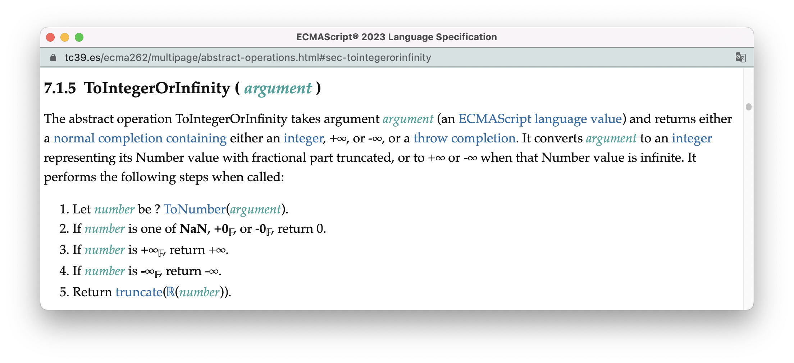

把这个抽象操作的具体逻辑转化为中文如下：

> 1. 通过抽象操作[ToNumber](https://tc39.es/ecma262/multipage/abstract-operations.html#sec-tonumber)，把参数转化为数字，赋值在变量`number`上（此时`number`是一个Number类型）
> 2. 如果`number`是NaN、+0𝔽, or -0𝔽其中之一，返回0。
> 3. 如果`number`是+∞𝔽，返回+∞
> 4. 如果`number`是-∞𝔽，返回-∞
> 5. 把`number`转化为算法数字类型，并通过抽象操作[truncate](https://tc39.es/ecma262/multipage/notational-conventions.html#eqn-truncate)移除掉小数点后面的部分。


<br/>


### 算法中的规范类型

正如算法有内部自用的数字类型，算法也有其内部自用的数据类型，称为「规范类型」。规范类型将在[下一节](./7.spec_type.md)进行详细介绍。在这里，我先给出这些规范类型在算法中的标注方式：

| 规范类型         | 标注方式例子（使用符号或特定字体）                       |
| ---------------- | -------------------------------------------------------- |
| Enum             | 使用`sans-serif`字体表示                                 |
| List（列表）     | « 1, 2 »                                                 |
| Record（记录器） | { [[Field1]]: 42, [[Field2]]: false, [[Field3]]: empty } |
| Data Block       | db[2]                                                    |

不管是在[Expression表达式](https://tc39.es/ecma262/multipage/ecmascript-language-expressions.html#sec-comma-operator-runtime-semantics-evaluation)、还是StatementList语句的求值语义，你都看到算法步骤中带有一些问号`?`，它实际上是一段称为[ReturnIfAbrupt](https://tc39.es/ecma262/multipage/notational-conventions.html#sec-returnifabrupt)的逻辑的简写。它表示如果子算法的执行出现错误，或者需要进行跳转（如执行break语句），则终止整个主算法后续的执行并直接返回子算法的执行结果。

比如，Expression求值语义的第一步：

> 1. Let lref be ? [Evaluation](https://tc39.es/ecma262/multipage/syntax-directed-operations.html#sec-evaluation) of [Expression](https://tc39.es/ecma262/multipage/ecmascript-language-expressions.html#prod-Expression).

相当于：

> 1. Let lref be ReturnIfAbrupt([Evaluation](https://tc39.es/ecma262/multipage/syntax-directed-operations.html#sec-evaluation) of [Expression](https://tc39.es/ecma262/multipage/ecmascript-language-expressions.html#prod-Expression)).

它的含义是：如果逗号左边的表达式执行出现错误，后面的表达式就不会再执行了。如下面代码所示：

```js
((throw "new"), console.log(1))// 1不会输出
```

ReturnIfAbrupt的具体逻辑细节与一种名为[完成记录器](https://tc39.es/ecma262/multipage/ecmascript-data-types-and-values.html#sec-completion-record-specification-type)的规范类型有着紧密的关系，所以我们会在规范类型的章节中再作展开。

还有另一个比较少见的符号是感叹号`!`，`!`表示后面的子算法不会出现错误，也不会需要跳转，功能与`Assert: `类似。


