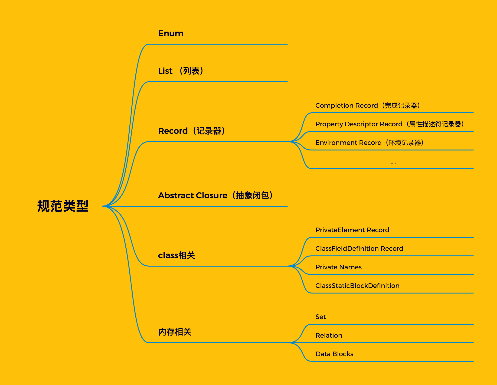
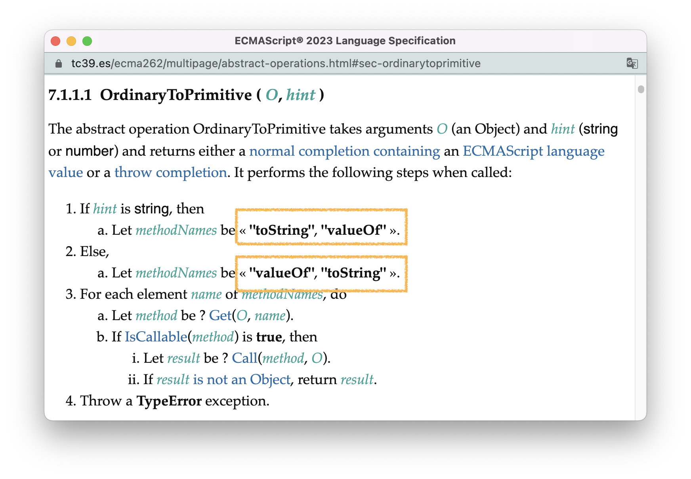
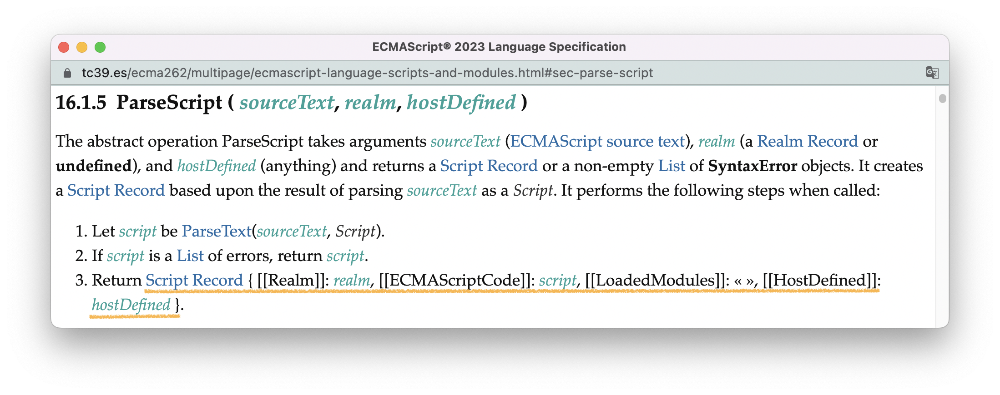
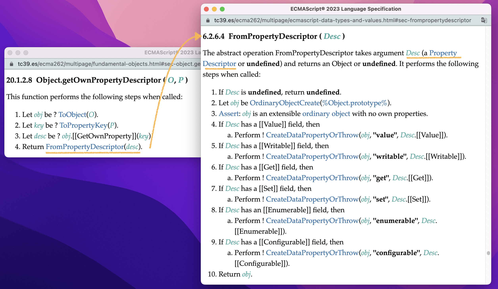
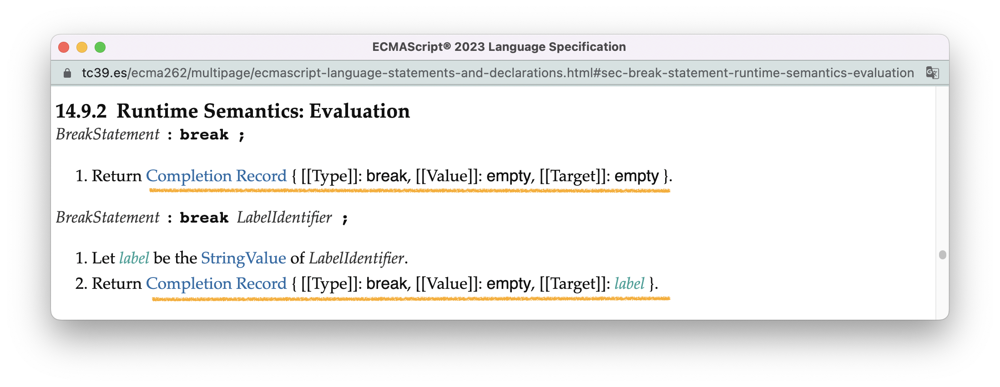
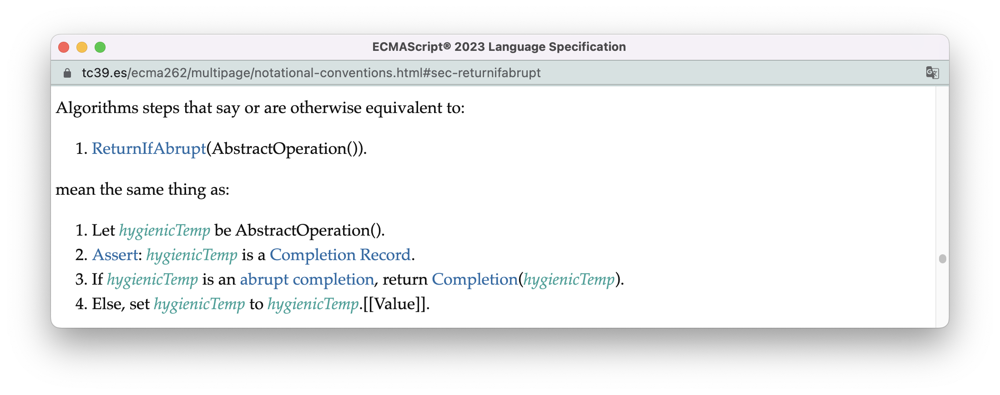
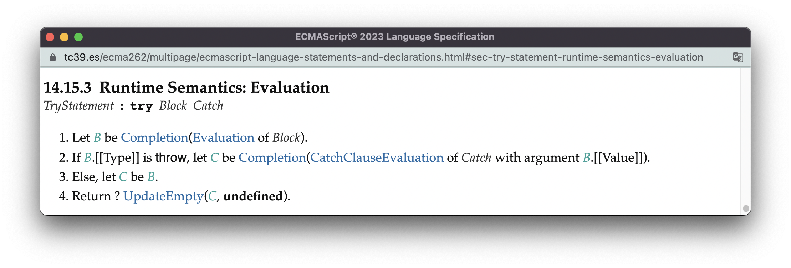
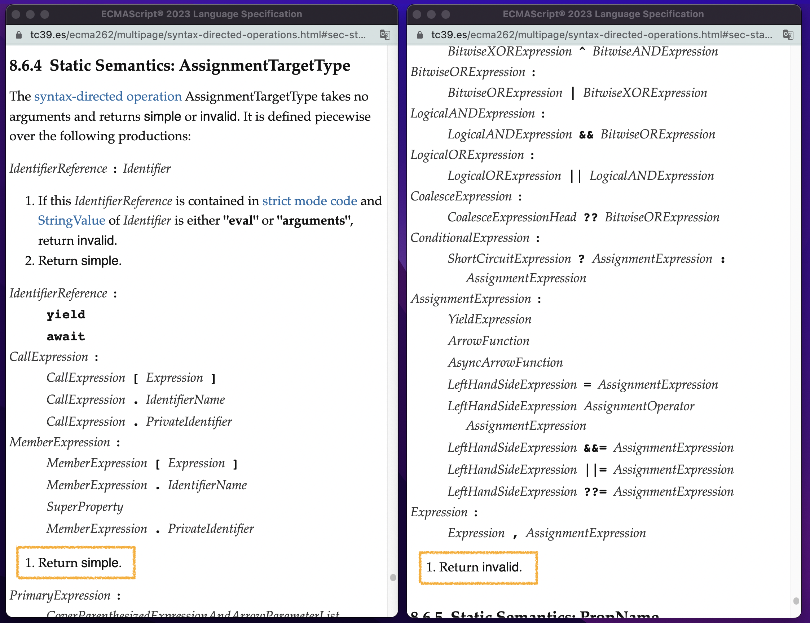
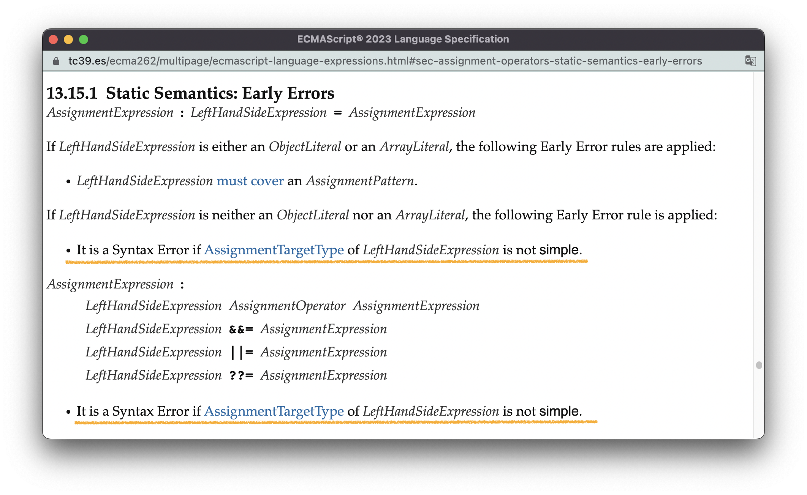
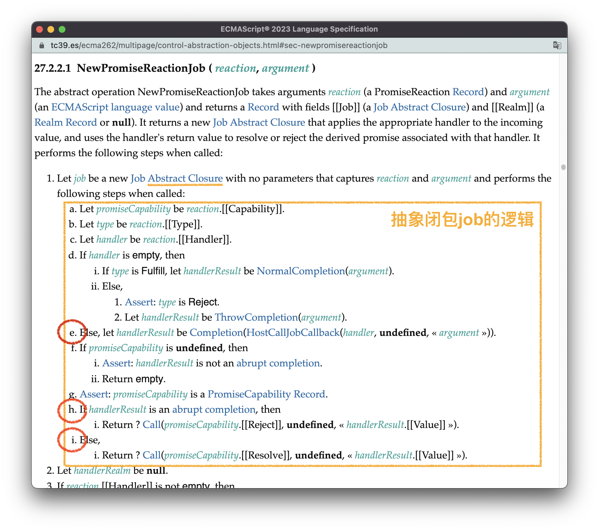

# 规范类型

[上一节](./6.algorithm.md)，我们讲了ECMAScript标准中的算法，而与算法总是形影不离的就是数据结构。

在ECMAScript中，数据类型可以分为两大类：一类称为[语言类型（Language Types）](https://tc39.es/ecma262/multipage/ecmascript-data-types-and-values.html#sec-ecmascript-language-types)，也就是我们熟知的JavaScript中的8种数据类型（Undefined、Null、Boolean、String、Symbol、Number、Bigint、Object）；另一类称为[规范类型（Specification Types）](https://tc39.es/ecma262/multipage/ecmascript-data-types-and-values.html#sec-ecmascript-specification-types)，这是标准内部使用的数据类型。

**规范类型是比语言类型更加底层的数据类型，主要用来表示和存储标准算法的中间状态，且无法被ECMAScript程序直接访问。** 

一些经常被人讨论、但却看不见摸不着的抽象概念，在标准中都有具体的规范类型表示，比如：

- 作用域：使用不同类型的环境记录器表示；
- Realm：使用Realm记录器表示；

理解了规范类型，这些概念对于你来说就不再是“看不见、摸不着”，而是实实在在的“就在哪儿”。

标准中主要的规范类型，我用一张图为你总结：



在本节中，我会介绍这里面主要的规范类型。class相关的规范类型会留在[15.类](./15.class.md)中才作介绍。内存相关的规范类型主要与SharedArrayBuffer、Atomics这种内置对象有关系，属于“冷门”知识，这里不会作介绍，本书暂时也不考虑涉及这方面的内容。


<br/>


### 目录:

- [列表（List）](#列表list)

- [记录器（Record）](#记录器record)

  * [属性描述符记录器（Property Descriptor Record）](#属性描述符记录器property-descriptor-record)

  * [完成记录器（Completion Record）](#完成记录器completion-record)

  * [其他的衍生记录器类型](#其他的衍生记录器类型)

- [Enum](#enum)

- [抽象闭包（Abstract Closure）](#抽象闭包abstract-closure)
<br/>


## 列表（List）

列表类型，顾名思义，是一个含有有序值的列表，你可以理解为标准算法内部使用的“数组”。在标准中，列表使用`«»`表示，如«1, 2»。

列表非常常见。比如，我们在[6.算法](./6.algorithm.md#抽象操作)中用来举例的抽象操作[OrdinaryToPrimitive](https://tc39.es/ecma262/multipage/abstract-operations.html#sec-ordinarytoprimitive)就使用了列表类型：




<br/>


## 记录器（Record）

**记录器（Record）是最常见也是最重要的规范类型，表示字段与值的集合，你可以理解为标准算法内部使用的“对象”。** 

记录器类型的每一个字段使用`[[]]`括住，字段的值可以是规范类型也可以是语言类型。比如以下：

```
 { 
   [[Field1]]: 42, 
   [[Field2]]: false, 
   [[Field3]]: empty 
 } 
```

实际上，单纯的记录器类型使用并不多；真正在标准中被广泛使用的是各种记录器的衍生类型，比如[脚本记录器](https://tc39.es/ecma262/multipage/ecmascript-language-scripts-and-modules.html#sec-scripts)（Script Record）。标准使用抽象操作[ParseScript](https://tc39.es/ecma262/multipage/ecmascript-language-scripts-and-modules.html#sec-parse-script)对普通脚本进行语法解析，得到的结果是一个脚本记录器，这个记录器会在后续代码执行的时候被使用：



这里每一个字段的含义是：

| 字段名             | 含义                                                         |
| ------------------ | ------------------------------------------------------------ |
| [[Realm]]          | 一个Realm记录器，Realm会在[8.执行环境](./8.execution-environment.md#realm)提到。 |
| [[ECMAScriptCode]] | 语法解析得到的解析树                                         |
| [[LoadModules]]    | 加载的模块                                                   |
| [[HostDefined]]    | 由宿主环境自定义的内容                                       |


<br/>


### 属性描述符记录器（Property Descriptor Record）

标准使用[属性描述符记录器](https://tc39.es/ecma262/multipage/ecmascript-data-types-and-values.html#sec-property-descriptor-specification-type)描述对象属性的特点，属性描述符又可以进一步分为数据属性描述符和访问器属性描述符。不同类型的属性描述符，其记录器有不同的字段：

  ```js
{ // 数据属性描述符
  [[Value]]：Language value
  [[Writable]]：Boolean
  [[Enumerable]]：Boolean
  [[Configurable]]：Boolean
}
{ // 访问器属性描述符
  [[Get]]：Object/null
  [[Set]]：Object/null
  [[Enumerable]]：Boolean
  [[Configurable]]：Boolean
}
  ```

我想你应该对这些字段的名称会很熟悉。在标准关于[Object.getOwnPropertyDescriptor(O,P)](https://tc39.es/ecma262/multipage/fundamental-objects.html#sec-object.getownpropertydescriptor)的算法中，我们可以看到这个Object的静态方法是如何使用属性描述符记录器的：



这个静态方法主要在做两个事情：

> 1. 使用对象O的内部方法[[GetOwnProperty]]，获得属性P的属性描述符记录器；
> 2. 通过抽象操作[FromPropertyDescriptor](https://tc39.es/ecma262/multipage/ecmascript-data-types-and-values.html#sec-frompropertydescriptor)把属性描述符记录器（规范类型）转化为对象（语言类型）。

关于对象的内部方法，我会在应用篇[13.对象类型](./13.object-type.md)中再作介绍。


<br/>


### 完成记录器（Completion Record）

[完成记录器](https://tc39.es/ecma262/multipage/ecmascript-data-types-and-values.html#sec-completion-record-specification-type)是非常重要的规范类型，用以表示语句或者算法执行的结果。

完成记录器有3个字段：

| 字段名     | 值                                                         | 含义               |
| ---------- | ---------------------------------------------------------- | ------------------ |
| [[Type]]   | `break`、`continue`、`return`、`throw`、`normal`其中一个值 | 语句完成的类型     |
| [[Value]]  | 除完成记录器以外，任何类型的值。                           | 语句执行产生的值   |
| [[Target]] | 一个类型为String的值或空值                                 | 控制跳转位置的标签 |

其中，[[Type]]字段为`normal`的完成记录器称为**正常完成（normal completion）** ，除此以外其他类型的完成记录器都称为**硬性完成（abrupt completion）** 。

**所有语句的求值语义，结果都会返回一个完成记录器，表示语句执行的结果。** 一般来说，当语句正常执行的时候，返回的是一个[[Type]]为`normal`的完成记录器，即”正常完成“。当语句执行出现错误的时候，返回是一个[[Type]]为`throw`的完成记录器，即”硬性完成“的一种。

当然，具体返回什么类型是由语句自身的求值语义决定的。有的语句可以主动创建硬性完成的记录器，如[break](https://tc39.es/ecma262/multipage/ecmascript-language-statements-and-declarations.html#sec-break-statement-runtime-semantics-evaluation)、[continue](https://tc39.es/ecma262/multipage/ecmascript-language-statements-and-declarations.html#sec-continue-statement-runtime-semantics-evaluation)、[return](https://tc39.es/ecma262/multipage/ecmascript-language-statements-and-declarations.html#sec-return-statement-runtime-semantics-evaluation)、[throw](https://tc39.es/ecma262/multipage/ecmascript-language-statements-and-declarations.html#sec-throw-statement-runtime-semantics-evaluation)语句。下图为break语句的求值语义：



从这张图你也可以看到，break关键词后面紧跟的“标签标识符（LabelIdentifier）”，可以修改完成记录器上的[[Target]]字段。

<br />

有了以上完成记录器的基础知识，我们就可以彻底理解语句的执行过程 —— [语句列表StatmentList](https://tc39.es/ecma262/multipage/ecmascript-language-statements-and-declarations.html#prod-StatementList)的求值语义。我们在[6.算法](./6.algorithm.md#链式产生式的语法导向操作)提到过，对普通脚本、函数体、块语句的求值，基于链式产生式的特点，最终都会导向对它们自身语句列表的求值。而StatementList的求值语义看起来非常简单：


在这张图中，我们有两个需要先注意的地方：

1. 算法中的问号`?`是一段称为[ReturnIfAbrupt](https://tc39.es/ecma262/multipage/notational-conventions.html#sec-returnifabrupt)的固定逻辑的简写。把这段固定逻辑“铺开”是这样的：

   

   > 1. 执行某个子算法；
   > 2. 子算法的执行结果必须是一个完成记录器；
   > 3. 如果执行结果是硬性完成，则直接返回这个执行结果；
   > 4. 否则，使用执行结果中的值（`[[Value]]`字段）继续后续主算法的执行。

   在statmentList求值语义中，这意味着，一旦某个语句的执行出现硬性完成，剩余的语句就不会执行了，整个语句列表的执行结果（返回值）就是这个硬性完成。

2. [UpdateEmpty](https://tc39.es/ecma262/multipage/ecmascript-data-types-and-values.html#sec-updateempty)是一个比较简单的抽象操作。它的过程我就不在这里列出了，你可以点击链接查看。它的作用是：当语句都是正常完成的时候，语句列表最终返回的数值，为最后一个产生了实际值的语句所产生的值，我知道这有一点绕，但是看个标准提供的例子你就明白了：

   ```js
   // 以下执行结果都为1
   eval("1;;;;;")
   eval("1;{}")
   eval("1;var a;")
   ```

基于以上，我们就可以用自然语言描述出语句列表的求值过程：

> 1. 依次执行语句列表中的语句：
>    1. 当某个语句的执行结果为硬性完成，返回这个硬性完成，终止语句列表的执行；
> 2. 如果所有的语句都是正常完成，那么语句列表的执行结果为正常完成，且完成记录器的[[Value]]字段，为执行过程中产生的最后一个[[Value]]字段不为空的完成记录器，其[[Value]]字段的值。

从这里你可以看出，为什么像break、continue、return、throw这些语句可以提前中断后续语句的执行。

当然，中断后续语句的执行并不意味着终止整个程序的执行，具体还需要看外层是如何处理语句列表返回的硬性完成的。比如，我们从[try语句的求值语义](https://tc39.es/ecma262/multipage/ecmascript-language-statements-and-declarations.html#sec-try-statement-runtime-semantics-evaluation)，可以看到try语句是如何“吸收”掉try块产生的执行错误，使得程序得以继续执行：



> 1. 执行try块。
> 2. 如果try块的执行结果是一个类型为`throw`的完成记录器，以该完成记录器的[[Value]]字段的值作为参数，调用catch块的[CatchClauseEvaluation](https://tc39.es/ecma262/multipage/ecmascript-language-statements-and-declarations.html#sec-runtime-semantics-catchclauseevaluation)运行时语义。
> 3. ....

在[17.错误处理](./17.error.md)中，我们会对throw完成记录器的捕获过程进行更加深入的探讨。


<br/>


### 其他的衍生记录器类型

上面提到的只是一部分的记录器类型。其余的记录器类型我会在涉及它们使用场景的相关章节中再作介绍：

- Realm记录器（Realm Record）：[8.执行环境](./8.execution-environment.md#realm)
- 环境记录器（Environment Record）：[9.作用域](./9.scope.md#环境记录器--标识符的容器)
- 引用记录器（Reference Record）：[10.作用域链](./10.scope-chain.md)
- 与class相关的记录器：[15.类](./15.class.md)


<br/>


## Enum

TypeScript中有一个[Enums](https://www.typescriptlang.org/docs/handbook/enums.html)类型，允许开发者定义一系列的常数：

```typescript
enum Direction {
  Up,
  Down,
  Left,
  Right,
}
```

标准中也有一个[Enum类型](https://tc39.es/ecma262/multipage/ecmascript-data-types-and-values.html#sec-enum-specification-type)，作用跟它基本是一样的。

完成记录器[[Type]]字段可能的值为`break`、`continue`、`return`、`throw`、`normal`，这里的每一个值都是Enum类型。

Enum的名只用于与其他的Enum作区分，不带有特殊的含义。

举一个Enum类型的完整使用例子。静态语义[AssignmentTargetType](https://tc39.es/ecma262/multipage/syntax-directed-operations.html#sec-static-semantics-assignmenttargettype)可以判断某个表达式是否可以作为赋值表达式中的被赋值对象使用，如果可以，返回`simple`，否则返回`invalid`。这两个值都是Enum，如下图所示：



在赋值表达式AssignmentExpression的[先验错误](https://tc39.es/ecma262/multipage/ecmascript-language-expressions.html#sec-assignment-operators-static-semantics-early-errors)中，会通过`AssignmentTargetType`检查运算符左边表达式的类型，只有返回结果为`simple`的表达式才能通过检查：



因此，以下的表达式语句都是合法的：

```js
// 普通脚本顶层代码且非严格模式下：
yield = 1;
await = 1;
```

而以下的语句都不能通过先验错误检查：

```js
1 = 1;
this = 1;
a++ = 1;
(a,b) = 1;
a || b = 1;
//  ❌ Uncaught SyntaxError: Invalid left-hand side expression
```


<br/>


## 抽象闭包（Abstract Closure）

[抽象闭包](https://tc39.es/ecma262/multipage/ecmascript-data-types-and-values.html#sec-abstract-closure)也是算法中常见的规范类型，它能够把一段逻辑以及这段逻辑需要用到的值封装起来，并在未来执行。你可以把抽象闭包理解为标准算法内部使用的一种闭包函数。

抽象闭包的创建模版一般如下所示：

> 1. Let （闭包名称） be a new Abstract Closure with parameters（参数名）that captures（参数值）and performs the following steps when called:
>
>    1. ....（闭包的逻辑）
>
>       ....

promise的链式调用就是通过抽象闭包实现。抽象操作[NewPromiseReactionJob](https://tc39.es/ecma262/multipage/control-abstraction-objects.html#sec-newpromisereactionjob)会使用抽象闭包对开发者注册的promise任务（`handler`）再进行一次封装。



它的关键逻辑就在用红色圈圈出的三步。当`handler`到点执行的时候（比如一个宏任务执行完毕，轮到微任务执行了），实际触发的是这个抽象闭包job：

> 1. （步骤e）先执行handler的逻辑
> 2. （步骤h）如果handler的执行结果是硬性完成，则reject promise（这会在后续触发这个promise上，使用catch方法及then方法第二个参数注册的promise任务）。
> 3. （步骤i）如果执行结果是正常完成，则resolve promise（这会在后续触发这个promise上使用then方法第一个参数注册的promise任务）。

基于此，promise得到了链式调用的能力，如下面的代码所示：

```js
Promise.resolve().then(() => {   // a. then方法会创建一个新的promise
  throw '触发硬性完成'             //  b. 硬性完成的handler导致新的promise被reject
}).catch(() => console.log("链式调用")) //  c. 进而链式触发了注册在新promise上的catch方法
```
