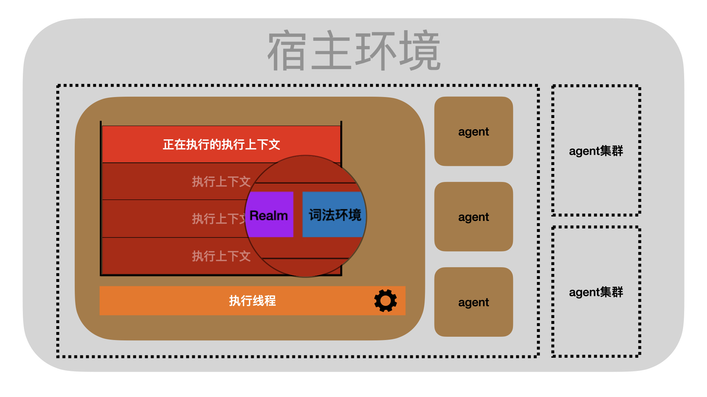
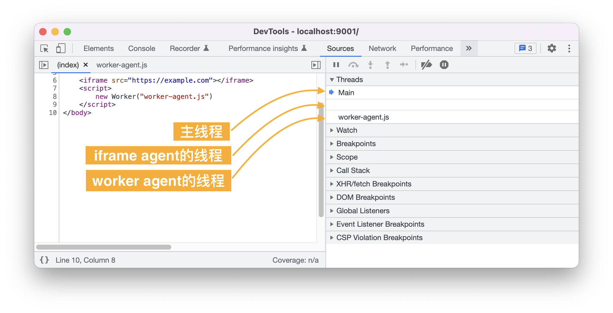
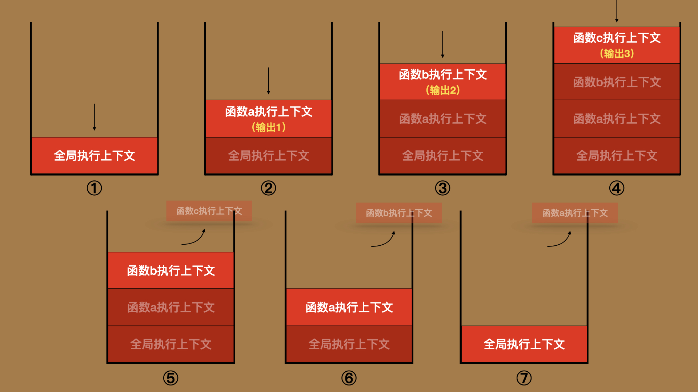
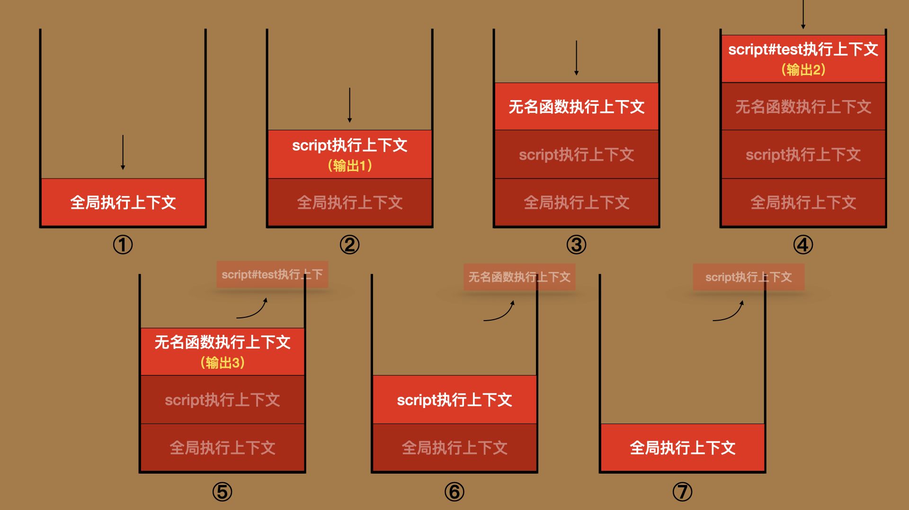
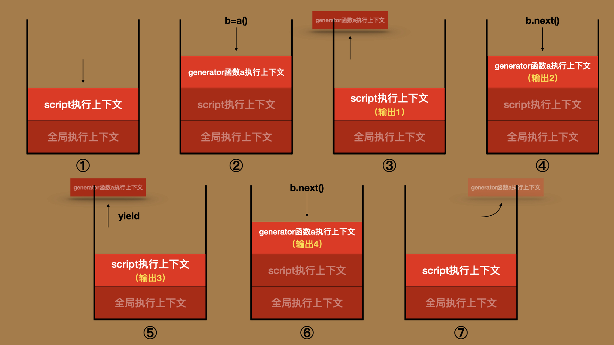
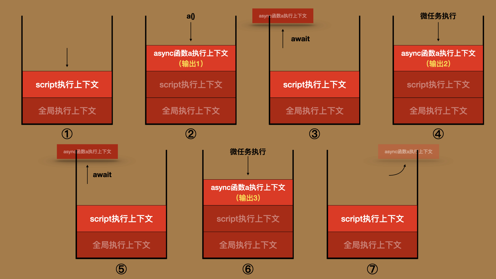
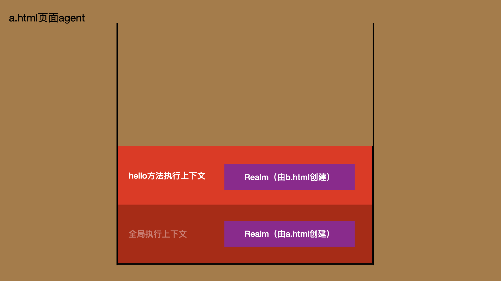

# ECMAScript执行环境

在[3.宿主环境](./3.host-environment.md)我们提到过，ECMAScript必须依赖一个**宿主环境**才能实现完整的功能。下图是在宿主环境中，与执行ECMAScript相关的“组件”：



总的来说，每个ECMAScript程序都必须在一个名为**agent**的区域内执行。一个agent对应一条**执行线程**。一个宿主可以有多个agent，当两个agent同处一个**agent集群**时，它们可以共享内存。

每一个agent都有自己独享的、且唯一的**执行上下文栈**，也称为调用栈，用来管理agent内代码的执行顺序。栈内可能会有一个或多个**执行上下文**，栈顶元素是**正在执行的执行上下文**。

每个执行上下文都有一个对应的**Realm**，来提供代码执行的基础资源。由代码创建的执行上下文，还会有一个**词法环境**，它是作用域链的起点。

本节，我将会对这些环境中的组件，按照从大到小的顺序进行介绍。


<br/>


### 目录:

- [Agents与Agent集群](#agents与agent集群)

  * [Agent集群](#agent集群)

- [调用栈与执行上下文](#调用栈与执行上下文)

  * [执行上下文远不止3种创建方式](#执行上下文远不止3种创建方式)

  * [执行上下文是实现异步编程的基础](#执行上下文是实现异步编程的基础)

  * [执行上下文中的词法环境是作用域链的起点](#执行上下文中的词法环境是作用域链的起点)

- [Realm](#realm)
<br/>


## Agents与Agent集群

在[HTML标准8.1.2](https://html.spec.whatwg.org/multipage/webappapis.html#integration-with-the-javascript-agent-formalism)中，定义了在浏览器宿主中3类不同的agent：

- `Similar-origin window agent`：新建一个浏览器窗口/标签、使用iframe加载一个新的页面都会创建这类agent。这类agent有自己关联的`window`对象。
- `worker agent`：新建一个worker时创建的agent，这类agent有自己专属的 `global`对象。worker agent还可以进一步分为*Dedicated worker agent*、*Shared worker agent*、*Service worker agent*。
- `worklet agent`: 开发者无法直接使用这个agent，这是浏览器实现自身功能的一个基础设施。

**具体的说，一个[agent](https://tc39.es/ecma262/multipage/executable-code-and-execution-contexts.html#agent)包含：一条执行线程、一个agent记录器（Agent Record）、以及一个调用栈。** 

**执行线程会执行调用栈中执行上下文的任务。** 尽管标准提到，不同的agent允许共享同一条执行线程，但现代浏览器基本上都是给每个agent启用一条独立的线程。给以下代码启动一个HTTP服务，你便可以在debugger上观测到这一点：

 ```html
 <body>
     <iframe src="https://example.com"></iframe> 
     <script>
         new Worker("worker-agent.js")
     </script>
 </body>
 ```

在这里，主页面、worker、iframe所创建的agent都独享一个线程：



执行线程另一个更加为人熟知的名字叫「事件循环」，我们在[3.宿主环境](./3.host-environment.md)提到过，“事件循环”这个概念来自于HTML标准而不是ECMAScript标准。如果你想了解HTML标准是如何定义“事件循环”的，可以阅读[8.1 浏览器的事件循环](https://github.com/Lawliet01/HTML-spec-decipherment/blob/main/8.1.md)，这是来自《人人都能读标准》的第二部 —— [HTML篇（重构中）](https://github.com/Lawliet01/HTML-spec-decipherment)里面的文章。


<br/>


### Agent集群

一个[Agent集群（agent clusters）](https://tc39.es/ecma262/multipage/executable-code-and-execution-contexts.html#sec-agent-clusters)可能包含多个agents，位于同一agent集群中的agent可以通过SharedArrayBuffer等内置对象进行内存共享。

计算机基础告诉我们：「线程（threads）」不能单独存在，它由「进程（process）」启动和管理，位于同一进程中的线程可以共享数据。从这个角度看，Agent集群划定了“进程的边界”。

[Agent记录器](https://tc39.es/ecma262/multipage/executable-code-and-execution-contexts.html#_ref_3969)的所有字段，都与内存操作相关，为了不偏离主题，这里便不再展开，让我们把更多的注意力放在更为重要的地方上，即agent的最后一个组成部分 —— 调用栈以及栈内的执行上下文。


<br/>


## 调用栈与执行上下文

我先对执行上下文常见的理解做一个总结：

> JavaScript使用执行上下文追踪运行时执行的代码，并使用调用栈来管理执行上下文。比如，每调用一个函数都会创建一个新的执行上下文，并压入栈顶；当这个函数执行完毕，对应的执行上下文就会从栈顶弹出。因而，栈顶永远是正在执行的上下文。当调用栈的空间被占满的时候，就会出现栈溢出的问题。
>
> 执行上下文一共有三种创建方式：
>
> - 执行全局代码会创建全局执行上下文
> - 执行函数会创建函数执行上下文
> - 使用`eval`方法会创建eval执行上下文。
>
> 比如，执行以下的代码：
>
> ```js
> a()
> function a(){
>   console.log(1)
>   b()
> }
> function b(){
>   console.log(2)
>   c()
> }
> function c(){
>   console.log(3)
> }
> 
> // 连续输出1,2,3
> ```
>
> 调用栈会经历下图中的过程：
>
> 

这里的内容大体上是对的，但也有错误或者说不完整的地方。我们现在再来看看标准对于[执行上下文](https://tc39.es/ecma262/multipage/executable-code-and-execution-contexts.html#sec-execution-contexts)的描述：


<br/>


### 执行上下文远不止3种创建方式

如果你对标准进行一次全文检索，你会发现创建执行上下文的方式有这么几种：

1. [程序初始化](https://tc39.es/ecma262/multipage/executable-code-and-execution-contexts.html#sec-initializehostdefinedrealm)的时候会创建一个全局执行上下文；
2. [普通脚本Script的执行](https://tc39.es/ecma262/multipage/ecmascript-language-scripts-and-modules.html#_ref_7902)会创建执行上下文；
3. [模块脚本Module环境初始化时](https://tc39.es/ecma262/multipage/ecmascript-language-scripts-and-modules.html#_ref_8374)会创建执行上下文；
4. [模块脚本Module的执行](https://tc39.es/ecma262/multipage/ecmascript-language-scripts-and-modules.html#_ref_8391)会创建执行上下文；
5. [函数的执行](https://tc39.es/ecma262/multipage/ordinary-and-exotic-objects-behaviours.html#_ref_4392)会创建执行上下文；
6. [eval方法的执行](https://tc39.es/ecma262/multipage/global-object.html#_ref_8715)会创建执行上下文；
7. [会创建迭代器](https://tc39.es/ecma262/multipage/control-abstraction-objects.html#sec-createiteratorfromclosure)的内置对象方法，如`Array.prototype.keys()`、`Map.prototype.values()`，执行时会额外创建一个与迭代器关联的执行上下文；

第一种方式与第二种方式常常被混为一谈。我们在[前言](./Preface.md)已经分析过了，如果普通脚本的执行不会创建新的执行上下文，以下的代码就不可能正常按照1、2、3输出：

```html
<script id="test"></script>
<script>
    console.log(1); 
    (function(){
        document.getElementById('test').innerHTML = "console.log(2);"
        console.log(3)
    })()
</script>
```

执行这段代码，实际的调用栈变化过程如下图所示：



而模块脚本执行上下文是被普遍忽视的部分。正因为模块的执行也会创建执行上下文，才使得以下的代码得以正常按照1，2，3的顺序输出：

```html
<!-- index.html -->
<script>
    console.log(1);
    (async function(){
        await import('./test.js')
        console.log(3)
    })()
</script>

<!-- test.js文件 -->
console.log(2)
```

此时调用栈的变化过程如下图所示：


<br/>


### 执行上下文是实现异步编程的基础

我还是先用可视化的方式为你呈现异步执行过程中调用栈的变化：

以下是一个Generator函数：

```js
function* a(){
    console.log(2);
    yield;
    console.log(4);
}
b = a()
console.log(1)
b.next()
console.log(3)
b.next()
```

执行过程中，调用栈的变化如下图所示：



以下是一个async函数：

```js
async function a(){
    console.log(1)
    await 0;
    console.log(2);
    await 0;
    console.log(3);
}
a()
```

此时，调用栈的变化过程如下图所示：



从上面两个例子你肯定可以看出，**当遇到yield或者await语句的时候，栈顶的执行上下文会弹出但不会销毁。待未来的某个时机，比如generator调用next方法，或轮到promise的微任务被执行，此时原来的执行上下文会重新压入栈顶，并从前面中断的部分继续执行。** 

标准在执行上下文身上定义了许多不同的[组件（component）](https://tc39.es/ecma262/multipage/executable-code-and-execution-contexts.html#table-state-components-for-all-execution-contexts)。比如，普通脚本、模块脚本所创建的执行上下文，会把解析后得到的[脚本记录器](https://tc39.es/ecma262/multipage/ecmascript-language-scripts-and-modules.html#sec-script-records)、[模块记录器](https://tc39.es/ecma262/multipage/ecmascript-language-scripts-and-modules.html#sec-source-text-module-records)存储在执行上下文的`ScriptOrModule`组件中；而函数创建的执行上下文，会把函数对象存储在执行上下文的`Function`组件中；这两个组件都记录了执行上下文需要执行的代码逻辑。

**与异步相关的关键组件是`code evaluation state`组件。它用于保存执行上下文中代码执行的状态。当代码执行需要暂停的时候（如遇到yield或者await语句），当前代码的执行状态就会保存在该组件中；待代码恢复执行的时候，就会从这个状态开始继续执行。这个组件使得执行上下文关联的代码逻辑可以实现暂停 -> 恢复执行 -> 再暂停 -> 再恢复执行。** 

以上就是ECMAScript实现异步编程的核心方式。

我为你找到了标准中关于generator异步执行以及async函数异步执行的核心算法，有兴趣你可以先自行阅读：

- [GeneratorStart](https://tc39.es/ecma262/multipage/control-abstraction-objects.html#sec-generatorstart) / [GeneratorResume](https://tc39.es/ecma262/multipage/control-abstraction-objects.html#sec-generatorresume) / [GeneratorYield](https://tc39.es/ecma262/multipage/control-abstraction-objects.html#sec-generatoryield)
- [AsyncBlockStart](https://tc39.es/ecma262/multipage/control-abstraction-objects.html#sec-asyncblockstart) / [Await](https://tc39.es/ecma262/multipage/control-abstraction-objects.html#await)

这些算法，我都会在应用篇[16.生成器](./16.iterator&generator.md)和[18.promise](./18.promise.md)作详细的讲解。


<br/>


### 执行上下文中的词法环境是作用域链的起点

严谨的说，上面的调用栈变化图也还是不完整的。因为像`console.log()`这样的内置函数在执行的时候，实际上也是会创建执行上下文的。

我没有在图中显示它的执行上下文，一个主要原因，当然是为了简洁性。但我之所以可以把它省略掉，是因为它创建的执行上下文对我的分析毫无影响。`console.log`的逻辑是由原生代码编写的，也许它执行的过程中还创建了其他的上下文，但我无法观察它的行为，也无法控制它的行为，正常情况，它的执行也不应该影响我的行为。而那些由我自己编写的函数就不一样了，这种函数不仅可能会影响我其他代码执行的先后顺序，还可能会改变其他代码变量查找的结果。

在ECMAScript中，把那些由开发者编写的代码所创建的执行上下文称为[ECMAScript代码执行上下文（ECMAScript code execution contexts）](https://tc39.es/ecma262/multipage/executable-code-and-execution-contexts.html#ecmascript-code-execution-context)。在我们[前面](#执行上下文远不止3种创建方式)列举的7种创建执行上下文的方式中，使用（2）普通脚本、（3、4）模块脚本、（6）eval方法、以及由开发者编写的函数，所创建都是ECMAScript代码执行上下文。

与由内部代码创建的执行上下文相比，这种执行上下文多了三个组件：

- LexicalEnvironment：词法环境，标识符解析的起点。
- VariableEnvironment：变量环境，绑定使用var声明的变量。
- PrivateEnvironment：私有环境，绑定class的私有字段。

这里面最重要的就是词法环境，它是每一条作用域链的起点。全局执行上下文以及内置函数执行上下文，没有这样的组件，所以在分析作用域链的时候，我们不需要考虑到它们。

当然，这一部分内容，需要更多的作用域相关知识才能解释清楚。我会在[9.作用域](./9.scope.md)/[10.作用域链](./10.scope-chain.md)两个章节中为你介绍这部分的知识。


<br />

而关于执行上下文，还剩最后一个重要的组件，就是`Realm`组件。


<br/>


## Realm

每个agent中的代码得以执行前，都必须先初始化它的Realm，这个过程由抽象操作[InitializeHostDefinedRealm](https://tc39.es/ecma262/multipage/executable-code-and-execution-contexts.html#sec-initializehostdefinedrealm)完成。这个抽象操作主要做的事情是：

1. [新建](https://tc39.es/ecma262/multipage/executable-code-and-execution-contexts.html#sec-createrealm)一个[Realm记录器](https://tc39.es/ecma262/multipage/executable-code-and-execution-contexts.html#realm-record)；
2. 创建所有[ECMAScript的固有对象](https://tc39.es/ecma262/multipage/ecmascript-data-types-and-values.html#sec-well-known-intrinsic-objects)，存储在Realm记录器的`[[Intrinsics]]`字段上。固有对象是那些帮助完成语言基础功能的对象（如Object、Array、Number...），标准的第19～28章定义了这些固有对象。
3. 创建一个全局对象，存储在Realm记录器的`[[GlobalObject]]`字段上。我们在[3.宿主环境](./3.host-environment.md)中已经提到，不同的宿主创建的全局对象可能不同，浏览器宿主创建的是window。
4. 创建一个全局环境记录器，存储在Realm记录器的`[[GlobalEnv]]`字段上。全局环境记录器用于绑定全局标识符，与全局作用域相关，这部分的内容会留在[9.作用域](./9.scope.md)中解释。

从Realm的创建过程你可以看出，**Realm是用来给程序的执行提供最基础的资源。** 

每一个执行上下文都有一个Realm组件，指向该执行上下文关联的代码执行时所使用的Realm。这同时也暗示了，同一调用栈内，不同的执行上下文可能会指向不同Realm。比如以下的代码：

```html
<!-- a.html - 主页面-->
<iframe src="b.html"></iframe>
<button onclick="frames[0].hello()">Hello</button>

<!-- b.html - iframe页面 -->
<script>
  window.hello = () => {
    debugger; // 
  };
</script>
```

当点击button时，调用栈上的执行上下文，内部的Realm是不一样的：



你也可以使用以下代码观察到这一点。`Function.prototype`是一个固有对象，一般来说，函数创建的时候会以它为原型。但从下面的代码你可以看到，b页面中的hello方法，其原型与a页面的中`Function.prototype`是不等的：

```js
// a.html中
let helloFn = frames[0].hello
console.log(Object.getPrototypeOf(helloFn) === Function.prototype) // false 
console.log(Object.getPrototypeOf(helloFn) === frames[0].Function.prototype) // true
```

这是因为不管a页面还是b页面，在初始化Realm的时候都各自创建了一套自己使用的固有对象，所以b页面的函数在创建的时候，使用的是b页面中的`Function.prototype`。

在HTML标准中，使用一个[settings object](https://html.spec.whatwg.org/multipage/webappapis.html#environment-settings-objects)对象来标识不同的Realm，setting Object会存储在Realm的`[[HostDefined]]`字段上。

