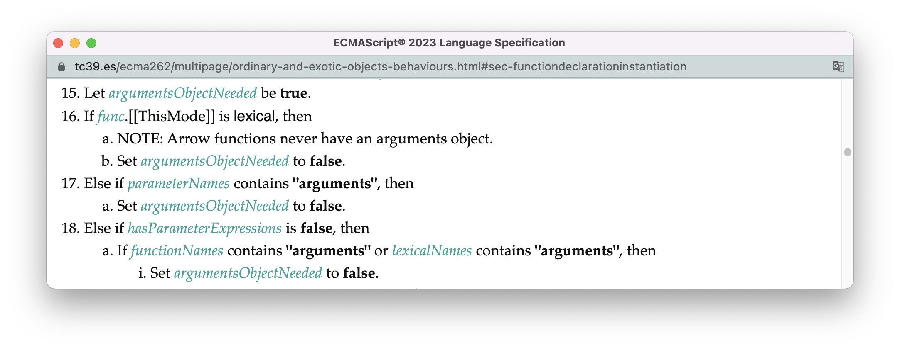
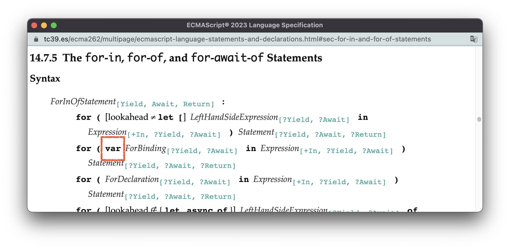
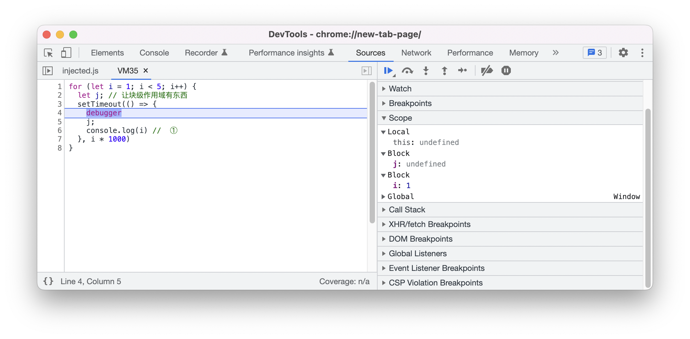

# 作用域

如果你还有印象的话，在[前言](./Preface.md)，我提到过这么一个事情，绝大多数在讲“作用域”的技术文章实际上都在“盲人摸象”：

> 某技术文章1：作用域是据名称来查找变量的一套规则。
>
> 某技术文章2：作用域指程序中定义变量的区域，它决定了当前执行代码对变量的访问权限。
>
> 某技术文章3：作用域，是指变量的生命周期（一个变量在哪些范围内保持一定值）。
>
> 某技术文章4：作用域是在运行时代码中的某些特定部分中变量，函数和对象的可访问性。
>
> ...

这些关于作用域的“定义”，描述的都只是作用域的某一个方面，而不是全貌。这种片面、模糊的描述，不仅让人觉得“把握”不住作用域，更严重的是它所带来的连锁反应 —— 基于作用域建立的或与作用域有强关联的其他概念，如作用域链、执行上下文等等，也无法被准确描述出来。

**标准使用环境记录器（Environment Record）这样一个具体的规范类型来表示作用域。** 

正因为有一个具体的事物可以依赖，所以关于作用域的各方各面，都得以进行准确、完整且毫无歧义的描述。比如，执行不同的代码会创建什么样的环境记录器、具体的创建过程是怎么样的、以及创建之后要做些什么，标准都事无巨细地给你讲清楚了：

| 执行代码 | 创建的记录器类型                                             | 创建算法                                                     | 声明实例化算法                                               |
| -------- | ------------------------------------------------------------ | ------------------------------------------------------------ | ------------------------------------------------------------ |
| 全局代码 | [全局环境记录器](https://tc39.es/ecma262/multipage/executable-code-and-execution-contexts.html#sec-global-environment-records) | [NewGlobalEnvironment](https://tc39.es/ecma262/multipage/executable-code-and-execution-contexts.html#sec-newglobalenvironment) | [GlobalDeclarationInstantiation](https://tc39.es/ecma262/multipage/ecmascript-language-scripts-and-modules.html#sec-globaldeclarationinstantiation) |
| 模块代码 | [模块环境记录器](https://tc39.es/ecma262/multipage/executable-code-and-execution-contexts.html#sec-module-environment-records) | [NewModuleEnvironment](https://tc39.es/ecma262/multipage/executable-code-and-execution-contexts.html#sec-newmoduleenvironment) | [InitializeEnvironment](https://tc39.es/ecma262/multipage/ecmascript-language-scripts-and-modules.html#sec-source-text-module-record-initialize-environment) |
| 函数代码 | [函数环境记录器](https://tc39.es/ecma262/multipage/executable-code-and-execution-contexts.html#sec-function-environment-records) | [NewFunctionEnvironment](https://tc39.es/ecma262/multipage/executable-code-and-execution-contexts.html#sec-newfunctionenvironment) | [FunctionDeclarationInstantiation](https://tc39.es/ecma262/multipage/ordinary-and-exotic-objects-behaviours.html#sec-functiondeclarationinstantiation) |
| 块级代码 | [声明式环境记录器](https://tc39.es/ecma262/multipage/executable-code-and-execution-contexts.html#sec-declarative-environment-records) | [NewDeclarativeEnvironment](https://tc39.es/ecma262/multipage/executable-code-and-execution-contexts.html#sec-newdeclarativeenvironment) | [BlockDeclarationInstantiation](https://tc39.es/ecma262/multipage/ecmascript-language-statements-and-declarations.html#sec-blockdeclarationinstantiation) |
| with语句 | [对象环境记录器](https://tc39.es/ecma262/multipage/executable-code-and-execution-contexts.html#sec-object-environment-records) | [NewObjectEnvironment](https://tc39.es/ecma262/multipage/executable-code-and-execution-contexts.html#sec-newobjectenvironment) | 同块级代码                                                   |

正因为有一个具体的事物可以依赖，所以作用域与其他概念的关系也是清晰无比的：**每个环境记录器都有一个`[[OuterEnv]]`字段指向另一个环境记录器，通过这个字段连接起来的所有环境记录器就构成了一条作用域链。每个「ECMAScript代码执行上下文」都会有一个「词法环境」组件，指向一个环境记录器，这是该执行上下文中的代码变量查找的起点，也就是作用域链的起点。调用栈上有几个ECMAScript代码执行上下文，运行环境中就有几条作用域链。** 

也正因为有一个具体的事物可以依赖，所以我得以在这本书中使用大量的图例，为你可视化作用域、作用域链、执行上下文它们之间的关系以及互动的过程。

在本节中，我会先介绍环境记录器，包括它不同的类型以及基本使用方式；然后基于环境记录器，我会非常详细地讲所有代码执行前都必须先经历的一个过程 —— 声明实例化。作用域链的部分会留在[下一节](./10.scope-chain.md)进行讲解。


<br/>


### 目录:

- [环境记录器 —— 标识符的容器](#环境记录器--标识符的容器)

  * [不同类型的环境记录器](#不同类型的环境记录器)

- [声明实例化 —— 标识符的绑定过程](#声明实例化--标识符的绑定过程)

- [声明实例化的一般过程](#声明实例化的一般过程)

  * [1. 作用域分析](#1-作用域分析)

  * [2. 绑定标识符](#2-绑定标识符)

- [全局声明实例化](#全局声明实例化)

- [块级声明实例化](#块级声明实例化)

- [函数声明实例化](#函数声明实例化)

- [for声明绑定实例化](#for声明绑定实例化)

- [其他声明实例化](#其他声明实例化)
<br/>


## 环境记录器 —— 标识符的容器

环境记录器是用来绑定代码中的**标识符**的，你可以把标识符理解为变量名。

当我们使用声明语句的时候，语句的标识符会绑定在某个特定的环境记录器中。比如下面的全局代码，会把a、b、c、d这4个标识符绑定在全局环境记录器中。

```js
const a = 1
let b = 2
var c = 3
function d(){console.log(4)}
```

于是，在未来的某个时间节点，我们可以在全局环境记录器上获取这些标识符，这个过程也称为**标识符的解析（resolve）** ：

```js
console.log(a, b, c)
d()
// 1,2,3
// 4
```

值得一提的是，这里的`console`其实也是一个标识符，但在程序初始化的时候就已经绑定在全局环境记录器上了。


你或许曾经听说过js引擎会把原始类型存储在栈中，把引用类型存储在堆中。标准没有任何地方提及过这方面的内容，这一部分是“实现定义”的。（如果你忘了什么是实现定义，可见[3.宿主环境](./3.host-environment.md)）


<br/>


### 不同类型的环境记录器

ECMAScript定义了5种环境记录器：

- [声明式环境记录器](https://tc39.es/ecma262/multipage/executable-code-and-execution-contexts.html#sec-declarative-environment-records)（Declarative Environment Records）：用途最广，最常用于绑定块级语句内的标识符。
- [函数环境记录器](https://tc39.es/ecma262/multipage/executable-code-and-execution-contexts.html#sec-function-environment-records)（Function Environment Records）：用于绑定函数体内的标识符。
- [全局环境记录器](https://tc39.es/ecma262/multipage/executable-code-and-execution-contexts.html#sec-global-environment-records)（Global Environment Records）：用于绑定全局顶层代码的标识符。
- [对象环境记录器](https://tc39.es/ecma262/multipage/executable-code-and-execution-contexts.html#sec-object-environment-records)（Object Environment Records）：可以把一个对象中的属性方法抽取出来作为标识符绑定在环境中，这是with语句和全局对象所使用的记录器。
- [模块环境记录器](https://tc39.es/ecma262/multipage/executable-code-and-execution-contexts.html#sec-module-environment-records)（Module Environment Records）：用于绑定模块顶层代码的标识符。

不同类型的环境记录器都有一些同名的方法，用于对记录器中的标识符进行增、删、改、查：

- 增：使用`CreateMutableBinding(N)`方法创建可变的标识符绑定；使用`CreateImmutableBinding(N)`方法创建不可变的绑定；
- 删：使用`DeleteBinding(N)`方法删除标识符的绑定；
- 改：使用`SetMutableBinding(N, V)`方法修改标识符的关联值；
- 查：使用`HasBinding(N)`方法查找环境中是否绑定了某个标识符，使用`GetBindingValue(N)`获得该标识符的关联值。

这些方法都是多态的：即同一名字的方法，不同的环境记录器具体逻辑可能会不一样。

所有的环境记录器还会有一个`[[OuterEnv]]`字段，指向另一个环境记录器，构成解析标识符时的先后顺序。

当然，不同类型的环境记录器根据自身的业务需求也会有许多其他的方法和字段，你可以从上面我为你提供的链接，看到不同记录器所有方法的逻辑以及字段的含义。


<br/>


## 声明实例化 —— 标识符的绑定过程

ECMAScript把源码分为[4类](https://tc39.es/ecma262/multipage/ecmascript-language-source-code.html#sec-types-of-source-code)，分别是：

- 全局代码：能以目标符[Script](https://tc39.es/ecma262/multipage/ecmascript-language-scripts-and-modules.html#prod-Script)进行解析，但不包括内嵌的函数代码。
- 模块代码：能以目标符[ModuleBody](https://tc39.es/ecma262/multipage/ecmascript-language-scripts-and-modules.html#prod-ModuleBody)进行解析，但不包括内嵌的函数代码。
- 函数代码：能以各种类型的函数/类目标符进行解析，但不包括内嵌的函数代码。
- eval代码：由内置函数eval的参数提供，会以目标符[Script](https://tc39.es/ecma262/multipage/ecmascript-language-scripts-and-modules.html#prod-Script)进行解析。

还记得我们在[8.执行环境](./8.execution-environment.md)中说的吗？这四种代码都会创建执行上下文。除了这一点，**在这些源码得以执行之前，它们都必须创建对应的环境记录器，并进行声明实例化（DeclarationInstantiation）。声明实例化会扫描源码区域中所有的声明语句，并根据声明语句的类型，在环境记录器中对语句中的标识符作相应的绑定操作。** 

有的地方会把“声明实例化”说成是“编译”，并说JavaScript会“先编译，后执行”，还是一样，我们照例沿用标准的术语。

这4种代码对应的声明实例化过程的核心算法我给你全找出来了：

- 全局声明实例化：[GlobalDeclarationInstantiation](https://tc39.es/ecma262/multipage/ecmascript-language-scripts-and-modules.html#sec-globaldeclarationinstantiation)
- 模块声明实例化：[InitializeEnvironment](https://tc39.es/ecma262/multipage/ecmascript-language-scripts-and-modules.html#sec-source-text-module-record-initialize-environment)
- 函数声明实例化：[FunctionDeclarationInstantiation](https://tc39.es/ecma262/multipage/ordinary-and-exotic-objects-behaviours.html#sec-functiondeclarationinstantiation)
- eval声明实例化：[EvalDeclarationInstantiation](https://tc39.es/ecma262/multipage/global-object.html#sec-evaldeclarationinstantiation)

在es6之后，为了支持块级作用域，又多了两种声明实例化过程：

- 块级声明实例化；[BlockDeclarationInstantiation](https://tc39.es/ecma262/multipage/ecmascript-language-statements-and-declarations.html#sec-blockdeclarationinstantiation)
- for声明绑定实例化：[ForDeclarationBindingInstantiation](https://tc39.es/ecma262/multipage/ecmascript-language-statements-and-declarations.html#sec-runtime-semantics-fordeclarationbindinginstantiation)。

在本节剩余的内容中，我会先讲声明实例化的一般过程，然后再给你展开这里每一种声明实例化的实际过程。


<br/>


## 声明实例化的一般过程

声明实例化主要可以分为两个步骤：

1. 作用域分析：扫描源码中的声明语句，得到不同类型的标识符。
2. 绑定标识符：对不同类型的标识符进行不同的绑定操作。


<br/>


### 1. 作用域分析

**在ECMAScript中，声明语句可以分为这么4类：** 

- [HoistableDeclaration](https://tc39.es/ecma262/multipage/ecmascript-language-statements-and-declarations.html#prod-HoistableDeclaration)：包括普通函数、Generator函数、Async函数、AsyncGenerator函数的声明语句（以下统称“函数声明”）；
- [ClassDeclaration](https://tc39.es/ecma262/multipage/ecmascript-language-functions-and-classes.html#prod-ClassDeclaration)：类声明语句；
- [LexicalDeclaration](https://tc39.es/ecma262/multipage/ecmascript-language-statements-and-declarations.html#prod-LexicalDeclaration)：使用let和const的声明语句；
- [VariableStatement](https://tc39.es/ecma262/multipage/ecmascript-language-statements-and-declarations.html#prod-VariableStatement)：使用var的声明语句。

作用域分析是基于[8.2 Scope Analysis](https://tc39.es/ecma262/multipage/syntax-directed-operations.html#sec-syntax-directed-operations-scope-analysis)定义的静态语义完成的。声明实例化的过程会使用这里提供的静态语义，把代码中的声明语句分类为「词法声明（lexicalDeclared）」和「变量声明（VarDeclaraed）」，并收集这些声明语句的标识符。

作用域分析是有边界的。我们在上面说过，全局代码不包含内嵌的函数代码，所以对全局代码的作用域分析不会侵入到内嵌函数代码中（但依旧会收集该函数的标识符），函数体内的代码会在函数声明实例化的时候才进行作用域分析。

作用域分析的结果可以总结为：**类声明语句、let/const声明语句永远归类为词法声明；var声明语句永远归类为变量声明；函数声明语句在全局顶层代码和函数顶层代码中，归类为变量声明，其他地方则归类为词法声明。** 

以下我会深入标准算法的细节，为你展示作用域分析的过程。如果你不太感兴趣，可以直接跳过看第二步 —— [标识符的绑定](#2-绑定标识符)。

<br />

所有声明实例化过程中的作用域分析都会由以下两个静态语义启动：

- [VarDeclaredNames](https://tc39.es/ecma262/multipage/syntax-directed-operations.html#sec-static-semantics-vardeclarednames)：判断语句是否为变量声明语句，如果是，获取该语句的标识符。
- [LexicallyDeclaredNames](https://tc39.es/ecma262/multipage/syntax-directed-operations.html#sec-static-semantics-lexicallydeclarednames)：判断语句是否为词法声明语句，如果是，获取该语句的标识符。

（有的声明实例化会使用[VarScopedDeclarations](https://tc39.es/ecma262/multipage/syntax-directed-operations.html#sec-static-semantics-varscopeddeclarations)与[LexicallyScopedDeclarations](https://tc39.es/ecma262/multipage/syntax-directed-operations.html#sec-static-semantics-lexicallyscopeddeclarations)，他们与上面两个静态语义没有本质区别，只是一个收集标识符，一个收集整个语句。）

下图为`VarDeclaredNames`静态语义的片段，这里展示了3种语句执行该静态语义的逻辑：


这里每一条静态语义分别可以总结为：

- 对于语句列表[StatementList](https://tc39.es/ecma262/multipage/ecmascript-language-statements-and-declarations.html#prod-StatementList)：该静态语义会对语句列表中的每一个语句，继续调用这个静态语义，最后返回所有执行结果的集合。
- 对于声明语句[Declaration](https://tc39.es/ecma262/multipage/ecmascript-language-statements-and-declarations.html#prod-Declaration)：该静态语义会返回一个空列表。由于[HoistableDeclaration](https://tc39.es/ecma262/multipage/ecmascript-language-statements-and-declarations.html#prod-HoistableDeclaration)、[ClassDeclaration](https://tc39.es/ecma262/multipage/ecmascript-language-functions-and-classes.html#prod-ClassDeclaration)、[LexicalDeclaration](https://tc39.es/ecma262/multipage/ecmascript-language-statements-and-declarations.html#prod-LexicalDeclaration)都是目标符`Declaration`的代换式，所以，函数声明语句、class声明语句、let/const声明语句都不属于变量声明语句。
- 对于变量声明语句[VariableStatement](https://tc39.es/ecma262/multipage/ecmascript-language-statements-and-declarations.html#prod-VariableStatement)：该静态语义会返回该语句的标识符（通过静态语义[BoundNames](https://tc39.es/ecma262/multipage/syntax-directed-operations.html#sec-static-semantics-boundnames)获取）。

因此，对以下模块脚本中的语句列表执行`VarDeclaredName`静态语义，最终得到的结果是`«"c"»`：

```html
<script type=module>
  const a = 1
  let b = 2
  var c = 3
  function d(){console.log(4)}
  class e{}
</script>
```

我们再看看`LexicallyDeclaredNames`的片段，从图中可以看出，它与静态语义`VarDeclaredNames`几乎是镜像的：


- 对于语句列表[StatementList](https://tc39.es/ecma262/multipage/ecmascript-language-statements-and-declarations.html#prod-StatementList)：对每一个语句继续调用这个静态语义，最后返回所有执行结果的集合。
- 对于语句[Statement](https://tc39.es/ecma262/multipage/ecmascript-language-statements-and-declarations.html#prod-Statement)：除了标签语句，其他一律返回空列表，包括变量声明语句[VariableStatement](https://tc39.es/ecma262/multipage/ecmascript-language-statements-and-declarations.html#prod-VariableStatement)。
- 对于声明语句[Declaration](https://tc39.es/ecma262/multipage/ecmascript-language-statements-and-declarations.html#prod-Declaration)：返回声明语句的标识符。

所以，对以下模块脚本中的语句列表执行`LexicallyDeclaredNames`，最终得到的结果是`«"a","b","d","e"»`

```html
<script type=module>
  const a = 1
  let b = 2
  var c = 3
  function d(){console.log(4)}
  class e{}
</script>
```

<br />

故事还没有结束，以上我举的两个例子，都是在模块脚本中进行作用域分析。当对普通脚本或函数调用`VarDeclaredName`、`LexicallyDeclaredNames`，会触发另外两个静态语义：[TopLevelVarDeclaredNames](https://tc39.es/ecma262/multipage/syntax-directed-operations.html#sec-static-semantics-toplevelvardeclarednames)、[TopLevelLexicallyDeclaredNames](https://tc39.es/ecma262/multipage/syntax-directed-operations.html#sec-static-semantics-toplevellexicallydeclarednames)。你可以从下图看到这一点（左为`VarDeclaredName`片段，右为`LexicallyDeclaredNames`片段）：


这两个静态语义与`VarDeclaredName`、`LexicallyDeclaredNames`最主要的不同，就是对函数声明[HoistableDeclaration](https://tc39.es/ecma262/multipage/ecmascript-language-statements-and-declarations.html#prod-HoistableDeclaration)作了不同的处理，此时函数声明会被当成变量声明。


所以，对以下普通脚本执行`VarDeclaredName`静态语义，最终得到的结果是`«"c","d"»`；执行`LexicallyDeclaredNames`，最终得到的结果是`«"a","b",e"»`：

```html
<script>
  const a = 1
  let b = 2
  var c = 3
  function d(){console.log(4)}
  class e{}
</script>
```

<br />

综上，不同静态语义得到的结果如下表所示，✅表示该声明语句的标识符会在对应的静态语义中被收集：

|                                                              | var  | let/const | function | class |
| ------------------------------------------------------------ | ---- | --------- | -------- | ----- |
| [VarDeclaredNames](https://tc39.es/ecma262/multipage/syntax-directed-operations.html#sec-static-semantics-vardeclarednames) | ✅    |           |          |       |
| [LexicallyDeclaredNames](https://tc39.es/ecma262/multipage/syntax-directed-operations.html#sec-static-semantics-lexicallydeclarednames) |      | ✅         | ✅        | ✅     |
| [TopLevelVarDeclaredNames](https://tc39.es/ecma262/multipage/syntax-directed-operations.html#sec-static-semantics-toplevelvardeclarednames) | ✅    |           | ✅        |       |
| [TopLevelLexicallyDeclaredNames](https://tc39.es/ecma262/multipage/syntax-directed-operations.html#sec-static-semantics-toplevellexicallydeclarednames) |      | ✅         |          | ✅     |


<br/>


### 2. 绑定标识符

一般来说，对于4类声明语句，绑定操作是不一样的：

- [LexicalDeclaration](https://tc39.es/ecma262/multipage/ecmascript-language-statements-and-declarations.html#prod-LexicalDeclaration)：如果使用let声明，对标识符创建一个可变的绑定；如果使用const声明，对标识符创建一个不可变的绑定；
- [ClassDeclaration](https://tc39.es/ecma262/multipage/ecmascript-language-functions-and-classes.html#prod-ClassDeclaration)：对标识符创建一个可变的绑定；
- [VariableStatement](https://tc39.es/ecma262/multipage/ecmascript-language-statements-and-declarations.html#prod-VariableStatement)：对标识符创建一个可变的绑定，并初始化标识符的关联值为undefined；
- [HoistableDeclaration](https://tc39.es/ecma262/multipage/ecmascript-language-statements-and-declarations.html#prod-HoistableDeclaration)：对标识符创建一个可变的绑定，并根据函数声明语句创建函数对象，然后初始化标识符的关联值为该函数对象，

这里有一个值得注意的地方：**“创建绑定”是标识符“实例化”的过程，但实例化（instantiate）不等同于初始化（initialize），只有初始化之后的标识符才可以被使用。这也是为什么var/函数声明会出现“变量提升”，其标识符可以被提前使用；而class/const/let声明则出现“暂时性死区”，其标识符不能被提前使用；class/const/let声明的标识符，会在声明语句实际执行的时候，才被初始化。** 

其次，这里所说的绑定操作只是一个一般过程，不同类型的声明实例化对标识符的绑定细节可能会有差异。那么接下来，我们就对不同的声明实例化过程，逐一展开。

<br />
<br/>


## 全局声明实例化

在[8.执行环境](./8.execution-environment.md#realm)中我们提到，全局代码在执行前会先[初始化Realm环境](https://tc39.es/ecma262/multipage/executable-code-and-execution-contexts.html#sec-initializehostdefinedrealm)，此时会[创建全局环境记录器](https://tc39.es/ecma262/multipage/executable-code-and-execution-contexts.html#sec-setrealmglobalobject)。全局环境记录器有两个重要的字段，用于存储不同类型的标识符：

- `[[ObjectRecord]]`：包含一个对象环境记录器，用于绑定全局对象上的属性方法，以及全局变量声明语句（var/函数）的标识符。这个记录器使得你可以像访问普通变量一样访问全局对象上的属性方法：

  ```js
  // 全局代码
  alert === window.alert // true
  
  var alert = 1
  alert === window.alert // 输出true：此时alert绑定在[[ObjectRecord]]上
  ```

- `[[DeclarativeRecord]]`：包含一个声明式环境记录器，用于绑定全局代码中词法声明语句（let/const/class）的标识符。

  ```js
  // 全局代码
  let alert = 1
  alert === window.alert // 输出false: 此时alert绑定在[[DeclarativeRecord]]上
  ```
  

于是，完成Realm环境的初始化后，调用栈大致是这样的：


<br />

在此之后，执行全局代码的核心抽象操作是[ScriptEvaluation()](https://tc39.es/ecma262/multipage/ecmascript-language-scripts-and-modules.html#sec-runtime-semantics-scriptevaluation)。它会先创建script执行上下文（下图位置1），初始化执行上下文的组件（2），接着进行全局声明实例化（3），最后才开始执行script中的代码（4）：


透过[全局声明实例化的算法](https://tc39.es/ecma262/multipage/ecmascript-language-scripts-and-modules.html#sec-globaldeclarationinstantiation)，我们可以看到这个过程主要做的事情如下：

> 1. （第1～14步）作用域分析：扫描所有声明语句，收集声明语句的标识符并进行分类。
> 2. （第15～17步）对上一步得到的不同类别的标识符，进行不同的绑定操作：
>    - 词法声明：
>      - （15.b.i）const语句的标识符：使用[CreateImmutableBinding()](https://tc39.es/ecma262/multipage/executable-code-and-execution-contexts.html#sec-global-environment-records-createimmutablebinding-n-s)创建一个不可变的绑定，把标识符绑定在`[[DeclarativeRecord]]`的记录器上。
>      - （15.b.ii）let、class语句的标识符：使用[CreateMutableBinding()](https://tc39.es/ecma262/multipage/executable-code-and-execution-contexts.html#sec-global-environment-records-createmutablebinding-n-d)创建一个可变的绑定，把标识符绑定在`[[DeclarativeRecord]]`的记录器上。
>
>    - 变量声明：
>      - （16）函数的标识符：根据函数的声明语句[创建函数对象](https://tc39.es/ecma262/multipage/syntax-directed-operations.html#sec-runtime-semantics-instantiatefunctionobject)，使用[CreateGlobalFunctionBinding()](https://tc39.es/ecma262/multipage/executable-code-and-execution-contexts.html#sec-createglobalfunctionbinding)把函数标识符绑定在`[[ObjectRecord]]`的记录器上，并初始化关联值为函数对象。
>      - （17）var语句的标识符：使用[CreateGlobalVarBinding()](https://tc39.es/ecma262/multipage/executable-code-and-execution-contexts.html#sec-createglobalvarbinding)把标识符绑定在`[[ObjectRecord]]`的记录器上，并初始化关联值为undefined。
>
>
> 

我们以下面的全局代码作为例子，这段代码包含了全局标识符绑定中可能遇到的所有情况：

```js
// 全局代码
  // ①
const glo_const = 1 
  // ②
let glo_let = 2
var glo_var = 3
class Glo_class{}

function glo_fn(){ // ③
  // 位于函数体内声明语句
  let inner_fn_let = 4
  var inner_fn_var = 5
}

if(true){ // ④
  // 位于块内的声明语句
  let block_let = 6 // ⑤
  var block_var = 7 // ⑥
  function block_fn(){} // ⑦
}
```

在经历全局声明实例化后，调用栈是下面这个样子的，此时代码处于注释①的位置：


我们一点一点地来分析这段代码与其环境：

1. 从前面抽象操作[ScriptEvaluation()](https://tc39.es/ecma262/multipage/ecmascript-language-scripts-and-modules.html#sec-runtime-semantics-scriptevaluation)的步骤4与步骤7（使用小红点标记）我们可以看到，Script执行上下文的Realm组件，会使用[脚本记录器](https://tc39.es/ecma262/multipage/ecmascript-language-scripts-and-modules.html#script-record)中的`[[Realm]]`字段，这个字段实际保存的是解析Script脚本的全局执行上下文所使用的Realm，词法环境组件则会指向全局环境记录器（*globalEnv*）。

2. 标识符只有在初始化之后才能被使用。在上图中你可以看到，顶层的var/函数声明的标识符（`glo_var`、`glo_fn`）已经被初始化了（红色字体，括号内为初始化的值），而顶层let/const/class声明的标识符（此时为灰色字体）只有在声明语句实际执行的时候才被初始化。因而，当代码执行到注释②的位置时，调用栈是下图的样子：

   

3. （注释③）：全局代码并不包含嵌套的函数代码，所以全局作用域分析不会侵入函数体内的代码。因此，函数glo_fn内的标识符（`inner_fn_let`、`inner_fn_var`）不会被提取。但函数自身的标识符（`glo_fn`）依旧会在全局环境中被绑定。

4. （注释④）：对于全局代码中的顶层块级代码，块级代码会先被识别为[块语句BlockStatement](https://tc39.es/ecma262/multipage/ecmascript-language-statements-and-declarations.html#prod-BlockStatement)（产生式[Statement](https://tc39.es/ecma262/multipage/ecmascript-language-statements-and-declarations.html#prod-Statement)的一条代换式），此时：

   - （注释⑤）：从收集顶层词法声明的静态语义[TopLevelLexicallyDeclaredNames](https://tc39.es/ecma262/multipage/syntax-directed-operations.html#sec-static-semantics-toplevellexicallydeclarednames)我们可以看出，所有的Statement都会直接返回一个空列表，也就是说，块中的class/let/const声明语句的标识符都不会在作用域分析的时候被提取出来，这部分语句会在块级声明实例化的时候才被处理。因此，标识符`block_let`不会被绑定在全局环境记录器中。

   - （注释⑥）：从收集顶层变量声明的静态语义[TopLevelVarDeclaredNames](https://tc39.es/ecma262/multipage/syntax-directed-operations.html#sec-static-semantics-toplevelvardeclarednames)我们可以看出，块中var声明的语句会被提取。所以，标识符`block_var`得到了提升：

   - （注释⑦）：对于全局顶层块中的函数声明语句，处理比较复杂。标准在附录中进行了[补充解释](https://tc39.es/ecma262/multipage/additional-ecmascript-features-for-web-browsers.html#sec-web-compat-globaldeclarationinstantiation)，大概的意思就是：非严格模式下，函数标识符会被实例化并初始化为undefined，严格模式下函数不会被实例化。你可以用下面两段代码看到区别：

     ```js
     console.log(a) // undefined
     {
       function a(){}
     }
     ```

     由于没有被提升，所以严格模式下会报错：

     ```js
     "use strict"
     console.log(a) // ❌ Uncaught ReferenceError: a is not defined
     {
       function a(){}
     }
     ```

<br >

对于上述的内容，你都可以在本地环境中使用开发者工具观察到，下图为我本地的chrome debugger（左侧为代码执行区域，右侧为作用域可视化）


从这里你可以看出：chrome使用一个名为Script的作用域表示全局词法声明，使用一个名为Global的作用域表示全局变量声明。在Global的片段中，你可以看到我们`block_fn`以及`block_var`的身影，其他的都是window对象上的标识符。由于标识符是根据字母顺序排序的，所以`glo_fn`、`glo_var`被大量的window标识符“埋”在后面了。

此外，chrome是根据查找标识符的顺序对作用域进行排序的。在下一节[10.作用域链](./10.scope-chain.md)你会看到，在全局环境记录器中查找某个标识符的时候，会先查找词法声明中的标识符，找不到再查找变量声明中的标识符。在chrome中，这个过程通过把Script排在Globol前面来表示。

最后，chrome的debugger不会区分标识符是否被初始化，未初始化的标识符统一使用undefined表示。


<br/>


## 块级声明实例化

理解了全局声明实例化，块级声明实例化就简单多了。

从[产生式Block的求值语义](https://tc39.es/ecma262/multipage/ecmascript-language-statements-and-declarations.html#sec-block-runtime-semantics-evaluation)我们可以看出，执行块语句会先创建新的声明式环境记录器（下图位置1），然后对块内的语句进行块级声明实例化（2），最后执行块内的语句列表（3）。


[块级声明实例化](https://tc39.es/ecma262/multipage/ecmascript-language-statements-and-declarations.html#sec-blockdeclarationinstantiation)比全局声明实例化更为简单，因为它只收集词法声明，进而它只需要处理3种声明语句，如下图所示：


所有的标识符都会绑定在新创建的声明式环境记录器中，上图的关键步骤如下：

> 1. (第1步) 作用域分析，收集词法声明语句。
> 2. (第3步) 绑定标识符：
>    - （3.a.i）对于const声明语句：创建不可变的绑定；
>    - （3.a.ii）对于let/class/函数声明语句，创建可变的绑定；
>    - （3.b）根据函数声明语句创建函数对象，并初始化函数标识符关联的值为该对象。

以下面的代码作为例子：

```js
// 全局代码
{ // ①
  //块内声明语句
  let block_let = 1
  const block_const = 2
  var block_var = 3 // ② 
  class Block_class{}
  function a_block_fn(){} // ③
}
```

完成块级声明实例化后，调用栈如下图所示，此时代码位于注释①的位置：


我们还是像前面一样一点一点地分析这段代码以及它的环境：

1. 从块语句的[求值语义](https://tc39.es/ecma262/multipage/ecmascript-language-statements-and-declarations.html#sec-block-runtime-semantics-evaluation)，我们可以看到执行块语句的过程中，当前执行上下文词法环境的变化过程，这其实也是“编织”作用域链的一个过程，以下为该语义中与词法环境相关的步骤

   > 执行块代码前：
   >
   > 1. （第1步）获取当前执行上下文的词法环境指向的环境记录器，命名为oldEnv（在这个例子中是全局环境记录器）
   > 2. （第2步）[创建](https://tc39.es/ecma262/multipage/executable-code-and-execution-contexts.html#sec-newdeclarativeenvironment)新的声明式环境记录器blockEnv（新的环境记录器的[[OuterEnv]]字段会指向oldEnv）
   > 3. （第4步）更新当前执行上下文的词法环境为blockEnv（即上面环境图中所处的样子）<br />
   >
   > 执行完块代码（第5步）后：<br />
   >
   > 4. （第6步）重新把词法环境指向oldEnv。

2. （注释② ）：因为var声明语句属于变量声明，所以其标识符不会绑定在块语句所创建的声明式环境记录器中，它会绑定在块语句的外层环境，在这个例子中，即全局环境记录器。

3. （注释③）：还记得我们在前面[作用域分析的一般过程](#1-作用域分析)中的总结吗？—— “函数声明语句在全局顶层代码和函数顶层代码中，归类为变量声明，其他地方则归类为词法声明”。所以，块内的函数声明标识符会在块中被提升。

   然而，如果你仔细看这个环境图，再结合前面全局声明实例化中提到的块内函数，你会发现块内函数不仅在块环境中绑定了一个标识符，在全局环境中也绑定了一个标识符。只不过前者初始化的值为函数对象，后者初始化的值为undefined。你同样可以在开发者工具中观察到这个怪异的行为：

   我猜这应该归咎于JavaScript早期设计的遗留问题，毕竟严格模式下的代码，这个现象就不存在了。


<br/>


## 函数声明实例化

在应用篇[14.函数](./14.function.md)中你会看到，函数被调用时会触发函数的内部方法[[Call]]，这是函数执行的[核心逻辑](https://tc39.es/ecma262/multipage/ordinary-and-exotic-objects-behaviours.html#sec-ecmascript-function-objects-call-thisargument-argumentslist)。[[Call]]方法会先创建函数的执行上下文以及函数环境记录器，并把执行上下文的词法环境指向该记录器（下图位置1），然后对函数进行声明实例化（2），最后执行函数体中的语句（3）。


[函数声明实例化](https://tc39.es/ecma262/multipage/ordinary-and-exotic-objects-behaviours.html#sec-functiondeclarationinstantiation)的过程，与全局声明实例化有非常多的相似之处，它一样会收集词法声明以及变量声明，对4种典型的声明语句的绑定操作，跟[绑定标识符的一般过程](#2-绑定标识符)也是一样的，所以这一部分我就不再重复。我们把注意力放在不一样的地方上：

1. 函数需要对它的参数标识符进行实例化:（下图为[函数声明实例化](https://tc39.es/ecma262/multipage/ordinary-and-exotic-objects-behaviours.html#sec-functiondeclarationinstantiation)的片段）

   

   对于完成实例化的参数标识符，根据不同的参数格式还要做不同的初始化：

   - 普通参数：如果函数调用的时候有赋值，则初始化为这个值，否则为undefined。
   - 表达式参数：如果函数调用的时候有赋值，则初始化为这个值，否则为表达式中的默认值。此外，为了避免参数表达式的标识符与函数体变量声明的标识符发生“碰撞”，会在函数环境记录器上再创建一个声明式环境记录器，并把变量声明的标识符绑定在这个环境当中，从而实现两种类型标识符的隔离。

2. 函数可能还需要自动在环境中创建一个arguments对象：

   只有以下三种情况不需要自动创建arguments对象：

   - 函数是箭头函数
   - 参数中有名为arguments的参数
   - 函数体内有名为arguments的函数或标识符为arguments的词法声明语句

   如果需要创建arguments对象，不同的代码环境所创建的arguments对象也是不一样：

   

   - 实例化arguments：非严格模式下，对arguments标识符创建的是一个可变的绑定；严格模式下，则为不可变的绑定；

   - 初始化arguments：非严格模式且参数都是简单参数（不是表达式参数、剩余参数、解构参数）时，创建的是一个会与参数之间互相映射的arguments，其他情况下，arguments不会有映射。如下面代码所示

     ```js
     function non_strict_fn(a){
         arguments[0] = 2 // 企图修改a
         return a
     }
     non_strict_fn(1) // 2 - 非严格模式且简单参数，有映射，修改成功
     
     function strict_fn(a){
         "use strict"
         arguments[0] = 2 // 企图修改a
         return a
     }
     strict_fn(1) // 1 - 严格模式，无映射，修改失败
     ```

3. 最后，就是关于在函数中使用eval的情况。为了处理在参数中或函数体内使用eval的情况，可能又需要像表达式参数一样，额外创建的新的声明式环境记录器，进行标识符的隔离。对这部分有兴趣的读者可以自行阅读标准，本书所有关于函数环境记录器的内容都不会考虑这种情况。

<br />

举一个带有参数表达式的函数为例子：

```js
// 全局代码
fn_example(1)

function fn_example(normal_arg, expression_arg = 2){
  // 函数体内代码 
  // ①
  console.log(arguments)
  let fn_let = 3;
  var fn_var = 4;
  const fn_const = 5
  class Fn_class{}
  function fn_fn(){}
}
```

完成函数声明实例化时（①），调用栈如下图所示：


还是一样，你也可以在chrome debugger中观察它的作用域链：


在chrome debugger中，使用一个名为Local的作用域表示函数语句的作用域，当函数有参数表达式时，会额外单独使用一个名为Block的作用域装载函数体内的标识符。

其次，chrome应该使用了某种最小必要原则。如果在函数体内声明了函数，但却没有实际使用这个函数，就不会显示这个函数的标识符，所以你在这里看不到`fn_fn`（当然在这种情况下也可能chrome根本就不会创建这个函数，但这属于chrome自己的优化，不是标准的规定）。

关于上面这一点的另外两个体现是：

- 由于这段代码没有全局词法声明，即`[[DeclarativeRecord]]`为空，所以作用域一栏没有对应的名为Script的作用域。
- 如果你在函数体内没有使用arguments，那么在Local作用域一栏也不会显示出这个对象。

最后，chrome debugger会显示this值的指向，而关于this值的内容，我需要使用更多的篇幅进行讲解（在[19.this值解析](./19.this.md)中），所以我的环境图中先不作考虑。


<br/>


## for声明绑定实例化

[for循环语句](https://tc39.es/ecma262/multipage/ecmascript-language-statements-and-declarations.html#sec-for-in-and-for-of-statements)包括：for-in、for-of、for-await-of。

for声明绑定实例化是在[执行for循环语句](https://tc39.es/ecma262/multipage/ecmascript-language-statements-and-declarations.html#sec-runtime-semantics-forin-div-ofbodyevaluation-lhs-stmt-iterator-lhskind-labelset)的时候进行：每一次循环都会创建一个新的声明式环境记录器，然后把循环语句中的词法标识符绑定在该记录器中。

需要注意的是，for声明绑定实例化只绑定for循环语句中括号内的标识符，不包括循环语句后面的块语句，块语句中的标识符由执行块语句时触发的块级声明实例化完成绑定：

```js
// for声明绑定实例化只绑定i，不绑定j
for (let i of a) { 
  let j;
} 
```

[for声明绑定实例化](https://tc39.es/ecma262/multipage/ecmascript-language-statements-and-declarations.html#sec-runtime-semantics-fordeclarationbindinginstantiation)是最简单的实例化过程，只会绑定使用let以及const声明的语句。


> - let声明语句：创建可变的绑定；
> - const声明语句：创建不可变的绑定；
>

但从[for循环语句的文法](https://tc39.es/ecma262/multipage/ecmascript-language-statements-and-declarations.html#sec-for-in-and-for-of-statements)我们得知，括号内除了let/const声明，还允许使用var声明。



var声明会被外层收集变量声明的环境绑定，而不会在这里绑定。这也是为什么下面的代码会输出一堆5。因为每一次的循环，实际上都在更新外层的环境记录器内的标识符。

```js
for (var i = 1; i < 5; i++) {
  setTimeout(() => {
    console.log(i) //  ①
  }, i * 1000)
}
```

于是，当第一次执行到位置①时，环境如下所示：


而使用let/const声明可以解决这个问题：

```js
for (let i = 1; i < 5; i++) {
  setTimeout(() => {
    console.log(i) //  ①
  }, i * 1000)
}
```

因为当第一次执行到①时，环境如下所示：


当然，这里已经涉及到作用域链构建的知识了，在[10.作用域链](./10.scope-chain.md)中，我们会再来回顾这个例子。

你也可以通过chrome debugger观察到这一条作用域链。不过，要观察到这条链，你需要像下面这样修改一下代码，这还是因为chrome debugger只做最小必要的显示：

```js
for (let i = 1; i < 5; i++) {
  let j; // 让块级作用域有东西
  setTimeout(() => {
    debugger 
    j;
    console.log(i) //  ①
  }, i * 1000)
}
```

现在你肯定可以看懂下面Scope一栏的含义了：


<br/>


## 其他声明实例化

剩余的两种实例化过程，分别是[模块声明实例化](https://tc39.es/ecma262/multipage/ecmascript-language-scripts-and-modules.html#sec-source-text-module-record-initialize-environment)与[eval声明实例化](https://tc39.es/ecma262/multipage/global-object.html#sec-evaldeclarationinstantiation)。

和函数声明实例化一样，它们在大体过程上与我们所说的[声明实例化一般过程](#声明实例化的一般过程)差不多，但是又有自己需要特别处理的内容:

- 模块声明实例化除了处理4种主要的声明语句，还需要处理import/export语句中的标识符。
- eval声明实例化需要处理“直接eval”和“间接eval”两种情况，“直接eval”会在当前环境的基础上进行，“间接eval”则在全局环境的基础上进行。

基于篇幅原因以及必要性的考量，我就不再一一展开了，有了本节内容的基础，你也一定可以自己读懂它们。
