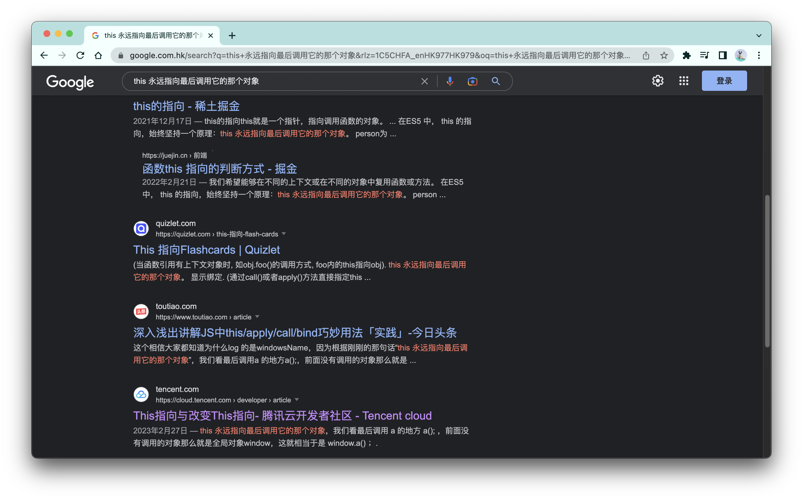
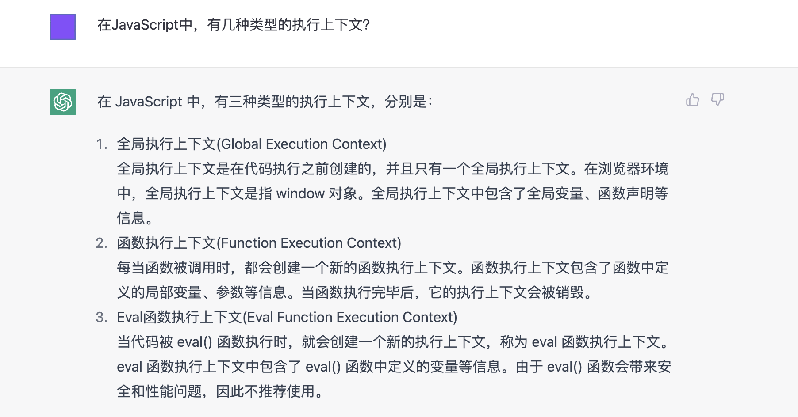
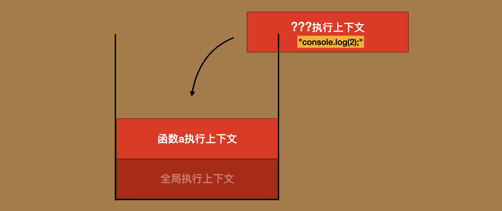
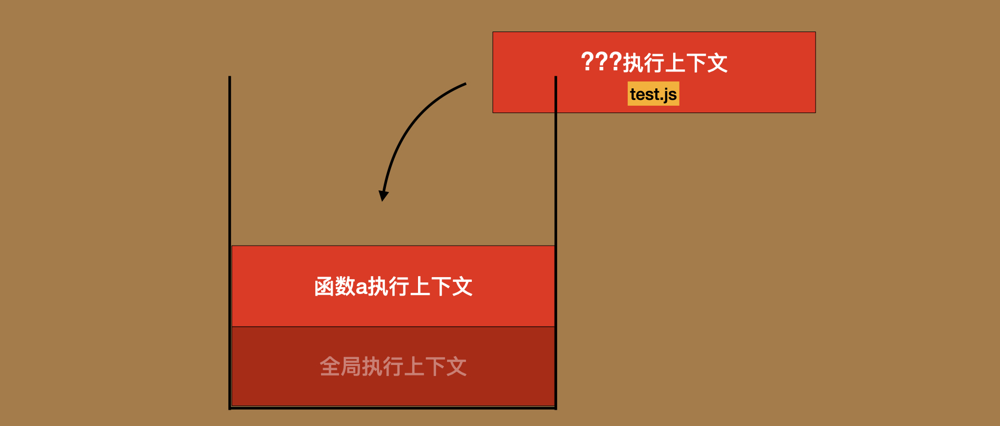
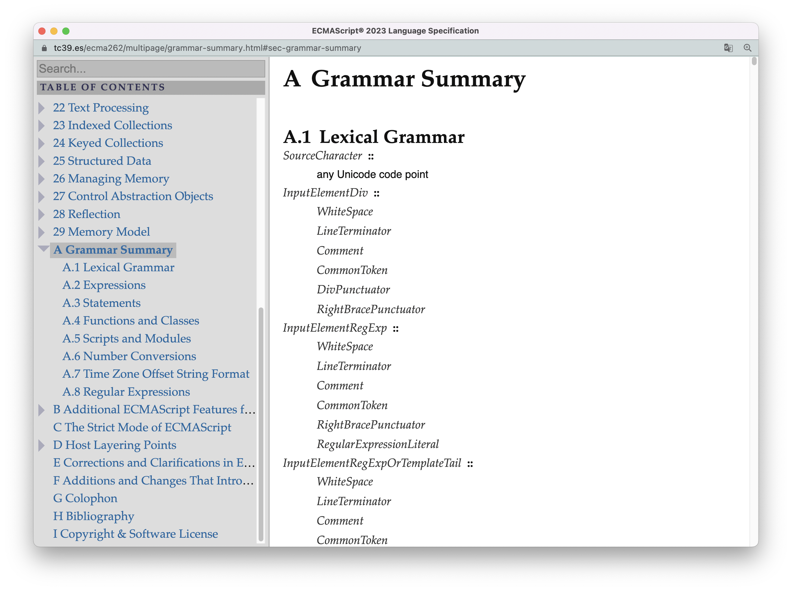

# 《人人都能读标准》—— ECMAScript篇

**本书系统地介绍了[ECMAScript标准](https://tc39.es/ecma262/multipage/)的阅读规则以及使用方式，并深入剖析了标准对JavaScript核心原理的描述。** 通过本书，读者能够完全掌握自行阅读标准的能力，深化对语言的理解，并最终得以使用这个世界上最好的JavaScript资料来解决日常工作问题、进阶个人编码能力。


<br/>


### 目录：

<br />

**前言：** [**为什么你学不精JavaScript？** ](./README.md#为什么你学不精javascript)

**Part1 介绍篇：** 

1. [**标准的阅读指南**](./1.reading_gudie.md)
2. [**标准的迭代模式**](./2.evolution.md)
3. [**ECMAScript的宿主环境**](./3.host-environment.md)

**Part2 原理篇：** 

4. [**文法符号系统（1）** ](./4.context-free-grammar.md)
5. [**文法符号系统（2）** ](./5.grammar-summary.md)
6. [**算法符号系统**](./6.algorithm.md)
7. [**规范类型**](./7.spec_type.md)
8. [**ECMAScript运行环境：agents、执行上下文、Realm**](./8.execution-environment.md)
9. [**ECMAScript运行环境：作用域与声明实例化**](./9.scope.md)
10. [**ECMAScript运行环境：作用域链与闭包**](./10.scope-chain.md)
11. [**原理篇总结：一个程序的完整执行过程**](./11.code-execution.md)

**Part3 应用篇：** 

12. [**内部模型：原始类型**](./12.primitive-type.md)
13. [**内部模型：对象类型**](./13.object-type.md)
14. [**底层算法：函数的创建与执行**](./14.function.md)
15. [**底层算法：类的创建与实例化**](./15.class.md)
16. [**底层算法：生成器的创建与异步迭代**](./16.iterator&generator.md)
17. [**底层算法：ECMAScript的错误处理机制**](./17.error.md)
18. [**应用标准：手写一个通过test262标准符合性测试的Promise**](./18.promise.md)
19. [**应用标准：4个步骤永久根治this值问题**](./19.this.md)
20. [**结语：使用engine262把标准“跑”起来**](./20.engine262.md)


<br/>


## 一则临时“广告”

我目前正在寻求一份好的工作机会 —— 前端开发，可base深圳、广州、香港，当然也可远程办公，有合适岗位推荐的朋友可联系：

- 微信：e_b_education
- 邮箱：cxz40901993@gmail.com

感谢😊！

<br />

-----

<br />

<br />
<br/>


## 为什么你学不精JavaScript

我先从一个JavaScript的基础概念 —— 作用域，讲起。

你可以在任何搜索引擎或者技术论坛中搜索「js 作用域」，然后在搜索结果中，查看不同的技术文章对作用域这个概念的定义。你会发现，在不同的作者眼中，作用域似乎都不大一样：

> 某技术文章1：作用域是据名称来查找变量的一套规则。
>
> 某技术文章2：作用域指程序中定义变量的区域，它决定了当前执行代码对变量的访问权限。
>
> 某技术文章3：作用域，是指变量的生命周期（一个变量在哪些范围内保持一定值）。
>
> 某技术文章4：作用域是在运行时代码中的某些特定部分中变量，函数和对象的可访问性。
>
> ...

（不贴出具体链接，是因为有的定义重复出现，我不能确定哪一篇是原创的）

有的作者认为作用域是“一套规则”，有的作者认为作用域是“一个区域”，有的作者认为作用域是“生命周期”，还有的作者认为作用域是一个叫作“可访问性”的抽象概念（这显然是一个对英文资料的生硬翻译）。

造成这种现象的核心原因在于：作用域是一个看不见摸不着的东西，我们只能在执行代码的过程中，感受到他在起作用，但我们从未见过它真正的模样。于是这些作者，只能依据个人开发经验，总结归纳并提炼出他们脑海当中“作用域”的样子。而每个作者不同的经验、不同的视角以及不同的知识储备，最终导致了他们说出来的‘作用域“是五花八门的。

**等等，这不就是现实版本的“盲人摸象”吗？** 。


<br/>


### 我们已经“盲”了太久

另一个典型例子就是“this值的解析”。如果你像上面一样查看this值相关的技术文章，你会发现，这些文章好像一直都在非常贴心地为你总结着各种各样关于this机制的“一般性规律”，但几乎每一种所谓的一般性规律，都伴随着大量他们知道的以及他们不知道的例外情况，用起来就像一台破旧的电视机，三天两头出问题。

举一条广为流传甚至是流传最广的关于this值的“规律”：

> this 永远指向最后调用它的那个对象



同样的意思另一个说法是：

> 函数最后由谁调用，this值就指向谁。

比如，下面的代码中，对象o调用了函数a，所以函数a中的this指向对象o。

```js
const o = {
  a: function(){console.log(this)}
}
o.a() // o
```

好像没什么问题。一般来说，作者此时会开始“洋洋自得”地使用这条“规律”解释一个关于this值的奇怪现象：

> ```js
> function a(){
>   console.log(this)
> }
> a() // window
> ```
>
> 作者解释：之所以输出为全局对象window，是因为此时函数a实际上是由window对象调用的，即`window.a()`。

看到这里，你是不是觉得这是一条穿透this值本质的规律？可它实际上并不是！

第一，这条规律不适用于模块代码：

```html
<script type="module">
  function a(){
    console.log(this)
  }
  a() //undefined
</script>
```

第二，这条规律不适用于箭头函数：

```js
const o = {
  a: () => {console.log(this)}
}
o.a() // window
```

第三，这条规律不适用于严格模式的函数：

```js
function a(){
  "use strict"
  console.log(this)
}
a() // undefined
```

第四，这条规律不适用于构造器函数：

```js
const o = {
  a: function(){console.log(this)}
}

new o.a() // 输出即不是window、也不是o，是一个新创建的对象
```

第五，这条规律不适用于函数有显式绑定的情况：

```js
const o = {
  a: function(){console.log(this)}.bind({c:1})
}

o.a() // {c:1}
```

最后，甚至，这条规律中最让作者得意的那一部分，也是错的：

```js
let a = function(){console.log(this)}
console.log(window.a) // undefined
a() // window
window.a() // 报错：window.a is not a function
```

我只要使用let来声明函数a，函数a就不会出现在window上，此时直接调用`window.a()`是会报错的，但执行函数a的结果依旧输出为window。也就是说，**“输出为全局对象”这个事情，跟函数是不是在被全局对象调用根本没有半毛钱关系。** 实际上，这是“发明”这条规律的作者所不知道的其他机制在起作用。

也就是说，搞了这么久，这条规律正确的说法应该是：

> 除了模块代码、箭头函数、严格模式、new表达式、显示绑定、普通调用的情况以外，this永远指向最后调用它的那个对象！

看吧，有时候你也不能怪程序员不好找对象，他们对“永远”的理解跟正常人不太一样。

<br />

我们看不见“作用域”，所以我们对作用域的样子众说纷纭；我们看不见this值的底层解析机制，所以我们对其机制的揣测各不相同，且漏洞百出；但有时候，由于我们看不见，在某些地方我们又会达成奇怪的一致，即便是错误的一致。比如，关于执行上下文的类型。

网络上所有的技术文章，关于执行上下文的类型，或者说创建执行上下文的方式，都整齐划一，异口同声 —— 3种，就连最近号称要让前端程序员回家种田的chatGPT也是这么认为的：



当然，这不怪它，毕竟它的输出取决于输入，而它这个回答的“输入源”，不还是我们这帮人写的东西嘛....

只不过，这次我们全都错了。

执行上下文是JavaScript中的一个重要的基础概念。整个运行环境中，只有执行上下文栈栈顶的代码会执行。于是，假如执行上下文真的只有上述的三种类型，那么下面的代码根本就不可能连续输出1、2、3：

```html
<script id="test"></script>
<script>
    console.log(1); 
    (function a(){
        document.getElementById('test').innerHTML = "console.log(2);"
        console.log(3)
    })()
</script>
```

当执行函数a的时候，会创建一个函数执行上下文，并压入执行上下文栈的栈顶，用以执行函数a的逻辑。函数a会修改`id`为test的script标签的innerHTML，而此时，该script标签会重新解析并启动`console.log(2)`的执行。这个时候，执行上下文栈如下图所示：



请问，为了执行script标签上`console.log(2)`的逻辑，我们应该为其创建什么类型的执行上下文？

- eval执行上下文？肯定不是吧；
- 函数执行上下文？你只要稍作测试就知道了，script标签中的代码不能访问函数a内的变量，也不会自生成一个`arguments`变量，所以它不是以函数的形式执行的，因而创建的必然不是函数执行上下文。
- 全局执行上下文？大家都说全局执行上下文有且只有一个，此时已经被函数执行上下文压在下面了，在函数结束执行前都无法执行代码了。

所以，必然还有其他类型的执行上下文。

同理，如果执行上下文真的只有三种类型，那么下面的代码也根本就不可能连续输出1、2、3：

```html
<!-- index.html -->
<script>
    console.log(1);
    (async function a(){
        await import('./test.js')
        console.log(3)
    })()
</script>

<!-- test.js文件 -->
console.log(2)
```

因为此时，同样没有适合执行test.js文件的执行上下文：



所以，必然还有其他类型的执行上下文。

<br />

JavaScript的这些概念以及运行机制，对我们来说就是一个“黑盒”。多年以来，绝大多数程序员研究这个黑盒的方式，就是给其不同的输入，看其输出的结果，然后推测其内部的运作机理。现在我们已经看到这种方式有多么“鸡肋”。

由于黑盒的存在，我们总是会引发一些不必要的争论，比如let声明究竟有没有提升？如果能够打开黑盒，把里面看个究竟，这些争论就会瞬间终结。


由于黑盒的存在，我们难以搞清楚像作用域这样最基础的概念，更不用谈基于它衍生出来的其他概念。试问，你看到过哪一篇文章真的能把作用域、作用域链、执行上下文、闭包这些概念的关系豪无歧义地捋清楚的？你看上面那个chatGPT关于全局上下文的表述，把全局上下文说成是“window对象”，这就是典型的混淆概念。而如果能够打开黑盒，这些混淆就能瞬间变得清晰。

由于黑盒的存在，撰写技术文章的作者是“盲”的，读者也是“盲”的，于是，我们就正中了《马太福音》中的寓言：The blind leading the blind —— 瞎子给瞎子引路，最后大家都要掉进坑里。

如果能够打开黑盒，就能把大家都从坑里拉出来。


<br/>


### 让我们把黑盒打开

要把黑盒拆开，最简单粗暴的方式，就是阅读js引擎的[源码](https://github.com/v8/v8)，但这个方法的适用人群非常少。一方面，引擎是通过C++实现的，这是其中一道门槛；另一方面，引擎的实现需要考虑诸多方面，包括性能、安全性、兼容性等等，一不小心你就会迷失在无尽的细节处理当中。

**所以，我们退而求其次，使用另一个方法：阅读黑盒的“设计手册” —— ECMAScript标准。** 这就好比当你想要研究一台汽车的构造，阅读这台汽车的工程设计手册，必然是比把这台汽车买回来然后自己逐个零件拆卸研究，更加省时省力省钱。

**ECMAScript标准做的事情，就是把整个JS底层运行机理，使用人类看得懂的自然语言，一五一十、逻辑缜密且毫无歧义地摊开来给你讲清楚。** 

与市面上的技术文章/技术书籍相比，标准有三个重要的不同：

第一，概念具体化。

在标准中，可不会使用“规则”、“范围”、“可访问性”这种模糊的词汇描述“作用域”。标准使用一个有棱有角、名为“环境记录器”的内部对象来表示作用域，并把这个内部对象每个属性的含义、每个方法的逻辑，以及这个对象与其他内部对象之间的关系，全都条理清晰、只字不漏地给你讲清楚。

这就好比当你想要知道什么是氧气，一些人会说，氧气是一种无色无味的气体；另一些人会说，氧气是一种能够助燃的物质；还是一些人会说，氧气是人类生存必不可少的条件；但标准会说：氧气是O2，由两个氧原子组成，这种化学构成会有哪些性质等等。

也正因为标准对于概念的定义是如此之具体，使得我在本书中得以借助大量的图示对这些原本“看不见”的概念进行“可视化”。在[8.执行环境](./8.execution-environment.md)中，我可视化了整个Js运行环境的轮廓。在[9.作用域](./9.scope.md)中，我可视化了作用域的创建以及变量声明的过程。在[10.作用域链](./10.scope-chain.md)中，我可视化了作用域链的构建过程...

<br />

第二，机制明确化。

多年来，大家都在通过输入输出的方式，揣测this值是如何解析的。到最后，大家甚至好像都已经不是在盲人摸象，而是盲人“猜”象了。但实际上，就像JONY-J的歌名，不用去猜，标准早就把this的解析过程明明白白地写了出来，只不过没人去看罢了。

那我只好来当第一个吃螃蟹的人。

在本书的[19.this值解析](./19.this.md)一节中，我基于标准对this值的描述，总结出了4个影响this值的关键变量，并基于这4个变量归纳出一个“人脑解析this值4步法”，这个4步法可以解决掉全天下所有关于this值的解析问题，让你从此彻底告别这个困扰你多年的疑难杂症。

但这真不是我的智慧在起作用，起码不是在起主要作用，而是标准写得足够好。不信你再看一个例子，我基于标准对Promise的定义，按部就班地造了一个[Promise的轮子](https://github.com/Lawliet01/spec-promise)，这个轮子通过了test262标准符合性测试中99.3%的测试用例。同类产品中，2500星的[then/Promise](https://github.com/then/promise)只通过了64%，7300星的[es6-promise](https://github.com/stefanpenner/es6-promise)只通过了46%....

<br />

第三，内容完整。

关于执行上下文究竟有哪些类型，其实你只需要对标准进行一次全文检索就知道了，搜以下关键词：

> - new execution context 
> - new ECMAScript code execution context
>

至于结果，我会在[8.执行环境](./8.execution-environment.md#执行上下文远不止3种创建方式)中给你展示，反正远远不止三种。

一般来说，你在标准以外的地方读到关于执行上下文的内容，只能了解到关于执行上下文最皮毛的地方，即压入弹出调用栈的那一部分。（这也是没办法的事，因为最基础的地方错了，就注定没法往深去讲）。

而在标准中，你能看到关于执行上下文的各方各面，比如：

- 执行上下文内部的具体构成；
- 执行上下文与其他概念（如作用域、作用域链、Realm）的明确关系；
- 在查找变量的过程中，执行上下文起到了什么作用；
- 执行上下文是如何实现语言的异步编程的；
- ...

上述的内容都会在本书中为你呈现。

<br />

**本质上来说，ECMAScript标准，就是JavaScript语言的“说明书”。** 并且这本说明书，是由tc39技术委员会精挑细选出来的语言专家，对其进行各种精雕细琢后打磨出来的产品。我们这些孤军作战的技术作者，跟他们这套豪华阵容相比，就是小学篮球队对阵金州勇士队。

可叹的是，如此顶级的“说明书”，甚至还完全免费，却一直被绝大多数的前端工程师束之高阁。这实际上也是生活中的一个普遍现象。在生活中，大多数人从来不看电器的使用说明书，也不读药品的服用说明书，尽管知道自己可能会因此吃亏，但反正不读、就是不读、坚决不读。不读产品说明书容易伤钱，不读药品说明书容易伤身，而不读JavaScript的语言说明书，真就是即伤钱又伤身，难道不是吗？想想你曾经因为不理解语言的某个机制，多写了多少bug，多加了多少班......

当然，我也明白其中的主要原因：因为读不懂嘛，这不所以才有了这本书嘛...


<br/>


## 标准阅读难点分析与本书给予的帮助

读懂标准，我认为有三座横跨在你面前的“山”：

1. 英语
2. 标准使用的符号系统
3. 标准自有的概念


<br/>


### 英语

这一座“山”实际上并不像外人所想的那样难以翻越。

我们可以在[ECMAScript标准2023](https://tc39.es/ecma262/#sec-overview)的页面中，使用以下的代码测试标准的词汇总数：

```js
let total = document.body.textContent.split(' ').filter(e => e.match(/^[A-Za-z]+$/))
console.log(total.length) // 175124
```

输出显示，标准一共有超过17万个词汇。乍一看，这是相当惊人的总量，但如果你把这17万个词去重：

```js
total = total.map(w => w.toLowerCase())
// 无重复的英文单词量
console.log((new Set(total)).size) // 5172
// 无重复且长度大于等于5个字符的英文单词量
console.log((new Set(total.filter(e => e.length >= 5))).size) // 4662
```

你会发现，实际的词汇量只有4000到5000个左右。而大学四级要求的词汇量是4500个，从这个角度看，只要你能够考过大学四级，你就完全具备了搞定标准英语的能力；你要是竟然过了六级，那标准的英语真的是随意拿捏，只要你愿意下点功夫。

搞定标准英文的方式是很简单朴素的：**遇到不懂的单词就去查字典，遇到不懂的句子就找翻译软件（[DeepL](https://www.deepl.com/translator#en/zh/)就是个不错的选择），然后使用翻译结果配合理解。读英文就跟练肌肉一样，你越练就会越强。** 

这里需要注意的是，有的单词在计算机领域中是有特定含义的，这时候日常的字典并不能帮助你理解这个词的意思。比如，"production"这个词，你查字典，它的意思包括：生产、制造、 产生、出示、制作、上演、播放....，但在计算机领域，它表示的是“产生式”，一个文法中的概念。

所以，当你使用字典和翻译软件也不能理解某个词的时候，你可以走以下几个步骤：

> 1. 对照我下面为你准备的[词汇表](#概念术语对照表)，查看这个词是否是一个标准使用的特定术语；
> 2. 如果词汇表中没有这个词，在[MDN](https://developer.mozilla.org/zh-CN/)上检索这个词，查看这个词是否是一个前端领域的专有术语；
> 3. 如果MDN也没有结果，在谷歌上搜："XXX in computer science"，查看这个词是否是一个计算机领域的专有术语。
> 4. 如果你还是不能得到满意的答案，提交issue，我会在空余时间会为你解答。
>

当然，如果你可以使用chatGPT的话，直接问chatGPT也是可以的，甚至你往往会发现效率更高。

而如果你目前还没有通过四级的能力，那我向你推荐一本书，李笑来老师@xiaolai的[《人人都能用英语》](https://github.com/xiaolai/everyone-can-use-english)。这本书不是那种照本宣科的东西，而是从根本上颠覆了你原有的英文学习方式，使得你从第一天起就可以收获使用英文带来的回报。

最后，我强烈不推荐阅读任何标准的中文翻译材料。不仅仅是因为我清楚这些材料翻译质量差、内容过时以及漏翻的部分非常多。更重要的是，习惯于中文舒适圈会使得你永远无法自由地在优质的英文资料池中穿梭，使用中文资料训练的AI很大概率不能媲美chatGPT，因为输入源之间的质量差距实在是太大了。


<br/>


### 标准使用的符号系统

标准的符号系统主要包含两大部分：文法与算法。而主要对大家形成阻碍的，是文法符号系统。



然而，这一座“山”也同样不像外人所想的那样难以逾越。

实际上，生活中处处都是符号系统。简单的如公厕性别标识、红绿灯、地铁路线图，复杂的如股票k线图、英语音标、高等数学公式等等，都属于符号系统。

而我们早就习得过比标准的文法更为复杂的符号系统，我们现在每天都在写的HTML、CSS、JavaScript，哪一不比文法系统更为复杂？你觉得难，本质上只是因为你身边没什么人学这个东西，也没人讨论这个，所以你找不到好的资料罢了。

而这，不就是本书的存在意义么？在本书的原理篇，我会详细解释文法符号系统与算法符号系统，然后贯穿本书的，是对这两个系统的大量应用。我保证，只要你认真阅读这本书，你不可能翻不过这座山。


<br/>


### 标准自有的概念

我认为，真正困难的，是最后这一点。标准使用了许多你在普通技术文章中、日常开发中不会使用到的词汇以及概念，比如前面提到过的“文法”、“产生式”、“环境记录器”等等。

人脑想要消化一个新的概念是费时费脑的，而在你最初阅读标准的时候，一瞬间，大量不熟悉的概念向你席卷而来，你根本招架不住。

举个例子。标准的前四章只是介绍性的内容，第五章才算正式开始。我们来看看[第五章](https://tc39.es/ecma262/multipage/notational-conventions.html#sec-context-free-grammars)上来的第一句话：

> A *context-free grammar* consists of a number of *productions*. 

这句话没有任何生词，也非常简单，但却出现了两个你可能会不熟悉的概念：`context-free grammar`以及`productions`。下一句话，标准对`productions`是什么东西做了一个定义：

> Each production has an abstract symbol called a *nonterminal* as its *left-hand side*, and a sequence of zero or more nonterminal and *terminal* symbols as its *right-hand side*.

这句话不仅比上一句话的结构更加复杂，而且为了定义一个概念，又引入了更多的概念：`abstract symbol`、`nonterminal`、`terminal`。

如果在此之前，你已经遗忘了或者根本就没有过任何编译原理的知识，我相信你多多少少已经感受到被标准“支配
”的恐怖了。

再举个例子，我们都知道，JavaScript有8种数据类型，而除了这8种数据类型，标准又额外定制了另外一套更为底层的数据类型，称为规范类型，单独给标准内的算法使用。

**从这里你可以看出，那些撰写技术文章的作者，即便读过标准，也根本没办法从标准的角度来解释JavaScript。因为仅仅是为了解释某一个特性，就不得不先给读者抛出一大堆他们从未听说过的概念，最后不仅导致篇幅爆炸，读者的体验也拉了大胯。这也是为什么最终我不得不把这个事情演化成一本书。** 

**本书的一个重要使命，就是帮助你提前建立标准中最常用、最重要概念。** 你可以在下面的[术语表](#概念术语对照表)中先瞥一眼这些概念。当所有的概念搭建完成后，只要你具备通过四级的英文水准，你就能自己读懂标准。

你可以从下面这个例子大致看到我是如何帮你建立概念的。

如果标准需要定义一个叫"蜚蠊"的概念，它可能会说：

> 蜚蠊泛指属于“蜚蠊目”（学名）的昆虫， 属于节肢动物门、昆虫纲、蜚蠊目，是常见的医学昆虫。体内扁平，黑褐色，通常中等大小。头小，能活动。触角长丝状，复眼发达。翅平，前翅为鞘翅后翅为膜翅，前后翅基本等大，覆盖于腹部背面；有的种类无翅。不善飞，能疾走。不完全变态。产卵于卵鞘内，约有6000种，主要分布在热带、亚热带地区，生活在野外或者室内。

而这本书会这么介绍：

> 蜚蠊就是我们常说的的蟑螂，也有人叫小强，长下面这样：
>
> 【此时附一张蟑螂的图】
>
> 许多人把蟑螂与[蟑螂恶霸](https://baike.baidu.com/item/%E8%9F%91%E8%9E%82%E6%81%B6%E9%9C%B8/5443754)搞混了，实际上他们是完全不一样的东西....
>
> 蜚蠊的主要烹饪方式有：...

当我在讲一个概念的时候：

- 如果有一个可以直接让你秒懂且又不影响准确性的说法，我会使用这个说法帮助你进行理解；
- 如果此时可视化有助于增加你的理解，我会使用图示。也因此这本书我插入了大量的图片，如影响加载速度，请多包涵；
- 如果有必要，我会给你讲这个概念与其他概念的关系、异同、常见的理解错误；
- 如果有必要，我会给你讲这个概念的实际应用，且关键的概念往往不止举一个例子。

<br />
<br/>


## 本书概览

本书分为三个篇章：介绍篇、原理篇以及应用篇，篇章的名字已经暗示了他们各自的主要内容。

在介绍篇，我主要是为读者提供一个关于标准的“整体感知”，包括标准的大纲、标准的迭代方式以及标准是如何与其他的web规范（如HTML标准）协作的。

在原理篇，我会讲解标准的核心内容，包括文法、算法、规范类型、运行环境，并最终以一个程序的完整执行过程把这些内容串联起来。完成这部分的内容，你对标准就算是入门了。

如果说原理篇是“学”标准，那么应用篇就是“用”标准。在应用篇，我们会利用标准，把JavaScript这个黑盒“打开”，然后把里面看个究竟，看个痛快。我会为你展示，那些最常被拿来讨论的语言特性，比如在原始类型上调用方法、类型判断、类的创建与实例化、错误捕获、异步编程等等...在标准内是如何被描述的，换句话说，就是它们的“底层实现”是怎么样的。

<br />

本书的“用词”会完全遵照标准的用法，比如我不会使用“AST抽象语法树”这个词，而是使用“解析树（parse tree）”；我不会使用“预编译”这个词，而是使用“声明实例化（DeclarationInstantiation）”。

在书中，所有的内容我都会贴出与标准关联的链接。任何的内容，如果你觉得我说得不够明白，或者有疑惑，都可以直接跳进链接里头，看标准最原汁原味的解释。

本书的许多地方，尤其是应用篇，当提到某一个特性的时候，我常常会附上这个特性的关键算法片段图，尽管我会对算法的大致逻辑作一个概括，但你最好也跟着算法读一遍，甚至可以跳进标准中，找到整条调用链。读多了，看多了，慢慢就对标准不恐惧了，就越读越快了。

<br />

只要认真完成这本书，每个程序员都能够掌握独自阅读标准的能力，我对此非常有信心。

<br />
<br/>


## 最后的话

**我对前面以及本书后续提到任何他人的技术观点，都仅仅针对观点本身，我对观点的作者没有任何恶意，只有尊重。如有冒犯，请您原谅。** 

此外，写这本书是一个非常复杂的事情，需要同时考虑易读性、准确性、实用性等多个方面。目前从构思、编写、画图、校对各项工作都是个人完成，我也并非机器人，所以难免在文中会有出错或者表达不流畅的地方，如有纰漏，希望读者能够提issue指出问题，帮助我进一步完善这本书，非常感谢🙏！。

最后，我们相信“Garbage in, garbage out”，同时也坚信“Quality in, quality out”。通过阅读标准，愿大家都能成为更好的程序员！


<br/>


## 概念术语对照表

下表是本书对标准术语使用的中文翻译，这里很大一部分的翻译沿用掘金社区提供的[参考](https://github.com/xitu/gold-miner/wiki/ECMAScript%E7%BF%BB%E8%AF%91%E6%8C%87%E5%8D%97%EF%BC%882021.5%EF%BC%89)。在表中，点击左侧的链接会跳转到标准中定义该术语的位置，点转右侧的链接会跳转到本书与该术语相关的章节。

| 英文                                                         | 中文                                                         |
| ------------------------------------------------------------ | ------------------------------------------------------------ |
| [Notational Conventions](https://tc39.es/ecma262/multipage/notational-conventions.html#sec-notational-conventions) | [表示法约定](./1.reading_gudie.md#第5章表示法约定)         |
| [host environment](https://tc39.es/ecma262/multipage/overview.html#host-environment) | [宿主环境](./3.host-environment.md)                          |
| [host-defined](https://tc39.es/ecma262/multipage/overview.html#host-defined) | [宿主定义](./3.host-environment.md)                          |
| [implementation-defined](https://tc39.es/ecma262/multipage/overview.html#implementation-defined) | [实现定义](./3.host-environment.md)                          |
| [host hooks](https://tc39.es/ecma262/multipage/overview.html#host-hook) | [宿主钩子](./3.host-environment.md#加载模块)                 |
| [grammar](https://tc39.es/ecma262/multipage/notational-conventions.html#sec-context-free-grammars) | [文法](./4.context-free-grammar.md)                          |
| [production](https://tc39.es/ecma262/multipage/notational-conventions.html#sec-context-free-grammars) | [产生式](./4.context-free-grammar.md#文法的基本理解规则)     |
| [alternative](https://tc39.es/ecma262/multipage/notational-conventions.html#sec-notational-conventions) | [代换式](./4.context-free-grammar.md#文法的基本理解规则)     |
| [goal symbol](https://tc39.es/ecma262/multipage/notational-conventions.html#sec-context-free-grammars) | [目标符](./4.context-free-grammar.md#文法的基本理解规则)     |
| [terminator](https://tc39.es/ecma262/multipage/notational-conventions.html#sec-context-free-grammars) | [终结符](./4.context-free-grammar.md#文法的基本理解规则)     |
| [nonterminator](https://tc39.es/ecma262/multipage/notational-conventions.html#sec-context-free-grammars) | [非终结符](./4.context-free-grammar.md#文法的基本理解规则)   |
| [context-free grammars](https://tc39.es/ecma262/multipage/notational-conventions.html#sec-context-free-grammars) | [上下文无关文法](./4.context-free-grammar.md#文法的基本理解规则) |
| [Lookahead Restrictions](https://tc39.es/ecma262/multipage/notational-conventions.html#sec-lookahead-restrictions) | [前瞻限制](./4.context-free-grammar.md#文法的表示约定)       |
| [grammatical parameters](https://tc39.es/ecma262/multipage/notational-conventions.html#sec-grammatical-parameters) | [文法参数](./4.context-free-grammar.md#文法参数)             |
| [lexical grammer](https://tc39.es/ecma262/multipage/notational-conventions.html#sec-lexical-and-regexp-grammars) | [词法文法](./5.grammar-summary.md#词法分析)                  |
| [Input element](https://tc39.es/ecma262/multipage/notational-conventions.html#sec-lexical-and-regexp-grammars) | [输入元素](./5.grammar-summary.md#词法分析)                  |
| [syntactic grammer](https://tc39.es/ecma262/multipage/notational-conventions.html#sec-syntactic-grammar) | [句法文法](./5.grammar-summary.md#句法分析)                  |
| [parse tree](https://tc39.es/ecma262/multipage/notational-conventions.html#sec-syntactic-grammar) | [解析树](./5.grammar-summary.md#句法分析)                    |
| [abstract operations](https://tc39.es/ecma262/multipage/notational-conventions.html#sec-algorithm-conventions-abstract-operations) | [抽象操作](./6.algorithm.md#抽象操作)                        |
| [syntax-directed operation](https://tc39.es/ecma262/multipage/notational-conventions.html#sec-algorithm-conventions-syntax-directed-operations) | [语法导向操作](./6.algorithm.md#语法导向操作)                |
| [semantics](https://tc39.es/ecma262/multipage/notational-conventions.html#sec-algorithm-conventions-syntax-directed-operations) | [语义](./6.algorithm.md#语法导向操作)                        |
| [runtime semantics](https://tc39.es/ecma262/multipage/notational-conventions.html#sec-runtime-semantics) | [运行时语义](./6.algorithm.md#运行时语义)                    |
| [Runtime Semantics: Evaluation](https://tc39.es/ecma262/multipage/syntax-directed-operations.html#sec-evaluation) | [求值语义](./6.algorithm.md#运行时语义)                      |
| [static semantics](https://tc39.es/ecma262/multipage/notational-conventions.html#sec-static-semantic-rules) | [静态语义](./6.algorithm.md#静态语义)                        |
| [early error](https://tc39.es/ecma262/multipage/error-handling-and-language-extensions.html#early-error) | [先验错误](./6.algorithm.md#静态语义)                        |
| [chain production](https://tc39.es/ecma262/multipage/notational-conventions.html#sec-context-free-grammars) | [链式产生式](./6.algorithm.md#链式产生式的语法导向操作)      |
| [specification Types](https://tc39.es/ecma262/multipage/ecmascript-data-types-and-values.html#sec-ecmascript-specification-types) | [规范类型](./7.spec_type.md)                                 |
| [Record](https://tc39.es/ecma262/multipage/ecmascript-data-types-and-values.html#sec-list-and-record-specification-type) | [记录器](./7.spec_type.md#记录器record)                  |
| [Script Record](https://tc39.es/ecma262/multipage/ecmascript-language-scripts-and-modules.html#script-record) | [脚本记录器](./7.spec_type.md#记录器record)              |
| [Property Descriptor](https://tc39.es/ecma262/multipage/ecmascript-data-types-and-values.html#sec-property-descriptor-specification-type) | [属性描述符记录器](./7.spec_type.md#属性描述符记录器property-descriptor-record) |
| [Completion Record](https://tc39.es/ecma262/multipage/ecmascript-data-types-and-values.html#sec-completion-record-specification-type) | [完成记录器](./7.spec_type.md#完成记录器completion-record) |
| [normal completion](https://tc39.es/ecma262/multipage/ecmascript-data-types-and-values.html#sec-completion-record-specification-type) | [正常完成](./7.spec_type.md#完成记录器completion-record) |
| [abrupt completion](https://tc39.es/ecma262/multipage/ecmascript-data-types-and-values.html#sec-completion-record-specification-type) | [硬性完成](./7.spec_type.md#完成记录器completion-record) |
| [Abstract Closure](https://tc39.es/ecma262/multipage/ecmascript-data-types-and-values.html#sec-abstract-closure) | [抽象闭包](./7.spec_type.md#抽象闭包abstract-closure)    |
| [agent clusters](https://tc39.es/ecma262/multipage/executable-code-and-execution-contexts.html#sec-agent-clusters) | [agent集群](./8.execution-environment.md)                    |
| [execution context stack](https://tc39.es/ecma262/multipage/executable-code-and-execution-contexts.html#execution-context-stack) | [调用栈](./8.execution-environment.md#调用栈与执行上下文)    |
| [execution context](https://tc39.es/ecma262/multipage/executable-code-and-execution-contexts.html#sec-execution-contexts) | [执行上下文](./8.execution-environment.md#调用栈与执行上下文) |
| [ECMAScript code execution contexts](https://tc39.es/ecma262/multipage/executable-code-and-execution-contexts.html#ecmascript-code-execution-context) | [ECMAScript代码执行上下文](./8.execution-environment.md#执行上下文中的词法环境是作用域链的起点) |
| [LexicalEnvironment](https://tc39.es/ecma262/multipage/executable-code-and-execution-contexts.html#table-additional-state-components-for-ecmascript-code-execution-contexts) | [词法环境](./8.execution-environment.md#执行上下文中的词法环境是作用域链的起点) |
| [Realm Record](https://tc39.es/ecma262/multipage/executable-code-and-execution-contexts.html#realm-record) | [Realm记录器](./8.execution-environment.md#realm)            |
| [Environment Record](https://tc39.es/ecma262/multipage/executable-code-and-execution-contexts.html#sec-environment-records) | [环境记录器](./9.scope.md#环境记录器--标识符的容器)        |
| [identifier](https://tc39.es/ecma262/multipage/ecmascript-language-expressions.html#sec-identifiers) | [标识符](./9.scope.md#环境记录器--标识符的容器)            |
| [DeclarationInstantiation](https://tc39.es/ecma262/multipage/ecmascript-language-statements-and-declarations.html#sec-blockdeclarationinstantiation) | [声明实例化](./9.scope.md#声明实例化的一般过程)              |
| [lexicalDeclared](https://tc39.es/ecma262/multipage/syntax-directed-operations.html#sec-static-semantics-lexicallydeclarednames) | [词法声明](./9.scope.md#1-作用域分析)                       |
| [VarDeclaraed](https://tc39.es/ecma262/multipage/syntax-directed-operations.html#sec-static-semantics-vardeclarednames) | [变量声明](./9.scope.md#1-作用域分析)                       |
| [instantiate](https://tc39.es/ecma262/multipage/ecmascript-language-statements-and-declarations.html#sec-let-and-const-declarations) | [实例化](./9.scope.md#2-绑定标识符)                         |
| [initialize](https://tc39.es/ecma262/multipage/ecmascript-language-statements-and-declarations.html#sec-let-and-const-declarations) | [初始化](./9.scope.md#2-绑定标识符)                         |
| [Reference Record](https://tc39.es/ecma262/multipage/ecmascript-data-types-and-values.html#sec-reference-record-specification-type) | [引用记录器](./10.scope-chain.md#标识符的解析)              |
| [code point](https://tc39.es/ecma262/multipage/ecmascript-data-types-and-values.html#sec-ecmascript-language-types-string-type) | [码点](./12.primitive-type.md#string类型的编码形式)          |
| [code unit](https://tc39.es/ecma262/multipage/ecmascript-data-types-and-values.html#sec-ecmascript-language-types-string-type) | [码元](./12.primitive-type.md#string类型的编码形式)          |
| [high-surrogate code unit](https://tc39.es/ecma262/multipage/ecmascript-data-types-and-values.html#high-surrogate-code-unit) | [高代理码元](./12.primitive-type.md#string类型的编码形式)    |
| [low-surrogate code unit](https://tc39.es/ecma262/multipage/ecmascript-data-types-and-values.html#low-surrogate-code-unit) | [低代理码元](./12.primitive-type.md#string类型的编码形式)    |
| [surrogate pair](https://tc39.es/ecma262/multipage/ecmascript-data-types-and-values.html#surrogate-pair) | [代理对](./12.primitive-type.md#string类型的编码形式)        |
| [internal method](https://tc39.es/ecma262/multipage/ecmascript-data-types-and-values.html#sec-object-internal-methods-and-internal-slots) | [内部方法](./13.object-type.md#对象的内部模型)               |
| [internal slots](https://tc39.es/ecma262/multipage/ecmascript-data-types-and-values.html#sec-object-internal-methods-and-internal-slots) | [内部插槽](./13.object-type.md#对象的内部模型)               |
| [ordinary object](https://tc39.es/ecma262/multipage/ecmascript-data-types-and-values.html#ordinary-object) | [普通对象](./13.object-type.md#普通对象-vs-异质对象)         |
| [exotic object](https://tc39.es/ecma262/multipage/ecmascript-data-types-and-values.html#exotic-object) | [异质对象](./13.object-type.md#普通对象-vs-异质对象)         |
| [built-in object](https://tc39.es/ecma262/multipage/ecmascript-standard-built-in-objects.html#sec-ecmascript-standard-built-in-objects) | [内置对象](./13.object-type.md#内置对象-vs-非内置对象)       |
| [classElement](https://tc39.es/ecma262/multipage/ecmascript-language-functions-and-classes.html#prod-ClassElement) | [class元素](./15.class.md#3-给两个对象添加属性方法)         |
| [PrivateEnvironment](https://tc39.es/ecma262/multipage/executable-code-and-execution-contexts.html#privateenvironment-record) | [私有环境](./15.class.md#关于私有元素)                       |
| [iterator](https://tc39.es/ecma262/multipage/control-abstraction-objects.html#sec-iterator-interface) | [迭代器](./16.iterator&generator.md#迭代器与可迭代对象)      |
| [iterable](https://tc39.es/ecma262/multipage/control-abstraction-objects.html#sec-iterable-interface) | [可迭代对象](./16.iterator&generator.md#迭代器与可迭代对象)  |
| [parsing errors](https://tc39.es/ecma262/multipage/error-handling-and-language-extensions.html#sec-error-handling-and-language-extensions) | [解析错误](./17.error.md)                                    |
| [runtime errors](https://tc39.es/ecma262/multipage/error-handling-and-language-extensions.html#sec-error-handling-and-language-extensions) | [运行时错误](./17.error.md)                                  |

<br />

-----

本书的版权协议为 [CC-BY-NC-ND license](https://creativecommons.org/licenses/by-nc-nd/3.0/deed.zh)。


